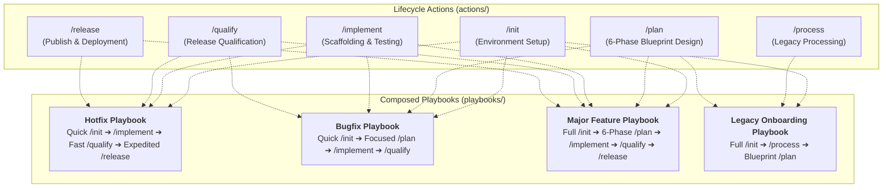

# Agent-Driven Guards Framework

A universal, environment-agnostic platform of **Guards**—structured execution gates, process controls, action boundaries, and verification assertions—designed to guide AI agents through a disciplined, safe, and token-optimized software planning and development lifecycle.

---

## Core Philosophy: Universal Framework vs. Target Implementations

The **Guards Framework** intentionally separates high-level architectural design intent, governance, and process control from runtime-specific execution engines:

- **Universal Guard Platform**: Overarching action specifications (such as Interactive Planning, Verification Gates, Process Status Handling, and Multi-Repository Architecture) are defined generically to ensure safety, predictability, and quality across any AI development environment.
- **Platform-Specific Implementations**: Abstract guard concepts and execution maps are mapped to concrete native primitives within target AI agent environments:
  - **Google Antigravity**: Serves as a primary reference implementation, realizing guard specifications through native platform primitives such as *Rules, Workflows, Skills, Hooks, Sidecars, and Process Status specifications*.
  - **Other Agent Environments** (e.g., OpenAI Codex, Claude Code, or custom agent loops): Adapt the universal guard specifications using their respective native prompt schemas, custom tool protocols, or platform capabilities.

---

## Framework Domain Model: Playbooks, Actions, and Commands

The **Guards Framework** structures agentic software development through a clean 3-tier domain hierarchy:

> **Playbooks** orchestrate **Actions**. Actions are invoked through **Commands**.

| Tier | Concept | Definition | Examples |
|:---|:---|:---|:---|
| **Tier 1** | **Playbook** | An orchestrated composition of actions with scenario-specific branching logic and feedback loops | "Greenfield Development Playbook", "Bugfix Playbook", "Hotfix Playbook" |
| **Tier 2** | **Action** | A self-contained, independently invocable lifecycle element with a single guiding question and cognitive persona | `/init`, `/process`, `/plan`, `/implement`, `/qualify`, `/release` |
| **Tier 3** | **Command** | A parametrized invocation of an action — a specific mode, flag, or building block within an action | `/init --release vX.Y.Z`, `/init --feature payment`, `/implement --code-graph` |

---

## Action & Command Vocabulary

The Guards Framework defines its own vocabulary. This is intentional, and the reasoning behind it reflects a fundamental shift in how agentic software development works.

### Action Commands Name Process Phases, Not Tools

Every action in the lifecycle describes **what the system is doing at a structural level** — not which binary gets invoked underneath:

| Action | Names a… |
| :--- | :--- |
| `/init` | Environment bootstrap **process** |
| `/process` | Legacy ingestion **process** |
| `/plan` | Architectural design **process** |
| `/implement` | Code execution **process** |
| `/qualify` | Release qualification **process** |
| `/release` | Deployment **process** |

None of these map 1:1 to a tool. `/process` is not `grep`. `/plan` is not `jira`. `/implement` is not `vim`. `/qualify` is not `pytest`. Inserting a tool name — such as `/test` — into this sequence would mean describing one phase in the grammar of a different system entirely.

### The Agentic Shift Changes Who Reads the Vocabulary

In human-driven development, a command name needs to be **recalled from memory under time pressure**. Familiarity dominates. This is why legacy CLI tooling uses short, tool-referencing verbs: they optimize for human motor-pattern recall.

In agent-driven development, the action command is **read from a specification document** by an entity with perfect recall. An AI agent executing `/qualify` does not benefit from the word "test" being common in npm documentation. It benefits from the command name **accurately scoping the full responsibility of the phase it is about to execute** — which includes test strategy negotiation, multi-layer test execution, scenario scaffolding, defect triage, and release gate control. The name `/qualify` encodes all of that. The name `/test` encodes only one part of it.

### The Framework Speaks in Its Own Voice

The Guards Framework has already established its own conceptual vocabulary:

- **Guards** — not "rules" or "checks"
- **Grill Engine** — not "questionnaire" or "wizard"
- **Dual Grounding Mandate** — not "prerequisites"
- **Token Economy Guard** — not "performance budget"
- **Process Status Matrix** — not "kanban board" or "ticket tracker"

These terms were not chosen because they were familiar. They were chosen because they precisely describe what the concepts *do inside this framework*. The action command vocabulary follows the same principle: each command name is chosen for what it means in this lifecycle, not for what it resembles in a different one.

This vocabulary is a one-time learning cost. After a single reading, the lifecycle sequence becomes permanently self-documenting — because every action name already carries its full operational meaning.

---

## Action Mindsets & The Guiding Questions Model

A central innovation of the Guards Framework is that **every action answers a fundamentally different question and operates with a distinct cognitive mindset**. 

Rather than viewing the development lifecycle merely as a checklist of activities, the framework assigns each action a clear persona, an explicit scope boundary, and a guiding question:

| Action | The Guiding Question | The Mindset / Persona | Operational Boundary & Scope |
| :--- | :--- | :--- | :--- |
| **`/init`** | **"Where and how do we work?"** | **System Administrator** | Bootstraps agentic, software, and directory environments; sets up repositories, sandboxes, branches, and tracking matrices without altering code logic. |
| **`/process`** | **"What already exists?"** | **Archaeologist & Analyst** | Ingests brownfield legacy code and documentation intact, categorizing historical context into feature staging and generating topological code graphs. |
| **`/plan`** | **"What should the system do?"** | **Architect & Designer** | Explores design alternatives, evaluates system impact, authors 6-phase blueprints (including `phase-5-test.md`), and drafts versioned implementation maps. |
| **`/implement`** | **"Does my code work?"** | **Software Engineer** | Scaffolds production code layer-by-layer and writes unit tests in `codebase-*/tests/` to verify local code logic in isolation. |
| **`/qualify`** | **"Does the whole system work?"** | **Quality Engineer (QA)** | Executes cross-layer integration, E2E browser flows, and regression catalogs (`codebase-qualify/` and `tests/`), diagnoses multi-layer defects, and certifies release readiness. |
| **`/release`** | **"Is the system delivered?"** | **Release & DevOps Operator** | Builds production Docker images, tags versions, generates walkthrough audit summaries, creates Pull Requests, and coordinates deployment handoffs. |

### The Separation of Testing Concerns

Understanding these mindsets resolves the common confusion around where testing belongs:

1. **The Architect (`/plan`) asks: *"What needs testing?"***
   * Produces `phase-5-test.md` (the verification scope delta) and updates living test scenarios under `agent-workspace/tests/`. It defines *what* must be proven, not the code to prove it.
2. **The Developer (`/implement`) asks: *"Does my code work?"***
   * Scaffolds unit tests co-located inside `codebase-<layer>/tests/` alongside newly written code to verify components in isolation. It does not boot the whole system or run cross-layer suites.
3. **The Quality Engineer (`/qualify`) asks: *"Does the system work?"***
   * Implements cross-layer test harnesses in `codebase-qualify/`, boots multi-service environments via `codebase-devops/`, executes the entire test matrix, performs root-cause defect attribution across layers, and signs off on release readiness.

This separation ensures that **the entity that writes the code is never the sole entity that certifies the system**, establishing true architectural rigor in autonomous agentic workflows.

---

## Key Components

The framework is organized into two primary structural pillars:

1. **[Playbooks](file:///Users/horvathgergo/Desktop/agent-driven-templates/playbooks/) (`playbooks/`)**: Composed end-to-end development lifecycles (Hotfix, Bugfix, Major Feature, Legacy Onboarding) that concatenate and chain atomic actions from `actions/` for task-calibrated governance.
2. **[Actions](file:///Users/horvathgergo/Desktop/agent-driven-templates/actions/summary.md) (`actions/`)**: Universal specifications and operational guides for fundamental lifecycle actions:
   - **[Summary & Operational Lifecycle](file:///Users/horvathgergo/Desktop/agent-driven-templates/actions/summary.md)**: Central entry point detailing the 3-tier structure, 6 lifecycle actions, and lifecycle Mermaid diagram.
   - **[End-User Guide & Operational Manual](file:///Users/horvathgergo/Desktop/agent-driven-templates/actions/user_guide.md)**: Conceptual summary, action principles, and operational manual for developers and AI agents.
   - **[Guard Process Handling Spec (`PROCESS_STATUS.md`)](file:///Users/horvathgergo/Desktop/agent-driven-templates/actions/process_handling.md)**: Release and feature governance with a concise 2-block status matrix and daily execution history log.
   - **[Multi-Repo & Docker Strategy Spec](file:///Users/horvathgergo/Desktop/agent-driven-templates/actions/multi_repo_architecture.md)**: Hybrid Docker containerization, symlink mapping, and dynamic layer expansion.
   - **[Standard Folder Structure Spec](file:///Users/horvathgergo/Desktop/agent-driven-templates/actions/folder_structure.md)**: Standard project folder layout, pure control plane architecture, and sub-repo symlink definitions.
   - **[Initialization Action (/init)](file:///Users/horvathgergo/Desktop/agent-driven-templates/actions/init/init_action.md)**: Bootstrapping action specification, 3-block Q&A schema (`init_questions.md`), and initialization execution maps.
   - **[Legacy Code & Docs Processing (/process)](file:///Users/horvathgergo/Desktop/agent-driven-templates/actions/process/process_action.md)**: Standalone action specification for deep historical code analysis, documentation review, and refactoring proposals.
   - **[Interactive Planning (/plan)](file:///Users/horvathgergo/Desktop/agent-driven-templates/actions/plan/plan_action.md)**: Interactive planning action specification, 6-phase blueprints, and implementation maps.
   - **[Action Implementation (/implement)](file:///Users/horvathgergo/Desktop/agent-driven-templates/actions/implement/implement_action.md)**: Action implementation specification, 4-part step schema, and visible scaffolding.
   - **[Release Qualification (/qualify)](file:///Users/horvathgergo/Desktop/agent-driven-templates/actions/qualify/qualify_action.md)**: Release qualification action specification and 3-pillar testing architecture.
   - **[Release & Operations (/release)](file:///Users/horvathgergo/Desktop/agent-driven-templates/actions/release/release_action.md)**: Release packaging, Docker builds, Git tagging, and PR operations.
   - **[Grill Engine Gate](file:///Users/horvathgergo/Desktop/agent-driven-templates/actions/grill_engine.md)**: Reusable Q&A engine design rules and state file formats (`GRILL_STATUS.md`).
   - **[Language-Specific Code Graph Taxonomy](file:///Users/horvathgergo/Desktop/agent-driven-templates/actions/code_graph_taxonomy.md)**: Universal node and connection rules for Python, Go, and JavaScript.

---

## Playbook Architecture: Composed Lifecycles

While `actions/` defines granular specifications for individual actions, **Playbooks** assemble these atomic actions into tailored execution chains to eliminate unnecessary friction for lightweight tasks:



### Playbook Archetypes

| Playbook | Target Scenario | Composed Action Sequence | Key Characteristics |
| :--- | :--- | :--- | :--- |
| **`hotfix`** | Production incidents & urgent hotfixes | Quick `/init` $
ightarrow$ `/implement` $
ightarrow$ Fast `/qualify` $
ightarrow$ Expedited `/release` | Bypasses `/plan` and `/process`; inherits workspace environment configs; fast-tracks directly to execution. |
| **`bugfix`** | Standard defect resolution | Quick `/init` $
ightarrow$ Focused `/plan` (Summary + Qualification Plan) $
ightarrow$ `/implement` $
ightarrow$ `/qualify` | Focuses planning strictly on root-cause analysis and regression test contract definition. |
| **`feature`** | Major new features & greenfield modules | Full `/init` $
ightarrow$ 6-Phase `/plan` $
ightarrow$ `/implement` $
ightarrow$ `/qualify` $
ightarrow$ `/release` | Full architectural governance, 6-phase blueprints, versioned implementation maps, and complete test suites. |
| **`legacy_onboarding`** | Ingesting and restructuring existing code | Full `/init` $
ightarrow$ `/process` $
ightarrow$ Selective `/plan` | Read-only legacy analysis, layer restructuring, resource staging, and baseline blueprint population. |

---

## Directory Layout

```text
agent-driven-templates/
├── README.md                          # Single authoritative repository overview & architecture manual
├── playbooks/                         # Composed end-to-end development lifecycles
│   └── .gitkeep
└── actions/                           # Fundamental lifecycle actions
    ├── summary.md                     # Central entry point, 3-tier structure & action sitemap
    ├── user_guide.md                  # End-User Guide & Operational Manual
    ├── folder_structure.md            # Standard repository folder layout
    ├── grill_engine.md                # Reusable Q&A Grill Engine specification
    ├── multi_repo_architecture.md     # Multi-repo symlinks & Hybrid Docker strategy
    ├── process_handling.md            # Guard Process Handling Spec (PROCESS_STATUS.md)
    ├── code_graph_taxonomy.md         # Language-Specific Code Graph Taxonomy (Python, Go, JS)
    ├── implementation_map_taxonomy.md # Implementation Map Taxonomy & Schema
    ├── init/                          # [Tier 2] Initialization Action Subfolder
    │   ├── init_action.md             # /init Bootstrapping action specification
    │   ├── init_questions.md          # 3-Block Q&A Grill schema
    │   └── antigravity/               # [Tier 3] Antigravity reference implementation
    │       ├── init_implementation_map.md # Antigravity execution map & decision links
    │       ├── init_tests.md          # Greenfield & brownfield verification test suite
    │       └── guards/                # Antigravity native primitives (rules, skills, hooks)
    ├── process/                       # [Tier 2] Legacy Processing Action Subfolder
    │   ├── process_action.md          # /process Brownfield action specification
    │   ├── process_questions.md       # /process Q&A Grill schema
    │   └── antigravity/               # [Tier 3] Antigravity reference implementation
    │       ├── process_implementation_map.md
    │       └── process_tests.md
    ├── plan/                          # [Tier 2] Interactive Planning Subfolder
    │   ├── plan_action.md             # Detailed action specifications
    │   ├── plan_questions.md          # 6-Block Q&A Grill schema
    │   └── antigravity/               # [Tier 3] Antigravity reference implementation
    │       ├── plan_implementation_map.md # Antigravity execution map & decision links
    │       ├── plan_tests.md          # Feature planning verification test suite
    │       └── guards/                # Antigravity native primitives (rules, skills, workflows, templates)
    ├── implement/                     # [Tier 2] Action Implementation Subfolder
    │   ├── implement_action.md        # Detailed action specifications
    │   ├── implement_questions.md     # Micro-Architecture Q&A Grill schema
    │   └── antigravity/               # [Tier 3] Antigravity reference implementation
    │       ├── implement_implementation_map.md # Antigravity execution map & decision links
    │       ├── implement_tests.md     # Action implementation verification test suite
    │       └── guards/                # Antigravity native primitives (rules, skills, workflows, templates)
    ├── qualify/                       # [Tier 2] Release Qualification Subfolder
    │   └── qualify_action.md          # Detailed qualification action specification
    └── release/                       # [Tier 2] Release & Operations Subfolder
        └── release_action.md          # Detailed release action specification
```
