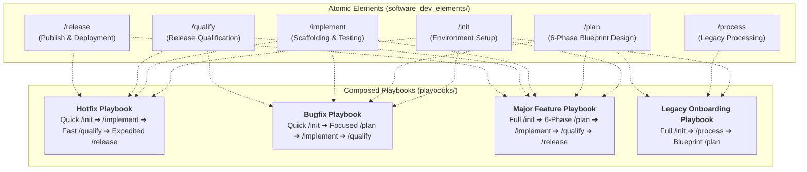

# Agent-Driven Guards Framework

A universal, environment-agnostic platform of **Guards**—structured execution gates, process controls, workflow boundaries, and verification assertions—designed to guide AI agents through a disciplined, safe, and token-optimized software planning and development lifecycle.

---

## Core Philosophy: Universal Framework vs. Target Implementations

The **Guards Framework** intentionally separates high-level architectural design intent, workflow governance, and process control from runtime-specific execution engines:

- **Universal Guard Platform**: Overarching workflow specifications (such as Interactive Planning, Verification Gates, Process Status Handling, and Multi-Repository Architecture) are defined generically to ensure safety, predictability, and quality across any AI development environment.
- **Platform-Specific Implementations**: Abstract guard concepts and execution maps are mapped to concrete native primitives within target AI agent environments:
  - **Google Antigravity**: Serves as a primary reference implementation, realizing guard specifications through native platform primitives such as *Rules, Workflows, Skills, Hooks, Sidecars, and Process Status specifications*.
  - **Other Agent Environments** (e.g., OpenAI Codex, Claude Code, or custom agent loops): Adapt the universal guard specifications using their respective native prompt schemas, custom tool protocols, or platform capabilities.

---

## Workflow Vocabulary & Design Language

The Guards Framework defines its own command vocabulary. This is intentional, and the reasoning behind it reflects a fundamental shift in how agentic software development works.

### Workflow Commands Name Process Phases, Not Tools

Every workflow command in the lifecycle describes **what the system is doing at a structural level** — not which binary gets invoked underneath:

| Command | Names a… |
| :--- | :--- |
| `/init` | Environment bootstrap **process** |
| `/process` | Legacy ingestion **process** |
| `/plan` | Architectural design **process** |
| `/implement` | Code execution **process** |
| `/qualify` | Release qualification **process** |
| `/release` | Deployment **process** |

None of these map 1:1 to a tool. `/process` is not `grep`. `/plan` is not `jira`. `/implement` is not `vim`. `/qualify` is not `pytest`. Inserting a tool name — such as `/test` — into this sequence would mean describing one phase in the grammar of a different system entirely.

### The Agentic Shift Changes Who Reads the Vocabulary

In human-driven development, a command name needs to be **recalled from memory under time pressure**. Familiarity dominates. This is why legacy CLI tooling uses short, tool-referencing verbs: they optimize for human motor-pattern recall.

In agent-driven development, the workflow command is **read from a specification document** by an entity with perfect recall. An AI agent executing `/qualify` does not benefit from the word "test" being common in npm documentation. It benefits from the command name **accurately scoping the full responsibility of the phase it is about to execute** — which includes test strategy negotiation, multi-layer test execution, scenario scaffolding, defect triage, and release gate control. The name `/qualify` encodes all of that. The name `/test` encodes only one part of it.

### The Framework Speaks in Its Own Voice

The Guards Framework has already established its own conceptual vocabulary:

- **Guards** — not "rules" or "checks"
- **Grill Engine** — not "questionnaire" or "wizard"
- **Dual Grounding Mandate** — not "prerequisites"
- **Token Economy Guard** — not "performance budget"
- **Process Status Matrix** — not "kanban board" or "ticket tracker"

These terms were not chosen because they were familiar. They were chosen because they precisely describe what the concepts *do inside this framework*. The workflow command vocabulary follows the same principle: each command name is chosen for what it means in this lifecycle, not for what it resembles in a different one.

This vocabulary is a one-time learning cost. After a single reading, the lifecycle sequence becomes permanently self-documenting — because every command name already carries its full operational meaning.

---

## Key Components

The framework is organized into two primary structural pillars:

1. **[Playbooks](file:///Users/horvathgergo/Desktop/agent-driven-templates/playbooks/) (`playbooks/`)**: Composed end-to-end development lifecycles (Hotfix, Bugfix, Major Feature, Legacy Onboarding) that concatenate and chain atomic stages from `software_dev_elements/` for task-calibrated governance.
2. **[Software Development Elements](file:///Users/horvathgergo/Desktop/agent-driven-templates/software_dev_elements/summary.md) (`software_dev_elements/`)**: Universal specifications and operational playbooks for atomic development stages:
   - **[Summary & Operational Lifecycle](file:///Users/horvathgergo/Desktop/agent-driven-templates/software_dev_elements/summary.md)**: Central entry point detailing the 3-tier structure, 6 development workflows, and lifecycle Mermaid diagram.
   - **[End-User Guide & Operational Manual](file:///Users/horvathgergo/Desktop/agent-driven-templates/software_dev_elements/user_guide.md)**: Conceptual summary, workflow principles, and operational manual for developers and AI agents.
   - **[Guard Process Handling Spec (`PROCESS_STATUS.md`)](file:///Users/horvathgergo/Desktop/agent-driven-templates/software_dev_elements/process_handling.md)**: Release and feature governance with a concise 2-block status matrix and daily execution history log.
   - **[Multi-Repo & Docker Strategy Spec](file:///Users/horvathgergo/Desktop/agent-driven-templates/software_dev_elements/multi_repo_architecture.md)**: Hybrid Docker containerization, symlink mapping, and dynamic layer expansion.
   - **[Standard Folder Structure Spec](file:///Users/horvathgergo/Desktop/agent-driven-templates/software_dev_elements/folder_structure.md)**: Standard project folder layout, pure control plane architecture, and sub-repo symlink definitions.
   - **[Initialization Workflow (/init)](file:///Users/horvathgergo/Desktop/agent-driven-templates/software_dev_elements/init/init_workflow.md)**: Bootstrapping playbook, 3-block Q&A schema (`init_questions.md`), and initialization execution maps.
   - **[Legacy Code & Docs Processing (/process)](file:///Users/horvathgergo/Desktop/agent-driven-templates/software_dev_elements/process/process_workflow.md)**: Standalone workflow for deep historical code analysis, documentation review, and refactoring proposals.
   - **[Grill Engine Gate](file:///Users/horvathgergo/Desktop/agent-driven-templates/software_dev_elements/grill_engine.md)**: Reusable Q&A engine design rules and state file formats (`GRILL_STATUS.md`).
   - **[Language-Specific Code Graph Taxonomy](file:///Users/horvathgergo/Desktop/agent-driven-templates/software_dev_elements/code_graph_taxonomy.md)**: Universal node and connection rules for Python, Go, and JavaScript.

---

## Playbook Architecture: Composed Lifecycles

While `software_dev_elements/` defines granular specifications for individual stages, **Playbooks** assemble these atomic elements into tailored execution chains to eliminate unnecessary friction for lightweight tasks:



### Playbook Archetypes

| Playbook | Target Scenario | Composed Workflow Sequence | Key Characteristics |
| :--- | :--- | :--- | :--- |
| **`hotfix`** | Production incidents & urgent hotfixes | Quick `/init` $\rightarrow$ `/implement` $\rightarrow$ Fast `/qualify` $\rightarrow$ Expedited `/release` | Bypasses `/plan` and `/process`; inherits workspace environment configs; fast-tracks directly to execution. |
| **`bugfix`** | Standard defect resolution | Quick `/init` $\rightarrow$ Focused `/plan` (Summary + Qualification Plan) $\rightarrow$ `/implement` $\rightarrow$ `/qualify` | Focuses planning strictly on root-cause analysis and regression test contract definition. |
| **`feature`** | Major new features & greenfield modules | Full `/init` $\rightarrow$ 6-Phase `/plan` $\rightarrow$ `/implement` $\rightarrow$ `/qualify` $\rightarrow$ `/release` | Full architectural governance, 6-phase blueprints, versioned implementation maps, and complete test suites. |
| **`legacy_onboarding`** | Ingesting and restructuring existing code | Full `/init` $\rightarrow$ `/process` $\rightarrow$ Selective `/plan` | Read-only legacy analysis, layer restructuring, resource staging, and baseline blueprint population. |

---

## Directory Layout

```text
agent-driven-templates/
├── README.md                          # Single authoritative repository overview & architecture manual
├── playbooks/                         # Composed end-to-end development lifecycles
│   └── .gitkeep
└── software_dev_elements/
    ├── summary.md                     # Central entry point, 3-tier structure & workflow sitemap
    ├── user_guide.md                  # End-User Guide & Operational Manual
    ├── folder_structure.md            # Standard repository folder layout
    ├── grill_engine.md                # Reusable Q&A Grill Engine specification
    ├── multi_repo_architecture.md     # Multi-repo symlinks & Hybrid Docker strategy
    ├── process_handling.md            # Guard Process Handling Spec (PROCESS_STATUS.md)
    ├── code_graph_taxonomy.md         # Language-Specific Code Graph Taxonomy (Python, Go, JS)
    ├── init/                          # [Tier 2] Initialization Workflow Subfolder
    │   ├── init_workflow.md           # /init Bootstrapping workflow specification
    │   ├── init_questions.md          # 3-Block Q&A Grill schema
    │   └── antigravity/               # [Tier 3] Antigravity reference implementation
    │       ├── init_implementation_map.md # Antigravity execution map & decision links
    │       ├── init_tests.md          # Greenfield & brownfield verification test suite
    │       └── guards/                # Antigravity native primitives (rules, skills, hooks)
    ├── process/                       # [Tier 2] Legacy Processing Workflow Subfolder
    │   ├── process_workflow.md        # /process Brownfield workflow specification
    │   ├── process_questions.md       # /process Q&A Grill schema
    │   └── antigravity/               # [Tier 3] Antigravity reference implementation
    │       ├── process_implementation_map.md
    │       └── process_tests.md
    ├── plan/                          # [Tier 2] Interactive Planning Subfolder
    │   ├── plan_workflow.md           # Detailed workflow specifications
    │   ├── plan_questions.md          # 6-Block Q&A Grill schema
    │   └── antigravity/               # [Tier 3] Antigravity reference implementation
    │       ├── plan_implementation_map.md # Antigravity execution map & decision links
    │       ├── plan_tests.md          # Feature planning verification test suite
    │       └── guards/                # Antigravity native primitives (rules, skills, workflows, templates)
    ├── implement/                     # [Tier 2] Action Implementation Subfolder
    │   ├── implement_workflow.md      # Detailed workflow specifications
    │   ├── implement_questions.md     # Micro-Architecture Q&A Grill schema
    │   └── antigravity/               # [Tier 3] Antigravity reference implementation
    │       ├── implement_implementation_map.md # Antigravity execution map & decision links
    │       ├── implement_tests.md     # Action implementation verification test suite
    │       └── guards/                # Antigravity native primitives (rules, skills, workflows, templates)
    ├── qualify/                       # Release Qualification workflow (Planned)
    └── release/                       # Release & Operations workflow (Planned)
```
