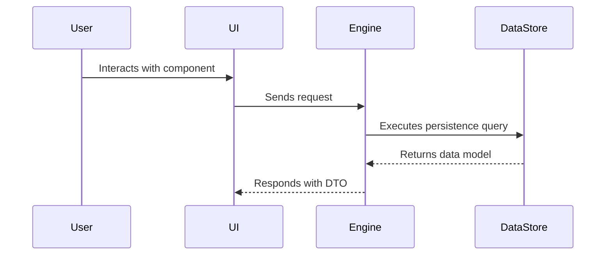

# System Capability Documentation: [Feature / System Capability Name]

This document provides system-wide documentation for the implemented capabilities under `agent-workspace/docs/`.

---

## 1. Capability Overview
Brief description of the feature capability implemented, business context, and primary user interactions.

## 2. Architecture & Layer Integration
- **Presentation Layer**: `[UI components & presenter models in codebase-ui]`
- **Engine / Backend Layer**: `[Domain services & API handlers in codebase-engine]`
- **Data / Persistence Layer**: `[Database models & storage engines in codebase-data]`
- **Operations Layer**: `[Container orchestration & configs in codebase-ops]`

## 3. Implemented API Contracts & DTOs
```yaml
Endpoint: /api/v1/[resource]
Method: GET | POST | PUT | DELETE
Request DTO: [Request Schema]
Response DTO: [Response Schema]
Authentication: [Auth Requirements]
```

## 4. System Interactions & Data Flow

