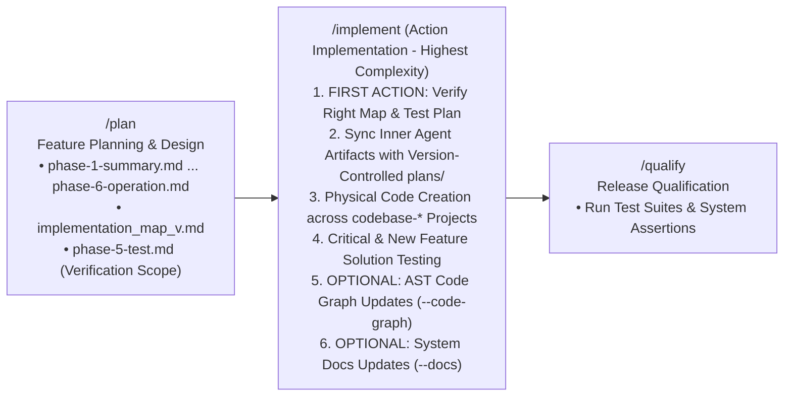
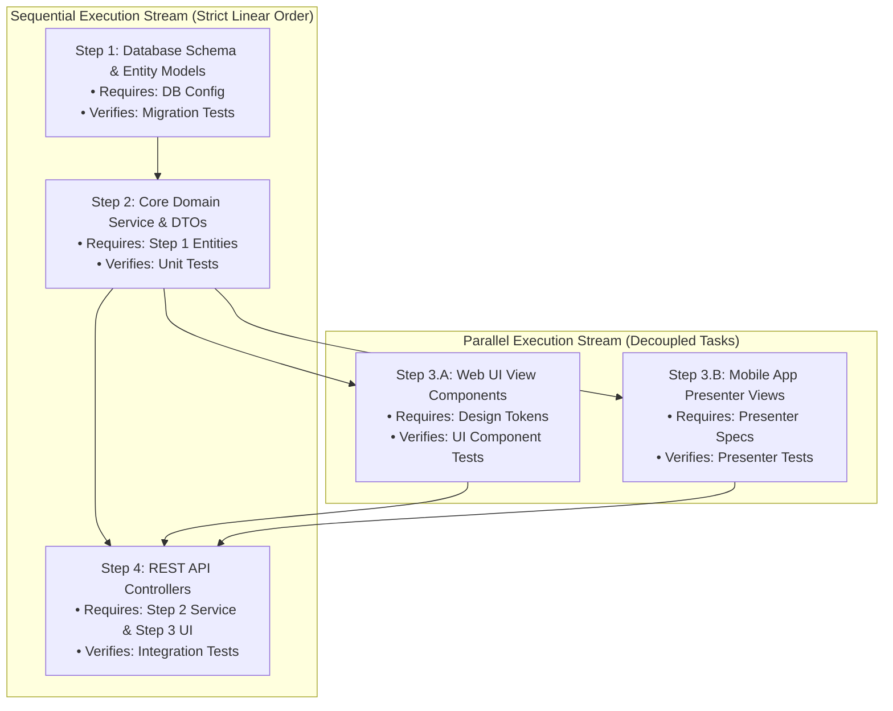

# Guard Specification: Action Implementation (/implement)

This document serves as the authoritative baseline specification for the `/implement` action in the **Guards Framework**. It governs how AI agents systematically execute, scaffold, and verify source code changes, run critical system and new feature solution tests, and optionally update AST-level code graphs and system documentation for planned features.

---

## 1. General Introduction & Core Philosophy

The `/implement` action is the execution engine of the **Guards Framework** and is recognized as **the most complex workflow in the entire operational lifecycle**. It bridges feature planning (`/plan`) and release qualification (`/qualify`) by executing the physical multi-project transformation of the codebase.



### Core Purpose: Complete Feature Implementation & Complexity Scope
The `/implement` action is responsible for the **entire implementation of the planned feature**. Because implementation requires touching live source code across distinct sub-repositories, asserting test suites, and optionally updating topological AST maps and global system knowledge, it possesses the highest architectural complexity among all framework playbooks:

1. **Code Creation & Scaffolding**: Generating production-grade source code, DTO schemas, domain services, data persistence entities, and presentation components.
2. **Multi-Project `codebase-*` Handling**: Managing multi-repository project layouts (`codebase-ui`, `codebase-engine`, `codebase-data`, `codebase-ops`) through workspace symlink layers (`agent-workspace/src/<layer>`), adhering strictly to layer boundaries and dependency policies.
3. **Solution Testing (Critical Features & New Feature Specifications)**: Scaffolding and executing test suites to guarantee BOTH that existing critical system features remain unbroken (regression protection) AND that new feature capabilities satisfy all test contracts defined by the Verification Scope (`phase-5-test.md`) and global `tests/`.
4. **OPTIONAL: AST Code Graph Generation & Synchronization (`code_graph`)**: On-demand parsing of source code ASTs to build and maintain 2-block modular code graph subfolders (`agent-workspace/src/<layer>/code_graph/`) following [code_graph_taxonomy.md](file:///Users/horvathgergo/Desktop/agent-driven-templates/actions/code_graph_taxonomy.md).
5. **OPTIONAL: System Documentation Promotion (`docs/`)**: On-demand promotion of feature resources staged in `plans/<feature-name>/resource/` into global `agent-workspace/docs/` describing all active features across the entire system.

### Decision Persistence & Inner Agent Artifact Alignment Mandate
> [!IMPORTANT]
> **Mandatory Sync between Inner Agent Artifacts & Version-Controlled `plans/` Docs**:
> Each and every result, decision, architectural choice, trade-off rationale, edge-case clarification, or outcome resulting from conversation between the user and the agent **MUST BE PERMANENTLY DOCUMENTED inside the version-controlled `agent-workspace/plans/<feature-name>/` directory**.
>
> In AI agent environments (such as **Google Antigravity**), agents maintain transient internal docs known as **Inner Agent Artifacts** (e.g., `implementation_plan.md`, `walkthrough.md`, scratchpads stored inside agent app data or brain storage). These inner docs are agent-internal and are NOT automatically tracked by the version-controlled Git repository system.
>
> **CRITICAL ALIGNMENT RULE**: Inner Agent Artifacts and the version-controlled files under `agent-workspace/plans/<feature-name>/` (e.g. `phase-*.md`, `GRILL_STATUS.md`, `PROCESS_STATUS.md`, `implementation_map_v<version>.md`) **MUST BE 100% ALIGNED AND SYNCHRONIZED**. Whenever a decision or implementation outcome is recorded or modified during execution, the agent MUST immediately update and persist those exact decisions into the corresponding version-controlled files in `agent-workspace/plans/<feature-name>/`.

### Token Economy Guard: Optional Maintenance of Code Graphs & System Documentation
> [!WARNING]
> **Token Economy Guard (No Automatic Overhead)**: Automatically re-parsing AST structures, regenerating Code Graphs (`code_graph`), and rewriting general system documentation (`docs/`) on every code modification generates **massive computational overhead and rapidly explodes token consumption**.
>
> Therefore, in the Guards Framework:
> - **Default Execution**: `/implement` focuses strictly on core code creation/scaffolding and solution testing based on the `implementation_map` and `test_plan`.
> - **Optional Add-On Operations**: Code Graph updates (`src/<layer>/code_graph/`) and System Documentation updates (`docs/`) are **strictly OPTIONAL** add-on operations. They are executed ONLY when explicitly requested by the user or enabled via CLI flags (`--code-graph`, `--docs`, `--full-sync`).

### First Action Mandate: Immediate Map & Test Plan Verification
> [!IMPORTANT]
> **First Action Mandate**: When an implementation is requested by the user, **the VERY FIRST THING the agent MUST do** is check the `implementation_map` (`implementation_map_v<version>.md`) and verify that the implementation will be executed based on the **RIGHT implementation_map and verification_scope** (`phase-5-test.md`).
>
> Before any code modification or scaffolding begins, the agent must validate:
> 1. The target software version and scope defined in `implementation_map_v<version>.md`.
> 2. The critical system feature assertions and verification boundaries defined in `phase-5-test.md`.
> 3. That the selected map and test plan accurately align with the user's implementation request.

### Visible Step-by-Step Execution & User Interruption Rights
> [!NOTE]
> **Visible Process & Interruption Gate**: During code execution, the agent MUST run a transparent, visible step-by-step process leveraging environment tools and capabilities (e.g., Antigravity interactive prompt tools, progress checkpoints, state updates) to their best:
> - **Followable Progress**: Every implementation step (scaffolding a module, adding DTOs, modifying services) is clearly presented so the user can follow along seamlessly.
> - **User Interruption & Clarification**: The user can, at any point during execution and without unwanted subagent delegation, interrupt the process, ask questions, or request micro-architectural clarification.
> - **Direct Communication**: Execution stays direct and interactive—never hidden behind opaque background loops or multi-agent delegations that prevent user feedback.

### Mandatory Dual Grounding Principle
> [!IMPORTANT]
> **Dual Grounding Mandate**: Any code implementation MUST stand firmly on two mandatory foundational resources created or confirmed prior to code modification:
> 1. **An `implementation_map` (`implementation_map_v<version>.md`)**: The version-linked execution roadmap detailing step-by-step file scaffolding, dependencies, and modification scopes (adhering to [implementation_map_taxonomy.md](file:///Users/horvathgergo/Desktop/agent-driven-templates/actions/implementation_map_taxonomy.md)).
> 2. **A Verification Scope (`phase-5-test.md`)**: The testing specification delta defining which global `tests/` must be updated, and which critical feature assertions must be verified.

---

## 2. Centrality & Structure of the Implementation Map (`implementation_map_v<version>.md`)

The **Implementation Map** is the single most critical asset in the `/implement` action. It bridges conceptual blueprints and physical code scaffolding. To ensure absolute clarity and predictability during execution, every step in an implementation map MUST be rigorously structured.

### A. Mandatory 4-Part Step Schema
Every implementation step defined inside an `implementation_map_v<version>.md` MUST contain four mandatory structural sections:

```markdown
### Step X: [Step Name / Scope Summary]

1. **Requirement Fulfilled**:
   - Explicitly references the documentation requirement or design spec from `phase-*.md` that this step realizes (e.g., `phase-3-data.md Section 2.1` or `phase-4-engine.md API Endpoint /api/v1/auth`).

2. **Prerequisites**:
   - Lists pre-execution conditions, prior step dependencies, required base classes/contracts, or database migrations that must exist before starting this step.

3. **Actions Taken**:
   - Details exact physical file modifications (`[NEW]`, `[MODIFY]`, `[REFACTOR]`), target sub-repositories (`codebase-data`, `codebase-engine`, `codebase-ui`), classes, methods, DTOs, and functions created.

4. **Verification Fulfilled**:
   - Specifies exact unit tests, integration test suites, or system assertions that MUST pass to consider this step completed (e.g., `pytest tests/unit/test_auth.py` or `go test ./pkg/service/...`).
```

### B. Sequential vs. Parallel Step Execution Categorization
Complex features consist of both dependent tasks and independent components. The implementation map MUST explicitly categorize all planned steps into **Sequential Execution Streams** and **Parallel Execution Streams**:

* **Sequential Execution Steps**: Steps that possess hard linear dependencies (e.g., Data Layer Schema Migration → Repository Interface → Service Logic → API Controller). These MUST be executed in strict numerical sequence.
* **Parallel Execution Steps**: Decoupled, independent steps that share no direct file dependencies (e.g., independent UI component views, standalone helper utilities, isolated DTO mappers). These MAY be executed in parallel or in flexible order.



---

## 3. Core Architectural Principles & Boundary Rules

### A. First-Action Verification & Dual Grounding Preconditions
1. **First-Action Map Check**: Upon receiving an `/implement` request, the agent's very first action is inspecting `agent-workspace/plans/<feature-name>/implementation_maps/` to verify that the target `implementation_map_v<version>.md` exists and matches the user's requested release scope.
2. **First-Action Verification Scope Check**: Simultaneously, the agent verifies `phase-5-test.md` to ensure all critical system feature assertions are present and linked to the implementation scope.
3. **Precondition Resolution Gate**: If either the map or test plan is missing or ambiguous, the agent MUST immediately stop, present the situation to the user, and confirm the right map and test plan before proceeding.

### B. Inner Agent Artifact & Version-Controlled `plans/` Synchronization Rule
1. **Mandatory Document Sync**: Every conversation result, decision, design choice, or step outcome produced in an inner agent doc/Artifact (e.g. Antigravity internal `implementation_plan.md`, `walkthrough.md`) MUST be immediately written and synchronized into the corresponding version-controlled files inside `agent-workspace/plans/<feature-name>/`.
2. **Single Source of Truth**: The version-controlled files under `agent-workspace/plans/<feature-name>/` remain the sole authoritative source of truth for the codebase across Git history, developers, and future agent sessions.

### C. Multi-Project `codebase-*` Sub-Repository Handling
The `/implement` workflow governs multi-repository and layered project structures:
1. **Target Sub-Repositories**: Source code modifications are written to `codebase-ui/`, `codebase-engine/`, `codebase-data/`, or `codebase-ops/` (accessed through symlinks under `agent-workspace/src/<layer>/`).
2. **Layer Boundary Enforcement**: Code in lower layers (e.g., `codebase-data`) MUST NOT import or depend on upper layers (e.g., `codebase-ui`), adhering strictly to the Rule of Dependency defined in [multi_repo_architecture.md](file:///Users/horvathgergo/Desktop/agent-driven-templates/actions/multi_repo_architecture.md).
3. **Symlink Resolution Check**: Prior to scaffolding, the agent asserts that relative symlinks in `agent-workspace/src/<layer>` resolve correctly to underlying sub-repositories.

### D. Solution Testing (Critical System Features & New Feature Specs)
1. **Critical Feature Protection (Regression Assertions)**: Implementation MUST NOT break existing core capabilities. The agent inspects `phase-5-test.md` for critical system assertions and executes baseline checks before and after code scaffolding.
2. **New Feature Test Scaffolding**: Alongside production code, the agent scaffolds unit, integration, and contract tests corresponding to newly introduced interfaces, DTOs, and services.
3. **Test-Code Co-location**: Test suites are placed alongside source files within `codebase-*` sub-repositories as specified in the test plan.

### E. Visible Step-by-Step Scaffolding & Direct Control (No Opaque Delegation)
1. **Step-by-Step Granularity**: Scaffolding is broken into clear, discrete execution steps adhering to the 4-part step schema (Requirement, Prerequisites, Actions, Verification).
2. **Visible Environment Tool Usage**: Uses platform primitives (e.g. Antigravity status notifications, interactive prompt tools, step-by-step diff previews) so that every disk action is explicitly visible to the developer.
3. **Interruption & Clarification Checkpoints**: Between scaffolding steps, the agent maintains an open interaction window allowing the user to:
   - Ask clarifying questions about proposed code structures.
   - Request micro-architectural adjustments or alternative design patterns.
   - Pause or resume the implementation sequence at will.
4. **No Opaque Delegation**: Implementation execution is performed directly by the agent in full view of the user, avoiding opaque subagent loops or background task delegations that obscure decision-making.

### F. Strict Directory Write Boundaries & Resource Separation
The `/implement` workflow strictly enforces clear separation between source code, workspace control maps, AST code graphs, and system documentation:

```text
Target Repositories / Sub-Folders       Role & Write Governance during /implement
──────────────────────────────────       ─────────────────────────────────────────
codebase-<layer>/  or  src/<layer>/    → Production Source Code & Test Specs (Physical Code Modifications)
agent-workspace/src/<layer>/code_graph/→ Optional AST Code Graphs (Written only when --code-graph enabled)
agent-workspace/docs/                  → Optional Global System Docs (Written only when --docs enabled)
agent-workspace/plans/<feature-name>/  → Version-Controlled Planning Artifacts & Decision Registry (Updated & Synced during /implement)
```

### G. Optional AST Code Graph Synchronization Rule (`--code-graph`)
1. **Default State**: By default, `/implement` skips AST code graph updates to conserve token usage and minimize API overhead.
2. **When Enabled (`--code-graph` or `--full-sync`)**: The agent parses newly created or modified source files for structural elements (`Module`, `Class`, `Struct`, `Interface`, `Function`) and updates `agent-workspace/src/<layer>/code_graph/` (`graph.md`, `process_flow.md`, `data_flow.md`, `risk_analysis.md`) following [code_graph_taxonomy.md](file:///Users/horvathgergo/Desktop/agent-driven-templates/actions/code_graph_taxonomy.md).

### H. Optional System Documentation Promotion Rule (`--docs`)
1. **Default State**: By default, `/implement` skips general system documentation updates to avoid token bloat during active development.
2. **When Enabled (`--docs` or `--full-sync`)**: Upon completing feature implementation, `/implement` inspects `plans/<feature-name>/resource/`, synthesizes non-code specs and API diagrams, and promotes them into global `agent-workspace/docs/`.

---

## 4. Directory Layout & Workflow Scaffold

```text
actions/implement/
└── implement_action.md               # Tier 2 Universal Specification (This Document)
```

---

## 5. Detailed Step-by-Step State Machine Design

Execution of the `/implement` workflow follows a strict 7-node sequential state machine starting with the mandatory immediate map & test plan verification, leading into visible step-by-step code scaffolding and solution testing, followed by optional code graph and documentation update checkpoints:

```mermaid
graph TD
    S1[Node S1: Environment & Workspace Check] 
    --> S2[Node S2: FIRST ACTION - Map & Verification Scope Check<br/>Validate right implementation_map_v<version>.md & phase-5-test.md]
    
    S2 -->|Missing or Ambiguous Map/Plan| S2_Confirm[Confirm / Select Right Map & Test Plan with User]
    S2 -->|Validated Right Map & Test Plan| S3[Node S3: Micro-Architecture Alignment Gate<br/>Confirm Starting codebase-* Layer & Step Boundaries]
    
    S2_Confirm --> S3
    
    S3 --> S4[Node S4: Visible Step-by-Step Code Scaffolding & Solution Testing<br/>• Execute Sequential & Parallel step streams<br/>• Follow 4-part step schema (Req, Prereq, Actions, Verification)<br/>• Execute critical system & new feature test suites<br/>• Sync Inner Agent Artifacts with Version-Controlled plans/<br/>• User Interruption & Clarification Checkpoints]
    
    S4 -->|--code-graph Enabled| S5[Node S5: OPTIONAL AST Code Graph Generation<br/>Build/Update src/<layer>/code_graph/ Files]
    S4 -->|--code-graph Disabled (Default)| S6
    
    S5 --> S6
    
    S6 -->|--docs Enabled| S6_Exec[Node S6: OPTIONAL System Documentation Update<br/>Promote plans/<feature>/resource/ to global docs/]
    S6 -->|--docs Disabled (Default)| S7[Node S7: PROCESS_STATUS.md Sync & Handoff to /qualify]
    
    S6_Exec --> S7
```

---

### Step Descriptions & Execution Reasoning

#### Step 1: Environment & Workspace Check (Node S1)
* **Description**: Verifies workspace initialization (`agent-workspace/` and active Git branch state). Asserts Docker engine status and active feature directory (`agent-workspace/plans/<feature-name>/`).
* **Storage Actions**: Reads `agent-workspace/plans/<feature-name>/PROCESS_STATUS.md`. Verifies Row 3 (`/plan`) is marked `Completed` or `In Progress`.

#### Step 2: FIRST ACTION - Map & Verification Scope Check (Node S2)
* **Description**: **As the very first action**, the agent checks `agent-workspace/plans/<feature-name>/implementation_maps/` and verifies that the request will be executed based on the **RIGHT `implementation_map_v<version>.md` AND Verification Scope (`phase-5-test.md`)**.
* **Reasoning**: Ensures zero ambiguity about target version, release scope, critical system assertions, or verification contracts before a single line of code is written.

#### Step 3: Micro-Architecture Alignment Gate (Node S3)
* **Description**: Confirms starting entry-point `codebase-*` layer, incremental step boundaries, sequential vs. parallel streams, optional features (`--code-graph`, `--docs`), and language AST taxonomies.
* **Reasoning**: Establishes developer alignment on immediate implementation targets before modifying code.

#### Step 4: Visible Step-by-Step Code Scaffolding & Solution Testing (Node S4)
* **Description**: Executes code modifications step-by-step following the 4-part step schema (Requirement, Prerequisites, Actions, Verification) outlined in the target `implementation_map_v<version>.md`. Executes sequential steps in order and parallel steps flexibly. Displays changes incrementally with visible tools.
* **Inner Artifact Alignment**: Immediately writes and synchronizes all decisions, plan updates, and step outcomes produced in inner agent docs/Artifacts to the corresponding version-controlled files under `agent-workspace/plans/<feature-name>/`.
* **User Interruption & Clarification**: Between scaffolding steps, the agent maintains an active communication window where the user can interrupt, ask questions, or request adjustments. No opaque background delegations are used.

#### Step 5: OPTIONAL AST Code Graph Generation & Update (Node S5)
* **Description**: **Executed ONLY when `--code-graph` or `--full-sync` flag is present**. Parses implemented code for structural symbols and updates modular code graph subfolders under `agent-workspace/src/<layer>/code_graph/` (`graph.md`, `process_flow.md`, `data_flow.md`, `risk_analysis.md`) adhering to `code_graph_taxonomy.md`.
* **Token Economy Guard**: Skipped by default to prevent excessive token consumption and AST parsing overhead during routine code implementation.

#### Step 6: OPTIONAL System Documentation Update & Knowledge Promotion (Node S6)
* **Description**: **Executed ONLY when `--docs` or `--full-sync` flag is present**. Synthesizes implemented code structures and feature reference materials from `agent-workspace/plans/<feature-name>/resource/`, updating general system documentation under `agent-workspace/docs/`.
* **Token Economy Guard**: Skipped by default to prevent token bloat.

#### Step 7: PROCESS_STATUS.md Sync & Handoff to `/qualify` (Node S7)
* **Description**: Updates `agent-workspace/plans/<feature-name>/PROCESS_STATUS.md`, marking Row 4 (`/implement`) as `Completed` with datestamped history log. Prepares handoff for `/qualify`.

---

## 6. Commands Reference & Execution Modes

### Commands Reference

| Command | Description |
|:---|:---|
| `/implement` (or `/implement --plan`) | **Core Implementation Mode** (Default). Verifies map & test plan first, executes step-by-step code scaffolding across `codebase-*` with solution testing |
| `/implement --code-graph` | **Implementation + AST Code Graph Mode**. Executes code scaffolding and updates AST Code Graphs in `agent-workspace/src/<layer>/code_graph/` |
| `/implement --docs` | **Implementation + System Docs Mode**. Executes code scaffolding and promotes feature resources to global `agent-workspace/docs/` |
| `/implement --full-sync` | **Full Synchronization Mode**. Executes code scaffolding, solution testing, AST Code Graph updates, and System Documentation updates |
| `/implement --auto` (or `/implement --apply`) | **Continuous Scaffolding Mode**. Executes step-by-step scaffolding automatically while streaming progress log and syncing outcomes |
| `/implement --version <vX.Y.Z>` | **Version Map Target**. Explicitly targets a specific implementation map version (e.g., `implementation_map_v1.0.0.md`) |
| `/implement --dry-run` | **Preview Mode**. Simulates step-by-step code scaffolding and displays file diff previews without altering files |


---

## 7. Summary Checklist for AI Agents Executing `/implement`

- [ ] **FIRST ACTION**: Check `implementation_map_v<version>.md` and verify execution is based on the RIGHT map and Verification Scope (`phase-5-test.md`).
- [ ] Confirm target release version, scope, `codebase-*` layers, and critical system assertions.
- [ ] Parse implementation map steps enforcing the mandatory 4-part step schema (Requirement, Prerequisites, Actions, Verification).
- [ ] Identify Sequential vs. Parallel execution streams before scaffolding.
- [ ] Execute visible step-by-step code scaffolding across target `codebase-*` projects in `src/`.
- [ ] Run solution testing verifying critical system regression assertions AND new feature test specs.
- [ ] **MANDATORY ARTIFACT SYNC**: Write and synchronize all decisions, plan updates, and conversation outcomes from inner agent docs (Artifacts) directly into version-controlled files under `agent-workspace/plans/<feature-name>/`.
- [ ] Maintain direct interaction allowing user interruption, questions, and clarification at any step (no opaque subagent delegation).
- [ ] **Token Economy Check**: Skip Code Graph (`src/<layer>/code_graph/`) and System Docs (`docs/`) updates by default unless `--code-graph`, `--docs`, or `--full-sync` flag is explicitly set.
- [ ] Update `PROCESS_STATUS.md` Row 4 to `Completed` with datestamped log entry.
