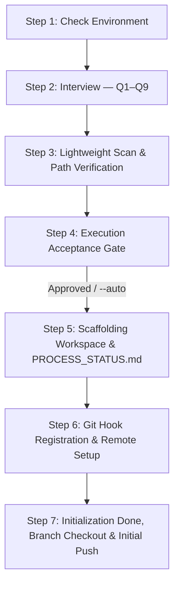

# `/init` Workflow Execution Playbook

This stateful execution playbook defines the linear, single-path state machine governing project initialization, pure control plane scaffolding (`agent-workspace/`), and remote Git origin synchronization within Google Antigravity.

---

## 1. Parameters & Operational Rules of Thumb

### CLI Parameter Handling
*   `/init`: Default interactive execution.
    *   **Greenfield run** (uninitialized workspace, no `agent-workspace/plans/initial/`): Scaffolds base agent control plane (`agent-workspace/`), creates Git branch `initial`, configures primary remote origin, and pushes initial documentation.
    *   **Re-run** (initialized workspace without options): Runs the sequential Q1–Q9 interview (auto-detecting conformant root), creates a feature/scope branch per branch origination rules, and scaffolds feature-bound plans under `agent-workspace/plans/<scope_name>/`.
*   `/init --auto`: Non-interactive execution mode. Bypasses the Node S4 Execution Acceptance prompt and automatically executes all planned scaffolding and remote sync tasks.
*   `/init --feature <feature_name>`: Explicitly initializes a feature development scope on Git branch `feature/<feature_name>` and creates `agent-workspace/plans/<feature_name>/`.
*   `/init --release <vX.Y.Z>`: Initializes a release branch (`release/vX.Y.Z`) and prepares release-scoped tracking.
*   `/init --dry-run`: Simulates the initialization sequence, previewing proposed folder structures and plan sheets without writing changes to disk.
*   `/init --force`: Overwrites default `.agents/` control rules and workflows while strictly preserving custom phase blueprints.

### Operational Rules of Thumb
1.  **Branch Origination Rule**: When creating a new branch in an existing repository (e.g. for feature, bugfix, or hotfix):
    - If only one branch exists, originate from it.
    - If multiple branches exist and all are merged/rebased into `main`/`master`, originate from `main`/`master`.
    - If unmerged branches exist: follow user prompt or explicitly ask the user which branch to originate from.
2.  **No-Restructuring Rule**: `/init` MUST NOT perform file moves, code refactoring, or import rewrites. If legacy codebase restructuring is required, the user is directed to call `/process`.
3.  **No Codebase Skeletons Rule**: `/init` creates strictly `agent-workspace/`. Software layer skeletons (`codebase-*`) and container configurations are planned in `/plan` or linked in `/process`.

### Workflow Context Notification Law
Every turn during `/init` MUST:
1. Open with a 1-line response banner quote:
   `> 📍 **Active Workflow**: /init | **Scope**: <branch> | **Node**: <Node_ID>`
2. Print a stylized transition badge when entering new nodes:
   `=== [Node S<N>: <Node Name>] ===`
3. Maintain header metadata (`Workflow`, `Branch`, `Date`) in `PROCESS_STATUS.md` and `GRILL_STATUS.md`.

---

## 2. Execution State Machine Nodes (S1 – S7)



### Node S1: Check Environment
1.  **Environment Check**: Verify filesystem write permissions and Git binary availability before asking interview questions.
2.  If permissions or binaries are missing, output setup diagnostics and halt.

### Node S2: Interview (Q1 to Q9)
1.  Execute the flat, sequential interview schema defined in `rules/init-grill.md` across four core sections:
    *   **Section A (Design Goal & Environment)**:
        - **Q1 (Local Workspace Parent Directory)**: Resolve parent directory and verify Baseline 2 (Clean Root Mandate via `git rev-parse --show-toplevel`).
        - **Q2 (Project Scope, Purpose & Names)**: Collect project purpose, milestones, `<local_workspace_root_name>` (if newly created), and `<scope_name>` (`initial` for greenfield, or named feature).
        - **Q3 (Git Set-up & Primary Remote Origin)**: Resolve Git identity mode (`adopt` | `clone` | `initialize`) and primary remote origin URL. Check Baseline 4 (Remote Divergence Halts).
    *   **Section B (Supporting Documentation)**:
        - **Q4/Q4b (Local Documentation Repository)**: Discover and link local documentation paths.
        - **Q5/Q5b (Remote / Cloud Documentation Repository)**: Discover and link cloud documentation URLs (Confluence, Notion, Wiki).
        - **Q6 (Further Documentation & Issue References)**: Capture linked issue references (e.g. `#142`), bug tickets, or context.
    *   **Section C (Agentic Environment)**:
        - **Q7 (Agent Guidance, Rules, Skills, MCPs & Hooks)**: Identify rules, skills, MCP servers, and hooks.
    *   **Section D (Verification & Confirmation)**:
        - **Q8 (Constraints & Pre-Planning Decisions)**: Explicitly record breaking changes, constraints, or dependency decisions.
        - **Q9 (Q&A Summary Verification & Reflection)**: Present formatted recap table of Q1–Q8 gathered answers; allow modifications or open reflections.
2.  Write full Q&A audit log to `agent-workspace/plans/<scope_name>/GRILL_STATUS.md`.
3.  Transition to Node S3.

### Node S3: Lightweight Scan & Path Verification
1.  Verify target workspace paths and auto-detect existing version control configs (`.git/config`).
2.  **Test Strategy Assertion**: Check for the existence of `agent-workspace/tests/TEST_STRATEGY.md`. If absent, record the gap in `PROCESS_STATUS.md` without halting.
3.  Strictly preserve existing source files without restructuring.

### Node S4: Execution Acceptance Gate
1.  Synthesize gathered information into an understanding summary and list planned scaffolding tasks.
2.  **User Acceptance Prompt**:
    *   If `--auto` flag is present: Log automatic bypass and proceed to Node S5.
    *   If interactive mode: Present understanding summary and prompt user for explicit approval (*"Proceed with execution?"*).
3.  Log acceptance decision into `agent-workspace/plans/<scope_name>/GRILL_STATUS.md`.

### Node S5: Scaffolding Workspace & `PROCESS_STATUS.md`
1.  Invoke `skills/init-scaffolder/SKILL.md`.
2.  **Control Plane Scaffolding**:
    *   Scaffold `agent-workspace/` control structures (`.agents/rules/`, `workflows/`, `skills/`, `hooks/`, `sidecars/`).
    *   Create plan subfolder `agent-workspace/plans/<scope_name>/`.
    *   Create empty staging directories `agent-workspace/docs/` and `agent-workspace/src/`.
    *   Provision a `.gitkeep` file inside **every scaffolded directory node** to guarantee tracking in Git.
    *   Deploy starter templates `templates/PROCESS_STATUS.md` and `templates/phase-1-summary.md` into `agent-workspace/plans/<scope_name>/`.
3.  **Git Set-up Execution (Baseline 3)**:
    *   If Q3 resolved to **clone**: Execute `git clone <origin_url> agent-workspace/`.
    *   If Q3 resolved to **initialize**: Execute `git init` on `agent-workspace/` (and register remote origin).
    *   If Q3 resolved to **adopt**: Use existing repository in place.

### Node S6: Git Hook Registration & Remote Origin Setup
1.  Register primary Git remote origin URL captured in Q3 (`git remote add origin <url>` or update existing).
2.  Install `hooks/pre-commit-plan-validator.sh` into `.git/hooks/pre-commit` and grant execution permissions (`chmod +x`).

### Node S7: Initialization Done, Branch Checkout & Initial Push
1.  **Branch Checkout Guarantee**: Ensure and assert the target working branch is checked out on `agent-workspace/` (`initial` for greenfield, `feature/<scope_name>` or `bugfix/<scope_name>` per branch origination rules).
2.  Mark `/init` step as `Completed` in `agent-workspace/plans/<scope_name>/PROCESS_STATUS.md` Block 1 matrix.
3.  Record datestamped entry in Block 2 daily history.
4.  Stage, commit, and push initial workspace control plane and documentation to remote origin:
    ```bash
    git add agent-workspace/
    git commit -m "chore(init): bootstrap agent-workspace control plane and initial documentation"
    git push -u origin <branch_name>
    ```
5.  Output initialization summary and recommend next workflow command (`/plan` or `/process`).
