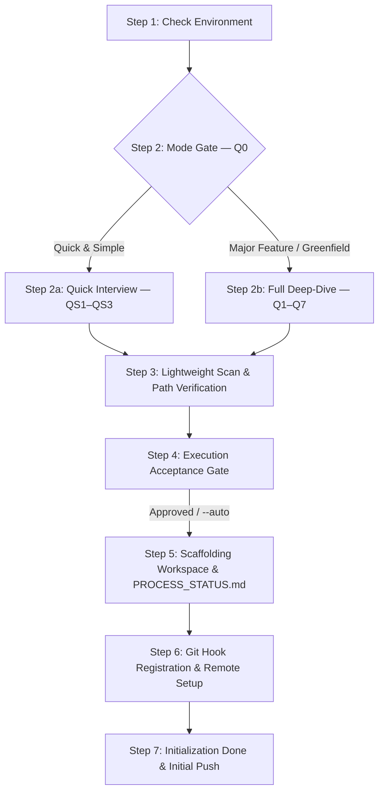

# `/init` Workflow Execution Playbook

This stateful execution playbook defines the dual-path state machine governing project initialization, pure control plane scaffolding (`agent-workspace/`), and remote Git origin synchronization within Google Antigravity.

---

## 1. Parameters & Operational Rules of Thumb

### CLI Parameter Handling
*   `/init`: Default interactive execution.
    *   **Greenfield run** (uninitialized workspace, no `agent-workspace/plans/initial/`): Scaffolds base agent control plane (`agent-workspace/`), creates Git branch `initial`, configures primary remote origin, and pushes initial documentation.
    *   **Re-run** (initialized workspace without options): Presents Q0 Mode Gate (Quick & Simple vs. Major Feature) and scaffolds feature-bound plans under `agent-workspace/plans/<feature_name>/`.
*   `/init --auto`: Non-interactive execution mode. Bypasses the Node S4 Execution Acceptance prompt and automatically executes all planned scaffolding and remote sync tasks.
*   `/init --feature <feature_name>`: Explicitly initializes a feature development scope on Git branch `feature/<feature_name>` and creates `agent-workspace/plans/<feature_name>/`.
*   `/init --dry-run`: Simulates the initialization sequence, previewing proposed folder structures and plan sheets without writing changes to disk.
*   `/init --force`: Overwrites default `.agents/` control rules and workflows while preserving user custom phase blueprints.

### Operational Rules of Thumb
1.  **Branch Origination Rule**: When creating a new branch in an existing repository (e.g. for feature, bugfix, or hotfix):
    - If only one branch exists, originate from it.
    - If multiple branches exist and all are merged/rebased into `main`/`master`, originate from `main`/`master`.
    - If unmerged branches exist: follow user prompt or explicitly ask the user which branch to originate from.
2.  **No-Restructuring Rule**: `/init` MUST NOT perform file moves, code refactoring, or import rewrites. If legacy codebase restructuring is required, the user is directed to call `/process`.
3.  **No Codebase Skeletons Rule**: `/init` creates strictly `agent-workspace/`. Software layer skeletons (`codebase-*`) and container configurations are planned in `/plan` or linked in `/process`.

### Workflow Context Notification Law
Every turn during `/init` MUST:
1. Open with a 1-line response banner quote:
   `> 📍 **Active Workflow**: /init | **Scope**: <branch> | **Node**: <Node_ID>`
2. Print a stylized transition badge when entering new nodes:
   `=== [Node S<N>: <Node Name>] ===`
3. Maintain header metadata (`Workflow`, `Branch`, `Date`) in `PROCESS_STATUS.md` and `GRILL_STATUS.md`.

---

## 2. Execution State Machine Nodes (S1 – S7)



### Node S1: Check Environment & Branch Initialization
1.  **Environment Check**: Verify filesystem write permissions and Git binary availability.
2.  **Branch Check**:
    *   If workspace is uninitialized (greenfield): Create and check out baseline Git branch: `git checkout -b initial`.
    *   If workspace is already initialized: Apply branch origination rules to determine parent branch, create and check out the new branch.

### Node S2: Mode Gate (Q0)
1.  **Greenfield Detection**: If `agent-workspace/plans/initial/` does NOT exist, auto-select **Major Feature / Greenfield Mode** and route to Node S2b.
2.  **Initialized Workspace**: Present Q0 mode selection prompt adhering to `rules/init-grill.md`.
    *   If Quick & Simple selected $\rightarrow$ Route to Node S2a.
    *   If Major Feature selected $\rightarrow$ Route to Node S2b.

### Node S2a: Quick & Simple Interview (QS1 – QS3)
1.  Execute QS1 (Aim & Reason + Feature/Branch Name), QS2 (Issue/Bug Reference), QS3 (Pre-Planning Decisions & Constraints).
2.  Write Q&A audit log to `agent-workspace/plans/<feature_name>/GRILL_STATUS.md` with header `mode: quick_simple`.
3.  Transition to Node S3.

### Node S2b: Major Feature / Greenfield Deep-Dive (Q1 – Q7)
1.  Execute sequential Q1 to Q7 interview prompts neutrally per `rules/init-grill.md`:
    - Q1: Scope, Purpose, & Milestones
    - Q2: Local System Folders & Existing Locations
    - Q3: Remote / Cloud Documentation Repository
    - Q4: Additional Remote Code Repositories
    - Q5: Primary Remote Git Origin & Provider (captures URL for initial push)
    - Q6: Agent Guidance, Rules, Skills, MCPs, & Hooks
    - Q7: Summary Verification & Reflection
2.  Write full Q&A audit log to `agent-workspace/plans/<branch_name>/GRILL_STATUS.md` with header `mode: major_feature`.
3.  Transition to Node S3.

### Node S3: Lightweight Scan & Path Verification
1.  Perform surface-level directory inspection to verify target paths and auto-detect existing version control configs.
2.  Strictly preserve brownfield code—do NOT perform any codebase restructuring or file relocation.

### Node S4: Execution Acceptance Gate
1.  Synthesize gathered information into an understanding summary and list planned scaffolding tasks.
2.  **User Acceptance Prompt**:
    *   If `--auto` flag is present: Log automatic bypass and proceed to Node S5.
    *   If interactive mode: Present understanding summary and prompt user for explicit approval (*"Proceed with execution?"*).
3.  Log acceptance decision into `agent-workspace/plans/<branch_name>/GRILL_STATUS.md`.

### Node S5: Scaffolding Workspace & `PROCESS_STATUS.md`
1.  Invoke `skills/init-scaffolder/SKILL.md`.
2.  **Quick & Simple Mode**:
    *   Create `agent-workspace/plans/<feature_name>/`.
    *   Create Git branch (`bugfix/<feature_name>` or `feature/<feature_name>`).
    *   Deploy `PROCESS_STATUS.md` and `phase-1-summary.md` (populated with QS1–QS3 data).
3.  **Major Feature / Greenfield Mode**:
    *   Scaffold `agent-workspace/` control structures (`.agents/rules/`, `workflows/`, `skills/`, `hooks/`, `sidecars/`).
    *   Create plan subfolder `agent-workspace/plans/<branch_name>/`.
    *   Create empty staging directories `agent-workspace/docs/` and `agent-workspace/src/`.
    *   Provision a `.gitkeep` file inside **every scaffolded directory node** to guarantee tracking in remote Git.
    *   Deploy starter templates: `templates/PROCESS_STATUS.md` and `templates/phase-1-summary.md` to `agent-workspace/plans/<branch_name>/`.

### Node S6: Git Hook Registration & Remote Setup
1.  Register primary Git remote origin URL captured in Q5 (`git remote add origin <url>` or update existing).
2.  Install `hooks/pre-commit-plan-validator.sh` into `.git/hooks/pre-commit` and grant execution permissions (`chmod +x`).

### Node S7: Initialization Done & Initial Push
1.  Mark `/init` step as `Completed` in `agent-workspace/plans/<branch_name>/PROCESS_STATUS.md` Block 1 matrix.
2.  Record datestamped entry in Block 2 daily history.
3.  Stage, commit, and push initial workspace control plane and documentation to remote origin:
    ```bash
    git add agent-workspace/
    git commit -m "chore(init): bootstrap agent control plane and documentation"
    git push -u origin <branch_name>
    ```
4.  Output initialization summary and recommend next workflow command (`/plan` or `/process`).
