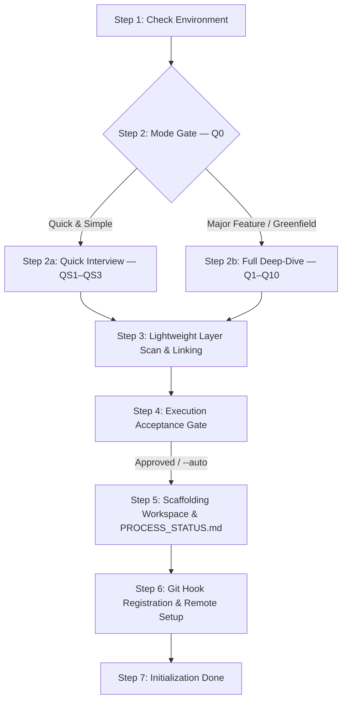

# `/init` Workflow Execution Playbook

This stateful execution playbook defines the dual-path state machine governing project initialization and scaffolding within Google Antigravity.

---

## 1. Parameters & Operational Rules of Thumb

### CLI Parameter Handling
*   `/init`: Default interactive execution.
    *   **Greenfield run** (uninitialized workspace, no `agent-workspace/plans/initial/`): Scaffolds base framework and creates Git branch `initial`.
    *   **Re-run** (initialized workspace without options): Presents Q0 Mode Gate (Quick & Simple vs. Major Feature) and scaffolds feature-bound plans under `agent-workspace/plans/<feature_name>/`.
*   `/init --auto`: Non-interactive execution mode. Bypasses the Node S4 Execution Acceptance prompt and automatically executes all planned scaffolding tasks.
*   `/init --feature <feature_name>`: Explicitly initializes a feature development scope on Git branch `feature/<feature_name>` and creates `agent-workspace/plans/<feature_name>/`.
*   `/init --add-layer <layer_name>`: Introduces a new layer skeleton `codebase-<layer_name>`, registers its relative symlink under `agent-workspace/src/<layer_name>`, provisions its standalone `Dockerfile`, and updates `codebase-devops/docker/docker-compose.yml`.
*   `/init --dry-run`: Simulates the initialization sequence, previewing proposed folder structures, relative symlinks, Docker files, and plan sheets without writing changes to disk.
*   `/init --force`: Overwrites default `.agents/` control rules and workflows while preserving user custom phase blueprints.

### Workflow Context Notification Law
Every turn during `/init` MUST:
1. Open with a 1-line response banner quote:
   `> 📍 **Active Workflow**: /init | **Scope**: <branch> | **Node**: <Node_ID>`
2. Print a stylized transition badge when entering new nodes:
   `=== [Node S<N>: <Node Name>] ===`
3. Maintain header metadata (`Workflow`, `Branch`, `Date`) in `PROCESS_STATUS.md` and `GRILL_STATUS.md`.

---

## 2. Execution State Machine Nodes (S1 – S7)

### Node S1: Check Environment & Branch Initialization
1.  **Docker Healthcheck**: Execute `docker info` to verify that Docker daemon is running and accessible.
2.  **Git Context Verification**: Verify Git installation and workspace root `.git` state.
3.  **Branch Check**:
    *   If workspace is uninitialized (greenfield): Create and check out baseline Git branch: `git checkout -b initial`.
    *   If workspace is already initialized: Preserve current branch or prepare for feature branch creation.

### Node S2: Mode Gate (Q0)
1.  **Greenfield Detection**: If `agent-workspace/plans/initial/` does NOT exist, auto-select **Major Feature / Greenfield Mode** and route to Node S2b.
2.  **Initialized Workspace**: Present Q0 mode selection prompt adhering to `rules/init-grill.md`.
    *   If Quick & Simple selected $\rightarrow$ Route to Node S2a.
    *   If Major Feature selected $\rightarrow$ Route to Node S2b.

### Node S2a: Quick & Simple Interview (QS1 – QS3)
1.  Execute QS1 (Aim & Reason + Feature/Branch Name), QS2 (Issue/Bug Reference), QS3 (Pre-Planning Decisions & Constraints).
2.  Inherit tech stack, architecture, cloud provider, and container profiles from `agent-workspace/plans/initial/GRILL_STATUS.md`.
3.  Write Q&A audit log and inherited profile to `agent-workspace/plans/<feature_name>/GRILL_STATUS.md` with header `mode: quick_simple`.
4.  Transition to Node S3.

### Node S2b: Major Feature / Greenfield Deep-Dive (Q1 – Q10)
1.  Execute sequential Q1 to Q10 interview prompts neutrally per `rules/init-grill.md`.
2.  Write full Q&A audit log to `agent-workspace/plans/<branch_name>/GRILL_STATUS.md` with header `mode: major_feature`.
3.  Transition to Node S3.

### Node S3: Lightweight Layer Scan & Linking
1.  Perform surface-level directory inspection to detect existing source or document folders.
2.  Auto-detect Git remote origin URLs from `.git/config` if present.
3.  Strictly preserve brownfield code—do NOT perform any codebase restructuring or file relocation.

### Node S4: Execution Acceptance Gate
1.  Synthesize gathered information into an understanding summary and list planned scaffolding tasks.
2.  **User Acceptance Prompt**:
    *   If `--auto` flag is present: Log automatic bypass and proceed to Node S5.
    *   If interactive mode: Present understanding summary and prompt user for explicit approval (*"Proceed with execution?"*).
3.  Log acceptance decision into `agent-workspace/plans/<branch_name>/GRILL_STATUS.md`.

### Node S5: Scaffolding Workspace & `PROCESS_STATUS.md`
1.  Invoke `skills/init-scaffolder/SKILL.md`.
2.  **Quick & Simple Mode**:
    *   Create `agent-workspace/plans/<feature_name>/`.
    *   Create Git branch (`bugfix/<feature_name>` or `feature/<feature_name>`).
    *   Deploy `PROCESS_STATUS.md` and `phase-1-summary.md` (populated with QS1–QS3 data).
    *   Existing sub-repositories and relative symlinks remain untouched.
3.  **Major Feature / Greenfield Mode**:
    *   Scaffold `agent-workspace/` control structures (`.agents/rules/`, `workflows/`, `skills/`, `hooks/`, `sidecars/`).
    *   Create plan subfolder `agent-workspace/plans/<branch_name>/`.
    *   Scaffold `codebase-devops/` sub-repository (`.github/workflows/ci.yml`, `docker/dev.Dockerfile`, `docker/docker-compose.yml`, `config/`, `Dockerfile`, `src/`, `tests/`).
    *   Scaffold layer skeletons `codebase-<layer_name>` (`src/`, `config/`, `tests/`, `Dockerfile`, `.github/workflows/`).
    *   Provision a `.gitkeep` file inside **every scaffolded directory node**.
    *   Create pure relative symlinks under `agent-workspace/src/` (`devops`, `layout`, `engine` $\rightarrow$ `../../codebase-X/src`). Perform 3-part verification check.
    *   Deploy starter templates: `templates/PROCESS_STATUS.md` and `templates/phase-1-summary.md` to `agent-workspace/plans/<branch_name>/`.

### Node S6: Git Hook Registration & Remote Setup
1.  Register Git remotes based on Q4/Q5 selections (or inherited provider configuration).
2.  Install `hooks/pre-commit-plan-validator.sh` into `.git/hooks/pre-commit` and grant execution permissions (`chmod +x`).

### Node S7: Initialization Done
1.  Mark `/init` step as `Completed` in `agent-workspace/plans/<branch_name>/PROCESS_STATUS.md` Block 1 matrix.
2.  Record datestamped entry in Block 2 daily history.
3.  Output initialization summary and recommend next workflow command (`/plan` or `/process`).
