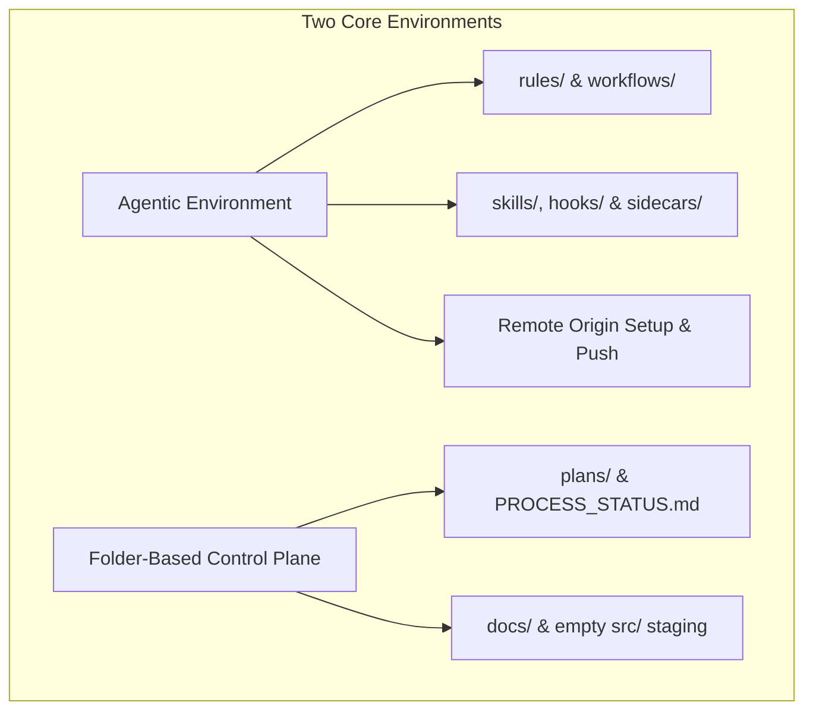
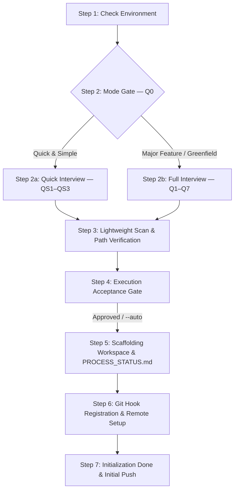

# Guard Specification: Initialization (/init)

This document collects all statements, requirements, theoretical design decisions, and implementation rationale regarding the `/init` action. It serves as the authoritative baseline specification for bootstrapping the Guards framework in any codebase while keeping execution simple, fast, and token-efficient.

---

## 1. General Introduction & Core Objectives

The `/init` action is a fundamental component of the **Software Development Action Guard**. It acts as the gatekeeper and bootstrapping process for the repository, transforming any standard codebase into a structured agentic development environment.

### Goal of the Action
The primary goal of `/init` is to initialize the project's agentic, software, and physical filesystem layers. By running `/init`, the workspace transitions from an unmonitored codebase into a state-tracked repository under the Guards guidelines.

### Role & Relationship Across Framework Specifications
To ensure the Guards Framework can be baselined and implemented consistently across diverse AI coding environments (e.g. Google Antigravity, OpenAI Codex, Claude Code, Cursor), the design is divided into two distinct specification tiers:

1.  **Platform-Agnostic Design Baselines (Theoretical & Architectural Specifications)**:
    *   [summary.md](file:///Users/horvathgergo/Desktop/agent-driven-templates/actions/summary.md): Central framework sitemap and 6-stage operational lifecycle.
    *   [multi_repo_architecture.md](file:///Users/horvathgergo/Desktop/agent-driven-templates/actions/multi_repo_architecture.md): Hybrid Multi-Repo structure, relative symlinks, Rule of Dependency config isolation, and Hybrid Docker handling strategy.
    *   [init_action.md](file:///Users/horvathgergo/Desktop/agent-driven-templates/actions/init/init_action.md) (*This Document*): Core `/init` workflow state machine design, step-by-step reasoning, state storage mechanics, and guard element definitions.
    *   [init_questions.md](file:///Users/horvathgergo/Desktop/agent-driven-templates/actions/init/init_questions.md): Dual-mode Q&A interview schema — Q0 Mode Gate, QS1–QS3 Quick & Simple interview, Q1–Q10 Major Feature deep-dive, baselines, and auto-detection rules.
    *   [folder_structure.md](file:///Users/horvathgergo/Desktop/agent-driven-templates/actions/folder_structure.md): Standard workspace folder layout specifications.
2.  **Environment-Specific Execution Guidelines**:
    *   [antigravity/init_implementation_map.md](file:///Users/horvathgergo/Desktop/agent-driven-templates/actions/init/antigravity/init_implementation_map.md): Specific execution guideline detailing how our agent implements these baselines within **Google Antigravity** using its native primitives (**rules, skills, workflows, hooks, sidecars, templates**) by scaffolding master guard files under `actions/init/antigravity/guards/`.
    *   [antigravity/init_tests.md](file:///Users/horvathgergo/Desktop/agent-driven-templates/actions/init/antigravity/init_tests.md): Test specification and scenario for verifying `/init` greenfield execution in Antigravity.

### Simplicity & Separation of Concerns Rule
For brownfield projects with existing source code and documentation, `/init` performs **only high-level layer identification** to create `codebase-*` skeletons and link existing source folders. **No code restructuring, deep historical analysis, or refactoring is required or allowed during `/init`**. All historical code analysis and legacy codebase restructuring are decoupled into the dedicated `/process` action.

### The Two Environments Initialized by /init
The initialization process establishes and connects two core environments:
- **Agentic Environment**: Sets up the agentic control layers (rules, workflows, skills, hooks, and sidecars) to guide agent execution, and configures the primary remote Git origin for workspace synchronization.
- **Folder-Based Control Plane**: Creates the physical directories for agent blueprints, human-facing docs, and the process state matrix under `agent-workspace/`.

*Note: Software layer scope (`codebase-*` sub-repositories), tech stack selection, and containerized execution (Hybrid Docker) are designed during `/plan` Phase 6 (Operations) or discovered by `/process` for brownfield projects.*

---

## 2. Detailed Representation of the Initialized Environments

The following diagram defines the two environments initialized by the `/init` action:

### Connected Descriptions of the Environments:

*   **Agentic Environment (Node A)**:
    Establishes the permanent constraints, tools, and remote synchronization governing agent behavior.
    *   **Rules & Workflows (Node A1)**: Scaffolds `.agents/rules/` and `.agents/workflows/`, deploying core governance files:
        *   `rules/implementation-plan.md` (defining 6-phase plan structure).
        *   `workflows/init.md` (defining initialization playbook).
    *   **Capabilities & Safety Triggers (Node A2)**: Creates placeholder directories for `skills/`, `hooks/`, and `sidecars/`.
    *   **Remote Synchronization (Node A3)**: Configures primary remote Git origin (`git remote add origin <url>`) and pushes initial documentation at completion.
*   **Folder-Based Control Plane (Node C)**:
    Organizes physical workspace control files, documentation, and process state machines.
    *   **Plans & Tracking (Node C1)**: Scaffolds `agent-workspace/plans/` organized into feature/branch subdirectories (e.g., `agent-workspace/plans/initial/` for initial setup, `agent-workspace/plans/<feature_name>/` for feature branches) containing blueprint templates, `GRILL_STATUS.md`, and `PROCESS_STATUS.md`.
    *   **Docs & Staging (Node C2)**: Creates `agent-workspace/docs/` for human-facing system documentation and an empty `agent-workspace/src/` directory (with `.gitkeep`) ready to receive relative symlinks once software layers are introduced in `/plan` or discovered in `/process`.

---

## 3. Step-by-Step Workflow Design & Implementation Reasoning

The execution of the `/init` action follows a dual-path state machine design. Node S2 acts as a **Mode Gate** that branches the interview flow into two paths — **Quick & Simple** (S2a, 3 questions) or **Major Feature** (S2b, 7 questions) — before converging back to the shared execution path (S3–S7):

### State Machine Execution & Transition Rules
1.  **Dual-Path Execution Guarantee**: Execution is strictly linear within each path: S1 $\rightarrow$ S2 $\rightarrow$ S2a *or* S2b $\rightarrow$ S3 $\rightarrow$ S4 $\rightarrow$ S5 $\rightarrow$ S6 $\rightarrow$ S7. Once the mode is selected, the alternate branch is never entered. S3–S7 are shared by both paths.
2.  **Mode Gate Selection Rule**: For **greenfield first-time runs** (no `agent-workspace/plans/initial/` exists), the system automatically selects **Major Feature / Greenfield Mode** and skips Q0. For **already initialized workspaces**, the Mode Gate (Q0) is always presented.
3.  **Gate Validation Before Transition**: A step MUST complete its verification assertions before transitioning state to the next node. If any step fails (e.g. S1 filesystem permission denied, S4 User Rejection), execution halts immediately with a diagnostic report.
4.  **Resume & Audit State**: If execution is interrupted, the state machine reads `agent-workspace/plans/<branch_name>/GRILL_STATUS.md` and `agent-workspace/plans/<branch_name>/PROCESS_STATUS.md` to resume from the last completed node without re-prompting previously answered questions.
5.  **Action Context Notification Law (Combined Multi-Layer Strategy)**: Every turn during `/init` MUST open with a 1-line response banner quote (`> 📍 **Active Workflow**: /init | **Scope**: <branch> | **Node**: <Node_ID>`), print a stylized transition box when entering new nodes, and maintain header metadata in `PROCESS_STATUS.md` and `GRILL_STATUS.md`.

---

### Connected Descriptions, Reasoning, & Guard Elements for Each Step:

#### Step 1: Check Environment (Node S1)
*   **Description**: Verifies that the host environment meets workspace requirements by validating filesystem read/write privileges, confirming Git availability, and checking workspace initialization status.
*   **Architectural & Implementation Reasoning**:
    *   *Why Run S1 First?*: Verifying filesystem write permissions and Git availability *before* asking questions prevents wasting user time in a Q&A interview if the target directory is read-only or Git is not installed.
*   **State & Storage Processing**:
    *   Verifies workspace write access and Git binary. If privileges are missing, prints setup instructions and halts.
*   **Guard Elements Implementing S1**:
    *   **Action Playbook Guard**: Executed by `workflows/init.md` (Node S1 step assertion).

---

#### Step 2: Mode Gate (Node S2)
*   **Description**: Determines the scope and magnitude of the initialization to select the appropriate interview path. For greenfield first-time runs (no `agent-workspace/plans/initial/` exists), this node automatically selects **Major Feature / Greenfield Mode** and transitions to S2b. For already initialized workspaces, it presents Q0 to the user.
*   **Architectural & Implementation Reasoning**:
    *   *Why a Mode Gate?*: A single `/init` workflow must serve both major architectural setups and minor bug fixes. Forcing users through multiple questions for a button-placement fix wastes time and erodes trust. The Mode Gate ensures the interview depth matches the task scope.
    *   *Greenfield Auto-Selection*: First-time runs have no existing stack to inherit, so Q0 is skipped and the full interview is mandatory.
    *   *Branch Name Auto-Detection*: If the current Git branch starts with `bugfix/`, `fix/`, `hotfix/`, or `patch/`, Quick & Simple Mode is pre-selected (user can override).
*   **State & Storage Processing**:
    *   Records selected mode into `agent-workspace/plans/<branch_name>/GRILL_STATUS.md` header metadata (`mode: quick_simple | major_feature`).
*   **Guard Elements Implementing S2**:
    *   **Action Playbook Guard**: Executed by `workflows/init.md` (Node S2 mode gate logic).

---

#### Step 2a: Quick & Simple Interview (Node S2a) — *Quick & Simple Mode Only*
*   **Description**: Runs a focused 3-question interview (QS1–QS3) designed for bug fixes and minor changes. Inherits the existing remote origin, agentic rules, and workspace structure from `agent-workspace/plans/initial/GRILL_STATUS.md`.
*   **Architectural & Implementation Reasoning**:
    *   *Inheritance-First Design*: Quick & Simple Mode assumes the workspace was already fully initialized during a prior greenfield run. All remote repository settings and agentic configurations are inherited from the initial `GRILL_STATUS.md` — no need to re-ask.
    *   *3-Question Focus*:
        *   **QS1 (Aim & Reason)**: Captures purpose, expected outcome, affected area, and feature/branch name.
        *   **QS2 (Issue & Bug Reference)**: Links to a ticket/issue or captures a bug description.
        *   **QS3 (Pre-Planning Decisions)**: Final gate for constraints, breaking changes, or dependencies that must be flagged before planning begins.
    *   *Neutral Choice & Free-Text Law*: Same neutral prompting rules as the full interview — no `[Recommended]` labels, mandatory free-text option on every prompt.
*   **State & Storage Processing**:
    *   Records QS1–QS3 answers into `agent-workspace/plans/<feature_name>/GRILL_STATUS.md` as an immutable audit log.
    *   Inherits baseline configuration from `agent-workspace/plans/initial/GRILL_STATUS.md` into the new feature's `GRILL_STATUS.md`.
    *   Creates `agent-workspace/plans/<feature_name>/phase-1-summary.md` with aim, issue reference, and decisions.
*   **Guard Elements Implementing S2a**:
    *   **Rule Guard**: Governed by `rules/init-grill.md` (Neutral prompts, QS1–QS3 sequence, inheritance rules).
    *   **State Engine**: Governed by `grill_engine.md` (Managing `agent-workspace/plans/<feature_name>/GRILL_STATUS.md`).

---

#### Step 2b: Major Feature / Greenfield Interview (Node S2b) — *Major Feature Mode Only*
*   **Description**: Runs the focused 7-question interview (Q1–Q7) across the target **Agentic Environment** and **Folder-Based Control Plane**.
*   **Architectural & Implementation Reasoning**:
    *   *Unchangeable Baseline (Pure Control Plane)*: Enforces the **Standard Guards Control Plane Layout** (`agent-workspace/`, `.agents/`, `plans/`, `docs/`, `src/`) without asking structural layout choices.
    *   *Neutral Choice & Free-Text Law*: All options are presented neutrally without `[Recommended]` labels. Every multiple-choice prompt includes a mandatory final free-text choice (`Other / Free-text (...)`).
    *   *Sequential Question Order*: Executes Q1 (Project Scope & Goals), Q2 (Local System Folders & Locations), Q3 (Cloud Docs), Q4 (Additional Remotes), Q5 (Primary Remote Git Origin & Provider), Q6 (Agent Guiders & MCPs), and Q7 (Summary Verification & Reflection).
*   **State & Storage Processing**:
    *   **Persistent Q&A Audit Log (`GRILL_STATUS.md`)**: As questions are answered, the agent records all prompts, options, and user inputs into `agent-workspace/plans/<branch_name>/GRILL_STATUS.md` (e.g., `agent-workspace/plans/initial/GRILL_STATUS.md` or `agent-workspace/plans/<feature_name>/GRILL_STATUS.md`). This file is preserved permanently alongside `PROCESS_STATUS.md` as an immutable audit log.
    *   **Q7 Reflection & Modification**: In Q7, the agent formats a clean recap table of all gathered Q1–Q6 answers. The user can choose to confirm, modify any specific answer by re-running its prompt, or add open-ended notes.
*   **Guard Elements Implementing S2b**:
    *   **Rule Guard**: Governed by `rules/init-grill.md` (Neutral prompts, Baseline 1, Q1–Q7 sequence).
    *   **State Engine**: Governed by `grill_engine.md` (Managing `agent-workspace/plans/<branch_name>/GRILL_STATUS.md` state machine).

---

#### Step 3: Lightweight Scan & Path Verification (Node S3)
* **Test Strategy Assertion**: As part of path verification, `/init` asserts the existence of `agent-workspace/tests/TEST_STRATEGY.md`. This is an **assertion only** — `/init` does not author it, since declaring test tiers and tooling is a stack decision reserved for `/plan`. If the file is absent, `/init` records the gap in `PROCESS_STATUS.md` and reports that `/plan --test-strategy` must run before `/implement` can satisfy its Dual Grounding preconditions. A missing strategy does not halt `/init`.
*   **Description**: Verifies target workspace directory paths and auto-detects version control configs (`.git/config`, etc.) to confirm remote origin URLs.
*   **Architectural & Implementation Reasoning**:
    *   *Simplicity & Non-Restructuring Rule*: `/init` strictly limits scanning to folder path verification and documentation linking into `phase-1-summary.md`. **No codebase restructuring, deep historical parsing, or refactoring is performed during `/init`**; all legacy codebase analysis is decoupled into `/process`.
*   **State & Storage Processing**:
    *   Maps discovered paths and remote origins into the 'Folders' section of `agent-workspace/plans/<branch_name>/phase-1-summary.md`.
*   **Guard Elements Implementing S3**:
    *   **Action Skill**: Executed by `skills/init-scaffolder/SKILL.md` (Path verification & brownfield folder linking).

---

#### Step 4: Execution Acceptance Gate (Node S4)
*   **Description**: Synthesizes all information collected during Nodes S2 and S3, presents a structured summary of the agent's understanding of the project, lists all planned execution steps to be taken, and requests explicit user acceptance before creating physical directories or files.
*   **Architectural & Implementation Reasoning**:
    *   *Why Execution Acceptance?*: Mirrors the execution acceptance gate pattern established across the Guards framework. Ensures total alignment between user intent and planned scaffolding operations before mutating filesystem state.
    *   *Dual Execution Modes*:
        *   **Default / Interactive Mode**: Prompts the user with the summary and planned step list, waiting for explicit confirmation (`1. Proceed with execution` / `2. Modify parameters`) before proceeding to S5.
        *   **Automated Mode (`--auto`)**: When the `--auto` flag is passed, the agent logs the summary and planned action list for auditing and immediately transitions to Node S5 without pausing for user confirmation.
*   **State & Storage Processing**:
    *   Appends the Execution Acceptance Summary and acceptance status to `agent-workspace/plans/<branch_name>/GRILL_STATUS.md`.
*   **Guard Elements Implementing S4**:
    *   **Action Playbook Guard**: Executed by `workflows/init.md` (Node S4 execution acceptance gate logic).

---

#### Step 5: Scaffolding Workspace & `PROCESS_STATUS.md` (Node S5)
*   **Description**: Creates physical workspace directories, scaffolds `.agents/` control structures, creates the feature/branch subfolder under `agent-workspace/plans/<branch_name>/` (e.g. `agent-workspace/plans/initial/` or `agent-workspace/plans/<feature_name>/`), creates `docs/` and `src/` placeholders, provisions `.gitkeep` files across all scaffolded directories, and initializes `agent-workspace/plans/<branch_name>/PROCESS_STATUS.md` and `agent-workspace/plans/<branch_name>/phase-1-summary.md`.
*   **Architectural & Implementation Reasoning**:
    *   *Feature-Bound Planning Organization*:
        *   Because every `/init` execution runs on a specific Git branch (`initial` for greenfield setup; `feature/<feature_name>` for feature runs), all planning blueprints and status tracking sheets are organized into subfolders inside `agent-workspace/plans/` matching the feature/branch scope (e.g. `agent-workspace/plans/initial/` or `agent-workspace/plans/<feature_name>/`).
    *   *Directory Preservation Policy (`.gitkeep` Rule)*:
        *   Git natively tracks files rather than empty directory nodes. To ensure that every scaffolded directory path (control folders under `.agents/` like `skills/`, `hooks/`, `sidecars/`, `rules/`, `workflows/`, plans subfolders under `agent-workspace/plans/`, `docs/`, and `src/`) is preserved and synchronized on remote Git origins, **the `/init` workflow automatically provisions a `.gitkeep` file inside every scaffolded directory node**.
    *   *Pure Control Plane Focus*:
        *   `/init` scaffolds strictly `agent-workspace/`. It does **not** create `codebase-*/` sub-repositories, Dockerfiles, or initial symlinks. Software layers and `src/` symlinks are created when layers are defined in `/plan` (greenfield) or linked during `/process` (brownfield).
    *   *Process Guard Initialization*: Deploys `agent-workspace/plans/<branch_name>/PROCESS_STATUS.md` containing **Block 1 (Action Execution Matrix)** with 6-phase planning sub-rows (3.1 to 3.6), and **Block 2 (Datestamped Daily History)** bound to the active branch (e.g. `initial` or `feature/<feature_name>`).
*   **State & Storage Processing**:
    *   Creates directory tree, provisions `.gitkeep` files in every created folder node, creates `agent-workspace/plans/<branch_name>/` subfolder, and deploys starter templates `templates/PROCESS_STATUS.md` and `templates/phase-1-summary.md` into `agent-workspace/plans/<branch_name>/`. Fills metadata gathered from Q1–Q7.
*   **Guard Elements Implementing S5**:
    *   **Action Skill**: Executed by `skills/init-scaffolder/SKILL.md` (Directory scaffolding, `.gitkeep` provisioning).
    *   **Templates**: Deploys `templates/PROCESS_STATUS.md` and `templates/phase-1-summary.md`.

---

#### Step 6: Git Hook Registration & Remote Origin Setup (Node S6)
*   **Description**: Configures Git repository context, sets up the primary remote origin URL (`git remote add origin <url>`) on GitHub/GitLab/Bitbucket based on Q5, and installs the `pre-commit-plan-validator.sh` safety hook into `.git/hooks/pre-commit`.
*   **Architectural & Implementation Reasoning**:
    *   *Remote Origin Setup*: Initializes Git on `agent-workspace/` and registers the primary remote origin URL to ensure the repository can synchronize with remote hosting.
    *   *Why Safety Interception?*: To guarantee process compliance, code changes MUST NOT be committed if `PROCESS_STATUS.md` or required `agent-workspace/plans/` status sheets are missing or corrupted.
*   **State & Storage Processing**:
    *   Initializes `.git` and configures remotes for `agent-workspace/`, then copies `hooks/pre-commit-plan-validator.sh` to `.git/hooks/pre-commit` and runs `chmod +x`.
*   **Guard Elements Implementing S6**:
    *   **Safety Hook**: Installed from `hooks/pre-commit-plan-validator.sh`.

---

#### Step 7: Initialization Done & Initial Remote Push (Node S7)
*   **Description**: Finalizes state machine execution, updates `PROCESS_STATUS.md` Block 1 row 1 (`/init` $\rightarrow$ `Completed`), logs daily history in Block 2, stages and commits all scaffolded control assets, pushes the initial commit to the remote origin (`git push -u origin <branch_name>`), and displays a summary of scaffolded assets and recommended next commands.
*   **Architectural & Implementation Reasoning**:
    *   *Immediate Remote Synchronization*: Pushing the initial documentation and agent control plane to the remote origin immediately ensures that team members and CI/CD pipelines have visibility of the newly initialized project governance from day one.
    *   *Operational Transition*: Formally marks `/init` completed and directs the user to the next logical action: `/process` (for legacy codebase discovery and restructuring) or `/plan` (for feature and architecture blueprinting).
*   **State & Storage Processing**:
    *   Updates `agent-workspace/plans/<branch_name>/PROCESS_STATUS.md` Block 1 and appends `[YYYY-MM-DD] /init workflow completed` log entry to Block 2.
    *   Executes `git add .agents/ plans/ docs/ src/`, `git commit -m "chore(init): bootstrap agent-workspace control plane and initial documentation"`, and `git push -u origin <branch_name>` (if remote origin is configured).
*   **Guard Elements Implementing S7**:
    *   **Action Playbook Guard**: Executed by `workflows/init.md` (Node S7 finalization logic).

---

## 4. Commands Reference & Options

### Commands Reference

| Command | Description |
|:---|:---|
| `/init` | Default interactive initialization (bootstraps greenfield `initial` branch or starts a new feature branch) |
| `/init --feature <feature_name>` | Explicitly initializes a new feature development scope and `feature/<feature_name>` branch |
| `/init --release <vX.Y.Z>` | Initializes a release branch (`release/vX.Y.Z`) and prepares release-scoped tracking |
| `/init --auto` | Automatic execution mode (bypasses interactive acceptance prompt and executes all planned scaffolding) |
| `/init --dry-run` | Previews all proposed files, agentic structures, and tracking sheets without writing changes to disk |
| `/init --force` | Overwrites existing default rules and workflows while strictly preserving custom phase blueprints |

### Parameters & Options Details
- `/init`: Default interactive execution.
  - **Initial Run (Greenfield)**: When run for the first time in an uninitialized workspace, `/init` automatically creates and checks out the **`initial`** Git branch (`git checkout -b initial`), scaffolds `.agents/` and `agent-workspace/` control structures, configures the primary remote Git origin, and pushes initial documentation.
  - **Subsequent Run (Initialized Workspace)**: When invoked without options in a workspace that is already properly initialized, `/init` is automatically recognized as a **New Feature Initialization**. It prompts the user for a feature name, creates and checks out a new branch `feature/<feature_name>`, and scaffolds a feature-bound `PROCESS_STATUS.md`.
- `/init --auto`: Automatic execution mode. Bypasses the interactive Execution Acceptance prompt (Node S4) and executes all planned workspace scaffolding, Git remote setup, and push tasks automatically.
- `/init --feature <feature_name>`: Explicitly initializes a new feature development scope, creates and checks out Git branch `feature/<feature_name>`, and scaffolds a feature-bound `PROCESS_STATUS.md`.
- `/init --dry-run`: Previews all proposed files, agentic structures, and `PROCESS_STATUS.md` content without writing any changes to disk.
- `/init --force`: Overwrites existing default rules and workflows in `.agents/rules/` and `.agents/workflows/` while strictly preserving custom phase blueprints (`phase-1-summary.md`, `PROCESS_STATUS.md`).

*Historical Codebase Restructuring Note: Codebase restructuring, historical code analysis, and legacy migrations are explicitly decoupled from `/init` and managed by the separate `/process` action.*
*Layer Scaffolding Note: Software layers (`codebase-*`) and container configurations are introduced during `/plan` (greenfield) or linked during `/process` (brownfield).*

### Operational Rules of Thumb
1.  **Branch Initialization Rule**:
    - **First-Time Run**: Scaffolds on a newly created `initial` branch and pushes to remote origin.
    - **Re-running `/init`**: If the workspace is already initialized, calling `/init` without options automatically creates a new `feature/<feature_name>` branch.
        - **Branch Origination**: When creating a new branch (e.g., hotfix, bugfix, or feature) in an existing project, the parent branch is determined as follows:
            1. If there is only one branch in the repository, the new branch originates from it.
            2. If several active branches exist but all are merged or rebased into `main`/`master` (no "hanging" branches), the agent selects the `main`/`master` branch as the origin.
            3. If there are several active branches that are not merged or rebased into `main`/`master`:
                a) The user can specify the target parent/origin branch in the prompt that contains the `/init` command.
                b) If this information is not provided, the agent MUST explicitly ask the user which branch it should use as the origin for the new branch.
2.  **No-Restructuring Rule**: `/init` MUST NOT perform file moves, code refactoring, or import rewrites. If legacy codebase restructuring is required, the user is directed to call `/process`.
3.  **Idempotency Rule**: Running `/init` multiple times in an already initialized workspace will restore missing default files without modifying active plans or custom project blueprints.
