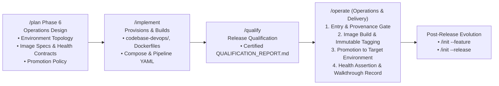
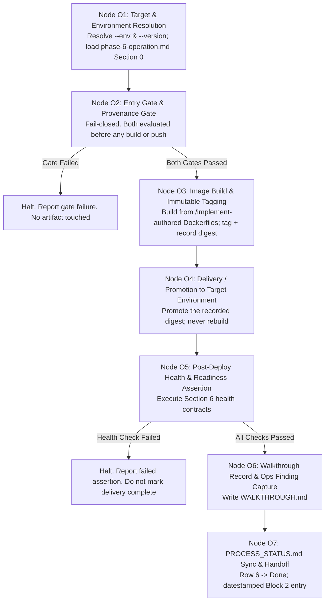

# Guard Specification: Operations & Delivery (/operate)

This document serves as the authoritative baseline specification for the `/operate` action in the
**Guards Framework**. It governs how AI agents build production Docker images, promote immutable
artifacts across declared environments, tag Git versions, produce walkthrough summaries, and open
pull requests. `/operate` is a **pure execution action**: it builds nothing it designed and designs
nothing it builds.

---

## 1. General Introduction & Core Philosophy

The `/operate` action is the delivery and operations engine of the **Guards Framework**. It executes
the environment topology, image specifications, and promotion policy that `/plan` Phase 6 designed
and `/implement` constructed, delivering a certified build into a target environment.



### 1.1 Core Philosophy: Why `/operate` Executes and Does Not Design

`/operate` builds nothing it designed and designs nothing it builds. The environment topology,
entry gates, image specifications, and health contracts come from `phase-6-operation.md`, authored
by `/plan`. The Dockerfiles, compose files, and pipeline YAML come from `/implement`. `/operate` runs
what those two actions produced and reports what happened. This mirrors `/qualify`'s relationship to
verification design exactly: the entity that executes and judges is never the entity that authored
the criteria it executes and judges against.

---

## 2. Core Architectural Principles & Boundary Rules

### A. Action Preconditions & the Environment Entry Gate
The gate `/operate` evaluates is **per-environment**, read from `phase-6-operation.md` §0
(Environment Topology):

1. **Gate `none`**: No certification is required. This is what makes pre-certification delivery —
   e.g. to a qualification target environment — legitimate: the environment itself declares that it
   requires no proof of certification to receive a build.
2. **Gate `certification: full`**: `QUALIFICATION_REPORT.md` in
   `agent-workspace/plans/<feature-name>/` must show `certification: full`. A `provisional`
   certification (produced by `/qualify --force-gate`) **may never** unlock an environment gated this
   way. Fail-closed: absent or non-matching certification halts delivery before any build or push.

### B. Pure Execution Mandate
`/operate` may **never**:
- Edit a Dockerfile, compose file, pipeline YAML, or deploy script.
- Create or provision any repository.
- Define, alter, or remove an environment, or change its entry gate.
- Author or ratify a scenario, or alter any scenario's `status` field.
- Modify `TEST_STRATEGY.md` or any `phase-*.md` document.
- Write to any `codebase-*/` repository.

If a delivery fails because an ops file is wrong — a broken Dockerfile stage, a missing compose
service, a misconfigured pipeline step — that is an `/implement` defect. `/operate` reports it and
loops back; it does not fix it in place.

### C. Filesystem Boundary Guard Rule
`/operate` writes only to:
- `agent-workspace/plans/<feature-name>/` — specifically `WALKTHROUGH.md` and any ops finding
  proposals (see §D).
- `agent-workspace/plans/<feature-name>/PROCESS_STATUS.md` — Row 6 status sync.

This aligns with the `/operate` column of
[directory_handling_roles.md](../directory_handling_roles.md). `/operate` holds no write authority
anywhere else in the repository tree.

### D. Bounded Exception: Walkthrough Record & Ops Finding Proposals
`/operate` MAY author an **ops finding** when delivery reveals something the design or construction
did not anticipate — a base image that needs a version bump, a health check timeout that is too
aggressive under real load, a configuration key that was declared but never wired. This mirrors
`/qualify`'s bounded coverage-gap proposal exception exactly:

**Permitted:**
- Record the finding in `WALKTHROUGH.md` under **Ops Findings**, carrying `origin: operate` and
  `status: unratified`.

**Prohibited:**
- Acting on the finding — editing the Dockerfile, compose file, or pipeline it concerns.
- Marking the finding `ratified` or otherwise adopting it into the operations design.
- Certifying or otherwise treating the finding as resolved.

Ops findings are the artifact that closes the Evolution Dialogue loop described in
[user_guide.md](../user_guide.md) §4: they are the direct input to the next `/plan` Phase 6 cycle,
exactly as `/qualify`'s coverage-gap proposals are the direct input to the next `/plan --ratify`.

### E. Environment Targeting & the Promotion Model
`/operate` builds an image **once** and promotes the same immutable digest across every environment
it reaches. It never rebuilds per environment.

**The provenance gate**: before promoting into any environment whose entry gate is
`certification: full`, `/operate` MUST verify that the digest it is about to promote is identical to
the digest recorded in `QUALIFICATION_REPORT.md`. A mismatch halts delivery, fail-closed.

**Rationale**: rebuilding per environment means `/qualify` certified one artifact while a different
one ships. Even an apparently trivial rebuild (same source, same Dockerfile) can silently change the
artifact — base image drift, non-pinned dependency resolution, build-time environment differences —
and there would be no mechanism to detect it. The provenance gate makes certification meaningless the
moment it is bypassed, so it is never optional.

---

## 3. Directory Layout & Delivery Artifacts

```text
actions/operate/
└── operate_action.md                   # Tier 2 Universal Specification (This Document)

agent-workspace/plans/<feature-name>/
├── WALKTHROUGH.md                      # Delivery record: gates, digest, health results, ops findings
└── PROCESS_STATUS.md                   # Row 6 synced on handoff
```

---

## 4. Detailed Step-by-Step State Machine Design

Execution of the `/operate` action follows a strict 7-node sequential state machine, gating twice
before any artifact is built or promoted:



### Step Descriptions & Execution Reasoning

#### Step 1: Target & Environment Resolution (Node O1)
* **Description**: Resolves `--env <name>` and `--version <vX.Y.Z>` from the command invocation.
  Loads the environment's row from `phase-6-operation.md` §0 (Environment Topology) — purpose,
  services, config source, entry gate, and promotion origin.
* **Storage Actions**: Reads `agent-workspace/plans/<feature-name>/phase-6-operation.md`.

#### Step 2: Entry Gate & Provenance Gate (Node O2)
* **Description**: Evaluates both gates from §2.A and §2.E, fail-closed, before touching any build
  artifact. The entry gate checks certification state where required; the provenance gate — evaluated
  only when promoting into a `certification: full` environment — checks digest identity against
  `QUALIFICATION_REPORT.md`.
* **Storage Actions**: Reads `QUALIFICATION_REPORT.md` in `agent-workspace/plans/<feature-name>/`.

#### Step 3: Image Build & Immutable Tagging (Node O3)
* **Description**: Builds the production image from the Dockerfiles `/implement` authored in each
  target `codebase-<layer>/`. Tags the image with the resolved version and records its content
  digest. This is the only node at which a build occurs — every later promotion reuses this digest.
* **Storage Actions**: None outside the container registry / build output.

#### Step 4: Delivery / Promotion to Target Environment (Node O4)
* **Description**: Promotes the digest recorded in Node O3 into the resolved environment, using the
  orchestration `/implement` built in `codebase-devops/`. Never rebuilds.
* **Storage Actions**: None beyond the target environment's runtime state.

#### Step 5: Post-Deploy Health & Readiness Assertion (Node O5)
* **Description**: Executes every check declared in `phase-6-operation.md` §6 (Health & Readiness
  Contracts) against the newly promoted deployment. A failed assertion halts before the delivery is
  reported complete.
* **Storage Actions**: None; results are captured into `WALKTHROUGH.md` in Node O6.

#### Step 6: Walkthrough Record & Ops Finding Capture (Node O6)
* **Description**: Writes `WALKTHROUGH.md` per the template in §6, capturing gate results, the
  promoted digest, health assertion outcomes, and any ops findings surfaced under §2.D.
* **Storage Actions**: Writes `agent-workspace/plans/<feature-name>/WALKTHROUGH.md`.

#### Step 7: PROCESS_STATUS.md Sync & Handoff (Node O7)
* **Description**: Updates `agent-workspace/plans/<feature-name>/PROCESS_STATUS.md`, marking Row 6
  (`/operate`) as `Completed` with a datestamped Block 2 entry. Displays a completion summary and
  points to the Evolution Dialogue (`/init --feature` or `/init --release`) as the next step.
* **Storage Actions**: Writes updated `PROCESS_STATUS.md`.

---

## 5. Commands Reference & Execution Modes

### Commands Reference

| Command | Description |
|:---|:---|
| `/operate` | Default interactive delivery mode — prompts for target environment and release version, builds production images, tags Git, and opens PR |
| `/operate --env <name>` | Targets a specific environment defined in `phase-6-operation.md` §0. Its declared entry gate governs whether certification is required |
| `/operate --version <vX.Y.Z>` | Explicitly specifies release version tag (e.g. `v1.0.0`) |
| `/operate --auto` | Automated release execution (builds images, creates tags, and generates PR without pausing for confirmation) |
| `/operate --dry-run` | Simulates release build and packaging — evaluates both gates and prints the delivery plan — without modifying Git tags or pushing images |
| `/operate --deploy` | Triggers post-release deployment scripts / webhooks defined in `codebase-devops/` |

---

## 6. Walkthrough Record Template (`WALKTHROUGH.md`)

```markdown
# Delivery Walkthrough: [Feature Name] - [Version]

- **Date**: YYYY-MM-DD
- **Target Environment**: `ENV-<id>`
- **Version**: `vX.Y.Z`
- **Image Digest**: `sha256:...`
- **Entry Gate**: `[none | certification: full]` — `[PASSED | FAILED | N/A]`
- **Provenance Gate**: `[PASSED | FAILED | N/A — entry gate is none]`

## 1. Gate Results

| Gate | Requirement | Result |
| :--- | :--- | :--- |
| Entry Gate | `<gate from phase-6-operation.md §0>` | `<result>` |
| Provenance Gate | Digest matches `QUALIFICATION_REPORT.md` | `<result>` |

## 2. Certification Reference
- **Source Report**: `QUALIFICATION_REPORT.md` (`<date>`)
- **Certification**: `[full | provisional | N/A]`

## 3. Health & Readiness Assertion Results

| Check | Expected | Result |
| :--- | :--- | :--- |
| `<from phase-6-operation.md §6>` | `<expected>` | `[PASS | FAIL]` |

## 4. Delivery Actions
- **PR / Merge Reference**: `<link or N/A>`
- **Deployment Trigger**: `[--deploy executed | not requested]`

## 5. Ops Findings
*Recorded per §2.D. `origin: operate`, `status: unratified`. Input to the next `/plan` Phase 6 cycle.*

| Finding | Discovered In | Blocker? |
| :--- | :--- | :--- |
| *(none)* | | |
```

---

## 7. Summary Checklist for AI Agents Executing `/operate`

- [ ] **First Action**: Resolve `--env` and `--version`; load the environment's row from `phase-6-operation.md` §0.
- [ ] Evaluate the entry gate. If `certification: full` is required, verify `QUALIFICATION_REPORT.md` shows `certification: full` — not `provisional`. Fail-closed.
- [ ] Evaluate the provenance gate when promoting into a `certification: full` environment: the digest being promoted MUST match the digest `QUALIFICATION_REPORT.md` certified.
- [ ] Do NOT edit any Dockerfile, compose file, pipeline YAML, or deploy script. Do NOT create or provision any repository. Do NOT alter an environment, entry gate, scenario, or `TEST_STRATEGY.md`.
- [ ] Build the production image once; tag it immutably; record its digest.
- [ ] Promote the recorded digest into the target environment. Never rebuild for a different environment.
- [ ] Execute every health & readiness contract declared in `phase-6-operation.md` §6. Halt on failure.
- [ ] Author ops findings only as `origin: operate, status: unratified`; never act on one directly.
- [ ] Generate `WALKTHROUGH.md` in `agent-workspace/plans/<feature-name>/`.
- [ ] Synchronize `PROCESS_STATUS.md` Row 6 to `Completed` with a datestamped log entry.
- [ ] Point to the Evolution Dialogue (`/init --feature` or `/init --release`) as the next step.
