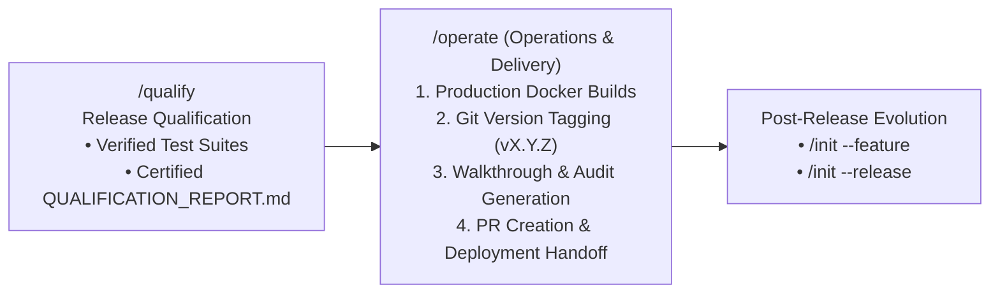

# Guard Specification: Operations & Delivery (/operate)

This document serves as the authoritative baseline specification for the `/operate` action in the **Guards Framework**. It governs how AI agents coordinate production packaging, build Docker release images, manage Git version tagging, open pull requests, produce walkthrough summaries, and execute deployment handoffs.

---

## 1. General Introduction & Core Philosophy

The `/operate` action is the delivery and operations engine of the **Guards Framework**. Positioned after release qualification (`/qualify`), it packages verified code artifacts into production releases and coordinates seamless deployment.

---

## 2. Commands Reference & Execution Modes

### Commands Reference

| Command | Description |
|:---|:---|
| `/operate` | Default interactive delivery mode — prompts for release version, builds production images, tags Git, and opens PR |
| `/operate --version <vX.Y.Z>` | Explicitly specifies release version tag (e.g. `v1.0.0`) |
| `/operate --auto` | Automated release execution (builds images, creates tags, and generates PR without pausing for confirmation) |
| `/operate --dry-run` | Simulates release build and packaging, outputting walkthrough preview without modifying Git tags or pushing images |
| `/operate --deploy` | Triggers post-release deployment scripts / webhooks defined in `codebase-devops/` |

---

## 3. Summary Checklist for AI Agents Executing `/operate`

- [ ] **First Action**: Verify `QUALIFICATION_REPORT.md` in `agent-workspace/plans/<feature-name>/` shows certified pass status.
- [ ] Confirm target release version tag (`vX.Y.Z`).
- [ ] Build production-ready Docker containers via `codebase-devops/`.
- [ ] Tag release in Git repository (`git tag vX.Y.Z`).
- [ ] Generate comprehensive release walkthrough and audit log (`WALKTHROUGH.md`).
- [ ] Open Pull Request / merge to target release branch.
- [ ] Update `PROCESS_STATUS.md` Row 6 to `Completed`.
