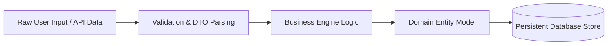

# Data Flow & Transformation Analysis: `<layer_name>` Layer

**Location**: `agent-workspace/src/<layer_name>/code_graph/data_flow.md`  
**Description**: Block 2 (Perspective B) — Inventory of data sources (user provided, configs, external APIs, databases, hardcoded constants) and datastream transformations.

---

## 1. Data Sources Inventory

| Source ID | Source Type | Origin / Provider | Consumer Element | Persistence Mechanism |
| :--- | :--- | :--- | :--- | :--- |
| `DS-001` | User Provided | HTTP Payload / Form Data | `UserDTO` | Ephemeral / In-Memory |
| `DS-002` | Config Gathered | Environment Variable / `.env` | `ConfigStruct` | Environment Config |
| `DS-003` | External API | Remote Service Response | `APIClient` | Cache / Session |
| `DS-004` | Database | SQL / ORM / Mongo Document | `Repository` | Persistent Store |
| `DS-005` | Hardcoded | Code Constant / Enums | `StaticRules` | Embedded in Source |

---

## 2. Datastream Transformation Map

