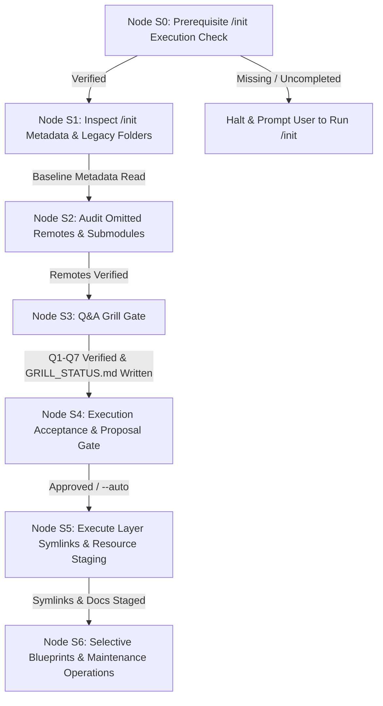

# Stateful Execution Playbook: `/process`

This playbook governs the step-by-step execution of the `/process` action within Google Antigravity. It transitions through nodes **S0** to **S6**, enforcing prerequisite initialization checks, read-only legacy source integrity, Q&A interview gating, execution acceptance / on-demand proposal generation, in-place layer symlinking under `agent-workspace/src/<layer>`, non-code doc staging in `agent-workspace/plans/<branch_name>/resource/`, on-demand workspace Code Graph subfolder creation (`agent-workspace/src/<layer>/code_graph/`), selective phase blueprint population, and process status updates.

---

## Command Flags & Parameters

The `/process` action accepts the following CLI commands and flags:

- `/process`: Default interactive execution. Runs prerequisite check, legacy audit, Q&A Grill gate, summarizes planned layer symlinks and resource staging, prompts for execution confirmation, creates `agent-workspace/src/<layer>` symlinks, stages non-code docs in `resource/`, selectively populates phase blueprints, and updates `PROCESS_STATUS.md`.
- `/process --proposal`: On-Demand Proposal Mode. Runs Q&A grill, drafts `agent-workspace/plans/<branch_name>/restructure-proposal.md`, displays Execution Acceptance prompt for user review, and pauses before creating workspace symlinks.
- `/process --auto` (or `--apply`): Automatic execution mode. Bypasses interactive confirmation prompts and executes all planned layer symlinks, resource doc staging, and blueprint updates immediately.
- `/process --dry-run`: Executes in preview mode. Outputs all proposed symlinks, layer mappings, and blueprint updates without modifying disk state.
- `/process --docs-only`: Extracts documentation, stages non-code docs in `resource/`, and synthesizes phase blueprints without creating workspace layer symlinks.
- `/process --code-graph`: By-Request Code Graph Mode. Parses legacy code and generates modular `agent-workspace/src/<layer>/code_graph/` subfolders (`graph.md`, `process_flow.md`, `data_flow.md`, `risk_analysis.md`) with Version Stamp Headers. Skipped by default to preserve token efficiency.
- `/process --docs`: By-Request Documentation Mode. Promotes non-code legacy documentation from `resource/` into `agent-workspace/docs/` with Version Stamp Headers. Skipped by default.
- `/process --full-sync`: Full Synchronization Mode. Executes core integration, generates Code Graphs, and updates system documentation in one pass.

---

## State Machine Execution Flow

---

### Node S0: Prerequisite `/init` Execution Check

1. **Process Status Verification**:
   - Check for `agent-workspace/plans/<branch_name>/PROCESS_STATUS.md` in the workspace root.
   - Read Block 1 (Workflow Execution Matrix) and verify that Row 1.0 (`/init`) is marked as `Completed`.

2. **Prerequisite Enforcement Gate**:
   - If `agent-workspace/plans/<branch_name>/PROCESS_STATUS.md` is missing or Row 1.0 is marked `Not Started`, halt execution immediately with error:
     > `[ERROR] The /process action requires a pre-initialized workspace. Please run /init first (or /init --feature <name>) to bootstrap workspace boundaries and process tracking before running /process.`

---

### Node S1: Inspect `/init` Metadata & Legacy Folders

1. **Read Architecture & Folder Map**:
   - Read `agent-workspace/plans/<branch_name>/phase-1-summary.md` to extract linked legacy source folder paths, configured tech stack, and primary remote Git origin.

2. **Read-Only Integrity Check Baseline**:
   - Record MD5 checksums for all source files in linked legacy directories.
   - Enforce **Baseline 1**: Original legacy directories remain 100% untouched and read-only (no code logic rewriting).

---

### Node S2: Audit Omitted Remotes & Submodules

1. **Scan Version Control Configs**:
   - Inspect `.git/config` and `.gitmodules` across linked legacy source folders for remote Git origins, submodules, and external documentation URLs.

2. **Audit Assembly**:
   - Assemble list of auto-detected remotes and submodules to present during Node S3.

---

### Node S3: Q&A Grill Gate

1. **Invoke Rule Guard**:
   - Load and execute `rules/process-grill.md`.

2. **Sequential Q1–Q7 Interview Execution**:
   - Prompt user sequentially through:
     * **Q1**: `/init` Baseline Review (linked legacy folders & project purpose).
     * **Q2**: Omitted Remote Sources Audit (remotes, submodules, external doc URLs).
     * **Q3**: Legacy Source & Non-Code Docs Mapping Strategy (code to `agent-workspace/src/<layer>/`, non-code docs to `agent-workspace/plans/<branch_name>/resource/`).
     * **Q4**: Workspace Code Graphs & Blueprint Extraction Scope (selective blueprint population).
     * **Q5**: Workflow Execution Mode & Proposal Generation (Standard vs Proposal `--proposal` vs Immediate `--auto`).
     * **Q6**: Integration Strategy (In-Place Symlink Mode vs Scaffolding Migration).
     * **Q7**: Q&A Summary Verification & Reflection.
   - Enforce **Neutral Prompting Law**: List options neutrally with zero `[Recommended]` tags and a mandatory final `Other / Free-text (...)` option.

3. **Permanent Audit Log Persistence**:
   - Write full transcript of Q1–Q7 questions, choices, and text inputs to `agent-workspace/plans/<branch_name>/GRILL_STATUS.md`.

---

### Node S4: Execution Acceptance & Proposal Gate

1. **Execution Mode Evaluation**:
   - **Proposal Mode (`/process --proposal`)**:
     * Draft `agent-workspace/plans/<branch_name>/restructure-proposal.md` detailing source-to-layer mappings, symlink paths, and doc staging targets.
     * Present proposal summary and pause for explicit developer confirmation before creating symlinks:
       > `Do you approve the proposed legacy integration plan in restructure-proposal.md?`
       > `1. Proceed with execution`
       > `2. Modify parameters`
   - **Standard Interactive Mode (`/process`)**:
     * Display a clean execution summary of planned layer symlinks and resource staging.
     * Prompt developer for confirmation (`1. Proceed with execution` / `2. Modify parameters`).
   - **Immediate Execution Mode (`--auto` / `--apply`)**:
     * Log execution plan to `GRILL_STATUS.md` and transition immediately to Node S5.

---

### Node S5: Execute Layer Symlinks & Resource Staging

1. **Invoke Migration Skill**:
   - Execute `skills/process-migrator/SKILL.md`.

2. **Execute In-Place Symlinks & Resource Staging**:
   - **In-Place Symlink Mode (Default)**: Create relative symbolic links inside `agent-workspace/src/<layer>` pointing directly to target legacy codebase directories (e.g. `agent-workspace/src/layout` $\rightarrow$ `../../legacy-ui`, `agent-workspace/src/engine` $\rightarrow$ `../../legacy-core`).
   - **Scaffolding & Copy Mode (Optional)**: If isolated sub-repositories were requested, scaffold `codebase-*` sub-repositories and copy source files intact without modifying code logic.
   - **Non-Code Documentation Staging**: Copy non-code legacy documentation, supplementary assets, schemas, and diagrams into **`agent-workspace/plans/<branch_name>/resource/`** as feature reference knowledge. (Global `docs/` is reserved for already implemented system capabilities; relevant docs will be linked/promoted into `docs/` later during `/implement`).
   - **Strict Non-Rewriting Rule**: Do NOT modify, rewrite, or refactor code logic or file contents.

3. **Read-Only Verification Check**:
   - Verify MD5 checksums of original legacy files to assert zero modifications in source repositories.

---

### Node S6: Selective Blueprints & Maintenance Operations

1. **Selective Blueprints Population**:
   - Synthesize identified legacy domain knowledge into relevant phase blueprint documents in `agent-workspace/plans/<branch_name>/` (`phase-1-summary.md` through `phase-6-operation.md`).
   - *Selective Rule*: Populate ONLY the blueprints for which relevant information was identified. Filling out all 6 phase documents is optional and not mandatory.

2. **Optional Operations (By-Request Flags)**:
   - **Code Graph Generation (`--code-graph`)**: If requested, scaffold `agent-workspace/src/<layer>/code_graph/` subfolders containing `graph.md`, `process_flow.md`, `data_flow.md`, and `risk_analysis.md` with Version Stamp Headers.
   - **System Documentation Update (`--docs`)**: If requested, synthesize and promote non-code legacy documentation from `resource/` into `agent-workspace/docs/` with Version Stamp Headers.

3. **Update Process Status**:
   - Update `agent-workspace/plans/<branch_name>/PROCESS_STATUS.md`. Mark Row 2.0 (`/process`) as `Completed` in Block 1 and append datestamped entry in Block 2.

4. **Finalize State Machine**:
   - Report completion summary and recommend next command (`/plan`).

