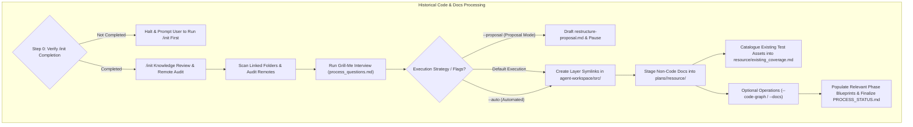
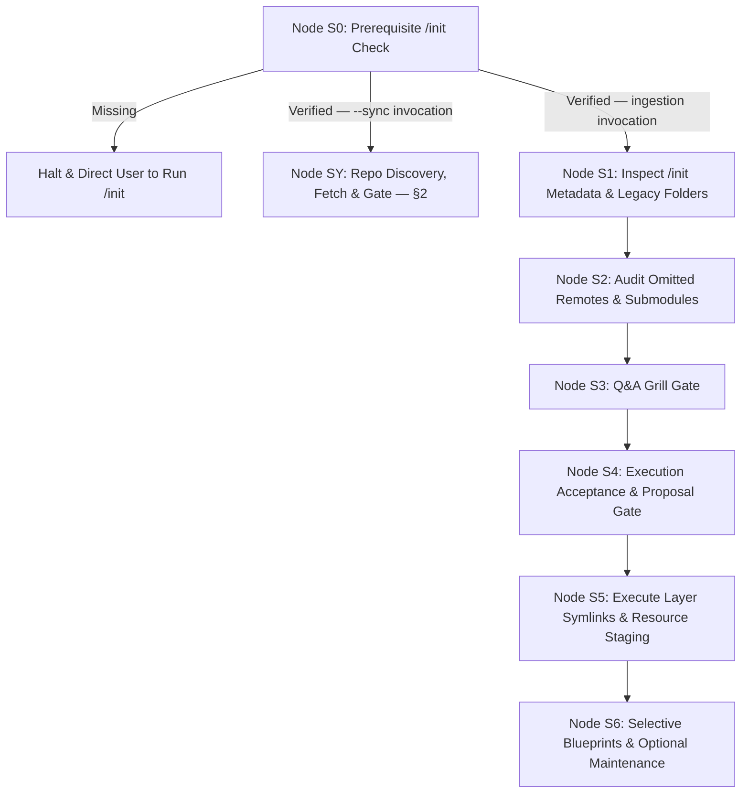

# Guard Specification: Legacy Ingestion & Synchronization (/process)

This document defines the requirements, design decisions, and step-by-step specification for the `/process` action. This action is a dedicated, standalone lifecycle element designed to process historical codebases, integrate legacy source repositories into the agent workspace without cluttering the `/init` action, and keep every repository in the workspace's remote-state ledger current relative to its own remote.

---

## 1. General Introduction & Core Objectives

The `/process` action is an essential component of the **Software Development Action Guard** for brownfield projects.

### Goal of the Action
The primary goal of `/process` is to analyze an existing, legacy, or unorganized codebase, extract domain knowledge into agentic blueprints, integrate existing source code into the workspace layer layout (`agent-workspace/src/<layer>`), stage non-code documentation into feature resources, link all previous remote sources into the workspace, and — via `--sync` — keep every repository's remote-state status current without ever regenerating the derived artifacts (Code Graphs, promoted docs, phase blueprints) that describe them.

### Pure Integration & No Code Modification Policy
> [!IMPORTANT]
> **No Code Rewriting**: `/process` is strictly an integration, organizational, and discovery workflow. It MUST NOT rewrite, refactor, or modify existing source code or logic. Code logic transformations are out of scope for `/process` and are deferred entirely to the `/plan` and `/implement` actions.

### The Three Knowledge Inputs
The `/process` action synthesizes three distinct knowledge sources to construct the integration strategy and updated blueprints:
1. **`/init` Baseline Knowledge**: Metadata, linked folder paths, technology stack, and Git origin information previously collected during `/init` (`agent-workspace/plans/phase-1-summary.md` and `PROCESS_STATUS.md`).
2. **Grill Engine Interactive Knowledge**: Developer choices and preferences gathered during the `/process` Q&A interview (`process_questions.md`), including layer mappings, in-place symlinking vs scaffolding, and documentation extraction scope.
3. **Existing Codebase & Documentation Knowledge**: Deep code structures, module dependencies, API endpoints, database schemas, and architectural specs extracted directly from scanning linked legacy folders and files.

### Core Objective & Execution Scope
Based on these three knowledge sources, `/process` executes four primary operations:
- **In-Place Symlink Integration & Layer Mapping**: Creates symbolic links inside `agent-workspace/src/<layer>` pointing directly to existing legacy codebases (or optionally scaffolds new `codebase-*` sub-repositories if isolated file migration is requested), integrating them seamlessly into the workspace without duplicating files.
- **Stage Non-Code Legacy Docs into Feature Resource Folder**: Copies non-code legacy documentation, supplementary assets, schemas, and diagrams into **`agent-workspace/plans/<feature-name>/resource/`** to serve as reference knowledge for the feature. (Global `docs/` is reserved for already implemented system capabilities, which will be updated later during `/implement`).
- **Catalogue Existing Test Coverage**: Discovers and records the verification assets already present in the legacy codebase — suites, runners, fixtures, coverage configuration, and test-executing CI steps — into **`agent-workspace/plans/<feature-name>/resource/existing_coverage.md`**. This catalogue is a required input to `/plan`, whose `phase-5-test.md` is a delta against existing coverage rather than a scope written from zero. Legacy tests are never modified or moved.
- **Link Previous Sources**: Registers and links external remote code repositories, Git submodules, and cloud documentation links into workspace project configurations and phase blueprints.
- **Selective Blueprint Population & Workspace Code Graph Generation**: Fills out relevant phase blueprint documents in `agent-workspace/plans/<feature-name>/` (filling out all 6 is optional and strictly based on relevance of identified content) and generates a dedicated **Modular Code Graph Subfolder** (`agent-workspace/src/<layer>/code_graph/`) inside the workspace layer directory containing 2 distinct analytical blocks (Unordered Graph + Multi-Perspective Analysis).

### Key Features
1. **Grill Engine Gate**: Uses a stateful, interactive interview based on [process_questions.md](file:///Users/horvathgergo/Desktop/agent-driven-templates/actions/process/process_questions.md) to confirm legacy source mappings and execution strategies.
2. **`/init` Knowledge Review**: Reads and summarizes metadata previously collected during `/init` (`agent-workspace/plans/<branch_name>/phase-1-summary.md` and `PROCESS_STATUS.md`).
3. **Remote Sources & Submodules Audit**: Identifies remote code repositories, Git submodules, and external documentation sources connected to the legacy codebase. `codebase-*` remotes and submodules are deliberately out of scope for `/init` (Pure Control Plane Scope baseline — see [init_questions.md](file:///Users/horvathgergo/Desktop/agent-driven-templates/actions/init/init_questions.md) §1) and are discovered here for the first time.
4. **In-Place Symlink Integration by Default**: Treats existing legacy code directories as the active codebase layers, linking them directly under `agent-workspace/src/<layer>` without modifying files.
5. **On-Demand Proposal Mode (`--proposal`)**: Proposal generation (`agent-workspace/plans/<branch_name>/restructure-proposal.md`) is available on demand via the `--proposal` flag rather than blocking standard execution.
6. **Untouched Legacy Source & As-Is Migration Policy**: Original legacy repositories remain untouched and read-only with respect to code rewriting.
7. **Selective Phase Blueprint Population**: Phase blueprints (`phase-1-summary.md` through `phase-6-operation.md`) are populated **only if relevant information is identified** in the legacy sources.
8. **2-Block Modular Workspace Code Graph Subfolders**: Generated on-demand (`--code-graph`) adhering to [code_graph_taxonomy.md](file:///Users/horvathgergo/Desktop/agent-driven-templates/actions/code_graph_taxonomy.md) and placed exclusively inside **`agent-workspace/src/<layer>/code_graph/`**, containing:
   * **Block 1**: `graph.md` (Unordered structural dependency graph & element registry based on language-specific nodes for Python, Go, and JS).
   * **Block 2 (Perspective A)**: `process_flow.md` (Process entry points & control flow initiation).
   * **Block 2 (Perspective B)**: `data_flow.md` (Data sources: user provided, configs, APIs, databases, hardcoded).
   * **Block 2 (Perspective C)**: `risk_analysis.md` (Dependency fan-in/fan-out, risk metrics, & test coverage maps).

### Separation from `/init`
While `/init` focuses strictly on lightweight bootstrapping of the pure control plane (`agent-workspace/`) with an empty `src/` staging directory, `/process` handles legacy code analysis, layer symlink integration (or optional scaffolding), modular Code Graph generation, and blueprint synthesis.

---

## 2. Repo Discovery & Ownership Classes (`--sync`)

`--sync` operates independently of the legacy-ingestion pipeline (Nodes S1–S6, §4 below) and reaches every repository in the workspace through a **live scan on every invocation** — never a stored registry. A registry can go stale the moment a new `codebase-*` repository is provisioned by `/implement` or a legacy folder is re-linked; a scan cannot.

### 2.1 Discovery
Two sources, both scanned on every invocation:
1. **Local Workspace Root children**: every immediate child directory containing a `.git` directory (`agent-workspace`, `codebase-*`).
2. **Legacy symlink targets**: every entry under `agent-workspace/src/<layer>` that is a symlink, resolved to its target's repository root. This covers brownfield repositories (Option B in [multi_repo_architecture.md](file:///Users/horvathgergo/Desktop/agent-driven-templates/actions/multi_repo_architecture.md)), which remain in their original location and are never children of the Local Workspace Root.

### 2.2 Addressing
`/process --sync <repo>` resolves `<repo>` in order:
1. Exact match against a Local Workspace Root child folder name (e.g. `codebase-layout`).
2. Exact match against a layer symlink name under `agent-workspace/src/` (e.g. `layout`).

The first match wins, and the resolved absolute repository path is echoed before any fetch runs. **No match** → the full scanned repository list is printed instead of guessing. **Multiple matches** → halts and asks the user to disambiguate. A resolved repository with no configured remote is reported as `no-remote` and skipped.

Invoked with no `<repo>` argument, `--sync` scans and presents every discovered repository with its state (`aligned` | `ahead` | `behind` | `diverged` | `no-remote`) and working-tree cleanliness, then prompts for a target — including an "all" option that processes every discovered repository in sequence.

### 2.3 Ownership Classes
`--sync` behavior is determined by **who owns the resolved repository** — never by divergence severity or repository size:

| Ownership Class | Repositories | `--sync` Behavior |
| :--- | :--- | :--- |
| **Framework-owned** | `agent-workspace` | Fetch. Fast-forward **only if the working tree is clean**. **Halt** — never merge, rebase, or force-push — if local history has diverged from the remote. |
| **Project-owned** | `codebase-*` (created by `/implement`, or scaffolded by `/process`) | Fetch and **report** state only. Never pulls, merges, or otherwise mutates the working tree — that remains the developer's own Git workflow. |
| **Foreign / read-only** | Legacy repositories linked in-place (Option B) | Fetch and **report** state only. Mutating a linked legacy repository is forbidden under the Read-Only Legacy Source Rule regardless of divergence state. |

`agent-workspace` is the **only** repository `--sync` may ever advance. Every other repository is reported on, never changed — consistent with the No Code Modification Policy (§1) and the Read-Only Legacy Source Rule ([process_questions.md](file:///Users/horvathgergo/Desktop/agent-driven-templates/actions/process/process_questions.md) Baseline 1).

### 2.4 No Regeneration — Status Only
`--sync` never regenerates Code Graphs, promoted documentation, `existing_coverage.md`, or phase blueprints. For each derived artifact it reads the existing **Version Stamp Header** (e.g. `<!-- Last Updated: v1.1.0 | <date> -->`) and compares it against the post-fetch repository state. An artifact whose stamped version or date precedes the fetched remote state is recorded as **stale** in `agent-workspace/plans/<branch_name>/PROCESS_STATUS.md` — it is never rebuilt as a side effect of `--sync`. Regenerating a stale artifact remains opt-in, via `--code-graph` or `--docs`, exactly as today.

This is not a token-economy convenience — it is what makes `--sync` viable as an automatic, silent precondition (§6). An operation that regenerated Code Graphs on every playbook invocation would be prohibitively expensive to run before every action chain.

### 2.5 Gate Semantics
`--sync` produces exactly one of two outcomes:
- **`pass`**: every reachable repository is `aligned` or was safely fast-forwarded (`agent-workspace` only); non-advancing repositories are reported, never blocking.
- **`halt: <repo> <reason>`**: `agent-workspace` has diverged from its remote, or a dirty working tree prevented a safe fast-forward.

No override flag exists for a `halt` outcome — matching the fail-closed posture of `/operate` Node O2. A manual invocation surfaces this outcome as a printed report; a playbook precondition (§6) consumes it directly.

---

## 3. Detailed Representation of Historical Processing

*The diagram below represents the legacy-ingestion pipeline only. `--sync` runs on its own short path, shown separately in §4's state machine, and never enters this flow.*

---

## 4. Detailed Step-by-Step Action Design

Execution follows a structured state machine, adhering to the **Action Context Notification Law (Combined Multi-Layer Strategy)** (prefixing every response turn with `> 📍 **Active Workflow**: /process | **Scope**: <branch> | **Node**: <Node_ID>`, printing node transition badges, and maintaining disk header metadata). Node S0 forks into two entirely separate paths: the legacy-ingestion pipeline (S1–S6) and the `--sync` path (Node SY), which never enters the ingestion pipeline:

*   **Step 0: Prerequisite `/init` Check (Node S0)**:
    *   Inspects `agent-workspace/plans/<branch_name>/PROCESS_STATUS.md`. If missing or if `/init` is marked `Not Started`, halts execution and prompts the user to run `/init` first. This precondition also gates `--sync`, since a `--sync` target must be resolvable relative to an existing `agent-workspace/`.
*   **Node SY: Repo Discovery, Fetch & Gate (`--sync` only — bypasses S1–S6)**:
    *   Executes the discovery scan, addressing resolution, ownership-classed fetch, and gate outcome defined in §2.
    *   **Interactive invocation** (`/process --sync`, no `<repo>` argument): presents the scanned repository table and prompts for a target.
    *   **Non-interactive invocation** (`/process --sync <repo>`, `--sync --all`, or invoked programmatically as a playbook precondition per §6): runs silently and surfaces output only on a `halt` outcome.
    *   Writes derived-artifact staleness status (§2.4) to `agent-workspace/plans/<branch_name>/PROCESS_STATUS.md` and terminates. Nodes S1–S6 are never entered.
*   **Step 1: Inspect `/init` Metadata & Local Legacy Folders (Node S1)**:
    *   Reads mapped local legacy folder paths, identified technology stack, and project goals from `agent-workspace/plans/<branch_name>/phase-1-summary.md`.
*   **Step 2: Audit Omitted Remotes & Submodules (Node S2)**:
    *   Scans `.git/config` and `.gitmodules` across linked legacy folders (`git remote -v`, `git submodule status`), discovering remote Git origins, submodules, and external documentation URLs — deliberately out of `/init`'s scope and surfaced here for the first time.
*   **Step 3: Q&A Grill Gate (Node S3)**:
    *   Invokes interactive Q&A interview governed by [process_questions.md](file:///Users/horvathgergo/Desktop/agent-driven-templates/actions/process/process_questions.md).
    *   Confirms source-to-layer mappings, symlink vs scaffolding strategy, and documentation extraction scope.
*   **Step 4: Execution Acceptance & Proposal Gate (Node S4)**:
    *   **Proposal Mode (`/process --proposal`)**: Generates `agent-workspace/plans/<branch_name>/restructure-proposal.md`, detailing source-to-layer mappings, symlink targets, non-code doc staging, and module path aliasing. Pauses for developer review.
    *   **Standard Mode (`/process`)**: Summarizes planned symlink creation and doc staging, prompting developer for execution confirmation.
    *   **Immediate Mode (`/process --auto`)**: Bypasses interactive confirmation and proceeds directly to Node S5.
*   **Step 5: Execute Layer Symlinks & Resource Staging (Node S5)**:
    *   **In-Place Symlink Mode (Default)**: Creates symbolic links under `agent-workspace/src/<layer>` pointing directly to target legacy codebase directories (e.g. `agent-workspace/src/engine` $\rightarrow$ `../../legacy-engine/src` or target path).
    *   **Scaffolding & Copy Mode (Optional)**: If isolated sub-repositories were requested, creates target `codebase-*` directories and copies source files intact without modifying code logic.
    *   **Resource Staging**: Copies non-code legacy documentation, supplementary assets, schemas, and diagrams into **`agent-workspace/plans/<feature-name>/resource/`** as reference knowledge for the feature.
    *   **Existing Test Asset Discovery**: Catalogues the verification assets the legacy codebase already contains — test suites and their locations, test runners and frameworks in use, fixture and mock directories, coverage configuration, and any CI steps that execute tests. The catalogue is written to **`agent-workspace/plans/<feature-name>/resource/existing_coverage.md`**. Legacy tests are **read and catalogued, never modified or relocated** — the No-Restructuring Rule applies to test code exactly as it applies to production code.
*   **Step 6: Selective Blueprint Population & Optional Maintenance Operations (Node S6)**:
    *   Selectively fills out relevant phase blueprint documents (`phase-1-summary.md` through `phase-6-operation.md` in `agent-workspace/plans/<feature-name>/`) based on identified legacy knowledge. *Filling out all 6 phase documents is optional and strictly based on relevance*.
    *   **OPTIONAL — Code Graph Generation (`--code-graph`)**: Executed only when explicitly requested. Generates a dedicated `agent-workspace/src/<layer>/code_graph/` subfolder per layer (containing `graph.md`, `process_flow.md`, `data_flow.md`, `risk_analysis.md`) with Version Stamp Headers.
    *   **OPTIONAL — System Documentation Update (`--docs`)**: Executed only when explicitly requested. Synthesizes and promotes non-code legacy documentation from `agent-workspace/plans/<feature-name>/resource/` into `agent-workspace/docs/`.
    *   Updates `agent-workspace/plans/<branch_name>/PROCESS_STATUS.md` marking Row 2.0 (`/process`) as `Completed`. *(Remote synchronization is no longer part of this node — see Node SY above and §2.)*

---

## 5. Commands Reference & Options

### Commands Reference

| Command | Description |
|:---|:---|
| `/process` | **Default Interactive Mode**. Runs Q&A grill, creates layer symlinks in `agent-workspace/src/<layer>`, stages legacy docs into `resource/`, and updates `PROCESS_STATUS.md` |
| `/process --proposal` | **On-Demand Proposal Mode**. Generates `agent-workspace/plans/<branch_name>/restructure-proposal.md` and pauses for developer review before applying changes |
| `/process --auto` (or `/process --apply`) | **Immediate Execution Mode**. Runs Q&A grill and executes symlinks/migrations immediately without confirmation pause |
| `/process --dry-run` | Performs historical analysis and outputs proposed integration report without modifying disk state |
| `/process --docs-only` | Extracts documentation and synthesizes phase blueprints without creating layer symlinks or moving files |
| `/process --code-graph` | **By-Request Code Graph Mode**. Generates `agent-workspace/src/<layer>/code_graph/` subfolders with Version Stamp Headers |
| `/process --docs` | **By-Request Documentation Mode**. Promotes non-code legacy documentation from `resource/` into `agent-workspace/docs/` |
| `/process --full-sync` | **Full Integration Mode**. *(Naming note: unrelated to Git remotes — see `--sync` below.)* Executes core integration, Code Graph generation, and system documentation update in one pass |
| `/process --sync [<repo>]` | **Remote Synchronization Mode** (see §2). Live-scans every repository, fetches, and applies ownership-classed behavior — fast-forwards `agent-workspace` only if clean, reports (never mutates) every `codebase-*` or legacy repository. Reports derived-artifact staleness; never regenerates. Omitting `<repo>` prompts from the scanned list |

### Parameters & Options Details
- `/process`: Default interactive execution. Runs the Grill Engine interview, verifies legacy paths, creates `agent-workspace/src/<layer>` symlinks, stages docs in `plans/<feature-name>/resource/`, and updates tracking sheets.
- `/process --proposal`: On-Demand Proposal Mode. Generates `agent-workspace/plans/<branch_name>/restructure-proposal.md` detailing planned mappings, symlinks, and doc staging, pausing for explicit developer approval.
- `/process --auto` (or `/process --apply`): Immediate Execution Mode. Executes symlink creation and file staging immediately without pausing for confirmation.
- `/process --dry-run`: Performs historical analysis and outputs the proposed migration report without creating symlinks or files.
- `/process --docs-only`: Extracts documentation and synthesizes phase blueprints without modifying workspace symlinks or file structures.
- `/process --code-graph`: By-Request Code Graph Mode. Parses legacy source code and generates `agent-workspace/src/<layer>/code_graph/` subfolders with Version Stamp Headers. Skipped by default to preserve token efficiency.
- `/process --docs`: By-Request Documentation Mode. Promotes non-code legacy documentation from `resource/` into `agent-workspace/docs/` with Version Stamp Headers. Skipped by default to preserve token efficiency.
- `/process --full-sync`: Full Integration Mode. Executes core integration, generates Code Graphs, and updates system documentation in one pass. Unrelated to Git remotes — see `--sync` below.
- `/process --sync [<repo>]`: Remote Synchronization Mode. Live-scans the workspace for every repository (Local Workspace Root children and legacy symlink targets — see §2.1), resolves `<repo>` by folder or symlink name if supplied, and fetches. Behavior then splits by ownership (§2.3): `agent-workspace` fast-forwards if its working tree is clean and **halts** on divergence (no override); every `codebase-*` or legacy repository is fetched and reported on only, never mutated. Reports staleness of derived artifacts against their Version Stamp Headers without regenerating them (§2.4). Runs independently of the legacy-ingestion pipeline (Node SY, §4) and is designed to double as an automatic playbook precondition (§6). *(The former `--pull` alias is retired — "pull" implied uniform mutation, which no longer describes non-`agent-workspace` targets.)*

---

## 6. Deferred to Playbook Layer

`--sync`'s manual invocation (interactive or with an explicit `<repo>`) is fully specified above and does not depend on anything in `playbooks/`. Two related mechanisms remain out of scope for this document, because `playbooks/` is not yet populated:

*   **Sync-as-precondition**: the expectation, established during this action's design, is that a playbook operating on an already-initialized workspace (feature, bugfix, hotfix — anything that is not bootstrapping a workspace from nothing) invokes `--sync` non-interactively *before* its action sequence begins, and treats a `halt` outcome (§2.5) as blocking the playbook itself. Bootstrap-style playbooks (greenfield, legacy onboarding) have no need for this — a greenfield workspace reaches a synced state by construction during `/init`, and legacy onboarding reads fresh state during `/process` ingestion regardless.
*   **Sync scope declaration**: which repositories a given playbook's precondition sync covers (e.g. a hotfix touching one layer may only need to sync `agent-workspace` and that layer's `codebase-*`, not every repository in the workspace) is a per-playbook binding, analogous to the question-narrowing bindings described in [init_questions.md](file:///Users/horvathgergo/Desktop/agent-driven-templates/actions/init/init_questions.md) §5.

A dedicated sync playbook, mentioned as a future addition, would consume this same `--sync` action path and needs no changes here to be built.
