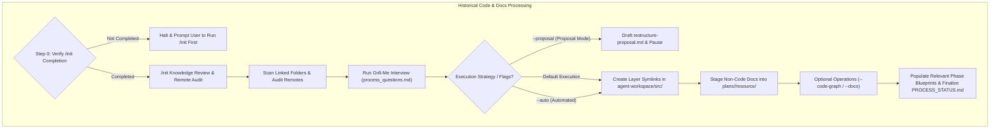
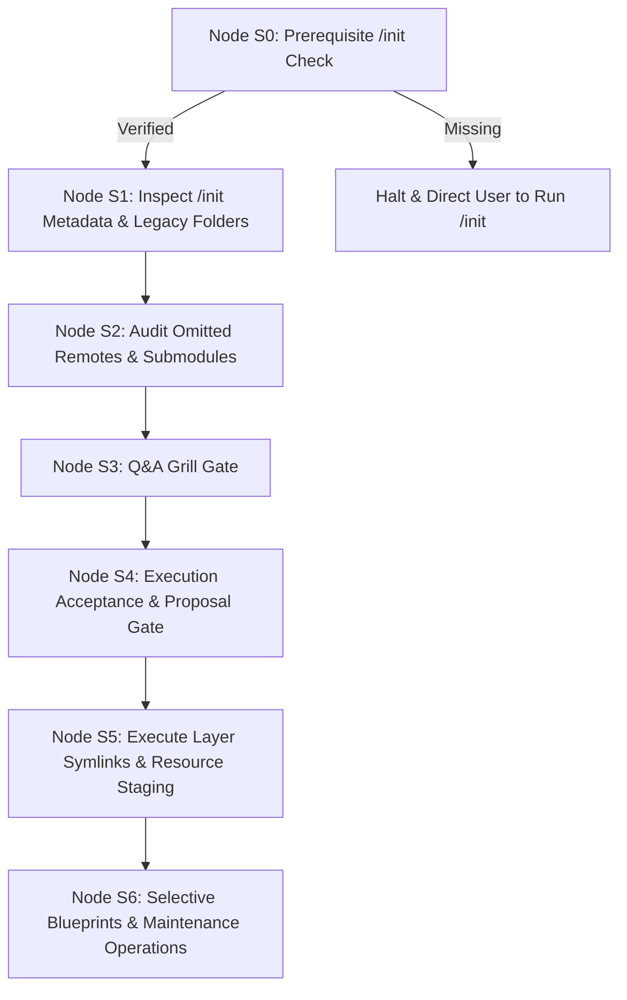

# Guard Specification: Legacy Ingestion & Synchronization (/process)

This document defines the requirements, design decisions, and step-by-step specification for the `/process` action. This action is a dedicated, standalone lifecycle element designed to process historical codebases, synchronize with remote coworker commits, and integrate legacy source repositories into the agent workspace without cluttering the `/init` action.

---

## 1. General Introduction & Core Objectives

The `/process` action is an essential component of the **Software Development Action Guard** for brownfield projects.

### Goal of the Action
The primary goal of `/process` is to analyze an existing, legacy, or unorganized codebase, extract domain knowledge into agentic blueprints, integrate existing source code into the workspace layer layout (`agent-workspace/src/<layer>`), stage non-code documentation into feature resources, link all previous remote sources into the workspace, and provide continuous knowledge synchronization for coworker commits.

### Pure Integration & No Code Modification Policy
> [!IMPORTANT]
> **No Code Rewriting**: `/process` is strictly an integration, organizational, and discovery workflow. It MUST NOT rewrite, refactor, or modify existing source code or logic. Code logic transformations are out of scope for `/process` and are deferred entirely to the `/plan` and `/implement` actions.

### The Three Knowledge Inputs
The `/process` action synthesizes three distinct knowledge sources to construct the integration strategy and updated blueprints:
1. **`/init` Baseline Knowledge**: Metadata, linked folder paths, technology stack, and Git origin information previously collected during `/init` (`agent-workspace/plans/phase-1-summary.md` and `PROCESS_STATUS.md`).
2. **Grill Engine Interactive Knowledge**: Developer choices and preferences gathered during the `/process` Q&A interview (`process_questions.md`), including layer mappings, in-place symlinking vs scaffolding, and documentation extraction scope.
3. **Existing Codebase & Documentation Knowledge**: Deep code structures, module dependencies, API endpoints, database schemas, and architectural specs extracted directly from scanning linked legacy folders and files.

### Core Objective & Execution Scope
Based on these three knowledge sources, `/process` executes four primary operations:
- **In-Place Symlink Integration & Layer Mapping**: Creates symbolic links inside `agent-workspace/src/<layer>` pointing directly to existing legacy codebases (or optionally scaffolds new `codebase-*` sub-repositories if isolated file migration is requested), integrating them seamlessly into the workspace without duplicating files.
- **Stage Non-Code Legacy Docs into Feature Resource Folder**: Copies non-code legacy documentation, supplementary assets, schemas, and diagrams into **`agent-workspace/plans/<feature-name>/resource/`** to serve as reference knowledge for the feature. (Global `docs/` is reserved for already implemented system capabilities, which will be updated later during `/implement`).
- **Link Previous Sources**: Registers and links external remote code repositories, Git submodules, and cloud documentation links into workspace project configurations and phase blueprints.
- **Selective Blueprint Population & Workspace Code Graph Generation**: Fills out relevant phase blueprint documents in `agent-workspace/plans/<feature-name>/` (filling out all 6 is optional and strictly based on relevance of identified content) and generates a dedicated **Modular Code Graph Subfolder** (`agent-workspace/src/<layer>/code_graph/`) inside the workspace layer directory containing 2 distinct analytical blocks (Unordered Graph + Multi-Perspective Analysis).

### Key Features
1. **Grill Engine Gate**: Uses a stateful, interactive interview based on [process_questions.md](file:///Users/horvathgergo/Desktop/agent-driven-templates/actions/process/process_questions.md) to confirm legacy source mappings and execution strategies.
2. **`/init` Knowledge Review**: Reads and summarizes metadata previously collected during `/init` (`agent-workspace/plans/<branch_name>/phase-1-summary.md` and `PROCESS_STATUS.md`).
3. **Remote Sources & Submodules Audit**: Identifies remote code repositories, Git submodules, and external documentation sources connected to the legacy codebase that were omitted during `/init`.
4. **In-Place Symlink Integration by Default**: Treats existing legacy code directories as the active codebase layers, linking them directly under `agent-workspace/src/<layer>` without modifying files.
5. **On-Demand Proposal Mode (`--proposal`)**: Proposal generation (`agent-workspace/plans/<branch_name>/restructure-proposal.md`) is available on demand via the `--proposal` flag rather than blocking standard execution.
6. **Untouched Legacy Source & As-Is Migration Policy**: Original legacy repositories remain untouched and read-only with respect to code rewriting.
7. **Selective Phase Blueprint Population**: Phase blueprints (`phase-1-summary.md` through `phase-6-operation.md`) are populated **only if relevant information is identified** in the legacy sources.
8. **2-Block Modular Workspace Code Graph Subfolders**: Generated on-demand (`--code-graph`) adhering to [code_graph_taxonomy.md](file:///Users/horvathgergo/Desktop/agent-driven-templates/actions/code_graph_taxonomy.md) and placed exclusively inside **`agent-workspace/src/<layer>/code_graph/`**, containing:
   * **Block 1**: `graph.md` (Unordered structural dependency graph & element registry based on language-specific nodes for Python, Go, and JS).
   * **Block 2 (Perspective A)**: `process_flow.md` (Process entry points & control flow initiation).
   * **Block 2 (Perspective B)**: `data_flow.md` (Data sources: user provided, configs, APIs, databases, hardcoded).
   * **Block 2 (Perspective C)**: `risk_analysis.md` (Dependency fan-in/fan-out, risk metrics, & test coverage maps).

### Separation from `/init`
While `/init` focuses strictly on lightweight bootstrapping of the pure control plane (`agent-workspace/`) with an empty `src/` staging directory, `/process` handles legacy code analysis, layer symlink integration (or optional scaffolding), modular Code Graph generation, and blueprint synthesis.

---

## 2. Detailed Representation of Historical Processing

---

## 3. Detailed Step-by-Step Action Design

Execution follows a structured state machine (Nodes S0 through S6), adhering to the **Action Context Notification Law (Combined Multi-Layer Strategy)** (prefixing every response turn with `> 📍 **Active Workflow**: /process | **Scope**: <branch> | **Node**: <Node_ID>`, printing node transition badges, and maintaining disk header metadata):

*   **Step 0: Prerequisite `/init` Check (Node S0)**:
    *   Inspects `agent-workspace/plans/<branch_name>/PROCESS_STATUS.md`. If missing or if `/init` is marked `Not Started`, halts execution and prompts the user to run `/init` first.
*   **Step 1: Inspect `/init` Metadata & Local Legacy Folders (Node S1)**:
    *   Reads mapped local legacy folder paths, identified technology stack, and project goals from `agent-workspace/plans/<branch_name>/phase-1-summary.md`.
*   **Step 2: Audit Omitted Remotes & Submodules (Node S2)**:
    *   Scans `.git/config` and `.gitmodules` across linked legacy folders (`git remote -v`, `git submodule status`), discovering remote Git origins, submodules, and external documentation URLs omitted during `/init`.
*   **Step 3: Q&A Grill Gate (Node S3)**:
    *   Invokes interactive Q&A interview governed by [process_questions.md](file:///Users/horvathgergo/Desktop/agent-driven-templates/actions/process/process_questions.md).
    *   Confirms source-to-layer mappings, symlink vs scaffolding strategy, and documentation extraction scope.
*   **Step 4: Execution Acceptance & Proposal Gate (Node S4)**:
    *   **Proposal Mode (`/process --proposal`)**: Generates `agent-workspace/plans/<branch_name>/restructure-proposal.md`, detailing source-to-layer mappings, symlink targets, non-code doc staging, and module path aliasing. Pauses for developer review.
    *   **Standard Mode (`/process`)**: Summarizes planned symlink creation and doc staging, prompting developer for execution confirmation.
    *   **Immediate Mode (`/process --auto`)**: Bypasses interactive confirmation and proceeds directly to Node S5.
*   **Step 5: Execute Layer Symlinks & Resource Staging (Node S5)**:
    *   **In-Place Symlink Mode (Default)**: Creates symbolic links under `agent-workspace/src/<layer>` pointing directly to target legacy codebase directories (e.g. `agent-workspace/src/engine` $\rightarrow$ `../../legacy-engine/src` or target path).
    *   **Scaffolding & Copy Mode (Optional)**: If isolated sub-repositories were requested, creates target `codebase-*` directories and copies source files intact without modifying code logic.
    *   **Resource Staging**: Copies non-code legacy documentation, supplementary assets, schemas, and diagrams into **`agent-workspace/plans/<feature-name>/resource/`** as reference knowledge for the feature.
*   **Step 6: Selective Blueprint Population & Optional Maintenance Operations (Node S6)**:
    *   Selectively fills out relevant phase blueprint documents (`phase-1-summary.md` through `phase-6-operation.md` in `agent-workspace/plans/<feature-name>/`) based on identified legacy knowledge. *Filling out all 6 phase documents is optional and strictly based on relevance*.
    *   **OPTIONAL — Code Graph Generation (`--code-graph`)**: Executed only when explicitly requested. Generates a dedicated `agent-workspace/src/<layer>/code_graph/` subfolder per layer (containing `graph.md`, `process_flow.md`, `data_flow.md`, `risk_analysis.md`) with Version Stamp Headers.
    *   **OPTIONAL — System Documentation Update (`--docs`)**: Executed only when explicitly requested. Synthesizes and promotes non-code legacy documentation from `agent-workspace/plans/<feature-name>/resource/` into `agent-workspace/docs/`.
    *   **OPTIONAL — Remote Synchronization (`--sync` / `--pull`)**: Fetches and securely pulls remote coworker commits, identifies structural diffs, and dynamically re-aligns local Code Graphs and phase blueprints to match the new remote state.
    *   Updates `agent-workspace/plans/<branch_name>/PROCESS_STATUS.md` marking Row 2.0 (`/process`) as `Completed`.

---

## 4. Commands Reference & Options

### Commands Reference

| Command | Description |
|:---|:---|
| `/process` | **Default Interactive Mode**. Runs Q&A grill, creates layer symlinks in `agent-workspace/src/<layer>`, stages legacy docs into `resource/`, and updates `PROCESS_STATUS.md` |
| `/process --proposal` | **On-Demand Proposal Mode**. Generates `agent-workspace/plans/<branch_name>/restructure-proposal.md` and pauses for developer review before applying changes |
| `/process --auto` (or `/process --apply`) | **Immediate Execution Mode**. Runs Q&A grill and executes symlinks/migrations immediately without confirmation pause |
| `/process --dry-run` | Performs historical analysis and outputs proposed integration report without modifying disk state |
| `/process --docs-only` | Extracts documentation and synthesizes phase blueprints without creating layer symlinks or moving files |
| `/process --code-graph` | **By-Request Code Graph Mode**. Generates `agent-workspace/src/<layer>/code_graph/` subfolders with Version Stamp Headers |
| `/process --docs` | **By-Request Documentation Mode**. Promotes non-code legacy documentation from `resource/` into `agent-workspace/docs/` |
| `/process --full-sync` | **Full Synchronization Mode**. Executes core integration, Code Graph generation, and system documentation update in one pass |
| `/process --sync` (or `--pull`) | **Remote Synchronization Mode**. Securely pulls remote coworker commits, identifies diffs, and dynamically re-aligns local Code Graphs and Phase Blueprints |

### Parameters & Options Details
- `/process`: Default interactive execution. Runs the Grill Engine interview, verifies legacy paths, creates `agent-workspace/src/<layer>` symlinks, stages docs in `plans/<feature-name>/resource/`, and updates tracking sheets.
- `/process --proposal`: On-Demand Proposal Mode. Generates `agent-workspace/plans/<branch_name>/restructure-proposal.md` detailing planned mappings, symlinks, and doc staging, pausing for explicit developer approval.
- `/process --auto` (or `/process --apply`): Immediate Execution Mode. Executes symlink creation and file staging immediately without pausing for confirmation.
- `/process --dry-run`: Performs historical analysis and outputs the proposed migration report without creating symlinks or files.
- `/process --docs-only`: Extracts documentation and synthesizes phase blueprints without modifying workspace symlinks or file structures.
- `/process --code-graph`: By-Request Code Graph Mode. Parses legacy source code and generates `agent-workspace/src/<layer>/code_graph/` subfolders with Version Stamp Headers. Skipped by default to preserve token efficiency.
- `/process --docs`: By-Request Documentation Mode. Promotes non-code legacy documentation from `resource/` into `agent-workspace/docs/` with Version Stamp Headers. Skipped by default to preserve token efficiency.
- `/process --full-sync`: Full Synchronization Mode. Executes core integration, generates Code Graphs, and updates system documentation in one pass.
- `/process --sync` (or `/process --pull`): Remote Synchronization Mode. Fetches and pulls remote coworker commits, identifies structural diffs, and dynamically re-aligns local Code Graphs and phase blueprints to match the new remote state.
