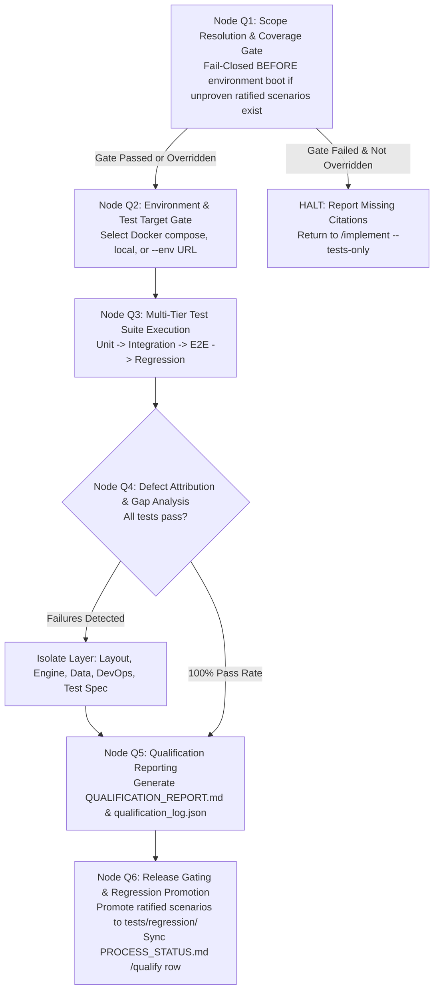

# `/qualify` Workflow Execution Playbook

This stateful execution playbook defines the 6-node state machine governing coverage gating, multi-tier test execution, defect attribution, coverage gap proposal handling, audit reporting, and release certification within Google Antigravity.

---

## 1. Parameters & Operational Rules of Thumb

### CLI Parameter Handling
* `/qualify` (or `/qualify --all`): Default full qualification matrix execution. Evaluates the Node Q1 Coverage Gate, runs Q1–Q6 grill, executes Unit $\rightarrow$ Integration $\rightarrow$ E2E $\rightarrow$ Regression suites, performs defect attribution, and generates audit reports.
* `/qualify --unit`: Unit & Isolation Tier only. Runs layer-local unit tests across `codebase-*/tests/`.
* `/qualify --integration`: Cross-Layer Integration Tier only. Runs contract and API suites in `codebase-qualify/src/integration/`.
* `/qualify --e2e`: End-to-End User Journey Tier only. Runs browser and journey flows in `codebase-qualify/src/e2e/`.
* `/qualify --regression`: Regression Protection Tier only. Runs master regression catalog in `agent-workspace/tests/regression/`.
* `/qualify --env <url>`: Targeted Environment Run. Executes suites directly against an external running URL, bypassing `codebase-devops` Docker provisioning.
* `/qualify --report-only`: Audit Reporting Mode. Synthesizes existing test execution outputs into `QUALIFICATION_REPORT.md` without re-running tests.
* `/qualify --propose`: Gap Discovery Mode. Executes suites and captures untested behaviors as proposals (`origin: qualify, status: unratified`) without blocking release.
* `/qualify --force-gate "<justification>"`: Gate Override. Bypasses a failed Node Q1 gate, recording the justification verbatim and yielding a `provisional` certification that cannot unlock `/operate`.

---

## 2. Execution State Machine Nodes (Q1 – Q6)

---

### Node Q1: Scope Resolution & Coverage Gate (Mandatory Pre-Boot)
1. **Scope Resolution**: Read `agent-workspace/plans/<feature-name>/phase-5-test.md` and extract the scenario IDs in scope.
2. **Scenario Ratification Check**: For each scenario ID, resolve against `agent-workspace/tests/scenarios/<id>.md`. Filter for `status: ratified`.
3. **Citation Scanning**: Scan `codebase-qualify/src/` and `codebase-*/tests/` for matching `@scenario <id>` citation tokens.
4. **Coverage Gate Evaluation**: Compute `missing := ratified \ implemented`.
   - **Pass**: If `missing` is empty, proceed to Node Q2.
   - **Fail-Closed**: If `missing` is non-empty and no `--force-gate` flag is provided, halt immediately. Output the list of missing scenarios with titles and return scope to `/implement --tests-only`.
   - **Overridden**: If `--force-gate` is supplied, record justification, stamp run `certification: provisional`, and proceed to Node Q2.

---

### Node Q2: Environment & Test Target Gate
1. Invoke the neutral Grill Engine enforcing `rules/qualify-grill.md`.
2. Confirm target environment:
   - **Docker Network**: Provison containers via `codebase-devops/docker/docker-compose.yml`.
   - **Local Server**: Target already-running local service instances.
   - **Staging / External**: Target `--env <url>`.
3. Confirm test tier selection (Full matrix or single tier).
4. Persist interview results to `agent-workspace/plans/<feature-name>/GRILL_STATUS.md`.

---

### Node Q3: Multi-Tier Test Suite Execution
1. Invoke `skills/qualify-evaluator/SKILL.md` to execute test suites in hierarchical order:
   - **Tier 1 (Unit)**: `codebase-*/tests/` (Layer micro-pipelines).
   - **Tier 2 (Integration)**: `codebase-qualify/src/integration/` (API & Contract tests).
   - **Tier 3 (E2E)**: `codebase-qualify/src/e2e/` (Browser & User journey flows).
   - **Tier 4 (Regression)**: `agent-workspace/tests/regression/` (Master regression catalog).
2. Capture test runner outputs, JUnit/TAP XML artifacts, exit codes, and timestamps.

---

### Node Q4: Defect Identification, Layer Attribution & Gap Discovery
1. **Defect Attribution**: If failures occur, parse stack traces and server logs to isolate the responsible layer:
   - `layout`: UI rendering, state, or DOM selector failures.
   - `engine`: API contract mismatches, service exceptions, logic errors.
   - `data`: Database migrations, relational integrity, schema bugs.
   - `devops`: Network timeouts, missing environment variables, port conflicts.
   - `test_spec`: Stale fixtures or outdated assertion criteria.
2. **Coverage Gap Discovery**: If untested behaviors are identified during execution:
   - Author proposal scenario in `agent-workspace/tests/scenarios/` stamped with `origin: qualify, status: unratified`.
   - Do NOT certify against unratified proposals.
3. **Correction Routing**: Confirm routing of defects back to `/implement` (code bug) or `/plan` (design gap).

---

### Node Q5: Qualification Reporting & Defect Logging
1. Generate `agent-workspace/plans/<feature-name>/QUALIFICATION_REPORT.md` containing:
   - Section 0: Coverage Gate Result (Ratified count, Proven count, Missing count).
   - Section 1: Test Suite Execution Summary (Pass/Fail/Skip table across all 4 tiers).
   - Section 2: Identified Defects & Layer Attribution.
   - Section 3: Coverage Gap Proposals (`status: unratified`).
   - Section 4: Unproven Scope (Populated only on `--force-gate` runs).
   - Section 5: Release Certification (Full vs. Provisional status).
2. Generate `agent-workspace/plans/<feature-name>/qualification_log.json` recording machine-readable run statistics.

---

### Node Q6: Release Gating, Regression Promotion & Handoff
1. **Regression Catalog Promotion**: If certification is `full` and pass rate is 100%, copy/promote all **ratified** feature scenarios from `tests/scenarios/` into `agent-workspace/tests/regression/`.
2. **Process Status Update**:
   - If certification is `full` and all suites pass: Update `agent-workspace/plans/<feature-name>/PROCESS_STATUS.md` `/qualify` row to `[x] Done`. Unlocks `/operate`.
   - If certification is `provisional` or defects exist: Mark the `/qualify` row as `Blocked` or `Failed` with diagnostic notes. `/operate` remains locked.
3. **Handoff**: Display execution summary and recommend proceeding to `/operate` upon successful certification.
