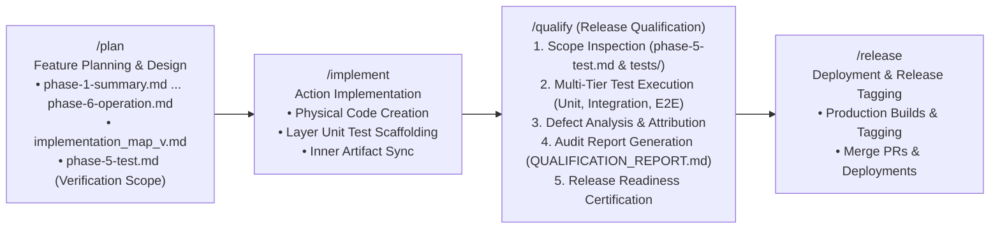
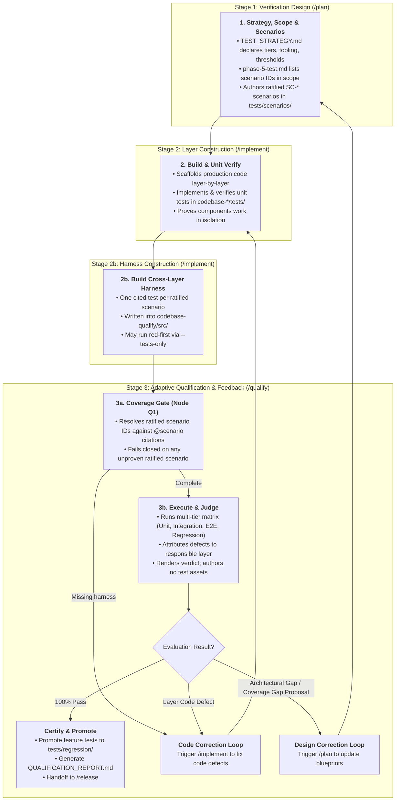

# Guard Specification: Release Qualification (/qualify)

This document serves as the authoritative baseline specification for the `/qualify` action in the **Guards Framework**. It governs how AI agents execute, analyze, and report on all testing tiers, identify and attribute defects, and certify software releases before deployment.

> [!IMPORTANT]
> **Scope Boundary.** `/qualify` **executes and judges**. It does not design verification criteria and it does not build test assets. Scenarios and test strategy are authored by `/plan`; harness code is built by `/implement`. This boundary is what keeps the action's declared scope fully covered by its guiding question — *"Does the integrated system work as a whole?"* — and it preserves the framework's foundational principle that **the entity which builds a thing is never the sole entity that certifies it**. See [verification_taxonomy.md](../verification_taxonomy.md) for the full artifact ownership model.

---

## 1. General Introduction & Core Philosophy

The `/qualify` action is the rigorous quality assurance and certification engine of the **Guards Framework**. Positioned between code implementation (`/implement`) and final release packaging (`/release`), it ensures that every code modification meets all functional, integration, regression, and business logic contracts.



### Core Philosophy: Why `/qualify` Instead of `/test`?

In traditional software development, "testing" often implies a single functional tool execution (e.g. running a test runner like `pytest` or `npm test`). In an agentic framework, quality gating is a comprehensive lifecycle activity:

1. **Process (Verb) vs. Asset (Noun)**: `/qualify` is the *process* of evaluating and certifying a release candidate for production. The *assets* used to perform this evaluation are tests (stored in `agent-workspace/tests/` and implemented in `codebase-qualify/`).
2. **Holistic Test Management**: The `/qualify` action does not simply run assertions; it supervises the entire test management lifecycle—scoping requirements, running multi-tier suites, performing defect attribution, generating audit reports, and deciding release gating status.
3. **Decoupled Governance**: It separates the governance of *what must be tested* from the physical *code that executes the test*, ensuring complete architectural cleanliness across multi-repository projects.

---

## 2. The Three-Pillar Qualification Architecture

To guarantee strict separation between governance, execution, and infrastructure orchestration, the framework enforces a **Three-Pillar Qualification Architecture**:

```
┌──────────────────────────────────────────────────────────────────────────────────┐
│                         PILLAR 1: TEST GOVERNANCE & ASSETS                       │
│                           (agent-workspace/tests/)                               │
│  • Master test scenarios, regression catalogs & E2E acceptance criteria (Docs)   │
│  • Feature test scoping delta (agent-workspace/plans/<feature>/phase-5-test.md)  │
└────────────────────────────────────────┬─────────────────────────────────────────┘
                                         │ Governs Requirements
                                         ▼
┌──────────────────────────────────────────────────────────────────────────────────┐
│                      PILLAR 2: TEST CODEBASE & IMPLEMENTATION                     │
│                               (codebase-qualify/)                                │
│  • Physical test source code, Playwright/Pytest specs, assertions & fixtures     │
│  • Standalone test runner Dockerfile, dependencies, and environment configs      │
└────────────────────────────────────────┬─────────────────────────────────────────┘
                                         │ Packaged / Executed by
                                         ▼
┌──────────────────────────────────────────────────────────────────────────────────┐
│                   PILLAR 3: ENVIRONMENT ORCHESTRATION & TRIGGER                  │
│                               (codebase-devops/)                                 │
│  • docker-compose.yml multi-service network provisioning (DB + Engine + UI)      │
│  • CI/CD macro-pipelines (.github/workflows/) triggering test suites             │
└──────────────────────────────────────────────────────────────────────────────────┘
```

### Pillar 1: Test Governance & Living Assets (`agent-workspace/tests/`)
* **Role**: Permanent knowledge base for all master test plans, regression test catalogs, and step-by-step user journey specifications.
* **Separation of Concerns**: Test plans are first-class governance documents and live at the root of `agent-workspace/tests/`, distinct from general documentation (`docs/`) and feature-in-flight design plans (`plans/`).
* **Role of `phase-5-test.md`**: Inside a feature plan, `phase-5-test.md` acts strictly as the **Feature Verification Scope** (the delta). It lists the scenario IDs in scope for that feature; those IDs are the binding input to the Node Q1 coverage gate.
* **Ownership**: This pillar is authored by `/plan`, not by `/qualify`. Scenarios under `agent-workspace/tests/scenarios/` carry immutable `SC-<feature-slug>-<nnn>` identifiers and a ratification status. `/qualify` **reads** them; it may not assign identifiers, amend `TEST_STRATEGY.md`, or alter any `status` field. Its single bounded exception is the coverage-gap proposal defined in Section 4.

### Pillar 2: Cross-Layer Test Implementation (`codebase-qualify/`)
* **Role**: Standalone production-grade sub-repository dedicated to physical test scripts, mock servers, data factories, and acceptance fixtures.
* **Ownership**: `codebase-qualify` is a **peer layer** of every other `codebase-*` repository, and its code is built by `/implement` under the same rules — via the Test Harness stream of the implementation map. `/qualify` executes this harness; it does not write it. Every harness test cites the scenario it satisfies using the canonical `@scenario SC-<feature-slug>-<nnn>` token defined in [verification_taxonomy.md](../verification_taxonomy.md) §4, and those citations are what the Node Q1 gate resolves against.
* **Cleanliness**: Production repositories (`codebase-layout`, `codebase-engine`) remain clean of cross-layer testing harnesses.
* **Symlink Visibility**: Exposed to the control plane via relative symlink `agent-workspace/src/qualify/`.
* **Layer-Autonomous Unit Tests**: Unit tests remain co-located inside layer skeletons (`codebase-<layer>/tests/`) and run during layer micro-pipelines with a mandatory 100% pass rate.

### Pillar 3: Test Environment Orchestration (`codebase-devops/`)
* **Role**: Infrastructure orchestrator. Provides `docker-compose.yml` to spin up isolated container networks (databases, backends, frontends, and qualify runner).
* **Execution Trigger**: Owns the CI/CD macro-pipelines that boot up environments and signal `codebase-qualify` to execute its test suites.

---

## 3. Test Execution Mechanics: Targeted vs. Automated

The qualification framework supports two distinct operational execution modes:

### A. Targeted / Manual Execution (Direct against Running App)
When an environment is already running locally or on a staging server:
* `codebase-devops` is **bypassed**.
* The agent executes test suites directly from `codebase-qualify/`, pointing to the active host:
  ```bash
  cd codebase-qualify
  npm run test:e2e -- --env-url=https://staging.example.com
  ```

### B. Automated Orchestration (Macro-Pipeline / CI)
When spinning up an isolated environment from scratch:
1. `codebase-devops` spins up services via `docker-compose up -d`.
2. `codebase-devops` triggers the `qualify-runner` container from `codebase-qualify`.
3. Test output and logs are streamed back, and containers are torn down.

---

## 4. Progressive Qualification Lifecycle & Feedback Loops

The qualification action bridges upfront architectural design with adaptive runtime quality assurance through a progressive 3-stage lifecycle and bidirectional feedback loops:



### Key Principles of the Progressive Model

1. **Verification Design (`/plan`)**: Test strategy, verification scope, and scenarios are authored during planning. Criteria therefore exist — in executable-ready, version-controlled form — before any feature code is written.
2. **Local Component Verification (`/implement`)**: Production code and layer-local unit tests are built against that contract.
3. **Harness Construction (`/implement`)**: The cross-layer harness in `codebase-qualify/` is built by the same action that builds the feature, from scenarios it did not author. It may be built red-first, ahead of feature code.
4. **Execution & Judgment (`/qualify`)**: Prior to release, `/qualify` gates on coverage, executes the full matrix, attributes defects across layers, and renders the verdict. **It authors no test assets.**
5. **Bidirectional Feedback & Correction Triggers**: If qualification exposes flaws or gaps:
   - **Unproven Scope**: the Node Q1 gate halts before execution and returns to `/implement --tests-only`.
   - **Layer Code Defect**: `/qualify` isolates the responsible layer and triggers a targeted fix in `/implement`.
   - **Architectural / Requirement Gap**: `/qualify` triggers a design revision in `/plan`.
6. **Regression Catalog Promotion**: Upon certification, **ratified** feature scenarios are promoted into `agent-workspace/tests/regression/` to safeguard future releases. Unratified proposals are never promoted.

### Defect Versus Coverage Gap

Execution routinely surfaces two different kinds of finding. Conflating them is what collapses the `/qualify` persona, so the framework separates them explicitly:

| Finding | Definition | `/qualify` authority |
| :--- | :--- | :--- |
| **Defect** | Observed behaviour contradicts a ratified scenario, or is self-evidently broken. | **Full.** Report it, attribute it to a layer, and **block the release**. No ratification required. A bug is a bug. |
| **Coverage gap** | Behaviour is untested because no criterion was ever written for it. | **Proposal only.** Author a scenario with `origin: qualify, status: unratified`, list it under **Coverage Gap Proposals** in the report, and continue. May not certify against it. |

`/qualify` therefore retains complete power to stop a bad release. What it does not hold is the power to expand the certification bar and then render judgment against its own expansion. Unratified proposals are inputs to the next `/plan --ratify` cycle.

> [!NOTE]
> **Hot-context capture without persona drift.** The action that discovers a gap is best placed to describe it, so `/qualify` may write the scenario while the context is fresh. What it may not do is ratify it. The `origin: qualify` stamp makes the provenance auditable, and the ratio of `plan`-origin to `qualify`-origin scenarios is itself a signal about planning quality.

---

## 5. Directory Layout & Qualification Artifacts

```text
agent-workspace/
├── tests/                              # Pillar 1: Global Master Test Scenarios
│   ├── integration/                    # Cross-layer integration specifications
│   ├── e2e/                            # System-wide user journey scenarios
│   └── regression/                     # Master regression assertion catalog
│
├── plans/<feature-name>/
│   ├── phase-5-test.md                 # Feature Verification Scope Delta
│   ├── QUALIFICATION_REPORT.md         # Human-Readable Qualification Audit Report
│   └── qualification_log.json          # Machine-Readable Test Execution Audit Trail
│
codebase-qualify/                       # Pillar 2: Cross-Layer Test Implementation
├── .github/workflows/
│   └── qualify.yml                     # Qualification CI pipeline
├── config/
│   ├── test-environments.yml           # Environment profiles (local, staging, CI)
│   └── coverage-thresholds.yml         # Coverage requirements
├── Dockerfile                          # Standalone test runner container
├── src/
│   ├── integration/                    # Physical API & contract test scripts
│   ├── e2e/                            # Physical browser & E2E test scripts
│   ├── business_logic/                 # Multi-layer workflow assertion scripts
│   └── shared/                         # Reusable mocks, fixtures & helpers
└── tests/                              # Meta-tests validating test infrastructure
```

---

## 6. Detailed Step-by-Step State Machine Design

Execution of the `/qualify` workflow follows a strict 6-node state machine:

```mermaid
graph TD
    Q1[Node Q1: Scope Resolution & COVERAGE GATE<br/>Resolve ratified SC-* IDs against @scenario citations<br/>FAIL CLOSED if any ratified scenario is unproven]
    Q1 -->|Gate FAILED| QHalt[HALT before environment boot<br/>Report missing IDs<br/>Return to /implement --tests-only]
    Q1 -->|Gate PASSED| Q2[Node Q2: Environment & Test Target Gate<br/>Select Target Mode: Unit, Integration, E2E, or Full Matrix]
    
    Q2 --> Q3[Node Q3: Multi-Tier Test Suite Execution<br/>• Tier 1: Layer Unit Tests (codebase-*/tests/)<br/>• Tier 2: Integration & Contract Tests (codebase-qualify/)<br/>• Tier 3: E2E User Journeys (codebase-qualify/)<br/>• Tier 4: Regression Catalog Assertions]
    
    Q3 --> Q4{Node Q4: Defect Identification & Attribution<br/>All tests pass?}
    
    Q4 -->|Failures Found| Q4_Defect[Isolate Root Cause Layer<br/>Layout, Engine, Data, or Test Spec]
    Q4_Defect --> Q5[Node Q5: Qualification Reporting<br/>Generate QUALIFICATION_REPORT.md & qualification_log.json]
    
    Q4 -->|100% Pass Rate| Q5
    
    Q5 --> Q6[Node Q6: Release Gating & Handoff<br/>Update PROCESS_STATUS.md Row 5 to Completed<br/>Handoff to /release]
```

### Step Descriptions & Execution Reasoning

#### Step 1: Scope Resolution & Coverage Gate (Node Q1)
* **Description**: Inspects `agent-workspace/plans/<feature-name>/phase-5-test.md` to extract the scenario IDs in scope, resolves each against `agent-workspace/tests/scenarios/`, and executes the **Coverage Gate** defined in [verification_taxonomy.md](../verification_taxonomy.md) §5.
* **Reasoning**: A suite that runs green proves nothing if a planned criterion was never built. The gate runs **before environment boot** so that unproven scope is caught as a scope failure rather than disguised as a passing run.

##### Gate Computation

```
scope       := scenario IDs listed in phase-5-test.md
ratified    := { id in scope : tests/scenarios/<id>.md has status == ratified }
implemented := { id : an "@scenario <id>" citation exists in codebase-qualify/src/
                      or codebase-*/tests/ }
missing     := ratified \ implemented
```

##### Gate Semantics

| Condition | Result |
| :--- | :--- |
| `missing` is empty | **Pass.** Proceed to Node Q2. |
| `missing` is non-empty | **Fail closed.** Halt before environment boot. Report every missing ID with its scenario title. Execute no tests and render no verdict. |

Three interpretation rules apply:

1. Scenarios with `status: unratified` or `status: retired` are excluded from `ratified` and never cause failure. Proposals are not obligations.
2. **Gate failure is not a test failure.** It reports that a planned proof was never built, and is attributed to `/implement`, not to the code under test. The correct response is `/implement --tests-only`, not a code fix.
3. The only override is `/qualify --force-gate "<justification>"`, which marks the run `certification: provisional`. A provisional run **may not** unlock `/release`.

#### Step 2: Environment & Test Target Gate (Node Q2)
* **Description**: Determines execution mode (e.g. running against live local/staging server or spinning up Docker compose network via `codebase-devops`). Confirms test tiers to run (`--unit`, `--integration`, `--e2e`, or full matrix).

#### Step 3: Multi-Tier Test Suite Execution (Node Q3)
* **Description**: Executes test suites in hierarchical order:
  1. **Layer Unit Tests**: Executes unit test suites across `codebase-<layer>/tests/` (Micro-pipeline assertions).
  2. **Cross-Layer Integration Tests**: Runs contract, API, and database pipeline tests in `codebase-qualify/src/integration/`.
  3. **End-to-End (E2E) Scenarios**: Runs browser and user journey flows in `codebase-qualify/src/e2e/`.
  4. **Regression Catalog**: Verifies that existing core capabilities defined in `agent-workspace/tests/regression/` remain unaffected.

#### Step 4: Defect Identification & Attribution (Node Q4)
* **Description**: In the event of a failure, the agent parses stack traces, logs, and failure screenshots to perform **Layer Attribution**:
  * *Layout Layer Defect*: UI rendering, CSS regression, component state defect.
  * *Engine Layer Defect*: API contract violation, logic bug, status code mismatch.
  * *Data Layer Defect*: Schema migration issue, constraint violation.
  * *Test Specification Defect*: Outdated mock, incorrect assertion expectation.
* **Reasoning**: Provides actionable diagnostic context directly to developers rather than generic failure alerts.

#### Step 5: Qualification Reporting & Defect Logging (Node Q5)
* **Description**: Generates the qualification audit report:
  * Creates `agent-workspace/plans/<feature-name>/QUALIFICATION_REPORT.md` (human-readable executive summary, test matrix pass/fail breakdown, defect attribution, and release certification status).
  * Writes `agent-workspace/plans/<feature-name>/qualification_log.json` (machine-readable run log with timestamps, execution duration, and exit codes).

#### Step 6: Release Gating & Handoff to `/release` (Node Q6)
* **Description**: Synchronizes `agent-workspace/plans/<feature-name>/PROCESS_STATUS.md`, marking Row 5 (`/qualify`) as `Completed`. If all release criteria are met, the agent recommends proceeding to `/release`.

---

## 7. Commands Reference & Execution Modes

### Commands Reference

| Command Variant | Execution Scope | Description |
| :--- | :--- | :--- |
| `/qualify` (or `/qualify --all`) | **Full Qualification Matrix** (Default) | Runs unit, integration, E2E, and regression test suites across all layers. |
| `/qualify --unit` | **Unit & Isolation Tier** | Runs layer-autonomous unit tests across `codebase-<layer>/tests/`. |
| `/qualify --integration` | **Cross-Layer Integration Tier** | Runs API contract and service integration tests from `codebase-qualify/`. |
| `/qualify --e2e` | **End-to-End User Journey Tier** | Runs headless browser and full journey flows from `codebase-qualify/`. |
| `/qualify --regression` | **Regression Protection Tier** | Runs master regression catalog from `agent-workspace/tests/`. |
| `/qualify --env <url>` | **Targeted Environment Run** | Executes test suites against an external running environment URL. |
| `/qualify --report-only` | **Audit Reporting Mode** | Synthesizes existing test results and generates `QUALIFICATION_REPORT.md`. |
| `/qualify --propose` | **Gap Discovery Mode** | Executes the matrix and emits Coverage Gap Proposals (`origin: qualify, status: unratified`) **without** gating the release. Used to survey coverage ahead of a planning cycle. |
| `/qualify --force-gate "<justification>"` | **Gate Override (Provisional)** | Proceeds past a failed Node Q1 coverage gate. Records the justification verbatim, lists every unproven ID under **Unproven Scope**, and marks the run `certification: provisional`. A provisional run may not unlock `/release`. This is the **only** override; no flag disables the gate. |

---

## 8. Qualification Report Template (`QUALIFICATION_REPORT.md`)

```markdown
# Qualification Audit Report: [Feature Name] - [Version]

- **Date**: YYYY-MM-DD
- **Target Map**: `implementation_map_v<version>.md`
- **Verification Scope**: `phase-5-test.md`
- **Coverage Gate (Node Q1)**: [PASSED | FAILED | OVERRIDDEN]
- **Certification**: [full | provisional]
- **Overall Status**: [PASSED | CONDITIONALLY_PASSED | FAILED]

## 0. Coverage Gate Result

| Ratified in scope | Proven by harness | Missing |
| :--- | :--- | :--- |
| 7 | 7 | 0 |

*Gate passed. All ratified scenarios in scope resolve to at least one `@scenario` citation.*

## 1. Test Suite Execution Summary

| Test Tier | Total | Passed | Failed | Skipped | Pass Rate |
| :--- | :--- | :--- | :--- | :--- | :--- |
| Layer Unit Tests (`codebase-*/`) | 42 | 42 | 0 | 0 | 100% |
| Integration Tests (`codebase-qualify/`) | 18 | 18 | 0 | 0 | 100% |
| E2E User Journeys (`codebase-qualify/`) | 6 | 6 | 0 | 0 | 100% |
| Regression Protection (`tests/`) | 24 | 24 | 0 | 0 | 100% |
| **Total** | **90** | **90** | **0** | **0** | **100%** |

## 2. Identified Defects & Layer Attribution
*(None if 100% pass rate)*

## 3. Coverage Gap Proposals
*Scenarios discovered during execution for which no criterion previously existed.*
*Authored with `origin: qualify, status: unratified`. NOT certified against.*
*Inputs to the next `/plan --ratify` cycle.*

| Proposed ID | Behaviour | Discovered in | Blocker? |
| :--- | :--- | :--- | :--- |
| `SC-<feature>-007` | Discount persists after cart is emptied | E2E tier | Yes — filed as defect |

## 4. Unproven Scope
*Populated only when the Node Q1 gate was overridden via `--force-gate`.*
*(Empty on a full certification.)*

- **Override justification**: *(verbatim, as supplied)*
- **Unproven ratified IDs**: *(none)*

## 5. Release Certification
- [x] Coverage gate passed (every ratified in-scope scenario proven)
- [x] Unit test baseline satisfied (100% pass rate)
- [x] Cross-layer contract verification satisfied
- [x] Zero regressions detected in core capabilities
- [x] Certification is `full` (not `provisional`)
- **Recommendation**: Proceed to `/release`
```

---

## 9. Summary Checklist for AI Agents Executing `/qualify`

- [ ] **First Action**: Inspect `phase-5-test.md` and extract the scenario IDs in scope.
- [ ] Resolve every ID against `agent-workspace/tests/scenarios/`; identify which carry `status: ratified`.
- [ ] **Run the Node Q1 Coverage Gate BEFORE booting any environment.** Halt fail-closed if any ratified in-scope scenario has no `@scenario` citation.
- [ ] Do NOT author harness code, assign scenario IDs, amend `TEST_STRATEGY.md`, or alter any `status` field.
- [ ] Determine execution mode (targeted live URL vs. `codebase-devops` container orchestrator).
- [ ] Execute multi-tier test suites in strict order: Unit $\rightarrow$ Integration $\rightarrow$ E2E $\rightarrow$ Regression.
- [ ] In case of failures, isolate defect attribution (`layout`, `engine`, `data`, or `test_spec`).
- [ ] Classify each finding as **defect** (may block release outright) or **coverage gap** (proposal only, `status: unratified`).
- [ ] Promote only **ratified** scenarios into `agent-workspace/tests/regression/` upon certification.
- [ ] Generate `QUALIFICATION_REPORT.md` and `qualification_log.json` in `agent-workspace/plans/<feature-name>/`.
- [ ] Synchronize `PROCESS_STATUS.md` Row 5 to `Completed` with datestamped log entry.
- [ ] Handoff to `/release` upon successful qualification gating.
