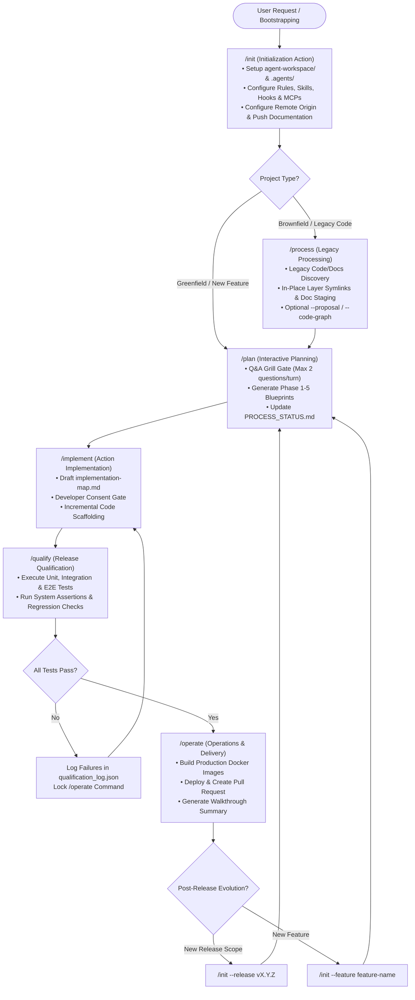

# Guards Framework: Full-Stack Software Development Summary

This document acts as the central summary and entry point for the Guards Framework project, coordinating the actions, playbooks, guidelines, and control tools for agent-driven software development.

---

## 1. Project Goal & Core Philosophy

### Project Goal
The primary objective is to define a standardized platform—the **Guards Framework**—that guides AI agents through structured, safe, and token-optimized development lifecycles using explicit **Guards**. It guarantees that agents always plan before implementing, verify before committing, and maintain a decoupled, flexible codebase layout across greenfield setup, brownfield restructuring, and post-release evolution.

### Core Philosophy: Universal Design vs. Environment Implementation
The Guard Framework intentionally separates high-level design intent from runtime-specific implementations:
- **Universal Design & Objectives**: The overall workflow steps, architectural principles, and guard goals remain identical regardless of the target platform.
- **Environment-Specific Resources**: Different AI agent environments offer distinct native primitives to instruct and govern agentic workflows. For example, **Antigravity** provides native resources such as *rules, hooks, sidecars, skills, and workflows*. Environments like **Codex** or **Claude Code** rely on their own specific prompt formats, custom commands, or file structures.
- **Portable Guard Concept**: While the concrete implementation of guards varies based on the target environment's capabilities, the underlying guard logic and workflow boundaries remain unified.

---

## 2. Architectural Design & Project Structure

The project directory structure is designed in a 3-tier layout to maintain separation between general design specifications and environment-specific implementations:

### Directory Scaffold

```text
actions/
├── summary.md                          # Central Entry Point & Framework Summary
├── user_guide.md                       # End-User Guide & Operational Manual
├── folder_structure.md                 # [Tier 1] Standard Repository Directory Layout Spec
├── grill_engine.md                     # [Tier 1] General Q&A Engine Spec
├── multi_repo_architecture.md          # [Tier 1] Multi-Repo & Symlink Architecture Spec
├── process_handling.md                 # [Tier 1] Process Guard & Matrix Spec
├── code_graph_taxonomy.md              # [Tier 1] Language-Specific Code Graph Taxonomy (Python, Go, JS)
├── verification_taxonomy.md            # [Tier 1] Scenario Identity, Ratification & Coverage Gate Contract
├── implementation_map_taxonomy.md      # [Tier 1] Implementation Map Taxonomy & Schema Spec
│
├── init/                               # [Tier 2] Initialization Workflow Subfolder
│   ├── init_action.md                # Detailed workflow specifications
│   ├── init_questions.md               # Scan & Q&A schemas
│   └── antigravity/                    # [Tier 3] Antigravity-specific resources & guards
│       ├── init_implementation_map.md  # Antigravity execution map & decision links
│       ├── init_tests.md               # Greenfield & brownfield verification test suite
│       └── guards/                     # Antigravity native primitives (rules, skills, hooks)
│
├── process/                            # [Tier 2] Legacy Processing Action Subfolder
│   ├── process_action.md               # Detailed action specifications
│   ├── process_questions.md            # Scan & Q&A Grill schema (incl. existing coverage discovery)
│   └── antigravity/                    # [Tier 3] Antigravity-specific resources & guards
│
├── plan/                               # [Tier 2] Interactive Planning Subfolder
│   ├── plan_action.md                # Detailed workflow specifications
│   ├── plan_questions.md               # Planning Grill Engine questionnaire schema
│   └── antigravity/                    # [Tier 3] Antigravity-specific resources & guards
│       ├── plan_implementation_map.md  # Antigravity execution map & decision links
│       ├── plan_tests.md               # Feature planning verification test suite
│       └── guards/                     # Antigravity native primitives (rules, skills, hooks)
│
├── implement/                          # [Tier 2] Action Implementation Subfolder
│   ├── implement_action.md           # Detailed workflow specifications
│   ├── implement_questions.md          # Micro-Architecture Q&A Grill schema
│   └── antigravity/                    # [Tier 3] Antigravity-specific resources & guards
│       ├── implement_implementation_map.md # Antigravity execution map & decision links
│       ├── implement_tests.md          # Action implementation verification test suite
│       └── guards/                     # Antigravity native primitives (rules, skills, workflows, templates)
│
├── qualify/                             # [Tier 2] Release Qualification Subfolder
│   ├── qualify_action.md                # Detailed action specifications (execution & verdict only)
│   ├── qualify_questions.md             # Execution-configuration Q&A Grill schema
│   └── antigravity/                     # [Tier 3] Antigravity-specific resources & guards
│       ├── qualify_implementation_map.md # Antigravity execution map & decision links
│       └── qualify_tests.md             # Release qualification verification test suite
│
└── release/                            # [Tier 2] Operations & Delivery Subfolder
    ├── operate_action.md             # Detailed workflow specifications
    ├── release_implementation_map.md
    └── guards/                         # [Tier 3] Environment-Specific Guards
```

### 3-Tier Structure Rationale

1. **General Design Elements (Main Root Folder)**
   - Located directly in `actions/`.
   - Defines overarching concepts, cross-cutting rules, user guides, and general-purpose specs (e.g., [End-User Guide](file:///Users/horvathgergo/Desktop/agent-driven-templates/actions/user_guide.md), [Grill Engine](file:///Users/horvathgergo/Desktop/agent-driven-templates/actions/grill_engine.md), [Multi-Repository Architecture Spec](file:///Users/horvathgergo/Desktop/agent-driven-templates/actions/multi_repo_architecture.md), and [Process Guard Spec](file:///Users/horvathgergo/Desktop/agent-driven-templates/actions/process_handling.md)) applied across all workflow steps.

2. **Action Subfolders & Implementation Maps**
   - Subdirectories dedicated to each lifecycle action (e.g., `init/`, `process/`, `plan/`, `implement/`, `qualify/`, `operate/`).
   - Contain detailed step specifications and environment/time-bound `*_implementation_map.md` files (e.g., `init_implementation_map.md`). These provide step-by-step execution roadmaps for implementing a specific workflow phase in a given environment at a specific point in time (e.g., an Antigravity-based implementation snapshot).

3. **Environment-Specific Guard Folders (`guards/`)**
   - Subdirectories located within each action folder (e.g., `init/guards/`, `plan/guards/`).
   - Contain the concrete guard implementations (e.g., specific rules, hooks, skill manifests, or prompt files) tailored for a target agent environment.

---

## 3. General-Purpose Components

The framework utilizes shared components and architectural blueprints that operate across all stages of the lifecycle:

- **[End-User Guide & Operational Manual](file:///Users/horvathgergo/Desktop/agent-driven-templates/actions/user_guide.md)**: Conceptual summary, workflow principles, and operational manual for developers and AI agents.
- **[Interactive Q&A Engine (Grill Engine)](file:///Users/horvathgergo/Desktop/agent-driven-templates/actions/grill_engine.md)**: A stateful, resume-ready interview module used to gather requirements and resolve architecture ambiguities before generating plans or code.
- **[Multi-Repository Architecture Spec](file:///Users/horvathgergo/Desktop/agent-driven-templates/actions/multi_repo_architecture.md)**: Specifications mapping out directory separation, symbolic link mapping, config dependency policies (Rule of Dependency), and the Hybrid Docker handling strategy to isolate UI and Engine components.
- **[Standard Folder Structure Spec](file:///Users/horvathgergo/Desktop/agent-driven-templates/actions/folder_structure.md)**: Standard directory layout, pure control plane (`agent-workspace/`), and sub-repository symlink structure across the framework lifecycle.
- **[Guard Process Handling Spec (Process Guard)](file:///Users/horvathgergo/Desktop/agent-driven-templates/actions/process_handling.md)**: Specifications for release-governed process handling documents (`PROCESS_STATUS.md`), featuring a concise 2-block structure (Workflow Execution Matrix & Datestamped Daily History) and branch-based release initialization options.
- **[Verification Taxonomy & Scenario Identity Spec](./verification_taxonomy.md)**: The identity layer of the framework — `SC-<feature-slug>-<nnn>` scenario identifiers, ratification lifecycle, `TEST_STRATEGY.md` schema, `@scenario` harness citation grammar, and the fail-closed coverage gate contract. Establishes the five verification artifacts and their single owning actions.
- **[Implementation Map Taxonomy Spec](file:///Users/horvathgergo/Desktop/agent-driven-templates/actions/implementation_map_taxonomy.md)**: Standardized schema and structure for `implementation_map.md` documents, guiding agent-driven code scaffolding, dependency sequences, and verification command execution.
- **Action Context Notification Law**: 3-layer notification standard (1-line turn headers, state node transition badges, and persistent disk header metadata) ensuring continuous developer awareness of active workflow state.

---

## 4. Framework Lifecycle Actions

The framework is organized into six fundamental lifecycle actions, each with its dedicated subdirectory under `actions/`. The following workflow diagram details the complete operational lifecycle from initialization to post-release evolution:



### Action Mindsets & The Guiding Questions Model

Every action in the Guards Framework operates under a distinct mindset and answers a dedicated architectural question:

| Action | The Guiding Question | Persona / Mindset | Core Purpose & Scope |
| :--- | :--- | :--- | :--- |
| **`/init`** | **"Where do we work, what are the agent rules, where is the remote repository, and how do we track progress?"** | **System Administrator** | Bootstraps the `agent-workspace/` pure control plane (`.agents/`, `plans/`, `docs/`, `src/`), configures agentic rules/skills/hooks/MCPs, initializes Git branch, configures primary remote Git origin, and pushes initial documentation. Does NOT create `codebase-*/` sub-repositories, Dockerfiles, or make tech stack choices. |
| **`/process`** | **"What already exists in the legacy codebase?"** | **Archaeologist & Analyst** | Ingests brownfield legacy code and documentation intact, discovers existing programming languages, frameworks, Docker configs, and CI/CD pipelines, categorizes historical assets into staging, and generates topological code graphs. |
| **`/plan`** | **"What are we going to build, what layers are needed, what tech stack will we use, and how will operations/Docker run?"** | **Architect & Designer** | Designs system architecture, determines software layer scope and creates `codebase-*` sub-repositories with `src/` symlinks, selects programming languages & frameworks, plans Hybrid Docker & CI/CD in Phase 6 (Operations), generates implementation maps, and **owns all verification design: test strategy, verification scope, ratified scenarios, and ratification**. |
| **`/implement`** | **"Does my code work in isolation?"** | **Software Engineer** | Scaffolds production code layer-by-layer in `codebase-*` repositories, writes co-located unit tests in `codebase-*/tests/`, **builds the cross-layer harness in `codebase-qualify/` from ratified scenarios**, and executes local isolation testing. |
| **`/qualify`** | **"Does the integrated system work as a whole?"** | **Quality Engineer (QA)** | Executes the qualification matrix against a booted environment, gates on scenario coverage, attributes defects across layers, renders the release verdict, and promotes ratified scenarios to the regression catalog. Authors no test assets. |
| **`/operate`** | **"Is the system packaged, delivered, and deployed?"** | **Operations Engineer (DevOps)** | Builds production Docker images, tags versions, generates audit walkthroughs, creates PRs, and coordinates deployment handoffs. |

### Detailed Action Descriptions

1.  **[Initialization (/init)](file:///Users/horvathgergo/Desktop/agent-driven-templates/actions/init/init_action.md)**
    *   *Path*: `actions/init/`
    *   *Purpose*: Bootstraps the agentic environment and `agent-workspace/` control directory, configures rules, skills, hooks, and MCPs, sets up primary remote Git origin, and pushes initial documentation.
    *   *Key Files*:
        *   [init_action.md](file:///Users/horvathgergo/Desktop/agent-driven-templates/actions/init/init_action.md) (Detailed specifications)
        *   [init_questions.md](file:///Users/horvathgergo/Desktop/agent-driven-templates/actions/init/init_questions.md) (Scans and Q&A schema)
        *   [antigravity/init_implementation_map.md](file:///Users/horvathgergo/Desktop/agent-driven-templates/actions/init/antigravity/init_implementation_map.md) (Antigravity guard execution roadmap)
        *   [antigravity/init_tests.md](file:///Users/horvathgergo/Desktop/agent-driven-templates/actions/init/antigravity/init_tests.md) (Greenfield & brownfield verification test specification)
2.  **[Legacy Code & Docs Processing (/process)](file:///Users/horvathgergo/Desktop/agent-driven-templates/actions/process/process_action.md)**
    *   *Path*: `actions/process/`
    *   *Purpose*: Handles deep historical code analysis, legacy documentation processing, discovers existing tech stacks, languages, frameworks, Docker configs, and refactoring proposals for brownfield projects.
    *   *Key Files*:
        *   [process_action.md](file:///Users/horvathgergo/Desktop/agent-driven-templates/actions/process/process_action.md) (Detailed specifications)
        *   [process_questions.md](file:///Users/horvathgergo/Desktop/agent-driven-templates/actions/process/process_questions.md) (Scans and Q&A Grill schema)
        *   [antigravity/process_implementation_map.md](file:///Users/horvathgergo/Desktop/agent-driven-templates/actions/process/antigravity/process_implementation_map.md) (Antigravity guard execution roadmap)
        *   [antigravity/process_tests.md](file:///Users/horvathgergo/Desktop/agent-driven-templates/actions/process/antigravity/process_tests.md) (Brownfield verification test specification)
3.  **[Interactive Planning (/plan)](file:///Users/horvathgergo/Desktop/agent-driven-templates/actions/plan/plan_action.md)**
    *   *Path*: `actions/plan/`
    *   *Purpose*: Leads the user through the creation of the 6-phase blueprint plans, designs software layer scope (`codebase-*`), selects tech stacks and frameworks, and plans Hybrid Docker / operations in Phase 6.
    *   *Key Files*:
        *   [plan_action.md](file:///Users/horvathgergo/Desktop/agent-driven-templates/actions/plan/plan_action.md) (Detailed specifications)
        *   [plan_questions.md](file:///Users/horvathgergo/Desktop/agent-driven-templates/actions/plan/plan_questions.md) (Scans and Q&A Grill schema)
        *   [antigravity/plan_implementation_map.md](file:///Users/horvathgergo/Desktop/agent-driven-templates/actions/plan/antigravity/plan_implementation_map.md) (Antigravity guard execution roadmap)
        *   [antigravity/plan_tests.md](file:///Users/horvathgergo/Desktop/agent-driven-templates/actions/plan/antigravity/plan_tests.md) (Feature planning verification test specification)
4.  **[Action Implementation (/implement)](file:///Users/horvathgergo/Desktop/agent-driven-templates/actions/implement/implement_action.md)**
    *   *Path*: `actions/implement/`
    *   *Purpose*: The most complex action in the framework, responsible for entire feature code creation across `codebase-*` sub-repositories. Executes physical code scaffolding based on mandatory dual grounding (`implementation_map_v<version>.md` + `phase-5-test.md` Verification Scope), enforcing a 4-part step schema (Requirement, Prerequisites, Actions, Verification) and Sequential vs. Parallel stream execution. Guarantees visible step-by-step user interaction with interruption & clarification rights, optional token-optimized Code Graph (`src/<layer>/code_graph/`) and System Docs (`docs/`) updates (`--code-graph`, `--docs`), and mandatory synchronization between inner agent docs (Artifacts) and version-controlled files under `agent-workspace/plans/<feature-name>/`.
    *   *Key Files*:
        *   [implement_action.md](file:///Users/horvathgergo/Desktop/agent-driven-templates/actions/implement/implement_action.md) (Universal Tier 2 baseline specification)
        *   [implement_questions.md](file:///Users/horvathgergo/Desktop/agent-driven-templates/actions/implement/implement_questions.md) (Micro-Architecture Q&A Grill schema)
        *   [antigravity/implement_implementation_map.md](file:///Users/horvathgergo/Desktop/agent-driven-templates/actions/implement/antigravity/implement_implementation_map.md) (Antigravity guard execution roadmap)
        *   [antigravity/implement_tests.md](file:///Users/horvathgergo/Desktop/agent-driven-templates/actions/implement/antigravity/implement_tests.md) (Action implementation verification test specification)
5.  **Release Qualification (`/qualify`)**
    *   *Path*: `actions/qualify/`
    *   *Purpose*: **Execution and judgment only.** Gates on scenario coverage (Node Q1, fail-closed), boots multi-container environments via `codebase-devops/`, executes the full test matrix, attributes defects to responsible layers, renders the release verdict, and promotes ratified scenarios into the regression catalog. It authors no test assets: scenarios and strategy belong to `/plan`, harness code to `/implement`. Its single bounded exception is proposing an unratified coverage-gap scenario, which it may never certify against.
    *   *Key Files*:
        *   [qualify_action.md](file:///Users/horvathgergo/Desktop/agent-driven-templates/actions/qualify/qualify_action.md) (Universal Tier 2 baseline specification)
        *   [qualify_questions.md](file:///Users/horvathgergo/Desktop/agent-driven-templates/actions/qualify/qualify_questions.md) (Execution-configuration Q&A Grill schema)
        *   [antigravity/qualify_implementation_map.md](file:///Users/horvathgergo/Desktop/agent-driven-templates/actions/qualify/antigravity/qualify_implementation_map.md) (Antigravity guard execution roadmap)
        *   [antigravity/qualify_tests.md](file:///Users/horvathgergo/Desktop/agent-driven-templates/actions/qualify/antigravity/qualify_tests.md) (Release qualification verification test specification)
6.  **Operations & Delivery (/operate)**
    *   *Path*: `actions/operate/`
    *   *Purpose*: Manages Docker builds, operations deployment, walkthrough summaries, and pull requests.
