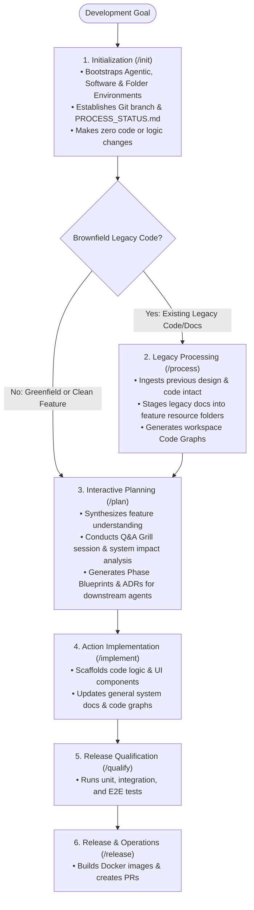
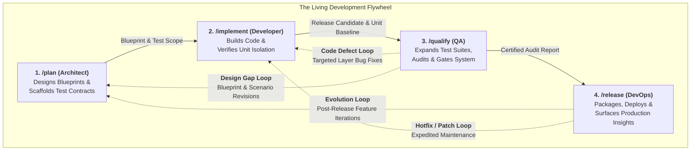

# Guards Framework: End-User Guide & Operational Manual

This document serves as the official user guide for the **Guards Framework**, explaining how developers and AI agents navigate the software planning and development lifecycle step by step.

---

## 1. Executive Summary & Framework Lifecycle

The Guards Framework enforces a disciplined, token-optimized, and safe development process for both new (greenfield) projects and existing (brownfield) codebases. The operational journey follows a clear, sequential flow:



---

## 2. Core Action Principles

### Action 1: Environment Initialization (`/init`)
- **Universal Entry Point**: Every development activity **always** begins with the `/init` workflow—whether bootstrapping a greenfield software project from scratch or extending an existing system with new feature capabilities.
- **Preparation of the Three Environments**: `/init` prepares the three core framework environments for the upcoming work:
  - **Agentic Environment**: Provisions `.agents/` control structures (rules, workflows, skills, hooks, sidecars).
  - **Software-Based Environment**: Asserts Docker engine status, container privileges, and execution sandbox settings.
  - **Folder-Based Environment**: Establishes Git branches (`initial` or `feature/<name>`), scaffolds layer skeletons (`codebase-*`), and deploys status tracking sheets (`PROCESS_STATUS.md`).
- **Strict Boundary Rule**: `/init` limits its scope strictly to environment setup and high-level folder linking. It **does not make any code, logic, or structural refactoring changes** to the codebase.

### Action 2: Ingestion of Existing Systems (`/process`)
- **Brownfield Context Ingestion**: For projects that possess pre-designed or previously implemented code and documentation from past development, `/process` runs immediately after `/init`.
- **Structured Knowledge Organization**: `/process` ingests, analyzes, and integrates previous design artifacts and implementation sources:
  - **In-Place Layer Integration**: Links existing legacy source code directly into workspace layers (`agent-workspace/src/<layer>/`) via symlinks (or copies intact into sub-repositories if isolated scaffolding is requested) without modifying code logic.
  - **Resource Staging**: Stages non-code legacy documentation and assets into `agent-workspace/plans/<feature-name>/resource/` for feature reference.
  - **Code Graph Generation**: Builds on-demand workspace-scoped Code Graphs (`agent-workspace/src/<layer>/code_graph/`) detailing structural node topologies.

### Action 3: Structured Feature Planning (`/plan`)
- **Architectural Bridge**: Once `/init` (and `/process`, if applicable) finishes successfully, the workspace is structured and ready for architectural design. This is where the `/plan` workflow begins.
- **Downstream Agent Guidance**: All planning artifacts are stored inside `.agents/plans/<feature-name>/` to share complete, unambiguous context with AI agents executing downstream implementation (`/implement`), qualification (`/qualify`), and deployment (`/release`).

### Action 4: Action Implementation (`/implement`)
- **Execution Engine & Highest Complexity**: `/implement` is the most complex action in the framework lifecycle, responsible for physical code creation across `codebase-*` sub-repositories.
- **Mandatory Dual Grounding & First Action**: Every implementation MUST stand on both an `implementation_map_v<version>.md` AND a Verification Scope (`phase-5-test.md`). The very first action when `/implement` is invoked is verifying these two resources.
- **Structured 4-Part Step Schema**: Scaffolding steps follow a strict 4-part structure (Requirement, Prerequisites, Actions, Verification) and are categorized into Sequential vs. Parallel execution streams.
- **Visible Step-by-Step Execution**: Scaffolding runs in a transparent, followable loop where the user can interrupt, ask questions, or request clarification at any time (no opaque subagent delegation).
- **Mandatory Inner Agent Artifact Synchronization**: All decisions, plan updates, and conversation outcomes recorded in inner agent docs (Artifacts) MUST be immediately synchronized and written into version-controlled files under `.agents/plans/<feature-name>/`.
- **Token Economy Guard**: AST Code Graph (`src/<layer>/code_graph/`) and System Documentation (`docs/`) updates are optional add-ons (`--code-graph`, `--docs`) to prevent token bloat during routine code scaffolding.

### Action 5: Release Qualification (`/qualify`)
- **Holistic Quality Assurance**: `/qualify` acts as the mandatory quality gate and defect attribution engine before any code can be packaged or deployed.
- **Three-Pillar Testing Architecture**: Separates living test governance (`agent-workspace/tests/`), test execution code (`codebase-qualify/`), and environment orchestration (`codebase-devops/`).
- **Comprehensive Lifecycle Supervision**: Supervises all testing tiers (layer unit tests, cross-layer contract suites, E2E browser flows, and regression catalogs), performs multi-layer defect attribution, and generates audit artifacts (`QUALIFICATION_REPORT.md` and `qualification_log.json`).

### Action 6: Release & Operations (`/release`)
- **Production Packaging & Deployment**: Builds production-ready Docker containers, generates Git release tags, opens pull requests, produces walkthrough summaries, and coordinates deployment handoffs.

---

## 3. Action Mindsets & The Guiding Questions Model

A cornerstone of the Guards Framework is that **every action answers a fundamentally different question and requires a distinct cognitive mindset**:

| Action | The Guiding Question | Cognitive Mindset | Core Responsibility & Boundaries |
| :--- | :--- | :--- | :--- |
| **`/init`** | **"Where and how do we work?"** | **System Administrator** | Bootstraps environments, sandboxes, layer skeletons, and tracking sheets. Makes zero code edits. |
| **`/process`** | **"What already exists?"** | **Archaeologist & Analyst** | Ingests brownfield legacy code intact, stages reference docs, and generates code graphs. |
| **`/plan`** | **"What should the system do?"** | **Architect & Designer** | Designs blueprints across 6 phases (including `phase-5-test.md`), analyzes system impact, and drafts implementation maps. |
| **`/implement`** | **"Does my code work?"** | **Software Engineer** | Scaffolds code layer-by-layer and writes unit tests in `codebase-*/tests/` to verify local logic in isolation. |
| **`/qualify`** | **"Does the whole system work?"** | **Quality Engineer (QA)** | Runs cross-layer integration, E2E scenarios, and regression suites (`codebase-qualify/` & `tests/`), attributes defects, and gates release. |
| **`/release`** | **"Is the system delivered?"** | **Release & DevOps Operator** | Builds production Docker images, tags release versions, generates audit walkthroughs, and creates pull requests. |

### Clear Separation of Testing Concerns

- **The Architect (`/plan`)** asks: *"What needs testing?"* $\rightarrow$ Defines requirements in `phase-5-test.md` and master scenarios in `agent-workspace/tests/`.
- **The Developer (`/implement`)** asks: *"Does my code work?"* $\rightarrow$ Scaffolds unit tests co-located in `codebase-<layer>/tests/` to verify components in isolation.
- **The Quality Engineer (`/qualify`)** asks: *"Does the whole system work?"* $\rightarrow$ Implements cross-layer harnesses in `codebase-qualify/`, boots environments, executes full matrices, isolates defect root causes, and certifies release readiness.

### Progressive Test Lifecycle & Feedback Loops

Testing in the Guards Framework evolves dynamically across three coordinated stages:

1. **Upfront Minimum Test Contract (`/plan`)**: During feature design, `/plan` defines the verification scope (`phase-5-test.md`) and scaffolds initial scenarios in `agent-workspace/tests/`. This gives `/implement` clear boundaries and unit test criteria before code is written.
2. **Local Component Construction (`/implement`)**: The developer builds the feature code and implements unit tests inside `codebase-<layer>/tests/` to satisfy the `/plan` contract in isolation.
3. **Adaptive Qualification & Extension (`/qualify`)**: Prior to release, `/qualify` executes the full matrix. It has the authority to:
   - **Extend Test Coverage**: Design new test phases (e.g. stress, edge-case, E2E browser flows) in `agent-workspace/tests/` and implement them in `codebase-qualify/`.
   - **Trigger Correction Loops**: Route code bugs back to `/implement` or architectural gaps back to `/plan`.
   - **Promote Regressions**: Automatically promote verified feature tests into the master `agent-workspace/tests/regression/` catalog upon release certification.

---

## 4. The Living Circular Ecosystem & Symbiotic Feedback Flywheel

A core strength of the Guards Framework is that **actions are not disposable, one-way waterfall stages**—they form a living, circular ecosystem that continuously informs, validates, and refines the software system:



### The Four Symbiotic Connections

The actions "live together" through four continuous feedback channels:

1. **`/plan` $\longleftrightarrow$ `/implement` (The Scaffolding Dialogue)**
   * `/plan` creates the design blueprints and `implementation_map_v1.md`.
   * When `/implement` encounters unexpected technical constraints (library quirks, API limitations), it immediately synchronizes back to the plan (authoring `implementation_map_v2.md` or ADRs) to ensure documentation never drifts from code reality.

2. **`/implement` $\longleftrightarrow$ `/qualify` (The Verification Dialogue)**
   * `/implement` hands off built layers with passing local unit tests.
   * When `/qualify` tests the full integrated system and discovers a defect, it isolates the responsible layer (Layout, Engine, Data) and loops back to `/implement` for a targeted patch before re-qualifying.

3. **`/qualify` $\longleftrightarrow$ `/plan` (The Behavioral Dialogue)**
   * `/qualify` runs real-world user flows and edge cases against a live environment.
   * If `/qualify` identifies a major business logic flaw or missing requirement, it feeds that insight back to `/plan` to update blueprints and `phase-5-test.md`.
   * Upon release certification, `/qualify` permanently promotes verified feature tests into `agent-workspace/tests/regression/`, enriching the baseline for all future `/plan` cycles.

4. **`/release` $\longleftrightarrow$ `/plan` (The Evolution Dialogue)**
   * `/release` delivers the validated system, tags the Git release version, and generates walkthrough audit summaries.
   * Release is never a dead end: deployment metadata and user feedback directly seed the next iteration cycle (`/init --feature` or `/init --release`), launching a new `/plan` cycle with complete historical context.

---

## 5. Action Context Notification Law (Combined Multi-Layer Strategy)

To ensure complete transparency and context awareness during pair programming sessions, the framework enforces a mandatory **3-Layer Action Context Notification Law**:

1. **Layer 1: Turn-by-Turn Response Banner Header**: Every AI agent response during an active workflow MUST open with a 1-line markdown banner header before any regular text or tool output:
   > 📍 **Active Action**: `/<workflow_name>` | **Scope**: `<branch_or_feature>` | **Node**: `<Node_ID> (<Node_Name>)`
2. **Layer 2: State Machine Node Transition Badges**: Playbooks MUST print a stylized text/markdown box upon entering any new state machine node (e.g. Node S2 $\rightarrow$ Node S3):
   ```text
   ┌──────────────────────────────────────────────────────────────────────────────┐
   │  ACTION STEP TRANSITION: /process                                          │
   │  Current Node: Node S3 - Q&A Grill Gate                                      │
   │  Target Branch: feature/payment-gateway  | Status: In Progress               │
   └──────────────────────────────────────────────────────────────────────────────┘
   ```
3. **Layer 3: Persistent Disk Header Metadata**: Status tracking sheets (`PROCESS_STATUS.md`, `GRILL_STATUS.md`, `restructure-proposal.md`, `phase-1-summary.md`) MUST contain top-level metadata recording active workflow state, current node, git branch/feature scope, and datestamp.

---

## 6. Overview of the Three Core Environments

The framework coordinates three distinct execution layers during initialization and planning:

| Environment | Purpose | Core Components Scaffolded / Governed |
| :--- | :--- | :--- |
| **Agentic Environment** | Governs AI agent execution, constraints, and tool access. | `.agents/rules/`, `.agents/workflows/`, `skills/`, `hooks/`, `sidecars/` |
| **Software-Based Environment** | Asserts containerized runtime, build privileges, and tool protocols. | Docker verification (`docker info`), `dev.Dockerfile`, `docker-compose.yml`, MCP configs |
| **Folder-Based Environment** | Maintains physical code separation, symlink maps, and feature tracking. | `codebase-*` layer skeletons, `src/` symlink maps, `.agents/plans/<feature-name>/`, `PROCESS_STATUS.md` |

---

## 7. Actions & Commands Reference Catalogue

The following tables provide the authoritative catalogue of all six fundamental lifecycle actions and their supported command variants and option flags.

### Master Actions Overview

| Action | Specification File | The Guiding Question | Cognitive Mindset | Default Command |
| :--- | :--- | :--- | :--- | :--- |
| **`/init`** | [`init_action.md`](file:///Users/horvathgergo/Desktop/agent-driven-templates/actions/init/init_action.md) | *"Where and how do we work?"* | **System Administrator** | `/init` |
| **`/process`** | [`process_action.md`](file:///Users/horvathgergo/Desktop/agent-driven-templates/actions/process/process_action.md) | *"What already exists?"* | **Archaeologist & Analyst** | `/process` |
| **`/plan`** | [`plan_action.md`](file:///Users/horvathgergo/Desktop/agent-driven-templates/actions/plan/plan_action.md) | *"What should the system do?"* | **Architect & Designer** | `/plan` |
| **`/implement`** | [`implement_action.md`](file:///Users/horvathgergo/Desktop/agent-driven-templates/actions/implement/implement_action.md) | *"Does my code work?"* | **Software Engineer** | `/implement` |
| **`/qualify`** | [`qualify_action.md`](file:///Users/horvathgergo/Desktop/agent-driven-templates/actions/qualify/qualify_action.md) | *"Does the whole system work?"* | **Quality Engineer (QA)** | `/qualify` |
| **`/release`** | [`release_action.md`](file:///Users/horvathgergo/Desktop/agent-driven-templates/actions/release/release_action.md) | *"Is the system delivered?"* | **Release & DevOps Operator** | `/release` |

---

### Action Commands & Options Breakdown

#### 1. Action: Initialization (`/init`)
*Specification*: [`actions/init/init_action.md`](file:///Users/horvathgergo/Desktop/agent-driven-templates/actions/init/init_action.md)

| Command / Option | Execution Mode / Scope | Description |
| :--- | :--- | :--- |
| `/init` | **Default Interactive Initialization** | Bootstraps a greenfield `initial` branch or prompts for a new feature branch in an initialized workspace. Sets up `.agents/` and `agent-workspace/`. |
| `/init --feature <feature_name>` | **Explicit Feature Scope** | Initializes a new feature development scope, creates/checks out `feature/<feature_name>`, and scaffolds a feature-bound `PROCESS_STATUS.md`. |
| `/init --release <vX.Y.Z>` | **Release Scope Initialization** | Initializes a release branch (`release/vX.Y.Z`) and prepares release-scoped tracking sheets. |
| `/init --auto` | **Automated Execution Mode** | Bypasses interactive execution acceptance prompt (Node S4) and executes all planned scaffolding, Git remote setup, and push tasks automatically. |
| `/init --dry-run` | **Preview Mode** | Previews all proposed directories, agentic structures, and tracking sheets without writing changes to disk. |
| `/init --force` | **Forced Overwrite Mode** | Overwrites existing default rules and workflows in `.agents/` while strictly preserving custom phase blueprints (`phase-1-summary.md`, `PROCESS_STATUS.md`). |

---

#### 2. Action: Legacy Ingestion & Processing (`/process`)
*Specification*: [`actions/process/process_action.md`](file:///Users/horvathgergo/Desktop/agent-driven-templates/actions/process/process_action.md)

| Command / Option | Execution Mode / Scope | Description |
| :--- | :--- | :--- |
| `/process` | **Default Interactive Mode** | Runs Q&A grill, creates layer symlinks in `agent-workspace/src/<layer>`, stages legacy docs into `plans/<feature-name>/resource/`, and updates `PROCESS_STATUS.md`. |
| `/process --proposal` | **On-Demand Proposal Mode** | Generates `agent-workspace/plans/<branch_name>/restructure-proposal.md` and pauses for explicit developer consent before applying changes. |
| `/process --auto` (or `--apply`) | **Immediate Execution Mode** | Runs Q&A grill and executes symlink creation and file staging immediately without pausing for confirmation. |
| `/process --dry-run` | **Preview Mode** | Performs historical analysis and outputs proposed integration report without creating symlinks or modifying disk state. |
| `/process --docs-only` | **Documentation Extraction Mode** | Extracts documentation and synthesizes phase blueprints without modifying workspace symlinks or moving files. |
| `/process --code-graph` | **By-Request Code Graph Mode** | Parses legacy source code and generates modular `agent-workspace/src/<layer>/code_graph/` subfolders with Version Stamp Headers. |
| `/process --docs` | **By-Request Documentation Mode** | Promotes non-code legacy documentation from `resource/` into global `agent-workspace/docs/` with Version Stamp Headers. |
| `/process --full-sync` | **Full Synchronization Mode** | Executes core integration, Code Graph generation, and system documentation update in one pass. |

---

#### 3. Action: Interactive Planning (`/plan`)
*Specification*: [`actions/plan/plan_action.md`](file:///Users/horvathgergo/Desktop/agent-driven-templates/actions/plan/plan_action.md)

| Command / Option | Execution Mode / Scope | Description |
| :--- | :--- | :--- |
| `/plan` | **Default Interactive Planning** | Synthesizes feature understanding, conducts interactive Q&A grill, and scaffolds 6-phase blueprints (`phase-1-summary.md` to `phase-6-operation.md`). |
| `/plan --feature <feature_name>` | **Targeted Feature Scope** | Explicitly targets planning for a specific feature branch scope under `agent-workspace/plans/<feature_name>/`. |
| `/plan --auto` | **Automated Planning Mode** | Evaluates system impact and scaffolds phase blueprints using default parameters and minimal Q&A prompting. |
| `/plan --dry-run` | **Preview Mode** | Previews planned blueprint documents and decision records in memory without persisting files to disk. |
| `/plan --research <topic>` | **Targeted Topic Research** | Executes deep-dive research on a specific architectural topic and generates `agent-workspace/plans/<feature-name>/knowledge/research_report_<topic>.md`. |
| `/plan --map` | **Implementation Map Drafting** | Drafts a versioned implementation map (`agent-workspace/plans/<feature-name>/implementation_maps/implementation_map_v<version>.md`) at the conclusion of planning. |

---

#### 4. Action: Action Implementation (`/implement`)
*Specification*: [`actions/implement/implement_action.md`](file:///Users/horvathgergo/Desktop/agent-driven-templates/actions/implement/implement_action.md)

| Command / Option | Execution Mode / Scope | Description |
| :--- | :--- | :--- |
| `/implement` (or `--plan`) | **Core Implementation Mode** (Default) | Verifies map & test plan first, executes visible step-by-step code scaffolding across `codebase-*` sub-repositories with solution testing, syncing outcomes to `plans/`. |
| `/implement --code-graph` | **Implementation + AST Code Graph Mode** | Executes code scaffolding, solution testing, and artifact sync, AND updates AST Code Graphs in `agent-workspace/src/<layer>/code_graph/`. |
| `/implement --docs` | **Implementation + System Docs Mode** | Executes code scaffolding, solution testing, and artifact sync, AND promotes feature resources to global `agent-workspace/docs/`. |
| `/implement --full-sync` | **Full Synchronization Mode** | Executes code scaffolding, solution testing, AST Code Graph updates, and System Documentation updates in one pass. |
| `/implement --auto` (or `--apply`) | **Continuous Scaffolding Mode** | Verifies map & test plan first, executes step-by-step scaffolding automatically while streaming progress log and syncing outcomes to `plans/`. |
| `/implement --version <vX.Y.Z>` | **Version Map Target** | Explicitly targets a specific implementation map version (e.g., `implementation_map_v1.0.0.md`). |
| `/implement --dry-run` | **Preview Mode** | Simulates step-by-step code scaffolding, displays file diff previews, and verifies code graph updates without altering files. |

---

#### 5. Action: Release Qualification (`/qualify`)
*Specification*: [`actions/qualify/qualify_action.md`](file:///Users/horvathgergo/Desktop/agent-driven-templates/actions/qualify/qualify_action.md)

| Command / Option | Execution Mode / Scope | Description |
| :--- | :--- | :--- |
| `/qualify` (or `--all`) | **Full Qualification Matrix** (Default) | Executes all testing tiers (unit, integration, E2E, regression) across all layers and generates `QUALIFICATION_REPORT.md`. |
| `/qualify --unit` | **Unit & Isolation Tier** | Runs layer-autonomous unit tests across `codebase-<layer>/tests/` with 100% pass rate requirement. |
| `/qualify --integration` | **Cross-Layer Integration Tier** | Runs API contract and service integration test suites from `codebase-qualify/`. |
| `/qualify --e2e` | **End-to-End User Journey Tier** | Runs headless browser tests and complete user journeys from `codebase-qualify/`. |
| `/qualify --regression` | **Regression Protection Tier** | Runs master regression catalog from `agent-workspace/tests/` to guarantee zero breakage of existing features. |
| `/qualify --env <url>` | **Targeted Environment Run** | Executes test suites directly against an external running environment or staging URL. |
| `/qualify --report-only` | **Audit Reporting Mode** | Synthesizes existing test execution outputs and generates `QUALIFICATION_REPORT.md` and `qualification_log.json`. |

---

#### 6. Action: Release & Operations (`/release`)
*Specification*: [`actions/release/release_action.md`](file:///Users/horvathgergo/Desktop/agent-driven-templates/actions/release/release_action.md)

| Command / Option | Execution Mode / Scope | Description |
| :--- | :--- | :--- |
| `/release` | **Default Interactive Release** | Prompts for release version, verifies certified qualification report, builds production Docker images, tags Git, and opens PR. |
| `/release --version <vX.Y.Z>` | **Explicit Version Tagging** | Explicitly specifies release version tag (e.g. `v1.0.0`) for Docker image tagging and Git release tags. |
| `/release --auto` | **Automated Release Mode** | Builds images, creates tags, generates release walkthrough, and opens PR without pausing for confirmation. |
| `/release --dry-run` | **Preview Mode** | Simulates release build and packaging, outputting walkthrough preview without modifying Git tags or pushing images. |
| `/release --deploy` | **Deployment Trigger Mode** | Triggers post-release deployment scripts or webhooks defined in `codebase-devops/`. |

---

## 8. Next Steps & Guide Extensions

This User Guide establishes the core operational mental model, action mindsets, and command reference catalogue. As the framework evolves, additional walkthroughs and scenario-specific execution guides will be added for:
- Greenfield vs. Brownfield operational deep-dives.
- Multi-agent coordination patterns and supervisor dispatch workflows.
- Integration recipes for external CI/CD pipelines and deployment orchestrators.

