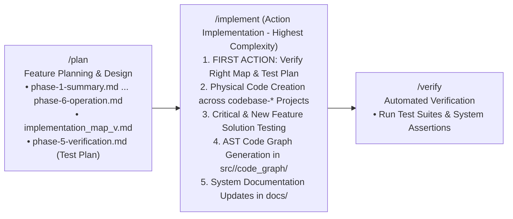
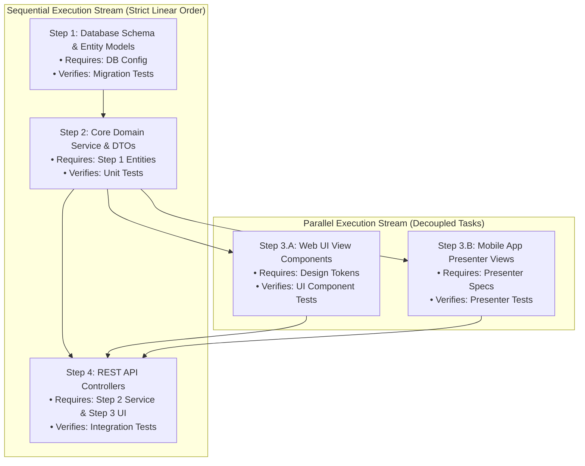

# Guard Specification: Action Implementation (/implement)

This document serves as the authoritative baseline specification for the `/implement` workflow in the **Guards Framework**. It governs how AI agents systematically execute, scaffold, and verify source code changes, build AST-level code graphs, run critical system and new feature solution tests, and promote system documentation for planned features.

---

## 1. General Introduction & Core Philosophy

The `/implement` workflow is the execution engine of the **Guards Framework** and is recognized as **the most complex workflow in the entire operational lifecycle**. It bridges feature planning (`/plan`) and automated verification (`/verify`) by executing the physical multi-project transformation of the codebase.



### Core Purpose: Complete Feature Implementation & Complexity Scope
The `/implement` workflow is responsible for the **entire implementation of the planned feature**. Because implementation requires touching live source code across distinct sub-repositories, updating topological AST maps, asserting test suites, and promoting global system knowledge, it possesses the highest architectural complexity among all framework playbooks:

1. **Code Creation & Scaffolding**: Generating production-grade source code, DTO schemas, domain services, data persistence entities, and presentation components.
2. **Multi-Project `codebase-*` Handling**: Managing multi-repository project layouts (`codebase-ui`, `codebase-engine`, `codebase-data`, `codebase-ops`) through workspace symlink layers (`agent-workspace/src/<layer>`), adhering strictly to layer boundaries and dependency policies.
3. **Solution Testing (Critical Features & New Feature Specifications)**: Scaffolding and executing test suites to guarantee BOTH that existing critical system features remain unbroken (regression protection) AND that new feature capabilities satisfy all test contracts in the Test Plan (`phase-5-verification.md`).
4. **AST Code Graph Generation & Synchronization (`code_graph`)**: Continuously parsing source code ASTs to build and maintain 2-block modular code graph subfolders (`agent-workspace/src/<layer>/code_graph/`) following [code_graph_taxonomy.md](file:///Users/horvathgergo/Desktop/agent-driven-templates/fullstack_software_dev/code_graph_taxonomy.md).
5. **System Documentation Promotion (`docs/`)**: Promoting feature resources staged in `plans/<feature-name>/resource/` into global `agent-workspace/docs/` describing all active features across the entire system.

### First Action Mandate: Immediate Map & Test Plan Verification
> [!IMPORTANT]
> **First Action Mandate**: When an implementation is requested by the user, **the VERY FIRST THING the agent MUST do** is check the `implementation_map` (`implementation_map_v<version>.md`) and verify that the implementation will be executed based on the **RIGHT implementation_map and test_plan** (`phase-5-verification.md` / critical feature test specifications).
>
> Before any code modification or scaffolding begins, the agent must validate:
> 1. The target software version and scope defined in `implementation_map_v<version>.md`.
> 2. The critical system feature assertions and test contracts defined in `phase-5-verification.md`.
> 3. That the selected map and test plan accurately align with the user's implementation request.

### Visible Step-by-Step Execution & User Interruption Rights
> [!NOTE]
> **Visible Process & Interruption Gate**: During code execution, the agent MUST run a transparent, visible step-by-step process leveraging environment tools and capabilities (e.g., Antigravity interactive prompt tools, progress checkpoints, state updates) to their best:
> - **Followable Progress**: Every implementation step (scaffolding a module, adding DTOs, modifying services) is clearly presented so the user can follow along seamlessly.
> - **User Interruption & Clarification**: The user can, at any point during execution and without unwanted subagent delegation, interrupt the process, ask questions, or request micro-architectural clarification.
> - **Direct Communication**: Execution stays direct and interactive—never hidden behind opaque background loops or multi-agent delegations that prevent user feedback.

### Mandatory Dual Grounding Principle
> [!IMPORTANT]
> **Dual Grounding Mandate**: Any code implementation MUST stand firmly on two mandatory foundational resources created or confirmed prior to code modification:
> 1. **An `implementation_map` (`implementation_map_v<version>.md`)**: The version-linked execution roadmap detailing step-by-step file scaffolding, dependencies, and modification scopes (adhering to [implementation_map_taxonomy.md](file:///Users/horvathgergo/Desktop/agent-driven-templates/fullstack_software_dev/implementation_map_taxonomy.md)).
> 2. **A Test Plan / Verification Specification (`phase-5-verification.md`)**: The testing specification defining critical feature assertions, unit/integration test contracts, edge cases, and verification criteria for the system capabilities being implemented.

---

## 2. Centrality & Structure of the Implementation Map (`implementation_map_v<version>.md`)

The **Implementation Map** is the single most critical asset in the `/implement` workflow. It bridges conceptual blueprints and physical code scaffolding. To ensure absolute clarity and predictability during execution, every step in an implementation map MUST be rigorously structured.

### A. Mandatory 4-Part Step Schema
Every implementation step defined inside an `implementation_map_v<version>.md` MUST contain four mandatory structural sections:

```markdown
### Step X: [Step Name / Scope Summary]

1. **Requirement Fulfilled**:
   - Explicitly references the documentation requirement or design spec from `phase-*.md` that this step realizes (e.g., `phase-3-data.md Section 2.1` or `phase-4-engine.md API Endpoint /api/v1/auth`).

2. **Prerequisites**:
   - Lists pre-execution conditions, prior step dependencies, required base classes/contracts, or database migrations that must exist before starting this step.

3. **Actions Taken**:
   - Details exact physical file modifications (`[NEW]`, `[MODIFY]`, `[REFACTOR]`), target sub-repositories (`codebase-data`, `codebase-engine`, `codebase-ui`), classes, methods, DTOs, and functions created.

4. **Verification Fulfilled**:
   - Specifies exact unit tests, integration test suites, or system assertions that MUST pass to consider this step completed (e.g., `pytest tests/unit/test_auth.py` or `go test ./pkg/service/...`).
```

### B. Sequential vs. Parallel Step Execution Categorization
Complex features consist of both dependent tasks and independent components. The implementation map MUST explicitly categorize all planned steps into **Sequential Execution Streams** and **Parallel Execution Streams**:

* **Sequential Execution Steps**: Steps that possess hard linear dependencies (e.g., Data Layer Schema Migration → Repository Interface → Service Logic → API Controller). These MUST be executed in strict numerical sequence.
* **Parallel Execution Steps**: Decoupled, independent steps that share no direct file dependencies (e.g., independent UI component views, standalone helper utilities, isolated DTO mappers). These MAY be executed in parallel or in flexible order.



---

## 3. Core Architectural Principles & Boundary Rules

### A. First-Action Verification & Dual Grounding Preconditions
1. **First-Action Map Check**: Upon receiving an `/implement` request, the agent's very first action is inspecting `agent-workspace/plans/<feature-name>/implementation_maps/` to verify that the target `implementation_map_v<version>.md` exists and matches the user's requested release scope.
2. **First-Action Test Plan Check**: Simultaneously, the agent verifies `phase-5-verification.md` (or the feature test plan) to ensure all critical system feature assertions are present and linked to the implementation scope.
3. **Precondition Resolution Gate**: If either the map or test plan is missing or ambiguous, the agent MUST immediately stop, present the situation to the user, and confirm the right map and test plan before proceeding.

### B. Multi-Project `codebase-*` Sub-Repository Handling
The `/implement` workflow governs multi-repository and layered project structures:
1. **Target Sub-Repositories**: Source code modifications are written to `codebase-ui/`, `codebase-engine/`, `codebase-data/`, or `codebase-ops/` (accessed through symlinks under `agent-workspace/src/<layer>/`).
2. **Layer Boundary Enforcement**: Code in lower layers (e.g., `codebase-data`) MUST NOT import or depend on upper layers (e.g., `codebase-ui`), adhering strictly to the Rule of Dependency defined in [multi_repo_architecture.md](file:///Users/horvathgergo/Desktop/agent-driven-templates/fullstack_software_dev/multi_repo_architecture.md).
3. **Symlink Resolution Check**: Prior to scaffolding, the agent asserts that relative symlinks in `agent-workspace/src/<layer>` resolve correctly to underlying sub-repositories.

### C. Solution Testing (Critical System Features & New Feature Specs)
1. **Critical Feature Protection (Regression Assertions)**: Implementation MUST NOT break existing core capabilities. The agent inspects `phase-5-verification.md` for critical system assertions and executes baseline checks before and after code scaffolding.
2. **New Feature Test Scaffolding**: Alongside production code, the agent scaffolds unit, integration, and contract tests corresponding to newly introduced interfaces, DTOs, and services.
3. **Test-Code Co-location**: Test suites are placed alongside source files within `codebase-*` sub-repositories as specified in the test plan.

### D. Visible Step-by-Step Scaffolding & Direct Control (No Opaque Delegation)
1. **Step-by-Step Granularity**: Scaffolding is broken into clear, discrete execution steps adhering to the 4-part step schema (Requirement, Prerequisites, Actions, Verification).
2. **Visible Environment Tool Usage**: Uses platform primitives (e.g. Antigravity status notifications, interactive prompt tools, step-by-step diff previews) so that every disk action is explicitly visible to the developer.
3. **Interruption & Clarification Checkpoints**: Between scaffolding steps, the agent maintains an open interaction window allowing the user to:
   - Ask clarifying questions about proposed code structures.
   - Request micro-architectural adjustments or alternative design patterns.
   - Pause or resume the implementation sequence at will.
4. **No Opaque Delegation**: Implementation execution is performed directly by the agent in full view of the user, avoiding opaque subagent loops or background task delegations that obscure decision-making.

### E. Strict Directory Write Boundaries & Resource Separation
The `/implement` workflow strictly enforces clear separation between source code, workspace control maps, AST code graphs, and system documentation:

```text
Target Repositories / Sub-Folders       Role & Write Governance during /implement
──────────────────────────────────       ─────────────────────────────────────────
codebase-<layer>/  or  src/<layer>/    → Production Source Code & Test Specs (Physical Code Modifications)
agent-workspace/src/<layer>/code_graph/→ AST Structural Code Graphs (graph.md, process_flow.md, data_flow.md, risk_analysis.md)
agent-workspace/docs/                  → Global System Documentation (Active Implemented System Capabilities)
agent-workspace/plans/<feature-name>/  → Planning Artifacts & Feature Resource Sandbox (Read-Only during /implement except PROCESS_STATUS.md)
```

1. **Production Code in `codebase-*` / `src/`**: All newly created modules, classes, services, UI components, database migrations, and unit tests are written to `codebase-*` sub-repositories (linked via symlinks under `agent-workspace/src/`).
2. **AST Code Graphs in `agent-workspace/src/<layer>/code_graph/`**: Code structural maps detailing nodes (`Module`, `Class`, `Struct`, `Interface`, `Function`) and connections (`IMPORTS`, `IMPLEMENTS`, `CALLS`, `EXTENDS`) are maintained strictly inside `agent-workspace/src/<layer>/code_graph/`. Production `codebase-*` sub-repositories remain 100% clean and free of documentation overhead.
3. **General System Documentation in `agent-workspace/docs/`**: System documentation describing implemented features across the entire application resides in global `docs/`. When `/implement` completes a feature, reference knowledge staged in `plans/<feature-name>/resource/` is reviewed, synthesized, and promoted into global `docs/`.

### F. Continuous Code Graph Synchronization Rule
Whenever a new source file is created or an existing module signature is modified:
1. The agent parses the structural elements (classes, interfaces, functions, DTOs, exports).
2. Updates `graph.md` (Unordered structural element registry adhering to Python, Go, or JS taxonomy in [code_graph_taxonomy.md](file:///Users/horvathgergo/Desktop/agent-driven-templates/fullstack_software_dev/code_graph_taxonomy.md)).
3. Updates `process_flow.md`, `data_flow.md`, and `risk_analysis.md` inside `agent-workspace/src/<layer>/code_graph/`.

### G. System Documentation Promotion Rule
Upon completing feature implementation:
1. `/implement` inspects `agent-workspace/plans/<feature-name>/resource/` for non-code specs, API diagrams, and schemas staged during `/process` or `/plan`.
2. Synthesizes and promotes these capabilities into permanent, human-readable documentation files under `agent-workspace/docs/` (e.g., `agent-workspace/docs/architecture/`, `agent-workspace/docs/api/`, `agent-workspace/docs/components/`).
3. Ensures `docs/` reflects the up-to-date, live reality of all implemented features across the entire codebase.

---

## 4. Directory Layout & Workflow Scaffold

```text
fullstack_software_dev/implement/
└── implement_workflow.md               # Tier 2 Universal Specification (This Document)
```

---

## 5. Detailed Step-by-Step State Machine Design

Execution of the `/implement` workflow follows a strict 7-node sequential state machine starting with the mandatory immediate map & test plan verification, leading into visible step-by-step code scaffolding, solution testing, AST code graph generation, system documentation updates, and process status sync:

```mermaid
graph TD
    S1[Node S1: Environment & Workspace Check] 
    --> S2[Node S2: FIRST ACTION - Map & Test Plan Verification<br/>Validate right implementation_map_v<version>.md & phase-5-verification.md]
    
    S2 -->|Missing or Ambiguous Map/Plan| S2_Confirm[Confirm / Select Right Map & Test Plan with User]
    S2 -->|Validated Right Map & Test Plan| S3[Node S3: Micro-Architecture Alignment Gate<br/>Confirm Starting codebase-* Layer & Step Boundaries]
    
    S2_Confirm --> S3
    
    S3 --> S4[Node S4: Visible Step-by-Step Code Scaffolding & Solution Testing<br/>• Execute Sequential & Parallel step streams<br/>• Follow 4-part step schema (Req, Prereq, Actions, Verification)<br/>• Execute critical system & new feature test suites<br/>• User Interruption & Clarification Checkpoints]
    
    S4 --> S5[Node S5: AST Code Graph Generation & Update<br/>Build/Update src/<layer>/code_graph/ Files]
    
    S5 --> S6[Node S6: System Documentation Update & Knowledge Promotion<br/>Promote plans/<feature>/resource/ to global docs/]
    
    S6 --> S7[Node S7: PROCESS_STATUS.md Sync & Handoff to /verify]
```

---

### Step Descriptions & Execution Reasoning

#### Step 1: Environment & Workspace Check (Node S1)
* **Description**: Verifies workspace initialization (`.agents/` and active Git branch state). Asserts Docker engine status and active feature directory (`agent-workspace/plans/<feature-name>/`).
* **Storage Actions**: Reads `agent-workspace/plans/<feature-name>/PROCESS_STATUS.md`. Verifies Row 3 (`/plan`) is marked `Completed` or `In Progress`.

#### Step 2: FIRST ACTION - Map & Test Plan Verification (Node S2)
* **Description**: **As the very first action**, the agent checks `agent-workspace/plans/<feature-name>/implementation_maps/` and verifies that the request will be executed based on the **RIGHT `implementation_map_v<version>.md` AND Test Plan (`phase-5-verification.md`)**.
* **Reasoning**: Ensures zero ambiguity about target version, release scope, critical system assertions, or verification contracts before a single line of code is written.

#### Step 3: Micro-Architecture Alignment Gate (Node S3)
* **Description**: Confirms starting entry-point `codebase-*` layer, incremental step boundaries, sequential vs. parallel streams, and language AST taxonomies.
* **Reasoning**: Establishes developer alignment on immediate implementation targets before modifying code.

#### Step 4: Visible Step-by-Step Code Scaffolding & Solution Testing (Node S4)
* **Description**: Executes code modifications step-by-step following the 4-part step schema (Requirement, Prerequisites, Actions, Verification) outlined in the target `implementation_map_v<version>.md`. Executes sequential steps in order and parallel steps flexibly. Displays changes incrementally with visible tools.
* **User Interruption & Clarification**: Between scaffolding steps, the agent maintains an active communication window where the user can interrupt, ask questions, or request adjustments. No opaque background delegations are used.

#### Step 5: AST Code Graph Generation & Update (Node S5)
* **Description**: Parses implemented code for structural symbols (Python dataclasses/protocols, Go structs/interfaces, JS ES6 classes/exports). Updates modular code graph subfolders under `agent-workspace/src/<layer>/code_graph/` (`graph.md`, `process_flow.md`, `data_flow.md`, `risk_analysis.md`) adhering to `code_graph_taxonomy.md`.

#### Step 6: System Documentation Update & Knowledge Promotion (Node S6)
* **Description**: Synthesizes implemented code structures and feature reference materials from `agent-workspace/plans/<feature-name>/resource/`. Updates general system documentation under `agent-workspace/docs/` (e.g. updating API reference, component architecture, data models).

#### Step 7: PROCESS_STATUS.md Sync & Handoff to `/verify` (Node S7)
* **Description**: Updates `agent-workspace/plans/<feature-name>/PROCESS_STATUS.md`, marking Row 4 (`/implement`) as `Completed` with datestamped history log. Prepares handoff for `/verify`.

---

## 6. Command Options & Execution Modes

| Command Variant | Execution Mode | Behavior & Description |
| :--- | :--- | :--- |
| `/implement` (or `/implement --plan`) | **Plan-First Step-by-Step Mode** (Default) | Verifies map & test plan first, runs visible step-by-step scaffolding across `codebase-*` projects following 4-part step schema with solution testing and user interruption checkpoints. |
| `/implement --auto` (or `/implement --apply`) | **Continuous Scaffolding Mode** | Verifies map & test plan first, executes step-by-step scaffolding automatically while streaming progress log and updating code graphs and system docs. |
| `/implement --version vX.Y.Z` | **Version Map Target** | Explicitly targets a specific implementation map version (e.g., `implementation_map_v1.0.0.md`). |
| `/implement --dry-run` | **Preview Mode** | Simulates step-by-step code scaffolding, displays file diff previews, and verifies code graph updates without altering files. |
| `/implement --docs-only` | **Documentation & Graph Sync Mode** | Synchronizes `src/<layer>/code_graph/` and updates `docs/` based on current source code without scaffolding new code. |

---

## 7. Summary Checklist for AI Agents Executing `/implement`

- [ ] **FIRST ACTION**: Check `implementation_map_v<version>.md` and verify execution is based on the RIGHT map and Test Plan (`phase-5-verification.md`).
- [ ] Confirm target release version, scope, `codebase-*` layers, and critical system assertions.
- [ ] Parse implementation map steps enforcing the mandatory 4-part step schema (Requirement, Prerequisites, Actions, Verification).
- [ ] Identify Sequential vs. Parallel execution streams before scaffolding.
- [ ] Execute visible step-by-step code scaffolding across target `codebase-*` projects in `src/`.
- [ ] Run solution testing verifying critical system regression assertions AND new feature test specs.
- [ ] Maintain direct interaction allowing user interruption, questions, and clarification at any step (no opaque subagent delegation).
- [ ] Generate/update AST Code Graph subfolders in `agent-workspace/src/<layer>/code_graph/`.
- [ ] Promote feature resources and update global system documentation in `agent-workspace/docs/`.
- [ ] Update `PROCESS_STATUS.md` Row 4 to `Completed` with datestamped log entry.
