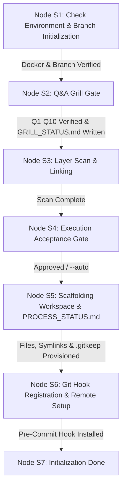

# Stateful Execution Playbook: `/init`

This playbook governs the step-by-step execution of the `/init` workflow within Google Antigravity. It transitions through nodes **S1** to **S7**, enforcing environmental assertions, Q&A interview gating, Execution Acceptance summary prompts, workspace scaffolding, relative symlinking, Hybrid Docker file generation, process status initialization, and Git safety hook registration.

---

## Command Flags & Parameters

The `/init` workflow accepts the following CLI flags:

- `/init`: Default interactive execution.
  - **Initial Run (Greenfield)**: When run for the first time in an uninitialized workspace, automatically creates and checks out the **`initial`** Git branch (`git checkout -b initial`).
  - **Subsequent Run (Initialized Workspace)**: When invoked without options in an already initialized workspace, automatically initializes a new feature scope by creating and checking out a new branch `feature/<feature_name>`.
- `--auto`: Automatic execution mode. Bypasses the interactive Execution Acceptance prompt (Node S4) and executes all planned workspace scaffolding and Git hook registration tasks automatically.
- `--feature <feature_name>`: Explicitly initializes workspace bound to an isolated feature branch `feature/<feature_name>`. Updates `PROCESS_STATUS.md` header.
- `--add-layer <layer_name>`: Dynamically expands an existing workspace by scaffolding a new sub-repository skeleton `codebase-<layer_name>`, registering a relative symlink `src/<layer_name>`, provisioning a standalone `Dockerfile`, and updating `docker-compose.yml`.
- `--dry-run`: Executes the workflow in preview mode. Outputs all proposed directories, files, symlinks, Docker configs, and `PROCESS_STATUS.md` content without writing any changes to disk.
- `--force`: Overwrites existing `.agents/` workflows and rules while strictly preserving custom phase blueprints (`PROCESS_STATUS.md`, `phase-1-summary.md`).

---

## State Machine Execution Flow

---

### Node S1: Check Environment & Branch Initialization

1. **Docker Engine Assertion**:
   - Execute `docker info` to verify that the Docker daemon is active and accessible.
   - If `docker info` fails (exit code $\neq 0$), halt execution immediately with error:
     > `[ERROR] Docker engine is unreachable. Docker daemon must be running to support Baseline 1 (Hybrid Docker Handling Strategy).`

2. **Git Context & Branch Initialization Assertion**:
   - Check if the current workspace root is a Git repository. If `.git/` is missing, initialize Git context (`git init`).
   - **Branch Management Logic**:
     - **Initial Run (Greenfield)**: If `.agents/plans/PROCESS_STATUS.md` does not exist, create and checkout the **`initial`** branch (`git checkout -b initial`).
     - **Subsequent Run (Initialized Workspace)**: If `.agents/plans/PROCESS_STATUS.md` exists and `/init` is invoked without options (or with `--feature <name>`), treat as a **New Feature Initialization**. Prompt for feature name (or parse `--feature <name>`), create and checkout `feature/<feature_name>` (`git checkout -b feature/<feature_name>`).

3. **Flag Evaluation**:
   - Parse flags (`--auto`, `--feature`, `--add-layer`, `--dry-run`, `--force`).
   - If `--dry-run` is active, print `[DRY-RUN MODE ACTIVATED: No disk modifications will be made.]`.

---

### Node S2: Q&A Grill Gate

1. **Invoke Rule Guard**:
   - Load and execute `rules/init-grill.md`.

2. **Baseline Application (Zero Questions Asked)**:
   - Apply **Baseline 1**: The Hybrid Docker Handling Strategy.
   - Apply **Baseline 2**: Standard Guards Folder Layout.

3. **Sequential Q1–Q10 Interview Execution**:
   - Prompt user sequentially through Q1 (Purpose), Q2 (Local System Folders with Q2.a path listing & remote auto-detection), Q3 (Cloud Docs with scan failure clarification), Q4 (Additional Remotes), Q5 (Cloud Provider), Q6 (Architecture Pattern), Q7 (Layer Scope), Q8 (Tech Stack), Q9 (Agent Guiders), and Q10 (Summary Verification & Reflection).
   - Enforce **Neutral Prompting Law**: List options neutrally with zero `[Recommended]` tags and a mandatory final `Other / Free-text (...)` option.

4. **Permanent Audit Log Persistence**:
   - Write full transcript of Q1–Q10 questions, choices, and text inputs to `.agents/plans/GRILL_STATUS.md`.

5. **User Approval Gate**:
   - If user rejects Q10 summary reflection, halt workflow and allow answer modifications before proceeding to S3.

---

### Node S3: Lightweight Layer Scan & Linking

1. **Surface Directory Scan**:
   - Scan workspace for existing `codebase-*` directories or brownfield source/documentation folders.

2. **Remote Origin Auto-Detection**:
   - Read `.git/config` to auto-detect existing Git remote origins.

3. **Decoupled Brownfield Constraint**:
   - **No codebase restructuring, deep historical code analysis, or refactoring is permitted during `/init`**.
   - Decouple all legacy code analysis and restructuring to the `/process-history` workflow.

---

### Node S4: Execution Acceptance Gate

1. **Information Synthesis & Summary Presentation**:
   - Synthesize all collected answers from Nodes S2 and S3 (vision, scope, layer skeletons, tech stack, Docker strategy, remotes).
   - Format and display the **Initialization Understanding Summary** and list all planned execution steps (directory creation, `.gitkeep` provisioning, relative symlinking, Hybrid Docker setup, status sheets deployment, Git hook registration).

2. **Dual Execution Mode Evaluation**:
   - **Default / Interactive Mode**: Prompt user for explicit acceptance:
     > `Do you approve the execution of these initialization steps?`
     > `1. Proceed with execution`
     > `2. Modify parameters`
     - If approved, proceed to Node S5. If rejected, halt execution to allow parameter adjustments.
   - **Automated Mode (`--auto`)**:
     - Log summary and step list to `.agents/plans/GRILL_STATUS.md` and proceed immediately to Node S5 without pausing for user prompt.

---

### Node S5: Scaffolding Workspace & `PROCESS_STATUS.md`

1. **Invoke Scaffolding Skill**:
   - Execute `skills/init-scaffolder/SKILL.md`.

2. **Directory & `.gitkeep` Provisioning**:
   - Scaffold `antigravity-workspace/` and `.agents/` (`rules/`, `workflows/`, `skills/`, `hooks/`, `sidecars/`, `plans/`).
   - Scaffold `codebase-<layer_name>` sub-repositories (`src/`, `config/`, `tests/`, `.github/workflows/`).
   - Provision a `.gitkeep` file inside **every created directory node** to guarantee remote Git tracking.

3. **Relative Symlinks & 3-Part Verification**:
   - Create relative symbolic links under `antigravity-workspace/src/` (e.g. `ln -s ../../codebase-layout/src src/layout`).
   - Run 3-part verification check: (1) verify symlink attribute, (2) confirm target resolves to active directory, (3) assert relative pathing.

4. **Hybrid Docker Provisioning**:
   - Scaffold `antigravity-workspace/docker/dev.Dockerfile` (sandbox) and `antigravity-workspace/docker/docker-compose.yml` (orchestrator).
   - Scaffold standalone `Dockerfile` specs in each `codebase-<layer_name>` sub-repo.

5. **Process Status & Summary Scaffolding**:
   - Deploy `.agents/plans/PROCESS_STATUS.md` from `templates/PROCESS_STATUS.md`. Update Block 1 matrix (`/init` $\rightarrow$ `Completed`, 5 planning sub-rows present) and Block 2 daily log.
   - Deploy `.agents/plans/phase-1-summary.md` from `templates/phase-1-summary.md`. Fill architecture metadata from Q1–Q10.

---

### Node S6: Git Hook Registration & Remote Setup

1. **Git Remote Configuration**:
   - Register remote origin URLs for single-repo or multi-repo setups based on Q4/Q5 choices (`git remote add origin <url>`).

2. **Pre-Commit Hook Installation**:
   - Copy `hooks/pre-commit-plan-validator.sh` to `.git/hooks/pre-commit`.
   - Set executable permissions: `chmod +x .git/hooks/pre-commit`.

---

### Node S7: Initialization Done

1. **Finalize State Machine**:
   - Assert all physical resources, `.gitkeep` files, symlinks, Docker configs, status sheets, and hooks exist.

2. **Summary Report & Next Command Recommendation**:
   - Output initialization completion summary report.
   - Recommend next workflow execution command:
     > `[SUCCESS] Workspace initialization completed. Recommended next command: /plan or /process-history`
