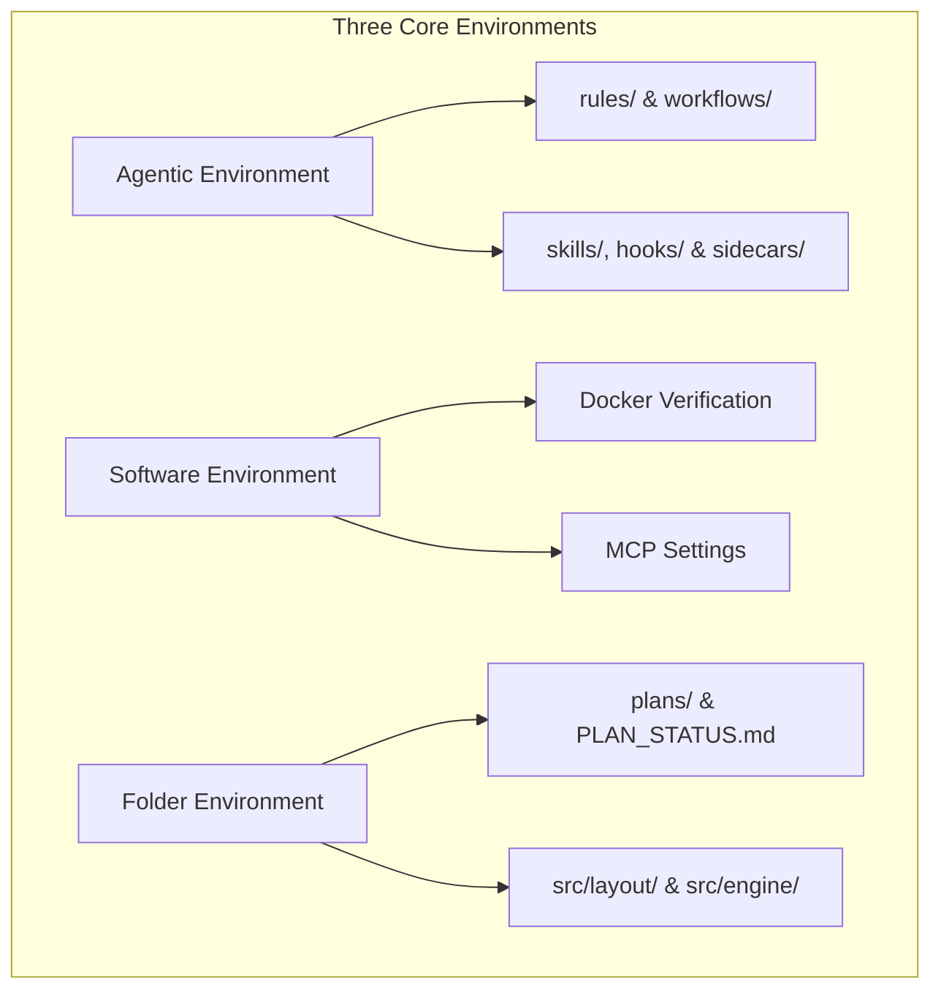
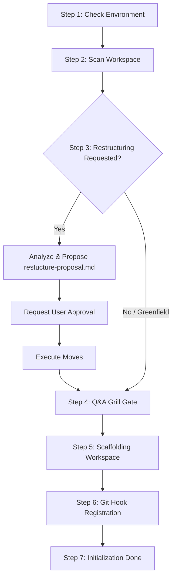

# Guard Specification: Initialization & Restructuring (/init)

This document collects all statements, requirements, and design decisions regarding the `/init` workflow. This workflow is the entry point for bootstrapping the Guards framework in any codebase.

---

## 1. General Introduction & Core Objectives

The `/init` workflow is a fundamental component of the **Software Development Workflow Guard**. It acts as the gatekeeper and bootstrapping process for the repository, transforming any standard codebase into a structured agentic development environment.

### Goal of the Workflow
The primary goal of `/init` is to initialize the project's agentic, software, and physical filesystem layers. By running `/init`, the workspace transitions from an unmonitored codebase into a state-tracked repository under the Guards guidelines.

### The Three Environments (Brief Overview)
The initialization process establishes and connects three key environments:
- **Agentic Environment**: Sets up the agentic control layers (rules, workflows, skills, hooks, and sidecars) to guide agent execution.
- **Software-Based Environment**: Asserts Docker availability and privileges, configuring the containerized sandboxes for execution.
- **Folder-Based Environment**: Creates the physical directories for code, tests, documentation, and agent blueprints.

---

## 2. Detailed Representation of the Three Environments

The following diagram defines the three environments initialized by the `/init` workflow:

### Connected Descriptions of the Environments:

*   **Agentic Environment (Node A)**:
    Establishes the permanent constraints and tools governing agent behavior.
    *   **Rules & Workflows (Node A1)**: Scaffolds the `.agents/rules/` and `.agents/workflows/` directories, deploying the core files:
        *   [rules/implementation-plan.md](file:///Users/horvathgergo/Desktop/agent-driven-templates/rules/implementation-plan.md) (defining the 5-phase plan blueprint structure).
        *   `workflows/init.md` (defining the initialization playbook).
    *   **Capabilities & Safety Triggers (Node A2)**: Creates placeholder directories for `skills/`, `hooks/`, and `sidecars/` to be populated during development.
*   **Software-Based Environment (Node B)**:
    Integrates the development environment with system-level services.
    *   **Docker Verification (Node B1)**: The workflow runs a primary check to confirm Docker is installed and that the agent has valid read/write privileges (e.g., executing test docker commands).
    *   **MCP Settings (Node B2)**: Generates basic configuration settings for Model Context Protocol integrations (e.g. database tools, browser agents).
*   **Folder-Based Environment (Node C)**:
    Organizes the physical files and workspace boundaries.
    *   **Plans & Tracking (Node C1)**: Scaffolds the `.agents/plans/` folder containing the 5-phase blueprint template files and the active tracking sheet `PLAN_STATUS.md`.
    *   **Decoupled Layout (Node C2)**: Prepares the source tree to separate presentation logic (`src/layout/`) from engine logic (`src/engine/`). For the complete layout, refer to the [folder_structure.md](file:///Users/horvathgergo/Desktop/agent-driven-templates/fullstack_software_dev/init/folder_structure.md) specification file.

---

## 3. Step-by-Step Workflow Design

The execution of the `/init` workflow follows this step-by-step design:

### Connected Descriptions of the Step-by-Step Design:

*   **Step 1: Check Environment (Node S1)**:
    Verifies that the software environment is valid. The agent runs `docker info` to check Docker installation status and permission boundaries, and verifies the local workspace integration (checks that `src/layout` and `src/engine` are valid symbolic links pointing to local repository directories).
*   **Step 2: Scan Workspace (Node S2)**:
    Scans the repository structure at a high level using workspace search tools to determine if the project is Greenfield (new/empty) or Brownfield (existing codebase).
*   **Step 3: Optional Restructuring (Nodes S3, S3A, S3B, S3C)**:
    If a brownfield project is detected and the user explicitly requests restructuring, the agent analyzes imports and layouts to separate presentation (`src/layout/`) from logic (`src/engine/`).
    *   **Propose (Node S3A)**: Drafts `.agents/restructure-proposal.md`.
    *   **Consent (Node S3B)**: Stalls execution until the developer explicitly approves the proposal.
    *   **Move (Node S3C)**: Executes file movements and updates import statements.
*   **Step 4: Q&A Grill Gate (Node S4)**:
    Runs the interactive interview loop to gather core project scope, tech stack, and remote source settings. For multi-repo setups, it asks the user to confirm the local paths of `codebase-layout` and `codebase-engine` to map the symlinks.
    *   *Reference (Engine)*: Refer to [grill_engine.md](file:///Users/horvathgergo/Desktop/agent-driven-templates/fullstack_software_dev/grill_engine.md) for detail on Grill behaviors.
    *   *Reference (Questions)*: Refer to [init_questions.md](file:///Users/horvathgergo/Desktop/agent-driven-templates/fullstack_software_dev/init/init_questions.md) for the exact questions and auto-detection rules.
*   **Step 5: Scaffolding Workspace (Node S5)**:
    Scaffolds the physical directories and deploys the essential guards framework files. It also maps the symlinks for layout and engine workspaces and scaffolds the central secrets configurations skeleton in `src/config/` (or `.env` file). Refer to the [folder_structure.md](file:///Users/horvathgergo/Desktop/agent-driven-templates/fullstack_software_dev/init/folder_structure.md) for the detailed scaffolding outline.
*   **Step 6: Git Hook Registration (Node S6)**:
    Registers Git origin (prompting for remote setups like GitHub, GitLab, or Bitbucket) and installs the pre-commit hook pointing to `pre-commit-plan-validator.sh` to enforce phase validation on commits.

---

## 4. How to Use Rules & Options

The `/init` command can be configured and run using the following operational rules and flags:

### Parameters & Options
- `/init`: Executes the standard scan, runs the Grill Q&A gate, and scaffolds `.agents/` folder structures. Restructuring analysis is omitted by default.
- `/init --restructure`: Runs standard setup and performs the optional brownfield codebase restructuring proposal (Step 3).
- `/init --dry-run`: Scans the directory and prints proposed scaffolding files and Docker status without writing any changes to disk.
- `/init --force`: Overwrites existing rules and workflows in `.agents/rules/` and `.agents/workflows/` with default framework values (useful for updating framework tools).

### Operational Rules of Thumb
1.  **Git Safety Rule**: The agent must check if git status is clean before executing Step 3 (Restructuring). If dirty files are present, it must warn the user to commit or stash first.
2.  **Idempotency Rule**: Running `/init` multiple times in an already initialized workspace will verify container status and restore missing default files without modifying active plans or custom project blueprints.
