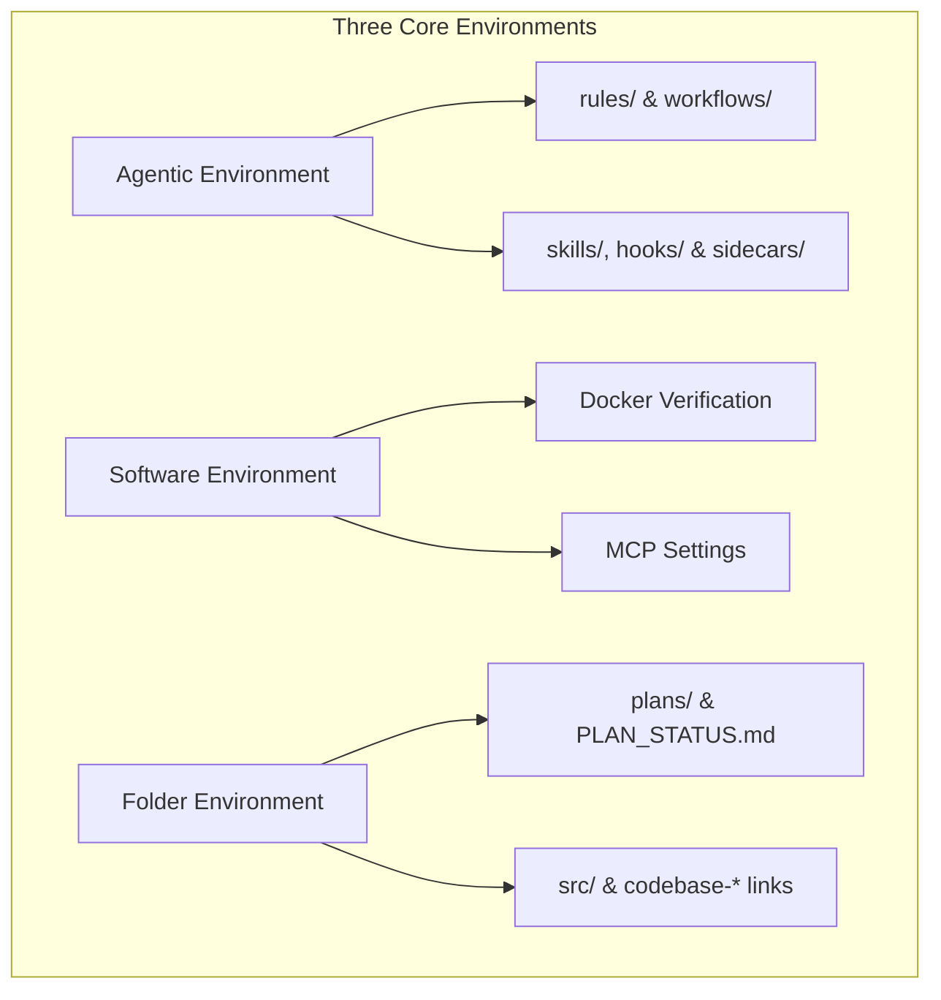
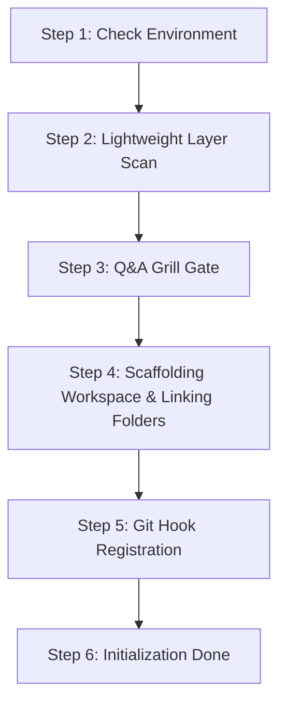

# Guard Specification: Initialization (/init)

This document collects all statements, requirements, and design decisions regarding the `/init` workflow. This workflow is the entry point for bootstrapping the Guards framework in any codebase while keeping execution simple, fast, and token-efficient.

---

## 1. General Introduction & Core Objectives

The `/init` workflow is a fundamental component of the **Software Development Workflow Guard**. It acts as the gatekeeper and bootstrapping process for the repository, transforming any standard codebase into a structured agentic development environment.

### Goal of the Workflow
The primary goal of `/init` is to initialize the project's agentic, software, and physical filesystem layers. By running `/init`, the workspace transitions from an unmonitored codebase into a state-tracked repository under the Guards guidelines.

### Simplicity & Separation of Concerns Rule
For brownfield projects with existing source code and documentation, `/init` performs **only high-level layer identification** to create `codebase-*` skeletons and link existing source folders. **No code restructuring, deep historical analysis, or refactoring is required or allowed during `/init`**. All historical code analysis and legacy codebase restructuring are decoupled into the dedicated `/process-history` workflow.

### The Three Environments (Brief Overview)
The initialization process establishes and connects three key environments:
- **Agentic Environment**: Sets up the agentic control layers (rules, workflows, skills, hooks, and sidecars) to guide agent execution.
- **Software-Based Environment**: Asserts Docker availability and privileges, configuring the containerized sandboxes for execution.
- **Folder-Based Environment**: Creates the physical directories for code, tests, documentation, and agent blueprints, linking existing source folders.

---

## 2. Detailed Representation of the Three Environments

The following diagram defines the three environments initialized by the `/init` workflow:

### Connected Descriptions of the Environments:

*   **Agentic Environment (Node A)**:
    Establishes the permanent constraints and tools governing agent behavior.
    *   **Rules & Workflows (Node A1)**: Scaffolds `.agents/rules/` and `.agents/workflows/`, deploying core files:
        *   [rules/implementation-plan.md](file:///Users/horvathgergo/Desktop/agent-driven-templates/rules/implementation-plan.md) (defining 5-phase plan structure).
        *   `workflows/init.md` (defining initialization playbook).
    *   **Capabilities & Safety Triggers (Node A2)**: Creates placeholder directories for `skills/`, `hooks/`, and `sidecars/`.
*   **Software-Based Environment (Node B)**:
    Integrates the development environment with system-level services.
    *   **Docker Verification (Node B1)**: Confirms Docker is installed and that the agent has valid read/write privileges.
    *   **MCP Settings (Node B2)**: Generates basic configuration settings for Model Context Protocol integrations.
*   **Folder-Based Environment (Node C)**:
    Organizes physical files, workspace boundaries, and existing source code links.
    *   **Plans & Tracking (Node C1)**: Scaffolds `.agents/plans/` containing 5-phase blueprint templates and `PLAN_STATUS.md`.
    *   **Decoupled Layout & Source Linking (Node C2)**: Maps `src/` symlinks to existing source folders or `codebase-<layer_name>` skeletons. For full details, refer to [folder_structure.md](file:///Users/horvathgergo/Desktop/agent-driven-templates/fullstack_software_dev/init/folder_structure.md).

---

## 3. Step-by-Step Workflow Design

The execution of the `/init` workflow follows this lightweight design:

### Connected Descriptions of the Step-by-Step Design:

*   **Step 1: Check Environment (Node S1)**:
    Verifies that the software environment is valid (`docker info`) and checks local workspace integration.
*   **Step 2: Lightweight Layer Scan (Node S2)**:
    Scans the repository at a surface level ONLY to identify existing high-level layer directories (e.g. `frontend/`, `backend/`, `api/`). **No deep code parsing or restructuring is permitted during `/init`**.
*   **Step 3: Q&A Grill Gate (Node S3)**:
    Runs the interactive interview loop to gather core project scope, tech stack, remote Git settings, and layer scope (single-layer vs fullstack vs multi-service), confirming the initial `codebase-<layer_name>` skeletons and existing folder links.
    *   *Reference (Engine)*: Refer to [grill_engine.md](file:///Users/horvathgergo/Desktop/agent-driven-templates/fullstack_software_dev/grill_engine.md).
    *   *Reference (Questions)*: Refer to [init_questions.md](file:///Users/horvathgergo/Desktop/agent-driven-templates/fullstack_software_dev/init/init_questions.md).
*   **Step 4: Scaffolding Workspace & Linking Folders (Node S4)**:
    Scaffolds physical directories and deploys essential guards framework files. It registers `src/` symlinks pointing to existing source folders or `codebase-<layer_name>` skeletons, provisions `docker/dev.Dockerfile` and `docker/docker-compose.yml`, scaffolds standalone `Dockerfile` specs in defined sub-repositories, and links existing source folders into `phase-1-summary.md`.
*   **Step 5: Git Hook Registration (Node S5)**:
    Registers Git origin (prompting for GitHub/GitLab/Bitbucket) and installs `pre-commit-plan-validator.sh`.

---

## 4. How to Use Rules & Options

The `/init` command is configured and run using the following operational rules and flags:

### Parameters & Options
- `/init`: Executes lightweight scan, runs Grill Q&A gate, scaffolds `.agents/` structures, and links existing source folders. Restructuring is strictly omitted.
- `/init --add-layer <layer_name>`: Introduces a new software layer sub-repository (`codebase-<layer_name>`) into an existing workspace, registering its symlink under `src/<layer_name>`, scaffolding its `Dockerfile`, and updating `docker-compose.yml`.
- `/init --dry-run`: Scans the directory and prints proposed scaffolding files and Docker status without writing any changes to disk.
- `/init --force`: Overwrites existing default rules and workflows in `.agents/rules/` and `.agents/workflows/`.

*Historical Codebase Restructuring Note: Codebase restructuring, historical code analysis, and legacy migrations are explicitly decoupled from `/init` and managed by the separate `/process-history` workflow.*

### Operational Rules of Thumb
1.  **No-Restructuring Rule**: `/init` MUST NOT perform file moves, code refactoring, or import rewrites. If legacy codebase restructuring is required, the user is directed to call `/process-history`.
2.  **Idempotency Rule**: Running `/init` multiple times in an already initialized workspace will verify container status and restore missing default files without modifying active plans or custom project blueprints.
