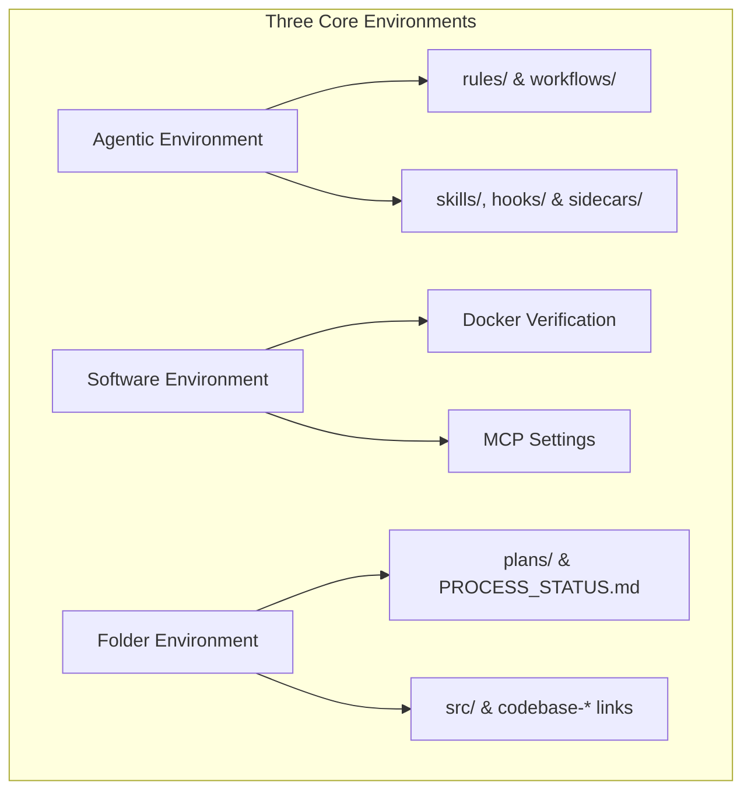
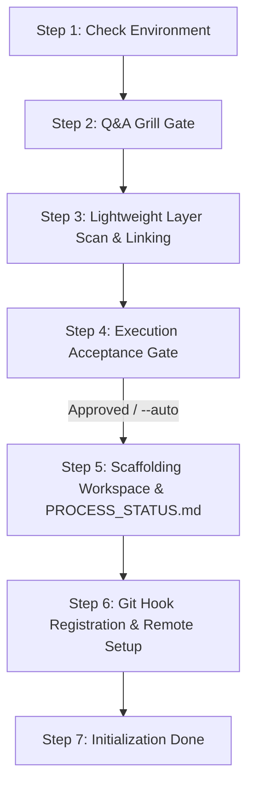

# Guard Specification: Initialization (/init)

This document collects all statements, requirements, theoretical design decisions, and implementation rationale regarding the `/init` workflow. It serves as the authoritative baseline specification for bootstrapping the Guards framework in any codebase while keeping execution simple, fast, and token-efficient.

---

## 1. General Introduction & Core Objectives

The `/init` workflow is a fundamental component of the **Software Development Workflow Guard**. It acts as the gatekeeper and bootstrapping process for the repository, transforming any standard codebase into a structured agentic development environment.

### Goal of the Workflow
The primary goal of `/init` is to initialize the project's agentic, software, and physical filesystem layers. By running `/init`, the workspace transitions from an unmonitored codebase into a state-tracked repository under the Guards guidelines.

### Role & Relationship Across Framework Specifications
To ensure the Guards Framework can be baselined and implemented consistently across diverse AI coding environments (e.g. Google Antigravity, OpenAI Codex, Claude Code, Cursor), the design is divided into two distinct specification tiers:

1.  **Platform-Agnostic Design Baselines (Theoretical & Architectural Specifications)**:
    *   [summary.md](file:///Users/horvathgergo/Desktop/agent-driven-templates/fullstack_software_dev/summary.md): Central framework sitemap and 6-stage operational lifecycle.
    *   [multi_repo_architecture.md](file:///Users/horvathgergo/Desktop/agent-driven-templates/fullstack_software_dev/multi_repo_architecture.md): Hybrid Multi-Repo structure, relative symlinks, Rule of Dependency config isolation, and Hybrid Docker handling strategy.
    *   [init_workflow.md](file:///Users/horvathgergo/Desktop/agent-driven-templates/fullstack_software_dev/init/init_workflow.md) (*This Document*): Core `/init` workflow state machine design, step-by-step reasoning, state storage mechanics, and guard element definitions.
    *   [init_questions.md](file:///Users/horvathgergo/Desktop/agent-driven-templates/fullstack_software_dev/init/init_questions.md): 3-block Q&A interview schema, baselines, auto-detection rules, and Q1–Q10 questions.
    *   [folder_structure.md](file:///Users/horvathgergo/Desktop/agent-driven-templates/fullstack_software_dev/init/folder_structure.md): Standard workspace folder layout specifications.
2.  **Environment-Specific Execution Guidelines**:
    *   [antigravity/init_implementation_map.md](file:///Users/horvathgergo/Desktop/agent-driven-templates/fullstack_software_dev/init/antigravity/init_implementation_map.md): Specific execution guideline detailing how our agent implements these baselines within **Google Antigravity** using its native primitives (**rules, skills, workflows, hooks, sidecars, templates**) by scaffolding master guard files under `fullstack_software_dev/init/antigravity/guards/`.
    *   [antigravity/init_tests.md](file:///Users/horvathgergo/Desktop/agent-driven-templates/fullstack_software_dev/init/antigravity/init_tests.md): Test specification and scenario for verifying `/init` greenfield execution in Antigravity.

### Simplicity & Separation of Concerns Rule
For brownfield projects with existing source code and documentation, `/init` performs **only high-level layer identification** to create `codebase-*` skeletons and link existing source folders. **No code restructuring, deep historical analysis, or refactoring is required or allowed during `/init`**. All historical code analysis and legacy codebase restructuring are decoupled into the dedicated `/process-history` workflow.

### The Three Environments (Brief Overview)
The initialization process establishes and connects three key environments:
- **Agentic Environment**: Sets up the agentic control layers (rules, workflows, skills, hooks, and sidecars) to guide agent execution.
- **Software-Based Environment**: Asserts Docker availability and privileges, configuring the containerized sandboxes for execution.
- **Folder-Based Environment**: Creates the physical directories for code, tests, documentation, and agent blueprints, linking existing source folders.

---

## 2. Detailed Representation of the Three Environments

The following diagram defines the three environments initialized by the `/init` workflow:

### Connected Descriptions of the Environments:

*   **Agentic Environment (Node A)**:
    Establishes the permanent constraints and tools governing agent behavior.
    *   **Rules & Workflows (Node A1)**: Scaffolds `.agents/rules/` and `.agents/workflows/`, deploying core files:
        *   `rules/implementation-plan.md` (defining 5-phase plan structure).
        *   `workflows/init.md` (defining initialization playbook).
    *   **Capabilities & Safety Triggers (Node A2)**: Creates placeholder directories for `skills/`, `hooks/`, and `sidecars/`.
*   **Software-Based Environment (Node B)**:
    Integrates the development environment with system-level services.
    *   **Docker Verification (Node B1)**: Confirms Docker is installed and that the agent has valid read/write privileges.
    *   **MCP Settings (Node B2)**: Generates basic configuration settings for Model Context Protocol integrations.
*   **Folder-Based Environment (Node C)**:
    Organizes physical files, workspace boundaries, and existing source code links.
    *   **Plans & Tracking (Node C1)**: Scaffolds `.agents/plans/` organized into feature/branch subdirectories (e.g., `.agents/plans/initial/` for initial setup, `.agents/plans/<feature_name>/` for feature branches) containing 5-phase blueprint templates, `GRILL_STATUS.md`, and `PROCESS_STATUS.md`.
    *   **Decoupled Layout & Source Linking (Node C2)**: Maps `src/` symlinks to existing source folders or `codebase-<layer_name>` skeletons. For full details, refer to [folder_structure.md](file:///Users/horvathgergo/Desktop/agent-driven-templates/fullstack_software_dev/init/folder_structure.md).

---

## ### Step-by-Step Workflow Design & Implementation Reasoning

The execution of the `/init` workflow follows a strict, sequential 7-node state machine design:

### State Machine Execution & Transition Rules
1.  **Sequential Execution Guarantee**: Step execution is strictly linear (S1 $\rightarrow$ S2 $\rightarrow$ S3 $\rightarrow$ S4 $\rightarrow$ S5 $\rightarrow$ S6 $\rightarrow$ S7). No step may be skipped, reordered, or executed out of sequence.
2.  **Gate Validation Before Transition**: A step MUST complete its verification assertions before transitioning state to the next node. If any step fails (e.g. S1 Docker missing, S4 User Rejection, S5 symlink target invalid), execution halts immediately with a diagnostic report.
3.  **Resume & Audit State**: If execution is interrupted, the state machine reads `.agents/plans/<branch_name>/GRILL_STATUS.md` and `.agents/plans/<branch_name>/PROCESS_STATUS.md` to resume from the last completed node without re-prompting previously answered questions.

---

### Connected Descriptions, Reasoning, & Guard Elements for Each Step:

#### Step 1: Check Environment (Node S1)
*   **Description**: Verifies that the host software environment meets system requirements by checking Docker engine status (`docker info`) and validating workspace filesystem privileges.
*   **Architectural & Implementation Reasoning**:
    *   *Why Run S1 First?*: Containerized execution is an unchangeable baseline (**Baseline 1: The Hybrid Docker Handling Strategy**). Verifying Docker engine availability *before* asking questions prevents wasting user time in a Q&A interview if the host container daemon is offline or lacks privileges.
*   **State & Storage Processing**:
    *   Executes `docker info` in a background subprocess. If Docker is missing or unprivileged, prints setup instructions and halts.
*   **Guard Elements Implementing S1**:
    *   **Workflow Playbook Guard**: Executed by `workflows/init.md` (Node S1 step assertion).

---

#### Step 2: Q&A Grill Gate (Node S2)
*   **Description**: Runs the stateful, interactive interview loop across the three target environments (**Agentic Environment**, **Software Environment**, and **Folder Environment**).
*   **Architectural & Implementation Reasoning**:
    *   *Unchangeable Baselines (No Questions Asked)*:
        *   **Baseline 1 (Software Environment)**: Enforces **The Hybrid Docker Handling Strategy** (`dev.Dockerfile` sandbox + `docker-compose.yml` orchestrator + layer `Dockerfile` specs) without asking container sandbox choices.
        *   **Baseline 2 (Folder Environment)**: Enforces the **Standard Guards Folder Layout** (`antigravity-workspace/`, `.agents/`, `src/`) without asking structural layout choices.
    *   *Neutral Choice & Free-Text Law*: All options are presented neutrally without `[Recommended]` labels to avoid biasing user decisions. Every multiple-choice prompt includes a mandatory final free-text choice (`Other / Free-text (...)`).
    *   *Sequential Question Order*: Executes Q1 (Scope), Q2 (System Folders Q2.a path listing with version-control auto-detection for remotes, Q2.b folder creation), Q3 (Cloud Docs with scan failure statement), Q4 (Additional Remotes Q4.a), Q5 (Cloud Provider Q5.a), Q6 (Architecture Pattern), Q7 (Layer Scope), Q8 (Tech Stack), Q9 (Agent Guiders), and Q10 (Summary Verification & Reflection).
*   **State & Storage Processing**:
    *   **Persistent Q&A Audit Log (`GRILL_STATUS.md`)**: As questions are answered, the agent records all prompts, options, and user inputs into `.agents/plans/<branch_name>/GRILL_STATUS.md` (e.g., `.agents/plans/initial/GRILL_STATUS.md` or `.agents/plans/<feature_name>/GRILL_STATUS.md`). This file is preserved permanently alongside `PROCESS_STATUS.md` as an immutable audit log.
    *   **Q10 Reflection & Modification**: In Q10, the agent formats a clean recap table of all gathered Q1–Q9 answers. The user can choose to confirm, modify any specific answer by re-running its prompt, or add open-ended notes.
*   **Guard Elements Implementing S2**:
    *   **Rule Guard**: Governed by `rules/init-grill.md` (Neutral prompts, 2 baselines, Q1–Q10 sequence).
    *   **State Engine**: Governed by `grill_engine.md` (Managing `.agents/plans/<branch_name>/GRILL_STATUS.md` state machine).

---

#### Step 3: Lightweight Layer Scan & Linking (Node S3)
*   **Description**: Performs a surface-level directory scan guided by Q2 (Local System Folders) and Q7 (Layer Scope) answers to identify existing layer directories (`frontend/`, `backend/`, `api/`) and confirm `codebase-*` sub-repository skeletons.
*   **Architectural & Implementation Reasoning**:
    *   *Simplicity & Non-Restructuring Rule*: `/init` strictly limits scanning to surface-level directory detection and folder linking into `phase-1-summary.md`. **Deep code parsing, historical analysis, file moves, and import rewrites are explicitly forbidden during `/init`** and decoupled into the standalone `/process-history` workflow.
*   **State & Storage Processing**:
    *   Scans folder paths provided in Q2.a and analyzes version control configs (`.git/config`, etc.) to auto-detect remote origins. Maps discovered directories into the 'Folders' section of `.agents/plans/<branch_name>/phase-1-summary.md`.
*   **Guard Elements Implementing S3**:
    *   **Action Skill**: Executed by `skills/init-scaffolder/SKILL.md` (Surface layer detection & brownfield folder linking).

---

#### Step 4: Execution Acceptance Gate (Node S4)
*   **Description**: Synthesizes all information collected during Nodes S2 and S3, presents a structured summary of the agent's understanding of the project, lists all planned execution steps to be taken, and requests explicit user acceptance before creating physical directories or files.
*   **Architectural & Implementation Reasoning**:
    *   *Why Execution Acceptance?*: Mirrors the execution acceptance gate pattern established in `/process-history`. Ensures total alignment between user intent and planned scaffolding operations before mutating filesystem state.
    *   *Dual Execution Modes*:
        *   **Default / Interactive Mode**: Prompts the user with the summary and planned step list, waiting for explicit confirmation (`1. Proceed with execution` / `2. Modify parameters`) before proceeding to S5.
        *   **Automated Mode (`--auto`)**: When the `--auto` flag is passed, the agent logs the summary and planned action list for auditing and immediately transitions to Node S5 without pausing for user confirmation.
*   **State & Storage Processing**:
    *   Appends the Execution Acceptance Summary and acceptance status to `.agents/plans/<branch_name>/GRILL_STATUS.md`.
*   **Guard Elements Implementing S4**:
    *   **Workflow Playbook Guard**: Executed by `workflows/init.md` (Node S4 execution acceptance gate logic).

---

#### Step 5: Scaffolding Workspace & `PROCESS_STATUS.md` (Node S5)
*   **Description**: Creates physical workspace directories, scaffolds `.agents/` control structures, creates the feature/branch subfolder under `.agents/plans/<branch_name>/` (e.g. `.agents/plans/initial/` or `.agents/plans/<feature_name>/`), registers relative symbolic links under `src/`, provisions Hybrid Docker files, provisions `.gitkeep` files across all scaffolded directories, and initializes `.agents/plans/<branch_name>/PROCESS_STATUS.md` and `.agents/plans/<branch_name>/phase-1-summary.md`.
*   **Architectural & Implementation Reasoning**:
    *   *Feature-Bound Planning Organization*:
        *   Because every `/init` execution runs on a specific Git branch (`initial` for greenfield setup; `feature/<feature_name>` for feature runs), all planning blueprints and status tracking sheets are organized into subfolders inside `.agents/plans/` matching the feature/branch scope (e.g. `.agents/plans/initial/` or `.agents/plans/<feature_name>/`).
    *   *Directory Preservation Policy (`.gitkeep` Rule)*:
        *   Git natively tracks files rather than empty directory nodes. To ensure that every scaffolded directory path (both control folders under `.agents/` like `skills/`, `hooks/`, `sidecars/`, `plans/`, `rules/`, `workflows/` and codebase directories like `src/`, `config/`, `tests/`, `docs/`, `docker/`) is preserved and synchronized on remote Git origins, **the `/init` workflow automatically provisions a `.gitkeep` file inside every scaffolded directory node**.
    *   *Multi-Repo Symlinking & 3-Part Verification*:
        *   Creates relative symbolic links (e.g., `ln -s ../../codebase-layout/src src/layout`) to ensure cross-machine and CI/CD portability without hardcoding absolute paths.
        *   Executes a mandatory **3-part verification check**: (1) verify symlink attribute exists, (2) confirm link target resolves to an active directory catching dangling links, and (3) assert relative pathing.
    *   *Hybrid Docker Provisioning*: Scaffolds `antigravity-workspace/docker/dev.Dockerfile` (sandbox), `antigravity-workspace/docker/docker-compose.yml` (orchestrator), and standalone `Dockerfile` specs in each `codebase-<layer_name>` sub-repo.
    *   *Process Guard Initialization*: Deploys `.agents/plans/<branch_name>/PROCESS_STATUS.md` containing **Block 1 (Workflow Execution Matrix)** with 5-phase planning sub-rows (3.1 to 3.5), and **Block 2 (Datestamped Daily History)** bound to the active branch (e.g. `initial` or `feature/<feature_name>`).
*   **State & Storage Processing**:
    *   Creates directory tree, provisions `.gitkeep` files in every created folder node, creates `.agents/plans/<branch_name>/` subfolder, and deploys starter templates `templates/PROCESS_STATUS.md` and `templates/phase-1-summary.md` into `.agents/plans/<branch_name>/`. Fills architecture metadata gathered from Q1–Q10.
*   **Guard Elements Implementing S5**:
    *   **Action Skill**: Executed by `skills/init-scaffolder/SKILL.md` (Directory scaffolding, `.gitkeep` provisioning, relative symlinks + 3-part check, Hybrid Docker files).
    *   **Templates**: Deploys `templates/PROCESS_STATUS.md` and `templates/phase-1-summary.md`.

---

#### Step 6: Git Hook Registration & Remote Origin Setup (Node S6)
*   **Description**: Configures Git repositories and remote origins on GitHub/GitLab/Bitbucket based on Q4, Q5, and Q5.a answers, and installs the `pre-commit-plan-validator.sh` safety hook into `.git/hooks/pre-commit`.
*   **Architectural & Implementation Reasoning**:
    *   *Git & Remote Origin Setup*:
        *   **Multi-Repo Setup (Separate Remotes for Docs vs. UI vs. Engine)**: Executes `git init` and registers remote origin URLs (`git remote add origin <url>`) inside `antigravity-workspace/`, `codebase-layout/`, and `codebase-engine/` independently. This ensures all three folders are initialized and tracked on their respective GitHub repositories.
        *   **Umbrella Monorepo Setup (Single Remote)**: Initializes a single root Git repository at `[Local Workspace Root]` containing all three subfolders under one single GitHub remote origin URL.
    *   *Why Safety Interception?*: To guarantee process compliance, code changes MUST NOT be committed if `PROCESS_STATUS.md` or required `.agents/plans/` status sheets are missing or corrupted.
*   **State & Storage Processing**:
    *   Initializes `.git` and configures remotes for target folders, then copies `hooks/pre-commit-plan-validator.sh` to `.git/hooks/pre-commit` and runs `chmod +x`.
*   **Guard Elements Implementing S6**:
    *   **Safety Hook**: Installed from `hooks/pre-commit-plan-validator.sh`.

---

#### Step 7: Initialization Done (Node S7)
*   **Description**: Finalizes state machine execution, updates `PROCESS_STATUS.md` Block 1 row 1 (`/init` $\rightarrow$ `Completed`), logs daily history in Block 2, and displays a summary of scaffolded assets and recommended next commands.
*   **Architectural & Implementation Reasoning**:
    *   *Operational Transition*: Formally marks `/init` completed and directs the user to the next logical workflow: `/process-history` (for legacy codebase restructuring) or `/plan` (for feature development).
*   **State & Storage Processing**:
    *   Updates `.agents/plans/PROCESS_STATUS.md` Block 1 and appends `[YYYY-MM-DD] /init workflow completed` log entry to Block 2.
*   **Guard Elements Implementing S7**:
    *   **Workflow Playbook Guard**: Executed by `workflows/init.md` (Node S7 finalization logic).

---

## 4. How to Use Rules & Options

The `/init` command is configured and run using the following operational rules and flags:

### Parameters & Options
- `/init`: Default interactive execution.
  - **Initial Run (Greenfield)**: When run for the first time in an uninitialized workspace, `/init` automatically creates and checks out the **`initial`** Git branch (`git checkout -b initial`) and scaffolds all initial `.agents/` control structures and blueprints.
  - **Subsequent Run (Initialized Workspace)**: When invoked without options in a workspace that is already properly initialized, `/init` is automatically recognized as a **New Feature Initialization**. It prompts the user for a feature name, creates and checks out a new branch `feature/<feature_name>`, and scaffolds a feature-bound `PROCESS_STATUS.md`.
- `/init --auto`: Automatic execution mode. Bypasses the interactive Execution Acceptance prompt (Node S4) and executes all planned workspace scaffolding and Git hook registration tasks automatically.
- `/init --feature <feature_name>`: Explicitly initializes a new feature development scope, creates and checks out Git branch `feature/<feature_name>`, and scaffolds a feature-bound `PROCESS_STATUS.md`.
- `/init --add-layer <layer_name>`: Introduces a new software layer sub-repository (`codebase-<layer_name>`) into an existing workspace, registering its symlink under `src/<layer_name>`, scaffolding its `Dockerfile`, and updating `docker-compose.yml`.
- `/init --dry-run`: Previews all proposed files, symlinks, Docker configs, and `PROCESS_STATUS.md` content without writing any changes to disk.
- `/init --force`: Overwrites existing default rules and workflows in `.agents/rules/` and `.agents/workflows/` while strictly preserving custom phase blueprints (`phase-1-summary.md`, `PROCESS_STATUS.md`).

*Historical Codebase Restructuring Note: Codebase restructuring, historical code analysis, and legacy migrations are explicitly decoupled from `/init` and managed by the separate `/process-history` workflow.*

### Operational Rules of Thumb
1.  **Branch Initialization Rule**:
    - **First-Time Run**: Scaffolds on a newly created `initial` branch.
    - **Re-running `/init`**: If the workspace is already initialized, calling `/init` without options automatically creates a new `feature/<feature_name>` branch.
2.  **No-Restructuring Rule**: `/init` MUST NOT perform file moves, code refactoring, or import rewrites. If legacy codebase restructuring is required, the user is directed to call `/process-history`.
3.  **Idempotency Rule**: Running `/init` multiple times in an already initialized workspace will verify container status and restore missing default files without modifying active plans or custom project blueprints.
