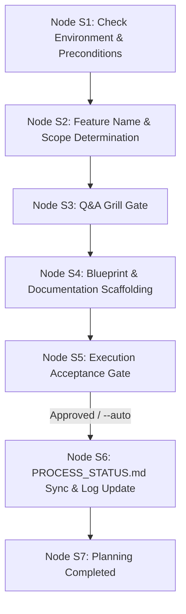

# Guard Specification: Interactive Planning (/plan)

This document serves as the authoritative baseline specification for the `/plan` workflow in the **Guards Framework**. It governs how AI agents interactively create, maintain, and structure token-optimized, agent-ready 5-phase blueprint documentation and technical specifications before implementation begins.

---

## 1. General Introduction & Core Objectives

The `/plan` workflow is the architectural bridge between initial workspace setup (`/init` / `/process-history`) and code implementation (`/implement`). It transforms project requirements into structured, unambiguous 5-Phase Blueprints and technical specifications.

### Goal of the Workflow
The primary goal of `/plan` is to guide human developers and AI agents through a stateful planning lifecycle, producing feature-isolated design documents that define **what** to implement, **how** it should be structured, **how** it will be verified, and **how** it will be deployed.

### Universal Design vs. Environment Implementation
- **Universal Design Specifications (Tier 2 - Platform-Agnostic)**:
  - [summary.md](file:///Users/horvathgergo/Desktop/agent-driven-templates/fullstack_software_dev/summary.md): Central framework sitemap and operational lifecycle.
  - [grill_engine.md](file:///Users/horvathgergo/Desktop/agent-driven-templates/fullstack_software_dev/grill_engine.md): Interactive Q&A interview engine rules.
  - [process_handling.md](file:///Users/horvathgergo/Desktop/agent-driven-templates/fullstack_software_dev/process_handling.md): Process status matrix and release governance rules.
  - [plan_workflow.md](file:///Users/horvathgergo/Desktop/agent-driven-templates/fullstack_software_dev/plan/plan_workflow.md) (*This Document*): Core `/plan` state machine design, boundary rules, and execution reasoning.
- **Environment-Specific Execution Guidelines (Tier 3 - Antigravity)**:
  - `antigravity/plan_implementation_map.md`: Antigravity-specific execution roadmap using native primitives (**rules, skills, workflows, templates, hooks**).
  - `antigravity/plan_tests.md`: Verification test suite for `/plan` execution.

---

## 2. Core Architectural Principles & Boundary Rules

### A. Workflow Preconditions Rule
1. **`/init` is Mandatory**: `/init` (or `/init --feature <name>` / `/init --release <v>`) **must** have been executed prior to running `/plan`. `/init` establishes Git branches, provisions root `.agents/` control structures, and scaffolds the initial architectural baseline (`phase-1-summary.md`).
2. **`/process-history` is Optional**: For brownfield codebases, `/process-history` runs historical analysis and drafts `restructure-proposal.md`. When present, `/plan` reads and incorporates its structural refactoring findings into the feature blueprints.

### B. Feature Isolation Architecture (`.agents/plans/<feature-name>/`)
To prevent documentation collisions during parallel feature development or multi-release management, `/plan` enforces **Feature Isolation**:
- Every feature initiative operates within a dedicated directory pair:
  - **`.agents/plans/<feature-name>/`** (holds feature process matrix, grill logs, and 5-phase blueprints)
  - **`docs/<feature-name>/`** (holds feature-specific technical diagrams, OpenAPI/Proto schemas, UI wireframes)
- **Feature Name Determination**:
  1. Auto-detected from active Git branch (e.g. branch `feature/user-auth` $\rightarrow$ `<feature-name>` = `user-auth`).
  2. Passed explicitly via command argument (e.g. `/plan --feature user-auth` or `/plan user-auth`).
  3. Read from active `PROCESS_STATUS.md` header initialized during `/init --feature <name>`.

### C. Playground & Filesystem Boundary Guard Rule
The `/plan` workflow enforces a strict write sandbox:
- **Allowed Playground**: All write, edit, create, and delete actions are **strictly restricted** to:
  - `.agents/plans/<feature-name>/` (and subfolders)
  - `docs/<feature-name>/` (and subfolders)
- **Forbidden Actions**: `/plan` is **strictly prohibited** from modifying source code files (`src/`, `codebase-*/`), root container configs, or system files outside `.agents/plans/<feature-name>/` and `docs/<feature-name>/`. Code implementation is explicitly decoupled into `/implement`.

### D. Scope-Driven Dynamic Phase Selection Rule
Not all features require all 5 blueprint documents. Active project layers (determined in `/init` Q7 or `/plan` Node S2) dynamically dictate which phase blueprints are generated:

| Phase Blueprint | Document Path | Core Contents | Scope Determination Rule |
| :--- | :--- | :--- | :--- |
| **Phase 1: Architecture & Vision** | `.agents/plans/<feature-name>/phase-1-summary.md` | Feature vision, layer skeleton map, tech stack, architectural rules. | **Mandatory for all features** (`[x] Done`). |
| **Phase 2: Design System & Layout** | `.agents/plans/<feature-name>/phase-2-layout.md` | UI views, component hierarchy, design tokens, styling strategy. Supporting specs in `docs/<feature-name>/ui/`. | Active when `frontend`, `web`, or `UI` scope is enabled; otherwise `[-] Not In Scope`. |
| **Phase 3: Core Engine & Data** | `.agents/plans/<feature-name>/phase-3-engine.md` | Domain logic, DTO mappers, API contracts, DB models. Supporting specs in `docs/<feature-name>/api/`. | Active when `backend`, `engine`, `API`, or `database` scope is enabled; otherwise `[-] Not In Scope`. |
| **Phase 4: Verification & Testing** | `.agents/plans/<feature-name>/phase-4-verification.md` | Test runners, unit/integration/E2E test suites, mock contracts, verification rules. | **Mandatory for all executable features**. |
| **Phase 5: Docker & Operations** | `.agents/plans/<feature-name>/phase-5-operation.md` | Dockerfiles, Compose profiles, environment variables, CI/CD pipelines. | Active when containerized/deployed environment is enabled; otherwise `[-] Not In Scope`. |

---

## 3. Directory Layout & Document Hierarchy

```text
.agents/plans/<feature-name>/
├── PROCESS_STATUS.md           # Feature-specific status matrix & execution history log
├── GRILL_STATUS.md             # Stateful Q&A interview transcript log
├── phase-1-summary.md          # Phase 1: High-Level Architecture & Vision Summary
├── phase-2-layout.md          # Phase 2: Design System & Layout Laws (if in scope)
├── phase-3-engine.md          # Phase 3: Core Engine & Data Mappers (if in scope)
├── phase-4-verification.md    # Phase 4: Verification & Test Specifications
└── phase-5-operation.md       # Phase 5: Docker, Compose & CI/CD Operations (if in scope)

docs/<feature-name>/
├── architecture/               # Technical architecture diagrams & component flowcharts
├── api/                        # OpenAPI specifications, Proto files, DTO schemas
└── ui/                         # Wireframes, layout boundaries, design system tokens
```

---

## 4. Detailed Step-by-Step State Machine Design

Execution of the `/plan` workflow follows a strict 7-node sequential state machine:



### State Machine Execution & Transition Rules
1. **Sequential Linearity**: Step execution is strictly linear (S1 $\rightarrow$ S2 $\rightarrow$ S3 $\rightarrow$ S4 $\rightarrow$ S5 $\rightarrow$ S6 $\rightarrow$ S7). No node may be bypassed out of sequence.
2. **Precondition Halted State**: If S1 fails (e.g. `/init` was not executed, `.agents/` missing), execution halts immediately with instructions to run `/init` first.
3. **Resume & Audit State**: If interrupted, the agent reads `.agents/plans/<feature-name>/GRILL_STATUS.md` and `PROCESS_STATUS.md` to resume without re-prompting answered questions.

---

### Step Descriptions & Implementation Reasoning

#### Step 1: Check Environment & Preconditions (Node S1)
* **Description**: Verifies that workspace initialization was completed by checking for `.agents/` and active Git branch state. Asserts system prerequisites (Docker daemon status).
* **Reasoning**: Running `/plan` without `/init` causes fragmented workspace paths. Halting early enforces framework compliance.
* **Storage Actions**: Reads `.agents/plans/PROCESS_STATUS.md` or git branch metadata.

#### Step 2: Feature Name & Scope Determination (Node S2)
* **Description**: Resolves `<feature-name>` from Git branch or user input, provisions `.agents/plans/<feature-name>/` and `docs/<feature-name>/` directories, and determines active layer scope (Frontend, Backend, Library, Ops).
* **Reasoning**: Setting feature boundaries up front isolates documentation and determines which Phase 2–5 blueprints are required vs `[-] Not In Scope`.
* **Storage Actions**: Initializes `.agents/plans/<feature-name>/` directory structure.

#### Step 3: Q&A Grill Gate (Node S3)
* **Description**: Executes stateful, chunked Q&A interview governed by [grill_engine.md](file:///Users/horvathgergo/Desktop/agent-driven-templates/fullstack_software_dev/grill_engine.md) for active phase blueprints.
* **Rules**:
  - Max 2 questions per turn to avoid cognitive overload.
  - Present options neutrally without recommended bias. Mandatory free-text option (`Other / Free-text (...)`).
  - Automatically skip questions for `[-] Not In Scope` phases.
* **Storage Actions**: Records full transcript continuously into `.agents/plans/<feature-name>/GRILL_STATUS.md`.

#### Step 4: Blueprint & Documentation Scaffolding (Node S4)
* **Description**: Drafts active 5-phase blueprint documents (`phase-1-summary.md` to `phase-5-operation.md`) under `.agents/plans/<feature-name>/` and supporting specs under `docs/<feature-name>/`.
* **Rules**: Strictly respects the Playground Boundary rule (writing ONLY to `.agents/plans/<feature-name>/` and `docs/<feature-name>/`).
* **Storage Actions**: Deploys populated phase blueprints and technical documentation.

#### Step 5: Execution Acceptance Gate (Node S5)
* **Description**: Synthesizes the generated 5-phase plan into an Execution Acceptance Summary, presenting the complete blueprint roadmap for developer approval.
* **Execution Modes**:
  - **Interactive Mode (Default)**: Waits for user approval (`1. Approve Plan & Proceed` / `2. Modify Parameters`).
  - **Automated Mode (`--auto`)**: Logs summary to `GRILL_STATUS.md` and transitions directly to Node S6.
* **Storage Actions**: Appends acceptance status to `GRILL_STATUS.md`.

#### Step 6: PROCESS_STATUS.md Sync & Log Update (Node S6)
* **Description**: Synchronizes `.agents/plans/<feature-name>/PROCESS_STATUS.md`. Updates Block 1 Workflow Execution Matrix (marking `/plan` and active phase sub-rows as `[x] Done`, out-of-scope sub-rows as `[-] Not In Scope`), and appends a datestamped entry to Block 2 History.
* **Storage Actions**: Writes updated `PROCESS_STATUS.md`.

#### Step 7: Planning Completed (Node S7)
* **Description**: Displays completion report with file links to all generated blueprints and instructions to initiate `/implement`.
* **Storage Actions**: Final state transition complete.

---

## 5. Knowledge Consumption & Inter-Workflow Data Flow

```mermaid
graph LR
    subgraph Inputs [Upstream Inputs]
        InitOut["/init Output<br/>• phase-1-summary.md<br/>• GRILL_STATUS.md"]
        HistOut["/process-history Output<br/>(Brownfield)<br/>• restructure-proposal.md"]
    end

    subgraph PlanWorkflow [/plan Workflow Sandbox]
        S2_Scope["Node S2: Scope & Feature Resolution"]
        S3_Grill["Node S3: Grill Engine"]
        S4_Draft["Node S4: Draft Blueprints & Docs"]
    end

    subgraph Outputs [Downstream Outputs]
        PlanOut[".agents/plans/<feature-name>/<br/>• PROCESS_STATUS.md<br/>• phase-1-summary.md<br/>• phase-2-layout.md<br/>• phase-3-engine.md<br/>• phase-4-verification.md<br/>• phase-5-operation.md"]
        DocsOut["docs/<feature-name>/<br/>• architecture/<br/>• api/<br/>• ui/"]
    end

    InitOut --> S2_Scope
    HistOut --> S2_Scope
    S2_Scope --> S3_Grill --> S4_Draft
    S4_Draft --> PlanOut
    S4_Draft --> DocsOut
```

---

## 6. Summary of Guard Elements for `/plan`

1. **Precondition Guard**: Halts execution if `.agents/` or `/init` baseline is missing.
2. **Boundary Guard**: Restricts write actions strictly to `.agents/plans/<feature-name>/` and `docs/<feature-name>/`. Prohibits source code modification during `/plan`.
3. **Scope Guard**: Evaluates active layers to bypass irrelevant phase questions and mark out-of-scope phase sub-rows as `[-] Not In Scope`.
4. **Grill State Engine**: Governed by `grill_engine.md`, auto-saving interview progress into `.agents/plans/<feature-name>/GRILL_STATUS.md`.
5. **Process Guard**: Governed by `process_handling.md`, maintaining Block 1 matrix and Block 2 datestamped execution history in `PROCESS_STATUS.md`.
