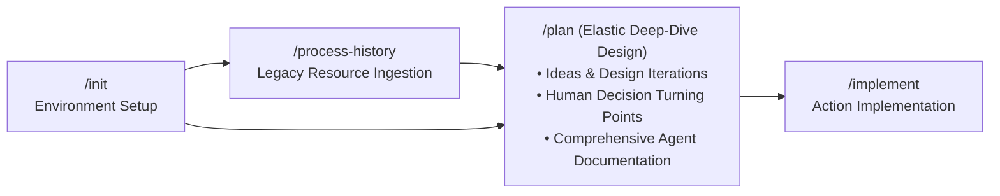
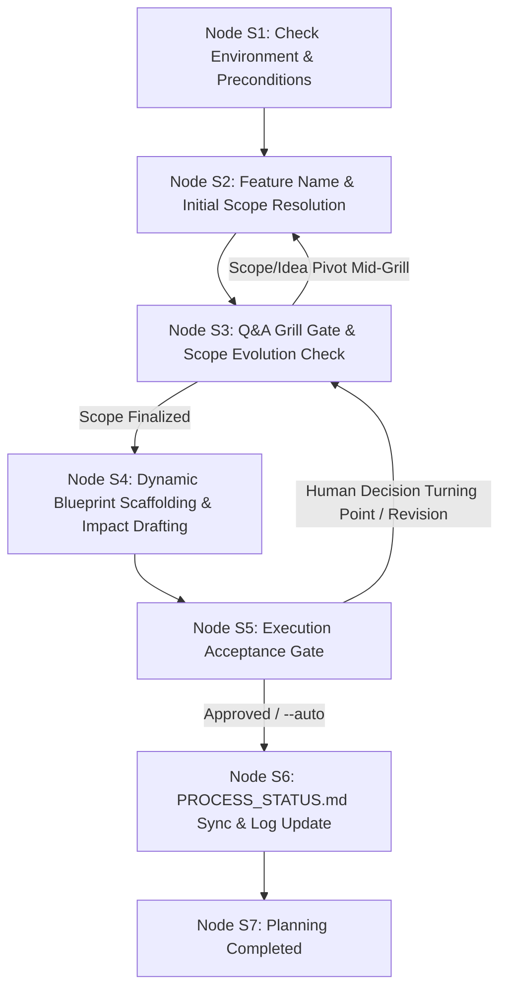

# Guard Specification: Interactive Planning (/plan)

This document serves as the authoritative baseline specification for the `/plan` workflow in the **Guards Framework**. It governs how AI agents interactively create, maintain, and structure token-optimized, agent-ready 5-phase blueprint documentation and technical specifications before implementation begins.

---

## 1. General Introduction & Core Philosophy

The `/plan` workflow is the architectural bridge between environment setup (`/init` / `/process-history`) and code implementation (`/implement`). It transforms raw ideas, feature requirements, and historical context into structured, unambiguous 5-Phase Blueprints and technical specifications.



### The Elastic Character of `/plan`
Unlike strict operational execution workflows, **`/plan` is the most elastic phase of the framework**:
- **Iterative Idea Exploration**: Accommodates evolving ideas, design alternatives, and architectural explorations.
- **Human Decision Turning Points**: Serves as the interactive forum where human developers make strategic design choices and turning-point decisions.
- **Upstream Foundation**:
  - **`/init`**: Sets up the agentic, software (Docker sandboxes), and folder environment boundaries.
  - **`/process-history`**: Ingests and processes existing documentation, legacy code, and historical resources related to the feature scope.
  - Once `/init` and `/process-history` complete, the agent and developer dive deep into feature design.
- **Comprehensive Agent Specs**: During `/plan`, all documentation needed for downstream AI agents (in `/implement`, `/verify`, and `/release`) is designed and written so code implementation proceeds deterministically without ambiguity.

### Universal Design vs. Environment Implementation
- **Universal Design Specifications (Tier 2 - Platform-Agnostic)**:
  - [summary.md](file:///Users/horvathgergo/Desktop/agent-driven-templates/fullstack_software_dev/summary.md): Central framework sitemap and operational lifecycle.
  - [grill_engine.md](file:///Users/horvathgergo/Desktop/agent-driven-templates/fullstack_software_dev/grill_engine.md): Interactive Q&A interview engine rules.
  - [process_handling.md](file:///Users/horvathgergo/Desktop/agent-driven-templates/fullstack_software_dev/process_handling.md): Process status matrix and release governance rules.
  - [code_graph_taxonomy.md](file:///Users/horvathgergo/Desktop/agent-driven-templates/fullstack_software_dev/code_graph_taxonomy.md): Code graph structure and taxonomy specification.
  - [plan_workflow.md](file:///Users/horvathgergo/Desktop/agent-driven-templates/fullstack_software_dev/plan/plan_workflow.md) (*This Document*): Core `/plan` state machine design, boundary rules, and execution reasoning.
- **Environment-Specific Execution Guidelines (Tier 3 - Antigravity)**:
  - `antigravity/plan_implementation_map.md`: Antigravity-specific execution roadmap using native primitives (**rules, skills, workflows, templates, hooks**).
  - `antigravity/plan_tests.md`: Verification test suite for `/plan` execution.

---

## 2. Core Architectural Principles & Boundary Rules

### A. Workflow Preconditions & Pipeline Handoff
1. **`/init` is Mandatory**: `/init` (or `/init --feature <name>` / `/init --release <v>`) **must** have been executed prior to running `/plan`. `/init` establishes Git branches, provisions root `.agents/` control structures, and scaffolds the initial architectural baseline (`phase-1-summary.md`).
2. **`/process-history` is Optional**: For brownfield codebases, `/process-history` ingests legacy documentation and code history, drafting `restructure-proposal.md`. When present, `/plan` reads and incorporates these findings into the feature blueprints.

### B. Dynamic Blueprint Lifecycle & Iterative Scope Evolution
Feature designs within `.agents/plans/<feature-name>/` can relate to **isolated parts of the system** or **the entire system**. Consequently, blueprint generation follows a dynamic, evolving method:

1. **Variable Phase Count**: A feature may contain all 5 phase blueprint documents (`phase-1-summary.md` through `phase-5-operation.md`) or only a relevant subset (e.g. `phase-1-summary.md` + `phase-3-engine.md`).
2. **Elastic Mid-Planning Scope Evolution**: **The number of active `phase-*.md` files and their defined scope can dynamically change and evolve *during* the planning phase**.
   - As Q&A Grill sessions unfold, ideas mutate, or human turning-point decisions are made, new phase blueprints can be introduced or existing ones marked as `[-] Not In Scope`.
   - The workflow dynamically creates or removes phase blueprint files and updates the `PROCESS_STATUS.md` matrix accordingly throughout the planning session.

### C. System-Wide Documentation Taxonomy & Resource Separation
The Guards Framework strictly decouples theoretical design intent, system-wide feature summaries, and implementation-level structural code graphs:

1. **`plans/<feature-name>/` (Feature Design & Impact Sandbox - Written during `/plan`)**:
   - Contains feature-specific creational or modification design blueprints (active subset of Phases 1–5).
   - **System Impact Analysis**: Explicitly documents the aftermath and impact of the new/modified feature on the system's **existing processes, interfaces, and features** (whether affecting partial modules or the whole system).
2. **`docs/` (General System Documentation - Written during `/implement`)**:
   - Contains general system-wide documentation describing all active features across the entire system.
   - Maintained and updated during `/implement` when code changes are completed.
3. **`codebase-*/code_graph/` or `src/*/code_graph/` (Inner Structural Code Maps - Written during `/implement`)**:
   - Contains AST-level taxonomy, component call graphs, DTO schemas, and class/module dependency graphs detailing the inner structure of the source code.
   - Built and maintained during `/implement` using [code_graph_taxonomy.md](file:///Users/horvathgergo/Desktop/agent-driven-templates/fullstack_software_dev/code_graph_taxonomy.md).

### D. Feature Isolation Architecture (`.agents/plans/<feature-name>/`)
To support clean multi-feature development without documentation collisions, `/plan` operates strictly in feature subfolders:
- **Directory Location**: **`.agents/plans/<feature-name>/`**
- **Feature Name Determination**:
  1. Auto-detected from active Git branch (e.g. branch `feature/user-auth` $\rightarrow$ `<feature-name>` = `user-auth`).
  2. Passed explicitly via command argument (e.g. `/plan --feature user-auth` or `/plan user-auth`).
  3. Read from active `PROCESS_STATUS.md` header initialized during `/init --feature <name>`.

### E. Workspace & Filesystem Boundary Guard Rule
The `/plan` workflow enforces a strict write sandbox:
- **Allowed Workspace**: All write, edit, create, and delete actions are **strictly restricted to**:
  - **`.agents/plans/<feature-name>/`** (and all its subfolders)
- **Forbidden Actions**: `/plan` is **strictly prohibited** from modifying general system documentation in `docs/`, code graphs in `src/*/code_graph/`, or source code files (`src/`, `codebase-*/`). General system documentation updates and code graph generation are explicitly deferred to `/implement`.

### F. Dynamic Phase Reference Matrix

| Phase Blueprint | Document Path | Core Contents & System Impact Scope | Dynamic Scope Determination Rule |
| :--- | :--- | :--- | :--- |
| **Phase 1: Architecture & Vision** | `.agents/plans/<feature-name>/phase-1-summary.md` | Feature vision, system coverage (partial vs. full), tech stack, architectural rules, and **System Impact Analysis on existing features**. | **Mandatory baseline for all features** (`[x] Done`). |
| **Phase 2: Design System & Layout** | `.agents/plans/<feature-name>/phase-2-layout.md` | UI views, component hierarchy, design tokens, styling strategy, and UI layout integration. | Created/updated when UI/layout scope is active; `[-] Not In Scope` if UI is unaffected. Can be added mid-planning. |
| **Phase 3: Core Engine & Data** | `.agents/plans/<feature-name>/phase-3-engine.md` | Domain logic, DTO mappers, API contracts, DB models, and **Inter-Feature Data Flow & API Impact**. | Created/updated when engine/data scope is active; `[-] Not In Scope` if backend is unaffected. Can be added mid-planning. |
| **Phase 4: Verification & Testing** | `.agents/plans/<feature-name>/phase-4-verification.md` | Test runners, unit/integration/E2E test suites, mock contracts, and regression test specs. | Created/updated for executable scopes. |
| **Phase 5: Docker & Operations** | `.agents/plans/<feature-name>/phase-5-operation.md` | Dockerfiles, Compose profiles, environment variables, CI/CD pipelines, and infrastructure deployment impact. | Created/updated when ops/container scope is active; `[-] Not In Scope` if deployment is unaffected. Can be added mid-planning. |

---

## 3. Directory Layout & Document Hierarchy

```text
.agents/plans/<feature-name>/
├── PROCESS_STATUS.md           # Feature status matrix (dynamically updated active phase rows) & execution log
├── GRILL_STATUS.md             # Stateful Q&A interview transcript log
├── phase-1-summary.md          # Phase 1: Architecture, System Coverage (Partial/Full) & System Impact
├── phase-2-layout.md          # Phase 2: Design System & Layout Laws (dynamically included if in scope)
├── phase-3-engine.md          # Phase 3: Core Engine, API Contracts & Inter-Feature Data Mappers (dynamically included if in scope)
├── phase-4-verification.md    # Phase 4: Test Specifications & Regression Test Suite (dynamically included if in scope)
└── phase-5-operation.md       # Phase 5: Docker, Compose & CI/CD Operations (dynamically included if in scope)
```

---

## 4. Detailed Step-by-Step State Machine Design

Execution of the `/plan` workflow follows a strict 7-node sequential state machine with an **iterative loop** allowing scope expansion and human decision turning points during planning:



---

### Step Descriptions & Implementation Reasoning

#### Step 1: Check Environment & Preconditions (Node S1)
* **Description**: Verifies workspace initialization (`.agents/` and active Git branch state). Asserts Docker engine status.
* **Storage Actions**: Reads `.agents/plans/PROCESS_STATUS.md` or git branch metadata.

#### Step 2: Feature Name & Scope Resolution (Node S2)
* **Description**: Resolves `<feature-name>` from Git branch or command argument, provisions `.agents/plans/<feature-name>/`, and evaluates initial system coverage (partial module vs. full system) to determine active phase set.
* **Storage Actions**: Initializes `.agents/plans/<feature-name>/` directory structure.

#### Step 3: Q&A Grill Gate & Scope Evolution Check (Node S3)
* **Description**: Executes stateful Q&A interview governed by [grill_engine.md](file:///Users/horvathgergo/Desktop/agent-driven-templates/fullstack_software_dev/grill_engine.md).
* **Scope Evolution Rule**: If during Q&A new requirements surface or human turning points occur, Node S3 **dynamically adds or adjusts phase blueprints** in the active phase set and asks relevant follow-up questions.
* **Storage Actions**: Updates `.agents/plans/<feature-name>/GRILL_STATUS.md`.

#### Step 4: Dynamic Blueprint Scaffolding & Impact Drafting (Node S4)
* **Description**: Drafts active phase blueprint documents (`phase-1-summary.md` and active phase subset) under `.agents/plans/<feature-name>/`, documenting feature design, partial vs full system coverage, and system impact analysis.
* **Rules**: Strictly respects the Workspace Boundary rule (writing ONLY to `.agents/plans/<feature-name>/`).
* **Storage Actions**: Deploys/updates populated phase blueprint files.

#### Step 5: Execution Acceptance Gate (Node S5)
* **Description**: Synthesizes the generated blueprint set into an Execution Acceptance Summary for developer review.
* **Human Decision Turning Point**: If developer requests scope or design pivots, execution loops back to Node S3 to refine phase blueprints.
* **Storage Actions**: Appends acceptance status to `GRILL_STATUS.md`.

#### Step 6: PROCESS_STATUS.md Sync & Log Update (Node S6)
* **Description**: Synchronizes `.agents/plans/<feature-name>/PROCESS_STATUS.md`. Updates Block 1 matrix sub-rows to reflect the final active phase set (`[x] Done` for active, `[-] Not In Scope` for unneeded), and appends datestamped entry to Block 2.
* **Storage Actions**: Writes updated `PROCESS_STATUS.md`.

#### Step 7: Planning Completed (Node S7)
* **Description**: Displays completion report listing generated phase blueprints and instructions to proceed to `/implement`.
* **Storage Actions**: Final state transition complete.

---

## 5. Knowledge Consumption & Lifecycle Deferred Operations

```mermaid
graph TD
    subgraph Phase1_Plan [/plan Workflow Sandbox]
        InitIn["/init Output<br/>(phase-1-summary.md)"] --> S2_Plan["Node S2-S4: Elastic Deep-Dive Design & System Impact Analysis"]
        HistIn["/process-history Output<br/>(restructure-proposal.md)"] --> S2_Plan
        S2_Plan --> PlanOut[".agents/plans/<feature-name>/<br/>• PROCESS_STATUS.md<br/>• phase-1-summary.md<br/>• Dynamic phase-*.md subset"]
    end

    subgraph Phase2_Implement [/implement Workflow Sandbox]
        PlanOut --> ImpExec["Code Scaffolding & Verification"]
        ImpExec --> DocsGen["General System Docs<br/>(docs/)"]
        ImpExec --> GraphGen["Inner Structural Code Graphs<br/>(src/*/code_graph/)"]
    end
```

---

## 6. Summary of Guard Elements for `/plan`

1. **Precondition Guard**: Halts execution if `.agents/` or `/init` baseline is missing.
2. **Elastic Design Guard**: Governs iterative human decision turning points, design pivots, and idea explorations during planning.
3. **Boundary Guard**: Restricts write actions strictly to `.agents/plans/<feature-name>/`. Prohibits modifying `docs/`, `src/*/code_graph/`, or source code during `/plan`.
4. **Dynamic Blueprint Lifecycle Guard**: Allows the phase blueprint set (`phase-*.md`) and feature scope (partial vs. full system) to dynamically expand, shrink, or evolve during planning.
5. **Documentation Taxonomy Guard**: Decouples feature design & impact (`plans/<feature-name>/`) from general system docs (`docs/`) and inner code structure (`code_graph/`).
6. **System Impact Guard**: Enforces explicit documentation of feature aftermath/impact on existing system features.
7. **Grill State Engine**: Governed by `grill_engine.md`, auto-saving interview progress into `.agents/plans/<feature-name>/GRILL_STATUS.md`.
8. **Process Guard**: Governed by `process_handling.md`, maintaining Block 1 matrix and Block 2 datestamped execution history in `PROCESS_STATUS.md`.
