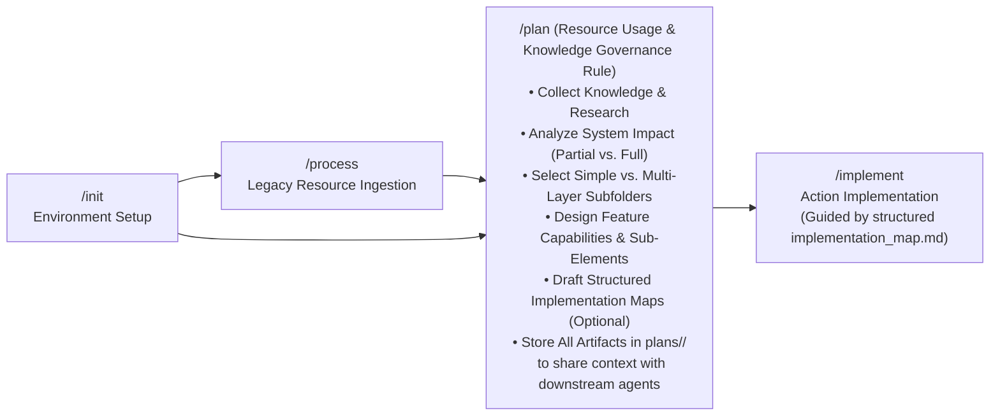

# Guard Specification: Interactive Planning (/plan)

This document serves as the authoritative baseline specification for the `/plan` workflow in the **Guards Framework**. It governs how AI agents interactively create, maintain, and structure token-optimized, agent-ready 5-phase blueprint documentation, knowledge summaries, decision-supporting artifacts, and structured implementation maps before code execution begins.

---

## 1. General Introduction & Core Philosophy

The `/plan` workflow is the architectural bridge between environment setup (`/init` / `/process`) and code implementation (`/implement`). It transforms raw ideas, feature requirements, and historical context into structured, unambiguous Phase Blueprints, research summaries, decision matrices, and structured implementation roadmaps.



### Core Philosophy: `/plan` as a Resource Usage & Knowledge Governance Rule
Fundamentally, **the `/plan` workflow is a governed rule for resource usage and knowledge collection**:
- **Knowledge Collection & Analysis**: During `/plan`, the developer and AI agent collect research, analyze system impact, explore design alternatives, and capture strategic decisions for a new or modified system capability.
- **Context Sharing for Downstream Agents**: The overarching goal of storing all blueprints, topic summaries, ADRs, and implementation maps strictly inside `.agents/plans/<feature-name>/` is **to share complete, unambiguous context with AI agents in downstream phases** (`/implement`, `/verify`, `/release`).
- **Initial Feature Understanding Summary First**: Every `/plan` execution begins with the agent summarizing its initial understanding of the feature (synthesizing `/init`, `/process`, and user prompt context) before any questions are asked.
- **Affected System, Blueprint & Subfolder Identification Q&A**: Following the summary, the interactive Q&A session starts. Its primary goals are to pinpoint **which parts of the system are affected**, determine **which specific `phase-*.md` documents must be created**, and evaluate **whether a multi-layer subfolder structure is needed**.
- **Default Simplicity vs. On-Demand Subfolders**: Simple features follow the basic flat 5 `phase-*.md` document structure inside `.agents/plans/<feature-name>/`. Complex features with multiple layers (web + mobile app UIs, multiple APIs, databases) use top-level `phase-*.md` files as **governors** and create subfolders under `.agents/plans/<feature-name>/sub_elements/` for sub-layer designs.
- **All Planning Artifacts Placed in `plans/<feature-name>/`**: **EVERY document created or modified during `/plan`**—including 5-phase blueprints, topic knowledge summaries, architecture decision records (ADRs), trade-off analyses, and structured implementation maps—MUST be placed inside `.agents/plans/<feature-name>/`.
- **Iterative & Elastic Character**: Accommodates evolving ideas, mid-planning sub-element discovery, design alternatives, and strategic human decision turning points.

### Universal Design vs. Environment Implementation
- **Universal Design Specifications (Tier 2 - Platform-Agnostic)**:
  - [summary.md](file:///Users/horvathgergo/Desktop/agent-driven-templates/fullstack_software_dev/summary.md): Central framework sitemap and operational lifecycle.
  - [grill_engine.md](file:///Users/horvathgergo/Desktop/agent-driven-templates/fullstack_software_dev/grill_engine.md): Interactive Q&A interview engine rules.
  - [process_handling.md](file:///Users/horvathgergo/Desktop/agent-driven-templates/fullstack_software_dev/process_handling.md): Process status matrix and release governance rules.
  - [code_graph_taxonomy.md](file:///Users/horvathgergo/Desktop/agent-driven-templates/fullstack_software_dev/code_graph_taxonomy.md): Code graph structure and taxonomy specification.
  - [implementation_map_taxonomy.md](file:///Users/horvathgergo/Desktop/agent-driven-templates/fullstack_software_dev/implementation_map_taxonomy.md): Implementation map structure and schema specification.
  - [plan_workflow.md](file:///Users/horvathgergo/Desktop/agent-driven-templates/fullstack_software_dev/plan/plan_workflow.md) (*This Document*): Core `/plan` state machine design, boundary rules, and execution reasoning.
  - [plan_questions.md](file:///Users/horvathgergo/Desktop/agent-driven-templates/fullstack_software_dev/plan/plan_questions.md): Interactive planning questionnaire schema and scanning rules.
- **Environment-Specific Execution Guidelines (Tier 3 - Antigravity)**:
  - `antigravity/plan_implementation_map.md`: Antigravity-specific execution roadmap using native primitives (**rules, skills, workflows, templates, hooks**).
  - `antigravity/plan_tests.md`: Verification test suite for `/plan` execution.

---

## 2. Core Architectural Principles & Boundary Rules

### A. Workflow Preconditions & Pipeline Handoff
1. **`/init` is Mandatory**: `/init` (or `/init --feature <name>` / `/init --release <v>`) **must** have been executed prior to running `/plan`. `/init` establishes Git branches, provisions root `.agents/` control structures, and scaffolds the initial architectural baseline (`phase-1-summary.md`).
2. **`/process` is Optional**: For brownfield codebases, `/process` ingests legacy documentation and code history, drafting `restructure-proposal.md`. When present, `/plan` reads and incorporates these findings into the feature blueprints.

### B. Resource Usage Governance & Strict Feature Sandbox (`.agents/plans/<feature-name>/`)
All creation, editing, research drafting, and decision documentation generated during `/plan` **MUST reside strictly inside `.agents/plans/<feature-name>/`** to serve as the single source of truth for downstream agents:

1. **5-Phase Blueprints**: `phase-1-summary.md` through `phase-5-operation.md` (active subset).
2. **Process & Interview Trackers**: `PROCESS_STATUS.md` and `GRILL_STATUS.md`.
3. **Knowledge Summaries**: Saved inside `.agents/plans/<feature-name>/knowledge/knowledge_summary_<topic>.md`.
4. **Decision-Supporting Artifacts**: Stored in `.agents/plans/<feature-name>/decisions/adr_<topic>.md`.
5. **Structured Implementation Maps**: Stored in `.agents/plans/<feature-name>/implementation_map.md` (or `.agents/plans/<feature-name>/implementation_maps/implementation_map_<scope>.md`).

### C. Multi-Layer Sub-Element Architecture & On-Demand Subfolders Rule
Complex features may encompass multiple distinct layers (e.g. web UI + mobile app UI, multiple microservice APIs, or distinct databases). The Guards Framework manages this complexity through an **on-demand hierarchy**:

1. **Default Simple Layout**: By default, features use the flat, simple 5 `phase-*.md` document structure directly inside `.agents/plans/<feature-name>/`. Subfolders are **not** created unless required.
2. **Phase Blueprints as Governors**: In complex multi-layer features:
   - Top-level `phase-*.md` documents act as **master governors / orchestrators** for the entire feature.
   - Subfolders are created under `.agents/plans/<feature-name>/sub_elements/<element_name>/` (e.g. `sub_elements/web_ui/`, `sub_elements/mobile_app/`, `sub_elements/payment_api/`).
   - Each subfolder contains sub-element design specs and phase blueprints governing that specific component.
3. **Q&A Identification & Mid-Planning Discovery**:
   - The need for multi-layer subfolders is evaluated during the Node S3 Q&A session.
   - If new sub-elements are discovered **mid-planning** as ideas evolve, the folder structure adapts dynamically to provision the necessary subfolders under `.agents/plans/<feature-name>/sub_elements/`.

### D. Structured Implementation Map & Asynchronous Execution Rule
System components can be implemented **in parallel, sequentially, or all at once**. Consequently, the workflow supports decoupled implementation planning guided by a **structured implementation map**:

1. **Structured Document Requirement**: An `implementation_map.md` is a **formal, structured document** adhering to the Tier 1 specification [implementation_map_taxonomy.md](file:///Users/horvathgergo/Desktop/agent-driven-templates/fullstack_software_dev/implementation_map_taxonomy.md) (defining target files, step-by-step scaffolding tasks, dependency sequences, verification commands, and acceptance criteria).
2. **Step-by-Step Agent Guidance**: Serves as the agent's authoritative roadmap during the `/implement` workflow.
3. **Flexible Creation Lifecycle**: An `implementation_map.md` can be created:
   - **At the end of the `/plan` phase** (via an explicit option in Node S5), OR
   - **At the beginning of the `/implement` phase**.
4. **Partial & Decoupled Scope**: It is common for one part of a system (e.g. UI layout or engine DTOs) to be fully designed and mapped for implementation while other components are still being designed. A structured implementation map can cover:
   - **A single part** of the feature (e.g. `implementation_map_layout.md` or `implementation_map_engine.md`),
   - **Multiple parts**, OR
   - **The entire feature at once** (`implementation_map_full.md`).

### E. Implementation Map Sandbox Guard (No Code Execution in `/plan`)
When the option to create a structured `implementation_map.md` is selected during `/plan`:
- **Allowed Action**: The agent identifies the target implementation scope and drafts `.agents/plans/<feature-name>/implementation_maps/implementation_map_<scope>.md` adhering to the structured implementation map schema.
- **STRICT PROHIBITION**: **ONLY the creation/drafting of the structured `implementation_map.md` document is allowed during `/plan`. NO code scaffolding, file editing in `src/` or `codebase-*/`, or actual code implementation is permitted during `/plan`!** Source code implementation remains strictly reserved for the `/implement` workflow.

### F. Dynamic Blueprint Lifecycle & Iterative Scope Evolution
Feature designs within `.agents/plans/<feature-name>/` can relate to **isolated parts of the system** or **the entire system**. Consequently, blueprint generation follows a dynamic, evolving method:

1. **Start with Feature Understanding Summary**: The workflow starts by articulating a clear summary of the planned feature capabilities.
2. **Identify Affected System Parts**: The Q&A session evaluates which system layers (Frontend, Engine, API, DB, Ops) are impacted and whether multi-layer subfolders are needed.
3. **Select Required `phase-*.md` Blueprint Set**: A feature may contain all 5 phase blueprint documents (`phase-1-summary.md` through `phase-5-operation.md`) or only a relevant subset.
4. **Elastic Mid-Planning Scope Evolution**: **The number of active `phase-*.md` files, sub-element folders, and their defined scope can dynamically change and evolve *during* the planning phase**.

### G. System-Wide Documentation Taxonomy & Resource Separation
The Guards Framework strictly decouples theoretical design intent, system-wide feature summaries, and implementation-level structural code graphs:

1. **`plans/<feature-name>/` (Feature Design, Knowledge & Impact Sandbox - Written during `/plan`)**:
   - Holds feature design blueprints, System Impact Analysis, topic knowledge summaries, decision-supporting ADRs, sub-element design folders, and structured implementation maps.
2. **`docs/` (General System Documentation - Written during `/implement`)**:
   - Contains general system-wide documentation describing all active features across the entire system.
   - Maintained and updated during `/implement` when code changes are completed.
3. **`codebase-*/code_graph/` or `src/*/code_graph/` (Inner Structural Code Maps - Written during `/implement`)**:
   - Contains AST-level taxonomy, component call graphs, DTO schemas, and class/module dependency graphs detailing the inner structure of the source code.
   - Built and maintained during `/implement` using [code_graph_taxonomy.md](file:///Users/horvathgergo/Desktop/agent-driven-templates/fullstack_software_dev/code_graph_taxonomy.md).

### H. Filesystem Boundary Guard Rule
The `/plan` workflow enforces a strict write sandbox:
- **Allowed Workspace**: All write, edit, create, and delete actions are **strictly restricted to**:
  - **`.agents/plans/<feature-name>/`** (and all its subfolders)
- **Forbidden Actions**: `/plan` is **strictly prohibited** from modifying general system documentation in `docs/`, code graphs in `src/*/code_graph/`, or source code files (`src/`, `codebase-*/`). General system documentation updates and code graph generation are explicitly deferred to `/implement`.

### I. Dynamic Phase Reference Matrix

| Phase Blueprint | Document Path | Core Contents & System Impact Scope | Dynamic Scope Determination Rule |
| :--- | :--- | :--- | :--- |
| **Phase 1: Architecture & Vision** | `.agents/plans/<feature-name>/phase-1-summary.md` | Feature vision, system coverage (partial vs. full), master architecture governor, and **System Impact Analysis**. | **Mandatory baseline for all features** (`[x] Done`). |
| **Phase 2: Design System & Layout** | `.agents/plans/<feature-name>/phase-2-layout.md` | UI views, component hierarchy, design tokens, styling strategy, and UI layout governor. | Selected during Q&A if UI/layout system is affected; `[-] Not In Scope` if UI is unaffected. |
| **Phase 3: Core Engine & Data** | `.agents/plans/<feature-name>/phase-3-engine.md` | Domain logic, DTO mappers, API contracts, DB models, and **Inter-Feature Data Flow & API Impact**. | Selected during Q&A if backend/engine/API is affected; `[-] Not In Scope` if backend is unaffected. |
| **Phase 4: Verification & Testing** | `.agents/plans/<feature-name>/phase-4-verification.md` | Master test runners, unit/integration/E2E test suites, mock contracts, and regression test specs. | Selected for executable scopes to verify affected system parts. |
| **Phase 5: Docker & Operations** | `.agents/plans/<feature-name>/phase-5-operation.md` | Dockerfiles, Compose profiles, environment variables, CI/CD pipelines, and infrastructure deployment impact. | Selected during Q&A if ops/containers are affected; `[-] Not In Scope` if deployment is unaffected. |

---

## 3. Directory Layout & Document Hierarchy

### Default Simple Layout (Baseline)
```text
.agents/plans/<feature-name>/
├── PROCESS_STATUS.md               # Feature status matrix & execution history log
├── GRILL_STATUS.md                 # Stateful Q&A interview transcript log
├── phase-1-summary.md              # Phase 1: Architecture, System Coverage (Partial/Full) & System Impact Analysis
├── phase-2-layout.md              # Phase 2: Design System & Layout Laws (dynamically created if UI is affected)
├── phase-3-engine.md              # Phase 3: Core Engine, API Contracts & Data Flow (dynamically created if engine is affected)
├── phase-4-verification.md        # Phase 4: Test Specifications & Regression Test Suite (dynamically created if in scope)
├── phase-5-operation.md           # Phase 5: Docker, Compose & CI/CD Operations (dynamically created if ops are affected)
├── knowledge/                      # Topic Knowledge Summaries & Research Notes requested during /plan
│   └── knowledge_summary_<topic>.md
├── decisions/                      # Architecture Decision Records (ADRs) & Trade-off Matrices
│   └── adr_<decision_name>.md
└── implementation_maps/            # Structured Implementation Maps drafted at end of /plan
    ├── implementation_map_layout.md   # Structured partial map for UI layout implementation
    └── implementation_map_full.md     # Structured full feature implementation map
```

### Complex Multi-Layer Layout (On-Demand / Identified during Q&A)
```text
.agents/plans/<feature-name>/
├── PROCESS_STATUS.md               # Master status matrix tracking overall and sub-element workflows
├── GRILL_STATUS.md                 # Stateful Q&A transcript
├── phase-1-summary.md              # Master Architecture & Vision Governor
├── phase-2-layout.md              # Master Design System & UI Governor
├── phase-3-engine.md              # Master Core Engine & API Contracts Governor
├── phase-4-verification.md        # Master Test & Assertion Governor
├── phase-5-operation.md           # Master Operations & Deployment Governor
├── sub_elements/                   # Sub-element design folders (created on-demand)
│   ├── web_ui/                     # Web interface layout & component specs
│   │   └── phase-2-layout.md       # Sub-element UI layout spec
│   ├── mobile_app/                 # App interface layout & view specs
│   │   └── phase-2-layout.md       # Sub-element Mobile UI spec
│   ├── auth_api/                   # Authentication API & DTO specs
│   │   └── phase-3-engine.md       # Sub-element API contract spec
│   └── inventory_db/               # Inventory Database & Schema specs
│       └── phase-3-engine.md       # Sub-element DB schema spec
├── knowledge/
└── implementation_maps/
```

---

## 4. Detailed Step-by-Step State Machine Design

Execution of the `/plan` workflow follows a strict 7-node sequential state machine starting with an initial feature summary, leading into affected system & multi-layer subfolder identification Q&A, and offering an optional Structured Implementation Map drafting gate at Node S5:

```mermaid
graph TD
    S1[Node S1: Check Environment & Preconditions] --> S2[Node S2: Initial Feature Understanding Summary]
    S2 --> S3[Node S3: Interactive Q&A Session<br/>Identify Affected System, phase-*.md Set & Subfolders]
    S3 -->|Scope/Sub-Element Discovery or Knowledge Request| S3_Docs[Draft Sub-Element Folders, Knowledge Summaries & ADRs]
    S3_Docs --> S3
    S3 -->|Affected System & Blueprint Structure Finalized| S4[Node S4: Dynamic Blueprint Scaffolding & Impact Drafting]
    S4 --> S5[Node S5: Execution Acceptance Gate & Implementation Map Option]
    S5 -->|Human Decision Turning Point / Revision| S3
    S5 -->|Option Selected: Draft Structured Implementation Map| S5_Map[Identify Map Scope & Draft structured implementation_map_<scope>.md in plans/<feature-name>/<br/>(NO CODE EDITING)]
    S5_Map --> S6
    S5 -->|Approved / --auto| S6[Node S6: PROCESS_STATUS.md Sync & Log Update]
    S6 --> S7[Node S7: Planning Completed]
```

---

### Step Descriptions & Implementation Reasoning

#### Step 1: Check Environment & Preconditions (Node S1)
* **Description**: Verifies workspace initialization (`.agents/` and active Git branch state). Asserts Docker engine status.
* **Storage Actions**: Reads `.agents/plans/PROCESS_STATUS.md` or git branch metadata.

#### Step 2: Initial Feature Understanding Summary (Node S2)
* **Description**: **As the very first action of `/plan`**, the agent synthesizes its initial understanding of the feature scope (from `/init` outputs, `/process` outputs, and initial user prompt) and presents an **Initial Feature Understanding Summary** to the developer.
* **Reasoning**: Establishing a shared understanding up front aligns the developer and agent before asking detailed Q&A questions.
* **Storage Actions**: Initializes `.agents/plans/<feature-name>/` directory structure and logs initial summary.

#### Step 3: Interactive Q&A Session - Affected System, Blueprint & Subfolder Identification (Node S3)
* **Description**: Immediately follows the initial summary. Executes stateful Q&A interview governed by [grill_engine.md](file:///Users/horvathgergo/Desktop/agent-driven-templates/fullstack_software_dev/grill_engine.md).
* **Primary Goals**:
  1. Identify **which parts of the system are affected** (Frontend, Engine, API, DB, Operations; partial sub-module vs. full system).
  2. Determine **which specific `phase-*.md` documents should be created** for this feature.
  3. Evaluate **whether multi-layer subfolders (`sub_elements/`) are required** (for complex features with multiple UIs or APIs), or if the default simple layout is sufficient.
  4. Support mid-planning discovery: if new sub-elements surface during Q&A, dynamically provision subfolders under `.agents/plans/<feature-name>/sub_elements/`.
  5. Support developer requests for **topic knowledge summaries** (`knowledge/`) or **decision-supporting ADRs** (`decisions/`).
* **Storage Actions**: Updates `.agents/plans/<feature-name>/GRILL_STATUS.md`.

#### Step 4: Dynamic Blueprint Scaffolding & Impact Drafting (Node S4)
* **Description**: Scaffolds the selected active phase blueprint documents (`phase-1-summary.md` plus identified `phase-*.md` set) and any required `sub_elements/` subfolder specs under `.agents/plans/<feature-name>/`, explicitly documenting feature design, master governors, affected system parts, and system impact analysis.
* **Rules**: Strictly respects the Workspace Boundary rule (writing ONLY to `.agents/plans/<feature-name>/`).
* **Storage Actions**: Deploys/updates populated phase blueprint files and sub-element specs.

#### Step 5: Execution Acceptance Gate & Implementation Map Option (Node S5)
* **Description**: Synthesizes the generated blueprint set into an Execution Acceptance Summary for developer review.
* **Structured Implementation Map Option**:
  - Developers can choose an explicit option: **Draft Structured Implementation Map for Ready Components**.
  - When selected, the agent identifies the target implementation scope (e.g. layout-only, engine-only, specific sub-element, or full feature) and drafts a structured `.agents/plans/<feature-name>/implementation_maps/implementation_map_<scope>.md` adhering to [implementation_map_taxonomy.md](file:///Users/horvathgergo/Desktop/agent-driven-templates/fullstack_software_dev/implementation_map_taxonomy.md).
  - **STRICT PROHIBITION**: ONLY the creation of the structured map document inside `.agents/plans/<feature-name>/` is allowed. **Zero code scaffolding or source code modification is permitted during `/plan`**.
* **Storage Actions**: Writes `implementation_map_<scope>.md` and appends acceptance status to `GRILL_STATUS.md`.

#### Step 6: PROCESS_STATUS.md Sync & Log Update (Node S6)
* **Description**: Synchronizes `.agents/plans/<feature-name>/PROCESS_STATUS.md`. Updates Block 1 matrix sub-rows to reflect active phase blueprints, sub-elements, and drafted implementation maps (`[x] Done` for active, `[-] Not In Scope` for unneeded), and appends datestamped entry to Block 2.
* **Storage Actions**: Writes updated `PROCESS_STATUS.md`.

#### Step 7: Planning Completed (Node S7)
* **Description**: Displays completion report listing generated phase blueprints, sub-element design folders, drafted structured implementation maps, and instructions to proceed to `/implement`.
* **Storage Actions**: Final state transition complete.

---

## 5. Knowledge Consumption & Lifecycle Deferred Operations

```mermaid
graph TD
    subgraph Phase1_Plan [/plan Workflow Sandbox]
        InitIn["/init Output<br/>(phase-1-summary.md)"] --> S2_Summary["Node S2: Initial Feature Understanding Summary"]
        HistIn["/process Output<br/>(restructure-proposal.md)"] --> S2_Summary
        S2_Summary --> S3_QA["Node S3: Q&A Session<br/>Identify Affected System, phase-*.md Set & Subfolders"]
        S3_QA --> S5_MapOption["Node S5: Draft Structured Implementation Map (Optional)"]
        S5_MapOption --> PlanOut[".agents/plans/<feature-name>/<br/>• PROCESS_STATUS.md<br/>• phase-1-summary.md (Governor)<br/>• Selected phase-*.md set<br/>• sub_elements/ (On-Demand Subfolders)<br/>• knowledge/ & decisions/<br/>• implementation_maps/<br/>(Structured context & map repository for downstream agents)"]
    end

    subgraph Phase2_Implement [/implement Workflow Sandbox]
        PlanOut --> ImpExec["Code Scaffolding & Verification<br/>(Guided by implementation_map_taxonomy.md schema)"]
        ImpExec --> DocsGen["General System Docs<br/>(docs/)"]
        ImpExec --> GraphGen["Inner Structural Code Graphs<br/>(src/*/code_graph/)"]
    end
```

---

## 6. Summary of Guard Elements for `/plan`

1. **Precondition Guard**: Halts execution if `.agents/` or `/init` baseline is missing.
2. **Resource Usage & Knowledge Governance Guard**: Establishes `/plan` as the governed rule for collecting, analyzing, and structuring knowledge in `.agents/plans/<feature-name>/` to share complete context with downstream AI agents.
3. **Initial Summary Mandate**: Forces `/plan` to open with an agent synthesis of feature understanding before starting Q&A.
4. **Sub-Element Hierarchy Guard**: Maintains simple flat `phase-*.md` blueprints by default, while dynamically creating `sub_elements/` subfolders for multi-layer features (web/app UIs, multiple APIs/DBs) using top-level phase docs as master governors.
5. **Structured Implementation Map Guard**: Governs the creation of formal `implementation_map_<scope>.md` files adhering to [implementation_map_taxonomy.md](file:///Users/horvathgergo/Desktop/agent-driven-templates/fullstack_software_dev/implementation_map_taxonomy.md), while strictly forbidding code execution during `/plan`.
6. **All-Documents Sandbox Guard**: Enforces that **ALL** documents generated during `/plan` (blueprints, subfolders, knowledge summaries, ADRs, trade-off matrices, implementation maps) reside strictly within `.agents/plans/<feature-name>/`.
7. **System Identification & Blueprint Selection Guard**: Directs the Q&A session to identify affected system parts and select the exact subset of `phase-*.md` documents and subfolder structures to create.
8. **Elastic Design Guard**: Governs iterative human decision turning points, design pivots, mid-planning sub-element discovery, and idea explorations during planning.
9. **Boundary Guard**: Restricts write actions strictly to `.agents/plans/<feature-name>/`. Prohibits modifying `docs/`, `src/*/code_graph/`, or source code during `/plan`.
10. **Documentation Taxonomy Guard**: Decouples feature design & impact (`plans/<feature-name>/`) from general system docs (`docs/`) and inner code structure (`code_graph/`).
11. **System Impact Guard**: Enforces explicit documentation of feature aftermath/impact on existing system features.
12. **Grill State Engine**: Governed by `grill_engine.md`, auto-saving interview progress into `.agents/plans/<feature-name>/GRILL_STATUS.md`.
13. **Process Guard**: Governed by `process_handling.md`, maintaining Block 1 matrix and Block 2 datestamped execution history in `PROCESS_STATUS.md`.
