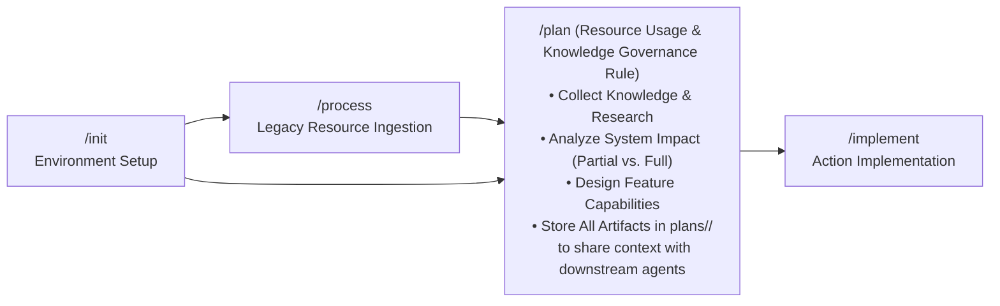
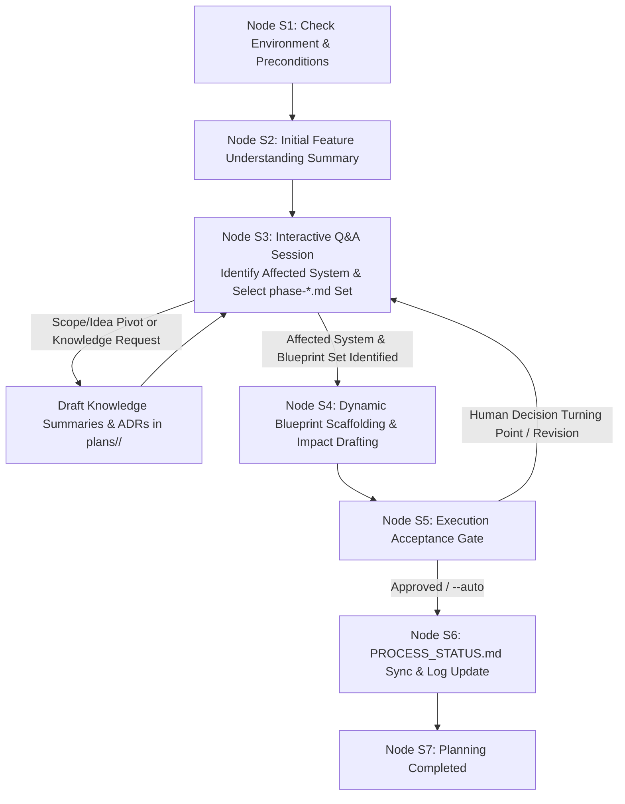

# Guard Specification: Interactive Planning (/plan)

This document serves as the authoritative baseline specification for the `/plan` workflow in the **Guards Framework**. It governs how AI agents interactively create, maintain, and structure token-optimized, agent-ready 5-phase blueprint documentation, knowledge summaries, and decision-supporting artifacts before implementation begins.

---

## 1. General Introduction & Core Philosophy

The `/plan` workflow is the architectural bridge between environment setup (`/init` / `/process`) and code implementation (`/implement`). It transforms raw ideas, feature requirements, and historical context into structured, unambiguous Phase Blueprints, research summaries, decision matrices, and technical specifications.



### Core Philosophy: `/plan` as a Resource Usage & Knowledge Governance Rule
Fundamentally, **the `/plan` workflow is a governed rule for resource usage and knowledge collection**:
- **Knowledge Collection & Analysis**: During `/plan`, the developer and AI agent collect research, analyze system impact, explore design alternatives, and capture strategic decisions for a new or modified system capability.
- **Context Sharing for Downstream Agents**: The overarching goal of storing all blueprints, topic summaries, and ADRs strictly inside `.agents/plans/<feature-name>/` is **to share complete, unambiguous context with AI agents in downstream phases** (`/implement`, `/verify`, `/release`).
- **Initial Feature Understanding Summary First**: Every `/plan` execution begins with the agent summarizing its initial understanding of the feature (synthesizing `/init`, `/process`, and user prompt context) before any questions are asked.
- **Affected System & Blueprint Identification Q&A**: Following the summary, the interactive Q&A session starts. Its primary goal is to pinpoint **which parts of the system are affected** and determine **which specific `phase-*.md` documents must be created**.
- **All Planning Artifacts Placed in `plans/<feature-name>/`**: **EVERY document created or modified during `/plan`**—including 5-phase blueprints, topic knowledge summaries, architecture decision records (ADRs), trade-off analyses, and decision matrices requested by the user—MUST be placed inside `.agents/plans/<feature-name>/`.
- **Iterative & Elastic Character**: Accommodates evolving ideas, design alternatives, and strategic human decision turning points.

### Universal Design vs. Environment Implementation
- **Universal Design Specifications (Tier 2 - Platform-Agnostic)**:
  - [summary.md](file:///Users/horvathgergo/Desktop/agent-driven-templates/fullstack_software_dev/summary.md): Central framework sitemap and operational lifecycle.
  - [grill_engine.md](file:///Users/horvathgergo/Desktop/agent-driven-templates/fullstack_software_dev/grill_engine.md): Interactive Q&A interview engine rules.
  - [process_handling.md](file:///Users/horvathgergo/Desktop/agent-driven-templates/fullstack_software_dev/process_handling.md): Process status matrix and release governance rules.
  - [code_graph_taxonomy.md](file:///Users/horvathgergo/Desktop/agent-driven-templates/fullstack_software_dev/code_graph_taxonomy.md): Code graph structure and taxonomy specification.
  - [plan_workflow.md](file:///Users/horvathgergo/Desktop/agent-driven-templates/fullstack_software_dev/plan/plan_workflow.md) (*This Document*): Core `/plan` state machine design, boundary rules, and execution reasoning.
- **Environment-Specific Execution Guidelines (Tier 3 - Antigravity)**:
  - `antigravity/plan_implementation_map.md`: Antigravity-specific execution roadmap using native primitives (**rules, skills, workflows, templates, hooks**).
  - `antigravity/plan_tests.md`: Verification test suite for `/plan` execution.

---

## 2. Core Architectural Principles & Boundary Rules

### A. Workflow Preconditions & Pipeline Handoff
1. **`/init` is Mandatory**: `/init` (or `/init --feature <name>` / `/init --release <v>`) **must** have been executed prior to running `/plan`. `/init` establishes Git branches, provisions root `.agents/` control structures, and scaffolds the initial architectural baseline (`phase-1-summary.md`).
2. **`/process` is Optional**: For brownfield codebases, `/process` ingests legacy documentation and code history, drafting `restructure-proposal.md`. When present, `/plan` reads and incorporates these findings into the feature blueprints.

### B. Resource Usage Governance & Strict Feature Sandbox (`.agents/plans/<feature-name>/`)
All creation, editing, research drafting, and decision documentation generated during `/plan` **MUST reside strictly inside `.agents/plans/<feature-name>/`** to serve as the single source of truth for downstream agents:

1. **5-Phase Blueprints**: `phase-1-summary.md` through `phase-5-operation.md` (active subset).
2. **Process & Interview Trackers**: `PROCESS_STATUS.md` and `GRILL_STATUS.md`.
3. **Knowledge Summaries**: When the user requests a research summary or deep-dive overview on a specific topic during planning, the resulting document MUST be saved inside `.agents/plans/<feature-name>/knowledge_summary_<topic>.md` (or `.agents/plans/<feature-name>/knowledge/`).
4. **Decision-Supporting Artifacts**: All decision matrices, trade-off analyses, Architecture Decision Records (ADRs), and evaluation documents requested by the user MUST be stored in `.agents/plans/<feature-name>/decisions/` or `.agents/plans/<feature-name>/decision_matrix.md`.

### C. Dynamic Blueprint Lifecycle & Iterative Scope Evolution
Feature designs within `.agents/plans/<feature-name>/` can relate to **isolated parts of the system** or **the entire system**. Consequently, blueprint generation follows a dynamic, evolving method:

1. **Start with Feature Understanding Summary**: The workflow starts by articulating a clear summary of the planned feature capabilities.
2. **Identify Affected System Parts**: The Q&A session evaluates which system layers (Frontend, Engine, API, DB, Ops) are impacted.
3. **Select Required `phase-*.md` Blueprint Set**: A feature may contain all 5 phase blueprint documents (`phase-1-summary.md` through `phase-5-operation.md`) or only a relevant subset (e.g. `phase-1-summary.md` + `phase-3-engine.md`).
4. **Elastic Mid-Planning Scope Evolution**: **The number of active `phase-*.md` files and their defined scope can dynamically change and evolve *during* the planning phase**.
   - As Q&A Grill sessions unfold, ideas mutate, or human turning-point decisions are made, new phase blueprints can be introduced or existing ones marked as `[-] Not In Scope`.
   - The workflow dynamically creates or removes phase blueprint files and updates the `PROCESS_STATUS.md` matrix accordingly throughout the planning session.

### D. System-Wide Documentation Taxonomy & Resource Separation
The Guards Framework strictly decouples theoretical design intent, system-wide feature summaries, and implementation-level structural code graphs:

1. **`plans/<feature-name>/` (Feature Design, Knowledge & Impact Sandbox - Written during `/plan`)**:
   - Holds feature design blueprints, System Impact Analysis, topic knowledge summaries, and decision-supporting ADRs.
2. **`docs/` (General System Documentation - Written during `/implement`)**:
   - Contains general system-wide documentation describing all active features across the entire system.
   - Maintained and updated during `/implement` when code changes are completed.
3. **`codebase-*/code_graph/` or `src/*/code_graph/` (Inner Structural Code Maps - Written during `/implement`)**:
   - Contains AST-level taxonomy, component call graphs, DTO schemas, and class/module dependency graphs detailing the inner structure of the source code.
   - Built and maintained during `/implement` using [code_graph_taxonomy.md](file:///Users/horvathgergo/Desktop/agent-driven-templates/fullstack_software_dev/code_graph_taxonomy.md).

### E. Filesystem Boundary Guard Rule
The `/plan` workflow enforces a strict write sandbox:
- **Allowed Workspace**: All write, edit, create, and delete actions are **strictly restricted to**:
  - **`.agents/plans/<feature-name>/`** (and all its subfolders)
- **Forbidden Actions**: `/plan` is **strictly prohibited** from modifying general system documentation in `docs/`, code graphs in `src/*/code_graph/`, or source code files (`src/`, `codebase-*/`). General system documentation updates and code graph generation are explicitly deferred to `/implement`.

### F. Dynamic Phase Reference Matrix

| Phase Blueprint | Document Path | Core Contents & System Impact Scope | Dynamic Scope Determination Rule |
| :--- | :--- | :--- | :--- |
| **Phase 1: Architecture & Vision** | `.agents/plans/<feature-name>/phase-1-summary.md` | Feature vision, system coverage (partial vs. full), tech stack, architectural rules, and **System Impact Analysis on existing features**. | **Mandatory baseline for all features** (`[x] Done`). |
| **Phase 2: Design System & Layout** | `.agents/plans/<feature-name>/phase-2-layout.md` | UI views, component hierarchy, design tokens, styling strategy, and UI layout integration. | Selected during Q&A if UI/layout system is affected; `[-] Not In Scope` if UI is unaffected. |
| **Phase 3: Core Engine & Data** | `.agents/plans/<feature-name>/phase-3-engine.md` | Domain logic, DTO mappers, API contracts, DB models, and **Inter-Feature Data Flow & API Impact**. | Selected during Q&A if backend/engine/API is affected; `[-] Not In Scope` if backend is unaffected. |
| **Phase 4: Verification & Testing** | `.agents/plans/<feature-name>/phase-4-verification.md` | Test runners, unit/integration/E2E test suites, mock contracts, and regression test specs. | Selected for executable scopes to verify affected system parts. |
| **Phase 5: Docker & Operations** | `.agents/plans/<feature-name>/phase-5-operation.md` | Dockerfiles, Compose profiles, environment variables, CI/CD pipelines, and infrastructure deployment impact. | Selected during Q&A if ops/containers are affected; `[-] Not In Scope` if deployment is unaffected. |

---

## 3. Directory Layout & Document Hierarchy

```text
.agents/plans/<feature-name>/
├── PROCESS_STATUS.md               # Feature status matrix & execution history log
├── GRILL_STATUS.md                 # Stateful Q&A interview transcript log
├── phase-1-summary.md              # Phase 1: Architecture, System Coverage (Partial/Full) & System Impact Analysis
├── phase-2-layout.md              # Phase 2: Design System & Layout Laws (dynamically created if UI is affected)
├── phase-3-engine.md              # Phase 3: Core Engine, API Contracts & Data Flow (dynamically created if engine is affected)
├── phase-4-verification.md        # Phase 4: Test Specifications & Regression Test Suite (dynamically created if in scope)
├── phase-5-operation.md           # Phase 5: Docker, Compose & CI/CD Operations (dynamically created if ops are affected)
├── knowledge/                      # Topic Knowledge Summaries & Research Notes requested during /plan
│   └── knowledge_summary_<topic>.md
└── decisions/                      # Architecture Decision Records (ADRs) & Trade-off Matrices
    └── adr_<decision_name>.md
```

---

## 4. Detailed Step-by-Step State Machine Design

Execution of the `/plan` workflow follows a strict 7-node sequential state machine starting with an initial feature summary and leading into the affected system identification Q&A session:



---

### Step Descriptions & Implementation Reasoning

#### Step 1: Check Environment & Preconditions (Node S1)
* **Description**: Verifies workspace initialization (`.agents/` and active Git branch state). Asserts Docker engine status.
* **Storage Actions**: Reads `.agents/plans/PROCESS_STATUS.md` or git branch metadata.

#### Step 2: Initial Feature Understanding Summary (Node S2)
* **Description**: **As the very first action of `/plan`**, the agent synthesizes its initial understanding of the feature scope (from `/init` outputs, `/process` outputs, and initial user prompt) and presents an **Initial Feature Understanding Summary** to the developer.
* **Reasoning**: Establishing a shared understanding up front aligns the developer and agent before asking detailed Q&A questions.
* **Storage Actions**: Initializes `.agents/plans/<feature-name>/` directory structure and logs initial summary.

#### Step 3: Interactive Q&A Session - Affected System & Blueprint Identification (Node S3)
* **Description**: Immediately follows the initial summary. Executes stateful Q&A interview governed by [grill_engine.md](file:///Users/horvathgergo/Desktop/agent-driven-templates/fullstack_software_dev/grill_engine.md).
* **Primary Goals**:
  1. Identify **which parts of the system are affected** (Frontend, Engine, API, DB, Operations; partial sub-module vs. full system).
  2. Determine **which specific `phase-*.md` documents should be created** for this feature.
  3. Support developer requests for **topic knowledge summaries** (`knowledge/`) or **decision-supporting ADRs** (`decisions/`), placing all created files inside `.agents/plans/<feature-name>/`.
* **Storage Actions**: Updates `.agents/plans/<feature-name>/GRILL_STATUS.md`.

#### Step 4: Dynamic Blueprint Scaffolding & Impact Drafting (Node S4)
* **Description**: Scaffolds the selected active phase blueprint documents (`phase-1-summary.md` plus identified `phase-*.md` set) under `.agents/plans/<feature-name>/`, explicitly documenting feature design, affected system parts, and system impact analysis.
* **Rules**: Strictly respects the Workspace Boundary rule (writing ONLY to `.agents/plans/<feature-name>/`).
* **Storage Actions**: Deploys/updates populated phase blueprint files.

#### Step 5: Execution Acceptance Gate (Node S5)
* **Description**: Synthesizes the generated blueprint set into an Execution Acceptance Summary for developer review.
* **Human Decision Turning Point**: If developer requests scope or design pivots, execution loops back to Node S3 to refine phase blueprints.
* **Storage Actions**: Appends acceptance status to `GRILL_STATUS.md`.

#### Step 6: PROCESS_STATUS.md Sync & Log Update (Node S6)
* **Description**: Synchronizes `.agents/plans/<feature-name>/PROCESS_STATUS.md`. Updates Block 1 matrix sub-rows to reflect the final active phase set (`[x] Done` for active, `[-] Not In Scope` for unneeded), and appends datestamped entry to Block 2.
* **Storage Actions**: Writes updated `PROCESS_STATUS.md`.

#### Step 7: Planning Completed (Node S7)
* **Description**: Displays completion report listing generated phase blueprints and instructions to proceed to `/implement`.
* **Storage Actions**: Final state transition complete.

---

## 5. Knowledge Consumption & Lifecycle Deferred Operations

```mermaid
graph TD
    subgraph Phase1_Plan [/plan Workflow Sandbox]
        InitIn["/init Output<br/>(phase-1-summary.md)"] --> S2_Summary["Node S2: Initial Feature Understanding Summary"]
        HistIn["/process Output<br/>(restructure-proposal.md)"] --> S2_Summary
        S2_Summary --> S3_QA["Node S3: Q&A Session & Knowledge Governance"]
        S3_QA --> PlanOut[".agents/plans/<feature-name>/<br/>• PROCESS_STATUS.md<br/>• phase-1-summary.md<br/>• Selected phase-*.md set<br/>• knowledge/ & decisions/<br/>(Complete context repository for downstream agents)"]
    end

    subgraph Phase2_Implement [/implement Workflow Sandbox]
        PlanOut --> ImpExec["Code Scaffolding & Verification"]
        ImpExec --> DocsGen["General System Docs<br/>(docs/)"]
        ImpExec --> GraphGen["Inner Structural Code Graphs<br/>(src/*/code_graph/)"]
    end
```

---

## 6. Summary of Guard Elements for `/plan`

1. **Precondition Guard**: Halts execution if `.agents/` or `/init` baseline is missing.
2. **Resource Usage & Knowledge Governance Guard**: Establishes `/plan` as the governed rule for collecting, analyzing, and structuring knowledge in `.agents/plans/<feature-name>/` to share complete context with downstream AI agents.
3. **Initial Summary Mandate**: Forces `/plan` to open with an agent synthesis of feature understanding before starting Q&A.
4. **All-Documents Sandbox Guard**: Enforces that **ALL** documents generated during `/plan` (blueprints, knowledge summaries, ADRs, trade-off matrices) reside strictly within `.agents/plans/<feature-name>/`.
5. **System Identification & Blueprint Selection Guard**: Directs the Q&A session to identify affected system parts and select the exact subset of `phase-*.md` documents to create.
6. **Elastic Design Guard**: Governs iterative human decision turning points, design pivots, and idea explorations during planning.
7. **Boundary Guard**: Restricts write actions strictly to `.agents/plans/<feature-name>/`. Prohibits modifying `docs/`, `src/*/code_graph/`, or source code during `/plan`.
8. **Documentation Taxonomy Guard**: Decouples feature design & impact (`plans/<feature-name>/`) from general system docs (`docs/`) and inner code structure (`code_graph/`).
9. **System Impact Guard**: Enforces explicit documentation of feature aftermath/impact on existing system features.
10. **Grill State Engine**: Governed by `grill_engine.md`, auto-saving interview progress into `.agents/plans/<feature-name>/GRILL_STATUS.md`.
11. **Process Guard**: Governed by `process_handling.md`, maintaining Block 1 matrix and Block 2 datestamped execution history in `PROCESS_STATUS.md`.
