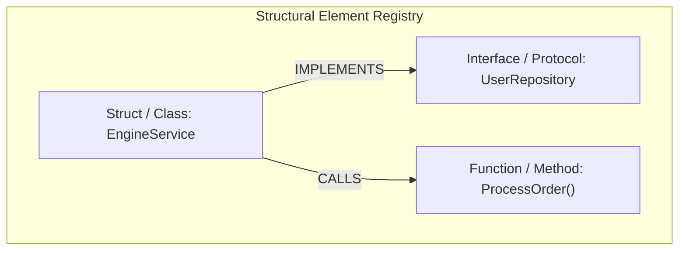

# Structural Code Graph: `<layer_name>` Layer

**Location**: `antigravity-workspace/src/<layer_name>/code_graph/graph.md`  
**Description**: Block 1 — Unordered structural dependency graph and element registry for the `<layer_name>` layer adhering to [code_graph_taxonomy.md](file:///Users/horvathgergo/Desktop/agent-driven-templates/fullstack_software_dev/code_graph_taxonomy.md).

---

## 1. Unordered Dependency Graph (Mermaid)

---

## 2. Structural Element Registry

| Element ID | Language | Node Type | File Path & Line Range | Exported / Visibility | Description & Signature |
| :--- | :--- | :--- | :--- | :--- | :--- |
| `E-001` | `[Go/Py/JS]` | `[Struct/Class/Interface]` | `[src/service/engine.go#L10-L45]` | Public | Core service component |
| `E-002` | `[Go/Py/JS]` | `[Function/Method]` | `[src/service/engine.go#L50-L85]` | Exported | Main execution handler |
