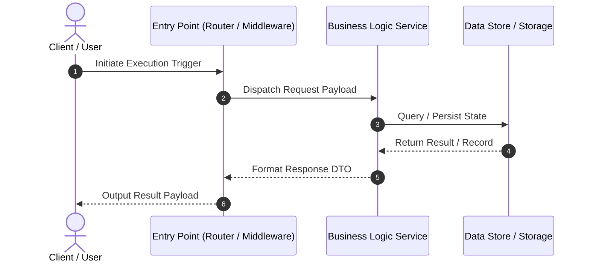

# Process Flow Analysis: `<layer_name>` Layer

**Location**: `antigravity-workspace/src/<layer_name>/code_graph/process_flow.md`  
**Description**: Block 2 (Perspective A) — Process entry points, execution triggers, and control flow initiation paths.

---

## 1. Process Entry Points

| Process ID | Entry Point Name | Trigger / Driver | File & Line Location | Target Handler / Receiver |
| :--- | :--- | :--- | :--- | :--- |
| `P-001` | `HTTP API Router` | Inbound REST Request | `[src/api/router.go#L15]` | `HandleUserRequest()` |
| `P-002` | `CLI / Cron Worker` | Scheduled Cron / Shell | `[src/cmd/worker.go#L20]` | `RunBackgroundJob()` |

---

## 2. Control Flow Initiation Paths

