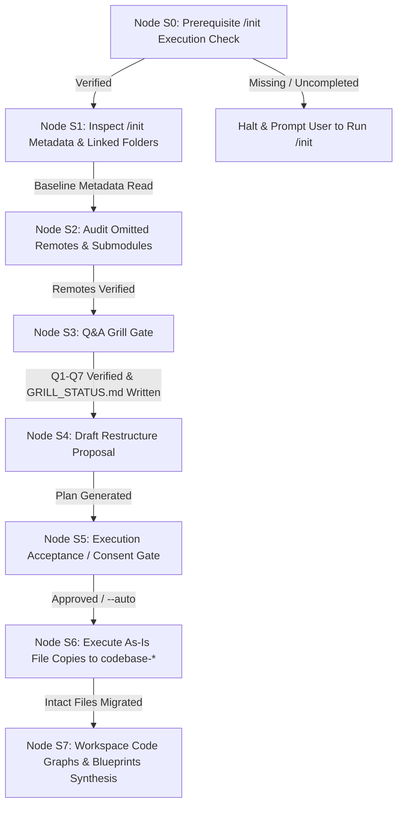

# Stateful Execution Playbook: `/process-history`

This playbook governs the step-by-step execution of the `/process-history` workflow within Google Antigravity. It transitions through nodes **S0** to **S7**, enforcing prerequisite initialization checks, read-only legacy source integrity, Q&A interview gating, restructure proposal consent, as-is file copying to `codebase-*` layers, workspace-scoped Code Graph subfolder creation (`antigravity-workspace/src/<layer>/code_graph/`), 5-phase blueprint population, and process status updates.

---

## Command Flags & Parameters

The `/process-history` workflow accepts the following CLI flags:

- `/process-history` (or `/process-history --plan`): Default interactive execution (Plan-First Mode). Runs prerequisite check, legacy audit, Q&A Grill gate, drafts `.agents/plans/restructure-proposal.md`, displays Execution Acceptance prompt for user approval, copies code as-is to `codebase-*` layers, generates workspace code graphs, and populates 5-phase blueprints.
- `/process-history --auto` (or `--apply`): Automatic execution mode. Bypasses the interactive Execution Acceptance prompt and executes all planned file migrations, code graph subfolder creation, and blueprint population automatically while recording `.agents/plans/restructure-proposal.md` as an audit log.
- `/process-history --dry-run`: Executes the workflow in preview mode. Outputs all proposed file mappings, layer destinations, Code Graph structures, and blueprint updates without writing any changes to disk.
- `/process-history --docs-only`: Extracts documentation, generates workspace Code Graph subfolders, and synthesizes 5-phase blueprints without proposing physical file migration.

---

## State Machine Execution Flow

---

### Node S0: Prerequisite `/init` Execution Check

1. **Process Status Verification**:
   - Check for `.agents/plans/PROCESS_STATUS.md` in the workspace root.
   - Read Block 1 (Workflow Execution Matrix) and verify that Row 1.0 (`/init`) is marked as `Completed`.

2. **Prerequisite Enforcement Gate**:
   - If `.agents/plans/PROCESS_STATUS.md` is missing or Row 1.0 is marked `Not Started`, halt execution immediately with error:
     > `[ERROR] The /process-history workflow requires a pre-initialized workspace. Please run /init first (or /init --feature <name>) to bootstrap workspace boundaries, layer skeletons, and process tracking before running /process-history.`

---

### Node S1: Inspect `/init` Metadata

1. **Read Architecture & Folder Map**:
   - Read `.agents/plans/phase-1-summary.md` to extract linked legacy source folder paths, configured tech stack, and target layer skeletons (`codebase-layout`, `codebase-engine`, etc.).

2. **Read-Only Integrity Check Baseline**:
   - Record MD5 checksums for all source files in linked legacy directories.
   - Enforce **Baseline 1**: Original legacy directories remain 100% untouched and read-only.

---

### Node S2: Audit Omitted Remotes & Submodules

1. **Scan Version Control Configs**:
   - Inspect `.git/config` and `.gitmodules` across linked legacy source folders for remote Git origins, submodules, and external documentation URLs.

2. **Audit Assembly**:
   - Assemble list of auto-detected remotes and submodules to present during Node S3.

---

### Node S3: Q&A Grill Gate

1. **Invoke Rule Guard**:
   - Load and execute `rules/process-history-grill.md`.

2. **Sequential Q1–Q7 Interview Execution**:
   - Prompt user sequentially through:
     * **Q1**: `/init` Baseline Review (linked legacy folders & project purpose).
     * **Q2**: Omitted Remote Sources Audit (remotes, submodules, external doc URLs).
     * **Q3**: Legacy Source-to-Layer Mapping Strategy (mapping legacy files to `codebase-*` targets).
     * **Q4**: Workspace Code Graphs & Blueprint Extraction Scope.
     * **Q5**: Execution Mode Selection (Plan-First `--plan` vs Immediate `--auto`).
     * **Q6**: As-Is Code Migration & Path Linking Strategy.
     * **Q7**: Q&A Summary Verification & Reflection.
   - Enforce **Neutral Prompting Law**: List options neutrally with zero `[Recommended]` tags and a mandatory final `Other / Free-text (...)` option.

3. **Permanent Audit Log Persistence**:
   - Write full transcript of Q1–Q7 questions, choices, and text inputs to `.agents/plans/GRILL_STATUS.md`.

---

### Node S4: Draft Restructure Proposal

1. **Generate Migration Plan**:
   - Draft `.agents/plans/restructure-proposal.md` detailing:
     * Source file paths in linked legacy directories.
     * Target layer sub-repository paths (`codebase-layout/src/`, `codebase-engine/src/`).
     * Non-destructive policy statement confirming original files remain untouched.

---

### Node S5: Execution Acceptance / Consent Gate

1. **Execution Mode Evaluation**:
   - **Plan-First Mode (`/process-history` / `--plan`)**: Present `.agents/plans/restructure-proposal.md` summary and pause for explicit developer confirmation:
     > `Do you approve the proposed legacy file migration and code graph generation plan?`
     > `1. Proceed with execution`
     > `2. Modify parameters`
     - Proceed to Node S6 if approved; halt if rejected.
   - **Immediate Execution Mode (`--auto`)**: Log summary to `.agents/plans/GRILL_STATUS.md` and proceed immediately to Node S6.

---

### Node S6: Execute As-Is File Copies to `codebase-*`

1. **Invoke Migration Skill**:
   - Execute `skills/process-history-migrator/SKILL.md`.

2. **As-Is Copy Operations & Non-Code Docs Staging**:
   - Copy legacy source code intact from linked legacy folders into target `codebase-*` layer sub-repositories (`codebase-layout/src/`, `codebase-engine/src/`).
   - **Non-Code Documentation Staging**: Copy non-code legacy documentation, supplementary assets, schemas, and diagrams into **`.agents/plans/<feature-name>/resource/`** (or `.agents/plans/resource/`) as feature reference knowledge. (Global `docs/` is reserved for already implemented system capabilities; relevant docs will be linked/promoted into `docs/` later during `/implement`).
   - **Strict Non-Rewriting Rule**: Do NOT modify, rewrite, or refactor code logic or file contents.

3. **Read-Only Verification Check**:
   - Verify MD5 checksums of original legacy files to assert zero modifications in source repositories.

---

### Node S7: Workspace Code Graphs & Blueprints Synthesis

1. **Generate Workspace Code Graph Subfolders**:
   - For each active layer, scaffold a dedicated subfolder at **`antigravity-workspace/src/<layer>/code_graph/`** (preventing doc overhead inside production `codebase-*` repos; no symlinks required).
   - Generate 4 modular files per layer adhering to `code_graph_taxonomy.md`:
     * `graph.md`: Unordered structural dependency graph & element registry (interfaces, classes, functions, entities, services based on Python, Go, or JS taxonomy).
     * `process_flow.md`: Process entry points & control flow initiation paths.
     * `data_flow.md`: Data sources (user provided, configs, APIs, DB, hardcoded) & datastream transformations.
     * `risk_analysis.md`: Coupling metrics (fan-in/fan-out), critical code nodes, & test coverage maps.

2. **Selective Blueprints Population**:
   - Synthesize identified legacy domain knowledge into relevant phase blueprint documents in `.agents/plans/<feature-name>/` (`phase-1-summary.md` through `phase-5-operation.md`).
   - *Selective Rule*: Populate ONLY the blueprints for which relevant information was identified. Filling out all 5 phase documents is optional and not mandatory.

3. **Update Process Status**:
   - Deploy/update `.agents/plans/PROCESS_STATUS.md`. Mark Row 2.0 (`/process-history`) as `Completed` in Block 1 and append datestamped entry in Block 2.

4. **Finalize State Machine**:
   - Report completion summary and recommend next command (`/plan`).
