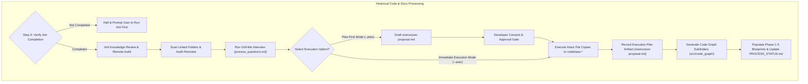

# Guard Specification: Legacy Code & Docs Processing (/process)

This document defines the requirements, design decisions, and step-by-step workflow for the `/process` command. This workflow is a dedicated, standalone playbook designed to process historical codebases, analyze legacy documentation, and execute codebase refactoring or restructuring without cluttering the `/init` workflow.

---

## 1. General Introduction & Core Objectives

The `/process` workflow is an essential component of the **Software Development Workflow Guard** for brownfield projects.

### Goal of the Workflow
The primary goal of `/process` is to analyze an existing, legacy, or unorganized codebase, extract domain knowledge into agentic blueprints, organize and copy existing files intact into the designed `codebase-*` folder structure created during `/init`, and link all previous sources into the workspace.

### Pure Migration & No Code Modification Policy
> [!IMPORTANT]
> **No Code Rewriting**: `/process` is strictly an organizational and migration workflow. It MUST NOT rewrite, refactor, or modify existing source code or logic. Code logic transformations are out of scope for `/process` and are deferred entirely to the `/plan` and `/implement` workflows.

### The Three Knowledge Inputs
The `/process` workflow synthesizes three distinct knowledge sources to construct the restructuring proposal and updated blueprints:
1. **`/init` Baseline Knowledge**: Metadata, initial linked folder paths, technology stack, layer count, and Docker configurations previously collected during `/init` (`.agents/plans/phase-1-summary.md` and `PROCESS_STATUS.md`).
2. **Grill Engine Interactive Knowledge**: Developer choices and preferences gathered during the `/process` Q&A interview (`process_questions.md`), including execution modes, layer mappings, and documentation extraction scope.
3. **Existing Codebase & Documentation Knowledge**: Deep code structures, module dependencies, API endpoints, database schemas, and architectural specs extracted directly from scanning linked legacy folders and files.

### Core Objective & Execution Scope
Based on these three knowledge sources, `/process` executes four primary operations:
- **Migrate & Organize Intact**: Copies existing source code intact into the newly created `codebase-*` sub-repository folder layout established during `/init` without code modifications.
- **Stage Non-Code Legacy Docs into Feature Resource Folder**: Copies non-code legacy documentation, supplementary assets, schemas, and diagrams into **`agent-workspace/plans/<feature-name>/resource/`** to serve as reference knowledge for the feature. (Global `docs/` is reserved for already implemented system capabilities, which will be updated later during `/implement`).
- **Link Previous Sources**: Registers and links external remote code repositories, Git submodules, and cloud documentation links into workspace project configurations and phase blueprints.
- **Selective Blueprint Population & Workspace Code Graph Generation**: Fills out relevant phase blueprint documents in `agent-workspace/plans/<feature-name>/` (filling out all 5 is optional and strictly based on relevance of identified content) and generates a dedicated **Modular Code Graph Subfolder** (`agent-workspace/src/<layer>/code_graph/`) inside the workspace layer directory containing 2 distinct analytical blocks (Unordered Graph + Multi-Perspective Analysis).

### Key Features
1. **Grill Engine Gate**: Uses a stateful, interactive interview based on [process_questions.md](file:///Users/horvathgergo/Desktop/agent-driven-templates/fullstack_software_dev/process/process_questions.md) to confirm legacy source mappings and execution strategies.
2. **`/init` Knowledge Review**: Reads and summarizes metadata previously collected during `/init` (`agent-workspace/plans/<branch_name>/phase-1-summary.md` and `PROCESS_STATUS.md`).
3. **Remote Sources & Submodules Audit**: Identifies remote code repositories, Git submodules, and external documentation sources connected to the legacy codebase that were omitted during `/init`.
4. **Dual Execution Options**: Supports both **Plan-First Mode** (generating `agent-workspace/plans/<branch_name>/restructure-proposal.md` and waiting for developer approval) and **Immediate Execution Mode** (copying files into `codebase-*` layers immediately while recording the execution plan artifact).
5. **Untouched Legacy Source & As-Is Migration Policy**: Original legacy repositories remain 100% untouched and read-only. Source code is migrated as-is into `codebase-*` sub-repositories without code modifications, while non-code documentation is staged inside `agent-workspace/plans/<feature-name>/resource/`.
6. **Selective Phase Blueprint Population**: Phase blueprints (`phase-1-summary.md` through `phase-5-operation.md`) are populated **only if relevant information is identified** in the legacy sources. Filling out all 5 blueprints is not mandatory.
7. **2-Block Modular Workspace Code Graph Subfolders**: To keep production `codebase-*` sub-repositories clean and free of documentation overhead, code graphs are built adhering to [code_graph_taxonomy.md](file:///Users/horvathgergo/Desktop/agent-driven-templates/fullstack_software_dev/code_graph_taxonomy.md) and placed exclusively inside **`agent-workspace/src/<layer>/code_graph/`** (no symlinks required), containing:
   * **Block 1**: `graph.md` (Unordered structural dependency graph & element registry based on language-specific nodes for Python, Go, and JS).
   * **Block 2 (Perspective A)**: `process_flow.md` (Process entry points & control flow initiation).
   * **Block 2 (Perspective B)**: `data_flow.md` (Data sources: user provided, configs, APIs, databases, hardcoded).
   * **Block 2 (Perspective C)**: `risk_analysis.md` (Dependency fan-in/fan-out, risk metrics, & test coverage maps).

### Separation from `/init`
While `/init` focuses strictly on lightweight bootstrapping, container checks, and establishing workspace boundaries, `/process` handles legacy code analysis, file organization into `codebase-*` layers, modular Code Graph generation, and blueprint synthesis.

---

## 2. Detailed Representation of Historical Processing



---

## 3. Step-by-Step Workflow Design

```mermaid
graph TD
    S0[Step 0: Prerequisite /init Execution Check] -->|Verified| S1[Step 1: Inspect /init Metadata & Linked Folders]
    S0 -->|Missing| Err[Halt & Direct User to Run /init]
    S1 --> S2[Step 2: Audit Omitted Remotes & Submodules]
    S2 --> S3[Step 3: Execute Q&A Grill Session]
    S3 --> S4[Step 4: Draft Restructuring & Migration Plan]
    S4 --> S5[Step 5: Consent Gate / Immediate Execution]
    S5 --> S6[Step 6: Execute As-Is File Copies to codebase-*]
## 3. Detailed Step-by-Step Workflow Design

Execution follows an 8-node state machine (Nodes S0 through S7):

*   **Step 0: Prerequisite `/init` Check (Node S0)**:
    *   Inspects `agent-workspace/plans/<branch_name>/PROCESS_STATUS.md`. If missing or if `/init` is marked `Not Started`, halts execution and prompts the user to run `/init` first.
*   **Step 1: Inspect `/init` Metadata & Local Legacy Folders (Node S1)**:
    *   Reads mapped local legacy folder paths, identified technology stack, and layer layout scope from `agent-workspace/plans/<branch_name>/phase-1-summary.md`.
*   **Step 2: Audit Omitted Remotes & Submodules (Node S2)**:
    *   Scans `.git/config` and `.gitmodules` across linked legacy folders (`git remote -v`, `git submodule status`), discovering remote Git origins, submodules, and external documentation URLs omitted during `/init`.
*   **Step 3: Q&A Grill Gate (Node S3)**:
    *   Invokes interactive Q&A interview governed by [process_questions.md](file:///Users/horvathgergo/Desktop/agent-driven-templates/fullstack_software_dev/process/process_questions.md).
    *   Maintains **Read-Only Legacy Source & Isolated Destination Baselines** (zero in-place edits in original legacy directories).
*   **Step 4: Draft Legacy Restructuring Plan (Node S4)**:
    *   Generates `agent-workspace/plans/<branch_name>/restructure-proposal.md`, detailing source-to-layer file mapping, non-code doc staging in `agent-workspace/plans/<feature-name>/resource/`, module path aliasing, and workspace symlink strategies.
*   **Step 5: Consent Gate & Mode Check (Node S5)**:
    *   **Plan-First Mode (`/process` or `/process --plan`)**: Displays summary of `restructure-proposal.md` and pauses execution, prompting developer for explicit acceptance before altering disk state.
    *   **Immediate Execution Mode (`/process --auto`)**: Logs `restructure-proposal.md` for auditing and transitions immediately to Node S6.
*   **Step 6: Execute As-Is File Migration & Resource Staging (Node S6)**:
    *   Copies source files intact into target `codebase-*` sub-repositories without modifying source logic or code text.
    *   Copies non-code legacy documentation, supplementary assets, schemas, and diagrams into **`agent-workspace/plans/<feature-name>/resource/`** (or `agent-workspace/plans/resource/`) as reference knowledge for the feature being worked on. (Global `docs/` is reserved for already implemented system capabilities; relevant docs are linked/promoted into global `docs/` later during the `/implement` workflow).
*   **Step 7: Generate Workspace Code Graph Subfolders & Populate Blueprints (Node S7)**:
    *   Generates a dedicated `agent-workspace/src/<layer>/code_graph/` subfolder per layer (preventing documentation overhead inside production `codebase-*` repositories; no symlinks required) with 2 analytical blocks:
        *   `graph.md`: Unordered dependency graph & structural node registry (interfaces, classes, functions, entities, services).
        *   `process_flow.md`: Process entry points & control flow initiation paths.
        *   `data_flow.md`: Data sources (user, configs, APIs, DB, hardcoded) & datastream transformations.
        *   `risk_analysis.md`: Coupling metrics (fan-in/fan-out), critical nodes, & test coverage maps.
    *   Selectively fills out relevant phase blueprint documents (`phase-1-summary.md` through `phase-5-operation.md` in `agent-workspace/plans/<feature-name>/`) based on identified legacy knowledge. *Filling out all 5 phase documents is optional and strictly based on relevance*.
    *   Updates `agent-workspace/plans/<branch_name>/PROCESS_STATUS.md` marking Row 2.0 (`/process`) as `Completed`.

---

## 4. How to Use Rules & Options

### Parameters & Options
- `/process` (or `/process --plan`): **Plan-First Mode** (Default). Runs Q&A grill, generates `agent-workspace/plans/<branch_name>/restructure-proposal.md`, and pauses for explicit developer review and consent before modifying code.
- `/process --auto` (or `/process --apply`): **Immediate Execution Mode**. Runs Q&A grill, copies/moves code into `codebase-*` sub-repositories immediately, and records `agent-workspace/plans/<branch_name>/restructure-proposal.md` as an execution audit log.
- `/process --dry-run`: Performs historical analysis and outputs the proposed migration report without moving any files.
- `/process --docs-only`: Extracts documentation and synthesizes 5-phase blueprints without proposing physical file restructuring.
