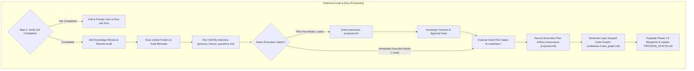
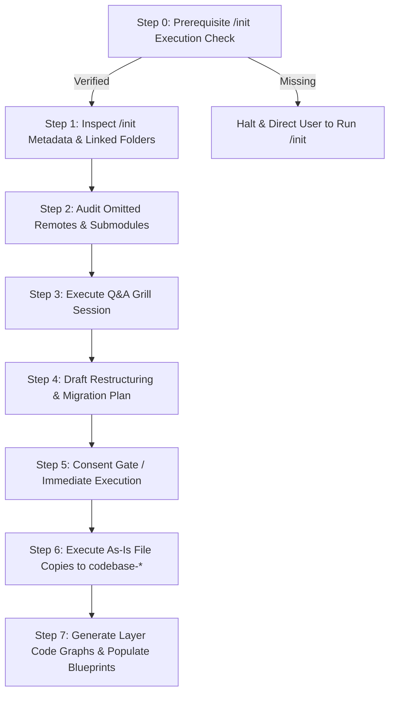

# Guard Specification: Legacy Code & Docs Processing (/process-history)

This document defines the requirements, design decisions, and step-by-step workflow for the `/process-history` command. This workflow is a dedicated, standalone playbook designed to process historical codebases, analyze legacy documentation, and execute codebase refactoring or restructuring without cluttering the `/init` workflow.

---

## 1. General Introduction & Core Objectives

The `/process-history` workflow is an essential component of the **Software Development Workflow Guard** for brownfield projects.

### Goal of the Workflow
The primary goal of `/process-history` is to analyze an existing, legacy, or unorganized codebase, extract domain knowledge into agentic blueprints, organize and copy existing files intact into the designed `codebase-*` folder structure created during `/init`, and link all previous sources into the workspace.

### Pure Migration & No Code Modification Policy
> [!IMPORTANT]
> **No Code Rewriting**: `/process-history` is strictly an organizational and migration workflow. It MUST NOT rewrite, refactor, or modify existing source code or logic. Code logic transformations are out of scope for `/process-history` and are deferred entirely to the `/plan` and `/implement` workflows.

### The Three Knowledge Inputs
The `/process-history` workflow synthesizes three distinct knowledge sources to construct the restructuring proposal and updated blueprints:
1. **`/init` Baseline Knowledge**: Metadata, initial linked folder paths, technology stack, layer count, and Docker configurations previously collected during `/init` (`.agents/plans/phase-1-summary.md` and `PROCESS_STATUS.md`).
2. **Grill Engine Interactive Knowledge**: Developer choices and preferences gathered during the `/process-history` Q&A interview (`process_history_questions.md`), including execution modes, layer mappings, and documentation extraction scope.
3. **Existing Codebase & Documentation Knowledge**: Deep code structures, module dependencies, API endpoints, database schemas, and architectural specs extracted directly from scanning linked legacy folders and files.

### Core Objective & Execution Scope
Based on these three knowledge sources, `/process-history` executes three primary operations:
- **Migrate & Organize Intact**: Copies existing source code and documentation intact into the newly created `codebase-*` sub-repository folder layout established during `/init` without code modifications.
- **Link Previous Sources**: Registers and links external remote code repositories, Git submodules, and cloud documentation links into workspace project configurations and phase blueprints.
- **Populate Blueprints & Generate Layer-Scoped Code Graphs**: Fills out all 5 phase blueprint documents in `.agents/plans/` and generates dedicated **Layer-Scoped Code Graph Documents** (`codebase-<layer>/code_graph.md`) inside each sub-repository, mapping code elements (interfaces, classes, functions, entities, services) and their structural connections specifically at that layer's level.

### Key Features
1. **Grill Engine Gate**: Uses a stateful, interactive interview based on [process_history_questions.md](file:///Users/horvathgergo/Desktop/agent-driven-templates/fullstack_software_dev/process_history/process_history_questions.md) to confirm legacy source mappings and execution strategies.
2. **`/init` Knowledge Review**: Reads and summarizes metadata previously collected during `/init` (`.agents/plans/phase-1-summary.md` and `PROCESS_STATUS.md`).
3. **Remote Sources & Submodules Audit**: Identifies remote code repositories, Git submodules, and external documentation sources connected to the legacy codebase that were omitted during `/init`.
4. **Dual Execution Options**: Supports both **Plan-First Mode** (generating `.agents/plans/restructure-proposal.md` and waiting for developer approval) and **Immediate Execution Mode** (copying files into `codebase-*` layers immediately while recording the execution plan artifact).
5. **Untouched Legacy Source & As-Is Migration Policy**: Original legacy repositories remain 100% untouched and read-only. Files are migrated as-is into the new directory structure created during `/init` (`antigravity-workspace/` and `codebase-*` sub-repositories) without code modifications.
6. **Layer-Scoped Code Graphs & Blueprints Synthesis**: Automatically populates `.agents/plans/phase-1-summary.md` through `phase-5-operation.md` and generates layer-scoped `codebase-<layer>/code_graph.md` files (mapping interfaces, classes, functions, and modules per sub-repository) to serve as dedicated resources for datastream evaluations and code element utilization.

### Separation from `/init`
While `/init` focuses strictly on lightweight bootstrapping, container checks, and establishing workspace boundaries, `/process-history` handles legacy code analysis, file organization into `codebase-*` layers, layer-scoped Code Graph generation, and blueprint synthesis.

---

## 2. Detailed Representation of Historical Processing

---

## 3. Step-by-Step Workflow Design

### Connected Descriptions of the Step-by-Step Design:
*   **Step 0: Prerequisite `/init` Execution Check (Node S0)**: Verifies that `.agents/plans/PROCESS_STATUS.md` exists and that Row 1.0 (`/init`) is marked as `Completed`.
    *   *Enforcement Rule*: If `/init` has not been executed, `/process-history` MUST immediately halt and inform the user: *"The `/process-history` workflow requires a pre-initialized workspace. Please run `/init` first (or `/init --feature <name>`) to bootstrap workspace boundaries, layer skeletons, and process tracking before running `/process-history`."*
*   **Step 1: Inspect `/init` Metadata (Node S1)**: Reads linked legacy folder paths and stack specifications registered during `/init` in `.agents/plans/phase-1-summary.md`.
*   **Step 2: Audit Omitted Remotes & Submodules (Node S2)**: Scans `.git/config`, `.gitmodules`, and documentation links across legacy folders to catch any origins omitted during `/init`.
*   **Step 3: Execute Q&A Grill Session (Node S3)**: Runs the sequential interview based on [process_history_questions.md](file:///Users/horvathgergo/Desktop/agent-driven-templates/fullstack_software_dev/process_history/process_history_questions.md).
*   **Step 4: Draft Restructuring Plan (Node S4)**: Generates `.agents/plans/restructure-proposal.md` mapping legacy files into `codebase-*` sub-repository targets.
*   **Step 5: Consent Gate / Execution Choice (Node S5)**: In Plan-First Mode, pauses for explicit developer approval. In Immediate Execution Mode, proceeds directly to file operations.
*   **Step 6: Execute As-Is File Copies (Node S6)**: Copies legacy source files intact into respective target `codebase-*` sub-repositories without modifying code logic.
*   **Step 7: Generate Layer Code Graphs & Populate Blueprints (Node S7)**:
    *   Generates layer-scoped Code Graph documents inside each target sub-repository (`codebase-<layer>/code_graph.md`), linking logical structural elements (interfaces, classes, functions, entities, services) specifically at the level of that layer. These graphs serve as dedicated resources for datastream evaluations and element utilization maps.
    *   Fills out all 5 phase blueprint documents (`phase-1-summary.md` through `phase-5-operation.md` in `.agents/plans/`) with synthesized legacy domain knowledge.
    *   Updates `.agents/plans/PROCESS_STATUS.md` marking Row 2.0 (`/process-history`) as `Completed`.

---

## 4. How to Use Rules & Options

### Parameters & Options
- `/process-history` (or `/process-history --plan`): **Plan-First Mode** (Default). Runs Q&A grill, generates `.agents/plans/restructure-proposal.md`, and pauses for explicit developer review and consent before modifying code.
- `/process-history --auto` (or `/process-history --apply`): **Immediate Execution Mode**. Runs Q&A grill, copies/moves code into `codebase-*` sub-repositories immediately, and records `.agents/plans/restructure-proposal.md` as an execution audit log.
- `/process-history --dry-run`: Performs historical analysis and outputs the proposed migration report without moving any files.
- `/process-history --docs-only`: Extracts documentation and synthesizes 5-phase blueprints without proposing physical file restructuring.
