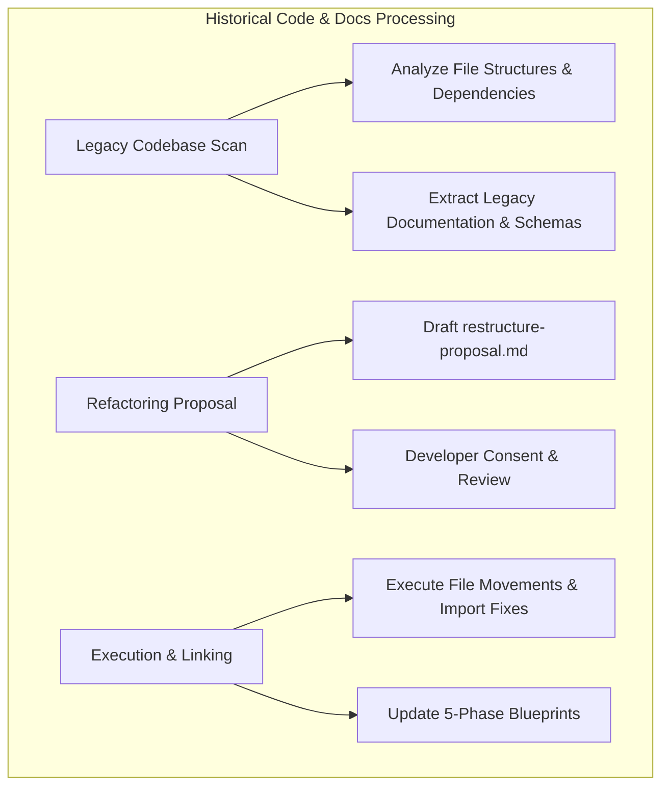
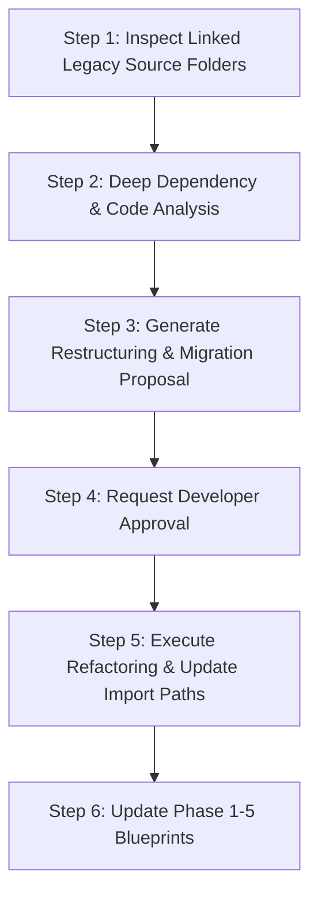

# Guard Specification: Legacy Code & Docs Processing (/process-history)

This document defines the requirements, design decisions, and step-by-step workflow for the `/process-history` command. This workflow is a dedicated, standalone playbook designed to process historical codebases, analyze legacy documentation, and execute codebase refactoring or restructuring without cluttering the `/init` workflow.

---

## 1. General Introduction & Core Objectives

The `/process-history` workflow is an essential component of the **Software Development Workflow Guard** for brownfield projects.

### Goal of the Workflow
The primary goal of `/process-history` is to take an existing, legacy, or unorganized codebase and perform deep historical analysis, extract legacy documentation into agentic blueprints, and execute structural refactoring (such as separating presentation logic into `codebase-layout` and core logic into `codebase-engine`).

### Separation from `/init`
While `/init` focuses strictly on lightweight bootstrapping, container checks, and establishing workspace boundaries, `/process-history` handles the heavy, token-intensive task of analyzing historical source code and executing refactoring proposals.

---

## 2. Detailed Representation of Historical Processing

---

## 3. Step-by-Step Workflow Design

### Connected Descriptions of the Step-by-Step Design:
*   **Step 1: Inspect Linked Legacy Source Folders (Node S1)**: Reads the legacy folder paths registered during `/init`.
*   **Step 2: Deep Dependency & Code Analysis (Node S2)**: Analyzes module dependencies, data models, API endpoints, and view layers across existing files.
*   **Step 3: Generate Restructuring Proposal (Node S3)**: Drafts `.agents/plans/restructure-proposal.md` mapping file movements to `codebase-*` sub-repositories.
*   **Step 4: Request Developer Approval (Node S4)**: Pauses execution until the developer explicitly approves the proposed restructuring plan.
*   **Step 5: Execute Refactoring (Node S5)**: Executes file movements, updates relative import paths, and refactors configuration files.
*   **Step 6: Update Phase Blueprints (Node S6)**: Synthesizes extracted legacy knowledge into `.agents/plans/phase-1-summary.md` through `phase-5-operation.md`.

---

## 4. How to Use Rules & Options

### Parameters & Options
- `/process-history`: Executes the full legacy analysis, generates a restructuring proposal, and waits for user consent.
- `/process-history --dry-run`: Performs historical analysis and outputs the proposed migration report without moving any files.
- `/process-history --docs-only`: Extracts documentation and synthesizes 5-phase blueprints without proposing physical file restructuring.
