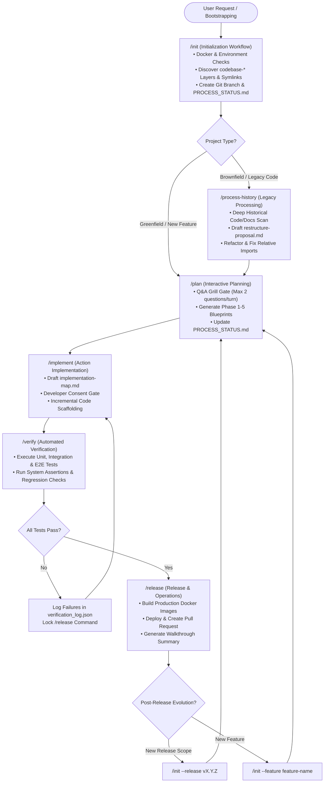

# Guards Framework: Full-Stack Software Development Summary

This document acts as the central summary and entry point for the Guards Framework project, coordinating the workflows, guidelines, and control tools for agent-driven software development.

---

## 1. Project Goal & Core Philosophy

### Project Goal
The primary objective is to define a standardized platform—the **Guards Framework**—that guides AI agents through structured, safe, and token-optimized development lifecycles using explicit **Guards**. It guarantees that agents always plan before implementing, verify before committing, and maintain a decoupled, flexible codebase layout across greenfield setup, brownfield restructuring, and post-release evolution.

### Core Philosophy: Universal Design vs. Environment Implementation
The Guard Framework intentionally separates high-level design intent from runtime-specific implementations:
- **Universal Design & Objectives**: The overall workflow steps, architectural principles, and guard goals remain identical regardless of the target platform.
- **Environment-Specific Resources**: Different AI agent environments offer distinct native primitives to instruct and govern agentic workflows. For example, **Antigravity** provides native resources such as *rules, hooks, sidecars, skills, and workflows*. Environments like **Codex** or **Claude Code** rely on their own specific prompt formats, custom commands, or file structures.
- **Portable Guard Concept**: While the concrete implementation of guards varies based on the target environment's capabilities, the underlying guard logic and workflow boundaries remain unified.

---

## 2. Architectural Design & Project Structure

The project directory structure is designed in a 3-tier layout to maintain separation between general design specifications and environment-specific implementations:

### Directory Scaffold

```text
fullstack_software_dev/
├── summary.md                          # Central Entry Point & Framework Summary
├── grill_engine.md                     # [Tier 1] General Q&A Engine Spec
├── multi_repo_architecture.md          # [Tier 1] Multi-Repo & Symlink Architecture Spec
├── process_handling.md                 # [Tier 1] Process Guard & Matrix Spec
├── code_graph_taxonomy.md              # [Tier 1] Language-Specific Code Graph Taxonomy (Python, Go, JS)
│
├── init/                               # [Tier 2] Initialization Workflow Subfolder
│   ├── init_workflow.md                # Detailed workflow specifications
│   ├── init_questions.md               # Scan & Q&A schemas
│   ├── folder_structure.md             # Repository directory layout spec
│   └── antigravity/                    # [Tier 3] Antigravity-specific resources & guards
│       ├── init_implementation_map.md  # Antigravity execution map & decision links
│       ├── init_tests.md               # Greenfield & brownfield verification test suite
│       └── guards/                     # Antigravity native primitives (rules, skills, hooks)
│
├── process_history/                    # [Tier 2] Legacy Processing Workflow Subfolder
│   ├── process_history_workflow.md     # Detailed workflow specifications
│   ├── process_history_implementation_map.md
│   └── guards/                         # [Tier 3] Environment-Specific Guards
│
├── plan/                               # [Tier 2] Interactive Planning Subfolder
│   ├── plan_workflow.md                # Detailed workflow specifications
│   ├── plan_implementation_map.md
│   └── guards/                         # [Tier 3] Environment-Specific Guards
│
├── implement/                          # [Tier 2] Action Implementation Subfolder
│   ├── implement_workflow.md           # Detailed workflow specifications
│   ├── implement_implementation_map.md
│   └── guards/                         # [Tier 3] Environment-Specific Guards
│
├── verify/                             # [Tier 2] Automated Verification Subfolder
│   ├── verify_workflow.md              # Detailed workflow specifications
│   ├── verify_implementation_map.md
│   └── guards/                         # [Tier 3] Environment-Specific Guards
│
└── release/                            # [Tier 2] Release & Operations Subfolder
    ├── release_workflow.md             # Detailed workflow specifications
    ├── release_implementation_map.md
    └── guards/                         # [Tier 3] Environment-Specific Guards
```

### 3-Tier Structure Rationale

1. **General Design Elements (Main Root Folder)**
   - Located directly in `fullstack_software_dev/`.
   - Defines overarching concepts, cross-cutting rules, and general-purpose specs (e.g., [Grill Engine](file:///Users/horvathgergo/Desktop/agent-driven-templates/fullstack_software_dev/grill_engine.md), [Multi-Repository Architecture Spec](file:///Users/horvathgergo/Desktop/agent-driven-templates/fullstack_software_dev/multi_repo_architecture.md), and [Process Guard Spec](file:///Users/horvathgergo/Desktop/agent-driven-templates/fullstack_software_dev/process_handling.md)) applied across all workflow steps.

2. **Step-Specific Workflow Subfolders & Implementation Maps**
   - Subdirectories dedicated to each operational phase (e.g., `init/`, `process_history/`, `plan/`, `implement/`, `verify/`, `release/`).
   - Contain detailed step specifications and environment/time-bound `*_implementation_map.md` files (e.g., `init_implementation_map.md`). These provide step-by-step execution roadmaps for implementing a specific workflow phase in a given environment at a specific point in time (e.g., an Antigravity-based implementation snapshot).

3. **Environment-Specific Guard Folders (`guards/`)**
   - Subdirectories located within each workflow step folder (e.g., `init/guards/`, `plan/guards/`).
   - Contain the concrete guard implementations (e.g., specific rules, hooks, skill manifests, or prompt files) tailored for a target agent environment.

---

## 3. General-Purpose Components

The framework utilizes shared components and architectural blueprints that operate across all stages of the lifecycle:

- **[Interactive Q&A Engine (Grill Engine)](file:///Users/horvathgergo/Desktop/agent-driven-templates/fullstack_software_dev/grill_engine.md)**: A stateful, resume-ready interview module used to gather requirements and resolve architecture ambiguities before generating plans or code.
- **[Multi-Repository Architecture Spec](file:///Users/horvathgergo/Desktop/agent-driven-templates/fullstack_software_dev/multi_repo_architecture.md)**: Specifications mapping out directory separation, symbolic link mapping, config dependency policies (Rule of Dependency), and the Hybrid Docker handling strategy to isolate UI and Engine components.
- **[Guard Process Handling Spec (Process Guard)](file:///Users/horvathgergo/Desktop/agent-driven-templates/fullstack_software_dev/process_handling.md)**: Specifications for release-governed process handling documents (`PROCESS_STATUS.md`), featuring a concise 2-block structure (Workflow Execution Matrix & Datestamped Daily History) and branch-based release initialization options.

---

## 4. Planned Development Workflows

The framework is organized into six development workflows, each with its dedicated subdirectory under `fullstack_software_dev/`. The following workflow diagram details the complete operational lifecycle from initialization to post-release evolution:



### Detailed Workflow Descriptions

1.  **[Initialization (/init)](file:///Users/horvathgergo/Desktop/agent-driven-templates/fullstack_software_dev/init/init_workflow.md)**
    *   *Path*: `fullstack_software_dev/init/`
    *   *Purpose*: Bootstraps Docker setups, performs lightweight layer scanning to establish `codebase-*` sub-repository skeletons, links existing source folders into initial documentation, and configures Git origin.
    *   *Key Files*:
        *   [init_workflow.md](file:///Users/horvathgergo/Desktop/agent-driven-templates/fullstack_software_dev/init/init_workflow.md) (Detailed specifications)
        *   [init_questions.md](file:///Users/horvathgergo/Desktop/agent-driven-templates/fullstack_software_dev/init/init_questions.md) (Scans and Q&A schema)
        *   [folder_structure.md](file:///Users/horvathgergo/Desktop/agent-driven-templates/fullstack_software_dev/init/folder_structure.md) (Desired repository directory layout)
        *   [antigravity/init_implementation_map.md](file:///Users/horvathgergo/Desktop/agent-driven-templates/fullstack_software_dev/init/antigravity/init_implementation_map.md) (Antigravity guard execution roadmap)
        *   [antigravity/init_tests.md](file:///Users/horvathgergo/Desktop/agent-driven-templates/fullstack_software_dev/init/antigravity/init_tests.md) (Greenfield & brownfield verification test specification)
2.  **[Legacy Code & Docs Processing (/process-history)](file:///Users/horvathgergo/Desktop/agent-driven-templates/fullstack_software_dev/process_history/process_history_workflow.md)**
    *   *Path*: `fullstack_software_dev/process_history/`
    *   *Purpose*: Handles deep historical code analysis, legacy documentation processing, refactoring proposals, and codebase restructuring for brownfield projects.
    *   *Key Files*:
        *   [process_history_workflow.md](file:///Users/horvathgergo/Desktop/agent-driven-templates/fullstack_software_dev/process_history/process_history_workflow.md) (Detailed specifications)
        *   [process_history_questions.md](file:///Users/horvathgergo/Desktop/agent-driven-templates/fullstack_software_dev/process_history/process_history_questions.md) (Scans and Q&A Grill schema)
        *   [antigravity/process_history_implementation_map.md](file:///Users/horvathgergo/Desktop/agent-driven-templates/fullstack_software_dev/process_history/antigravity/process_history_implementation_map.md) (Antigravity guard execution roadmap)
        *   [antigravity/process_history_tests.md](file:///Users/horvathgergo/Desktop/agent-driven-templates/fullstack_software_dev/process_history/antigravity/process_history_tests.md) (Brownfield verification test specification)
3.  **Interactive Planning (/plan)**
    *   *Path*: `fullstack_software_dev/plan/`
    *   *Purpose*: Leads the user through the creation of the 5-phase blueprint plans tracking status in `PROCESS_STATUS.md`.
4.  **Action Implementation (/implement)**
    *   *Path*: `fullstack_software_dev/implement/`
    *   *Purpose*: Scaffolds layout and logic components in increments after approval of a specific `implementation-map.md`.
5.  **Verification (/verify)**
    *   *Path*: `fullstack_software_dev/verify/`
    *   *Purpose*: Executes automated assertions, unit/integration/E2E test suites, and regression checks.
6.  **Release & Operations (/release)**
    *   *Path*: `fullstack_software_dev/release/`
    *   *Purpose*: Manages Docker builds, operations deployment, walkthrough summaries, and pull requests.
