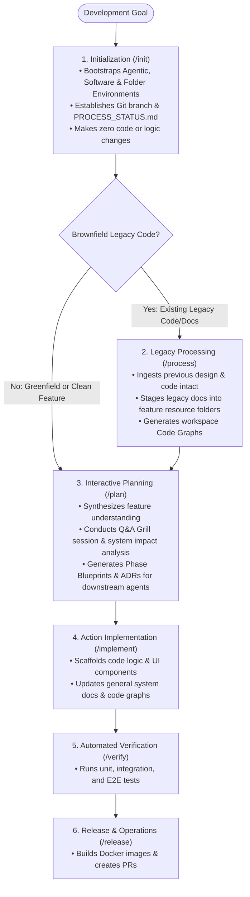

# Guards Framework: End-User Guide & Operational Manual

This document serves as the official user guide for the **Guards Framework**, explaining how developers and AI agents navigate the software planning and development lifecycle step by step.

---

## 1. Executive Summary & Framework Lifecycle

The Guards Framework enforces a disciplined, token-optimized, and safe development process for both new (greenfield) projects and existing (brownfield) codebases. The operational journey follows a clear, sequential flow:

---

## 2. Core Workflow Principles

### Phase 1: Environment Initialization (`/init`)
- **Universal Entry Point**: Every development activity **always** begins with the `/init` workflow—whether bootstrapping a greenfield software project from scratch or extending an existing system with new feature capabilities.
- **Preparation of the Three Environments**: `/init` prepares the three core framework environments for the upcoming work:
  - **Agentic Environment**: Provisions `.agents/` control structures (rules, workflows, skills, hooks, sidecars).
  - **Software-Based Environment**: Asserts Docker engine status, container privileges, and execution sandbox settings.
  - **Folder-Based Environment**: Establishes Git branches (`initial` or `feature/<name>`), scaffolds layer skeletons (`codebase-*`), and deploys status tracking sheets (`PROCESS_STATUS.md`).
- **Strict Boundary Rule**: `/init` limits its scope strictly to environment setup and high-level folder linking. It **does not make any code, logic, or structural refactoring changes** to the codebase.

### Phase 2: Ingestion of Existing Systems (`/process`)
- **Brownfield Context Ingestion**: For projects that possess pre-designed or previously implemented code and documentation from past development, `/process` runs immediately after `/init`.
- **Structured Knowledge Organization**: `/process` ingests, analyzes, and reorganizes previous design artifacts and implementation sources:
  - **Intact Source Migration**: Copies legacy source code intact into target `codebase-*` sub-repositories without modifying code logic.
  - **Resource Staging**: Stages non-code legacy documentation and assets into `.agents/plans/<feature-name>/resource/` for feature reference.
  - **Code Graph Generation**: Builds workspace-scoped Code Graphs (`antigravity-workspace/src/<layer>/code_graph/`) detailing structural node topologies.

### Phase 3: Structured Feature Planning (`/plan`)
- **Architectural Bridge**: Once `/init` (and `/process`, if applicable) finishes successfully, the workspace is structured and ready for architectural design. This is where the `/plan` workflow begins.
- **Agentic Context Creation**: During `/plan`, the developer and AI agent interactively define feature scope, analyze system impact, and generate structured Phase Blueprints (`phase-1-summary.md` through `phase-5-operation.md`), topic knowledge summaries, and Architecture Decision Records (ADRs).
- **Downstream Agent Guidance**: All planning artifacts are stored inside `.agents/plans/<feature-name>/` to share complete, unambiguous context with AI agents executing downstream implementation (`/implement`), testing (`/verify`), and deployment (`/release`).

---

## 3. Overview of the Three Core Environments

The framework coordinates three distinct execution layers during initialization and planning:

| Environment | Purpose | Core Components Scaffolded / Governed |
| :--- | :--- | :--- |
| **Agentic Environment** | Governs AI agent execution, constraints, and tool access. | `.agents/rules/`, `.agents/workflows/`, `skills/`, `hooks/`, `sidecars/` |
| **Software-Based Environment** | Asserts containerized runtime, build privileges, and tool protocols. | Docker verification (`docker info`), `dev.Dockerfile`, `docker-compose.yml`, MCP configs |
| **Folder-Based Environment** | Maintains physical code separation, symlink maps, and feature tracking. | `codebase-*` layer skeletons, `src/` symlink maps, `.agents/plans/<feature-name>/`, `PROCESS_STATUS.md` |

---

## 4. Next Steps & Guide Extensions

This initial version of the User Guide establishes the core operational mental model and workflow sequencing. As feature development progresses, subsequent sections will expand to include:
- Step-by-step CLI usage guides and flag reference tables (`--auto`, `--plan`, `--dry-run`).
- Greenfield vs. Brownfield operational walkthroughs.
- Detailed guidelines for downstream execution workflows (`/implement`, `/verify`, `/release`).
